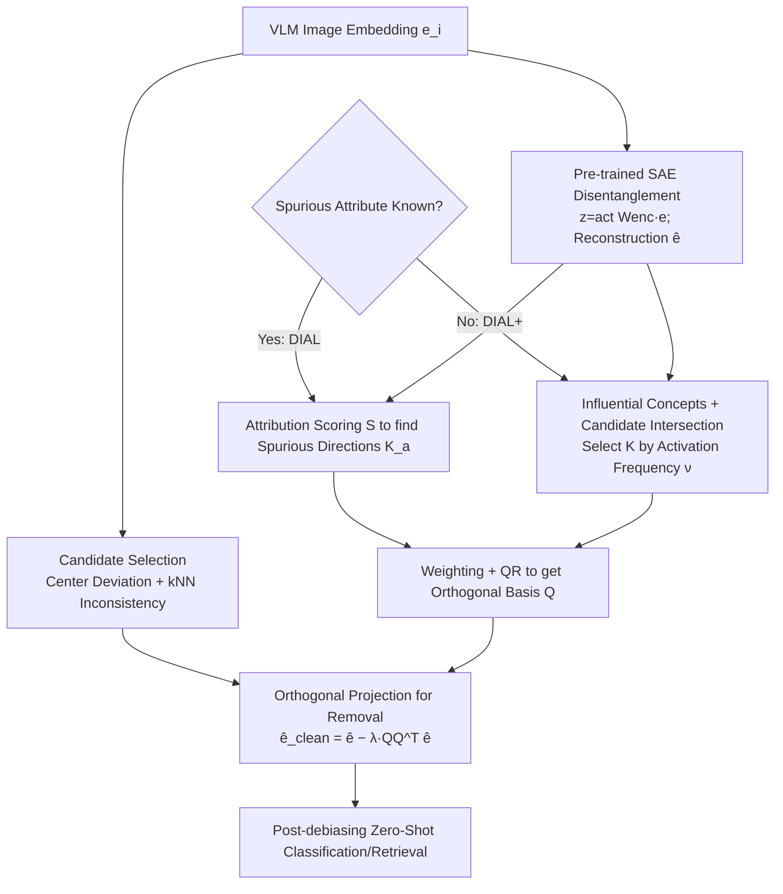

# Label-Free Mitigation of Spurious Correlations in VLMs using Sparse Autoencoders

**Conference**: ICLR 2026  
**OpenReview**: [https://openreview.net/forum?id=NHOLsaHuFv](https://openreview.net/forum?id=NHOLsaHuFv)  
**Code**: [https://github.com/byalavar/DIAL](https://github.com/byalavar/DIAL)  
**Area**: Multimodal VLM / Robustness and Debiasing / Interpretability  
**Keywords**: Spurious Correlations, CLIP Debiasing, Sparse Autoencoders, Zero-Shot, Worst-Group Accuracy, Orthogonal Projection  

## TL;DR
DIAL utilizes a pre-trained Sparse Autoencoder (SAE) to decompose CLIP image embeddings into interpretable monosemantic feature directions. It identifies subspaces encoding spurious attributes in a zero-shot manner and removes them from affected samples via orthogonal projection, requiring no training, additional data, class labels, or spurious feature labels.

## Background & Motivation
**Background**: Contrastive VLMs like CLIP have achieved strong zero-shot capabilities through web-scale training but often rely on **spurious correlations**—treating non-causal features that happen to appear frequently in training data as discriminative evidence. Examples include focusing on imaging artifacts rather than lesions in the ISIC dermatology dataset, medical equipment instead of pneumonia signs in chest X-rays, facial features instead of hair color for "Blonde" in CelebA, or water backgrounds instead of the birds themselves in Waterbirds. This causes the model performance on specific subgroups to fall far below the average, leading to dismal worst-group accuracy and fundamentally questioning fairness and reliability.

**Limitations of Prior Work**: Existing mitigation methods almost always incur additional costs. One category requires training/fine-tuning, re-weighting, or access to model parameters and class/spurious labels (e.g., Group-DRO variants, Zhu et al. 2025), which nullifies the zero-shot advantage of VLMs. Another category claims to be zero-shot but has weaknesses—TIE requires spurious labels for each sample to achieve optimality, and its label-free variant TIE* still relies on extra data to estimate scaling factors; ROBOSHOT depends on Large Language Models to generate "spurious insights," introducing issues like hallucinations, reliability, and sensitivity to LLM selection. Furthermore, much work only performs debiasing on the **text modality**, leaving biases encoded in visual representations untouched.

**Key Challenge**: True zero-shot debiasing requires "no labels, no extra data, and no external LLMs, while being able to locate and precisely remove spurious information hidden in image embeddings"—a triplet difficult to satisfy simultaneously because it is hard to identify "which direction is spurious" without supervision signals.

**Goal**: To propose a **completely zero-shot and interpretable** framework that identifies and removes spurious correlations within the image embedding space using only VLM embeddings (plus optional high-level descriptions of spurious attributes), simultaneously improving average accuracy and worst-group accuracy while narrowing the gap between them.

**Core Idea**: **Use Sparse Autoencoders to disentangle entangled VLM embeddings into a dictionary of monosemantic features**. The framework leverages the prior that "samples affected by spurious features deviate from their class centers" to identify victim samples in a zero-shot manner. It then uses **attribution scoring** to find feature directions aligned with spurious attributes and finally employs **orthogonal projection** to subtract the subspace spanned by these directions from the victim sample embeddings—making the entire pipeline naturally interpretable and auditable.

## Method

### Overall Architecture
DIAL (**D**isentangle, **I**dentify, **A**nd **L**abel-free removal) breaks debiasing into three steps: first, distribution analysis is used to filter candidate samples likely dominated by spurious features; second, a pre-trained SAE projects embeddings into a disentangled space to locate spurious feature directions; finally, orthogonal projection is applied to the candidate samples to remove the spurious subspace. When spurious attributes are known, DIAL is used (requiring a high-level description, e.g., "Male/Female" for CelebA); when unknown, DIAL+ is used, which automatically detects spurious concepts before mitigation, requiring only the embeddings as input. The entire process involves no training, no labels, and no external LLMs.

### Key Designs

**1. Candidate Sample Selection: Ensuring debiasing only affects relevant samples.** DIAL does not operate on all samples. Based on the prior that "spurious samples often deviate from their true class centers" (Li et al. 2025), it uses the VLM's own zero-shot predictions as pseudo-labels to approximate class centers and identifies samples deviating from these centers. It further refines this using k-nearest neighbor (kNN) consistency to exclude noise and outliers, resulting in a candidate set $S_{cand}$. Subsequent removal is only applied to samples in $S_{cand}$ to avoid damaging samples that are already correctly predicted and unrelated to spurious features, which is key to maintaining average accuracy while significantly boosting worst-group accuracy.

**2. SAE Disentanglement + Attribution Scoring: Zero-shot localization of spurious directions.** Given an embedding $e$, a pre-trained SAE (the paper uses Matryoshka SAE / MSAE) calculates sparse activations $z=\mathrm{act}(W_{enc}e+b_{enc})$ and the reconstruction $\hat e=W_{dec}z+b_{dec}$. The columns $\{f_j\}$ of the decoding matrix $W_{dec}$ represent a dictionary of monosemantic features $F$. For each spurious attribute $a$, prompts ("a photo of a $a$" and its negation) are used to split reconstructed embeddings into a positive set $P_a$ and a negative set $N_a$ in a zero-shot manner. The attribution scoring from Karvonen et al. is then adapted for the zero-shot scenario:

$$S(f_j, a)=\left(\frac{1}{|P_a|}\sum_{i\in P_a} z_{i,j}-\frac{1}{|N_a|}\sum_{i\in N_a} z_{i,j}\right)\times \mathrm{CosSim}(f_j, e_a)$$

where $e_a=\phi_t(\text{prompt}_a)$ is the text embedding of the attribute. This score requires the "feature direction to align with the attribute semantics" and "exhibit significantly higher activation in the positive set," enabling stable selection of directions encoding the spurious attribute. Instead of a hard top-$k$ cutoff, features are selected by descending $|S|$ until their cumulative contribution reaches a proportion $\alpha$ of the total attribution mass, yielding the spurious feature set $K_a$ for that attribute. All sets are merged into $K$. Ablations show that selection by **attribution mass $\alpha$** outperforms a fixed top-$k$ because the number of features per concept in an SAE varies greatly (e.g., "color patch" might occupy few features, while "land background" occupies many).

**3. Orthogonal Projection for Subspace Removal: Clean removal without damaging unrelated features.** Once $K$ is obtained, it is not projected directly; it is first denoised. The mean direction of spurious features $m=\frac{1}{|K|}\sum_{f_j\in K} f_j$ is calculated, and weights $w$ are derived via softmax from alignment scores $s_j=\beta\cdot\mathrm{CosSim}(f_j, m)$. Weights below a certain percentile are zeroed to obtain the filtered $K_f$. The weighted feature vectors $\{w_j f_j\}$ form the columns of matrix $V_w$, and QR decomposition $V_w=QR$ yields the orthogonal basis $Q$ for the spurious subspace. Finally, candidate sample embeddings are projected and subtracted according to a mitigation strength $\lambda\in[0,1]$:

$$\hat e_{i,clean}=\hat e_i-\lambda\, QQ^\top \hat e_i$$

Ablations indicate that **orthogonal projection significantly outperforms neuron ablation (zeroing)**. Zeroing only removes identified neurons, leaving residual unidentified spurious directions that dilute the effect, whereas orthogonal projection removes the entire spurious subspace (at the cost of potentially affecting non-spurious features very close to the spurious ones).

**4. DIAL+ Unsupervised Spurious Concept Detection: Omitting prior descriptions.** When spurious attributes are unknown, DIAL+ locates spurious concepts using three data-driven steps: (i) **Influential Concept Identification**—performing a "simulated ablation" $\hat e_{i,\neg j}=W_{dec}(z_i\odot(1-1_j))+b_{dec}$ for each feature; if its removal flips the zero-shot prediction, the feature enters the local influence set $I_i$ of the sample, and these are pooled into $I_{pool}$. (ii) **Candidate Sample Selection**—similarly using Alg.1 (center deviation + kNN inconsistency) to obtain $S_{cand}$. (iii) **Spurious Concept Extraction**—counting the activation frequency $\nu_j=\sum_{i\in S_{cand}}\mathbb{1}[j\in I_i]$ for each influential concept within the candidate set, taking the top-$k$ frequent concepts as the final set $K$. The intuition is that concepts which "can flip predictions and repeatedly appear in samples deviating from class centers" are most likely spurious features. Additionally, the framework uses a zero-shot grid search (Alg.2) to automatically select $k^*$, $\alpha$, and $\lambda$, optimizing for equidistance from embeddings to various spurious concepts, thus removing dependence on extra data for hyperparameter tuning.

## Key Experimental Results

Five standard benchmarks (CelebA, Waterbirds, FMOW, medical ISIC, COVID-19) are used with backbones including CLIP ViT-B/32, ViT-L/14, and BiomedCLIP for medical data, all disentangled with pre-trained MSAE. Metrics: Average Accuracy (AVG), Worst-Group Accuracy (WG, higher is better), and Gap (lower is better). Baselines are divided into those requiring auxiliary info (PerceptionCLIP/ROBOSHOT/TIE/TIE*) and those that do not (Zero-Shot/GroupPrompt/Ideal Words/Orth-Cali, and Ours).

### Main Results Table (Selected WG / Gap)

| Dataset / Backbone | Method | AVG↑ | WG↑ | Gap↓ |
|---|---|---|---|---|
| CelebA ViT-B/32 | TIE (Req. Labels+Data) | 85.11 | 82.63 | 2.48 |
| CelebA ViT-B/32 | **DIAL** | **85.54** | **83.47** | 2.17 |
| CelebA ViT-B/32 | **DIAL+** | 85.28 | 83.42 | **1.86** |
| CelebA ViT-L/14 | TIE | 86.17 | 84.60 | 1.57 |
| CelebA ViT-L/14 | **DIAL** | **86.87** | **85.24** | 1.63 |
| Waterbirds ViT-L/14 | Zero-Shot | 83.72 | 31.93 | 51.79 |
| Waterbirds ViT-L/14 | TIE (Req. Labels) | 84.12 | 78.82 | 5.30 |
| Waterbirds ViT-L/14 | **DIAL+** | 82.25 | 69.18 | 12.47 |
| ISIC (BiomedCLIP) | TIE | 69.90 | 65.87 | 4.03 |
| ISIC | **DIAL** | 70.71 | **68.42** | **2.29** |

In CelebA, DIAL outperforms all zero-shot baselines on ViT-B/32 and even beats methods requiring auxiliary data/labels/LLMs. On ViT-L/14, it achieves the highest WG and lowest Gap. In medical ISIC data, DIAL raises WG from the zero-shot 42.21 to 68.42 and reduces the Gap from 28.00 to 2.29, surpassing the label-dependent TIE. Waterbirds is a relative weakness; the authors attribute this to the "land/water background" concepts being too diverse and complex for a single high-level description to fully characterize the feature space, affecting the precision of attribution scoring.

### Ablation Study

| Dimension | Comparison | Conclusion |
|---|---|---|
| Feature Selection | top-$k$ features vs. mass $\alpha$ | $\alpha$ is better (different concepts occupy different numbers of features) |
| Feature Removal | Neuron zeroing vs. Orthogonal Projection | Orthogonal projection is significantly superior (removes entire subspace, less residue) |
| Debiased Retrieval | FairFace MaxSkew@1000 | Age 1.32→0.95, Gender 0.30→0.11, Ethnicity 0.61→0.32 |

### Key Findings
- Even without knowing spurious attributes, DIAL+ performs **comparably** to DIAL (which requires prior descriptions), proving the effectiveness of unsupervised spurious concept detection.
- The method is **modality-agnostic**: debiasing acts on image embeddings, distinguishing it from zero-shot baselines that primarily modify the text modality. MaxSkew and other fairness metrics decreased across three sensitive attributes in FairFace, indicating the embedding space truly became fairer.
- In high-risk domains like medicine, the interpretability of the method allows for a direct audit of "which concepts were removed," facilitating diagnosis of model failure causes.

## Highlights & Insights
- **Converging mechanistic interpretability tools (SAE) with practical debiasing**: While SAEs were previously used to "evaluate if concepts can be erased," this work turns them into an engine for surgical removal of spurious subspaces without labels. The attribution scoring is cleverly adapted for zero-shot use.
- **Targeted mitigation by "only moving victim samples"**: Identifying candidates via center deviation and kNN consistency allows for boosting worst-group accuracy without dragging down average accuracy, a balance many global debiasing methods fail to achieve.
- **Truly data-free zero-shot**: Even the hyperparameter tuning data is omitted by using the equidistance of embeddings to spurious concepts as a zero-shot search objective, removing the implicit dependencies found in TIE or ROBOSHOT.
- **Trust value through auditability**: The entire pipeline (which features, which subspace, how much was removed) is inspectable, which is a significant selling point for high-risk scenarios like healthcare.

## Limitations & Future Work
- **Risk of collateral damage**: When non-spurious features and spurious features are close in the embedding space, orthogonal projection may inadvertently weaken useful information.
- **Insufficient characterization of complex concepts**: The lagging performance on Waterbirds indicates that for highly diverse spurious attributes like "background," a single high-level description plus attribution scoring may not cover the full feature space.
- **Dependence on SAE quality**: The quality of disentanglement determines the performance ceiling. Appendix results show a correlation between SAE quality and performance. Optimal $(\alpha,\lambda)$ settings may change across backbones/datasets; although zero-shot search helps, it is still influenced by the search range and candidate selection hyperparameters.
- **Future Work**: Exploring analytical solutions to replace grid searches for lower dependency and extending the framework to machine unlearning and broader fairness tasks.

## Related Work & Insights
- **Zero-shot VLM Debiasing**: Orth-Cali (Chuang et al.) uses a closed-form calibration projection to remove bias directions; Ideal Words (Trager et al.) averages text prompts; TIE (Lu et al.) shifts image embeddings along spurious vectors calculated from text; ROBOSHOT (Adila et al.) uses LLM insights. DIAL differs fundamentally by being **label-free, data-free, LLM-free, and acting on the image modality**.
- **SAEs and Mechanistic Interpretability**: Concept erasure evaluations by Karvonen et al., concept erasure in diffusion models (Tian et al.), and contrastive sparse representations (Wen et al.) provided the tools to manipulate semantics with SAEs. This paper combines attribution and orthogonal projection into a deployable debiasing solution.
- **Insights**: The combination of attribution scoring (semantic alignment × activation difference) and orthogonal subspace removal is a generalizable "recipe" for any task requiring the targeted erasure of specific semantics. The unsupervised identification of candidates via "class center deviation" is also a transferable heuristic for mining biased or anomalous samples.

## Rating
- Novelty: ⭐⭐⭐⭐ — First systematic transformation of SAE mechanistic interpretability into a completely data-free zero-shot VLM debiasing scheme, with clear innovations in zero-shot attribution and unsupervised detection.
- Experimental Thoroughness: ⭐⭐⭐⭐ — Tested on five datasets across multiple backbones and retrieval tasks. Baselines are fair. Ablations cover selection, removal, and retrieval. However, it is not consistently the top performer on all datasets (e.g., Waterbirds/COVID), and interpretability is mostly shown qualitatively.
- Writing Quality: ⭐⭐⭐⭐ — Steps are clear, motivations are well-explained, and formulas correspond well with algorithms. Some notation in DIAL+ is slightly dense.
- Value: ⭐⭐⭐⭐ — The ability to debias without labels, data, or LLMs while remaining auditable is highly meaningful for fairness and trusted deployment in high-risk domains.

<!-- RELATED:START -->

## Related Papers

- [\[ICML 2026\] Density-Aware Translation of Spurious Correlations in Zero-Shot VLMs](../../ICML2026/multimodal_vlm/density-aware_translation_of_spurious_correlations_in_zero-shot_vlms.md)
- [\[NeurIPS 2025\] Sparse Autoencoders Learn Monosemantic Features in Vision-Language Models](../../NeurIPS2025/multimodal_vlm/sparse_autoencoders_learn_monosemantic_features_in_visionlan.md)
- [\[CVPR 2026\] Sparse Spectral LoRA: Routed Experts for Medical VLMs](../../CVPR2026/multimodal_vlm/sparse_spectral_lora_routed_experts_for_medical_vlms.md)
- [\[ICML 2025\] The Devil Is in the Details: Tackling Unimodal Spurious Correlations for Generalizable Multimodal Reward Models](../../ICML2025/multimodal_vlm/the_devil_is_in_the_details_tackling_unimodal_spurious_correlations_for_generali.md)
- [\[ICLR 2026\] MMTok: Multimodal Coverage Maximization for Efficient Inference of VLMs](mmtok_multimodal_coverage_maximization_for_efficient_inference_of_vlms.md)

<!-- RELATED:END -->
