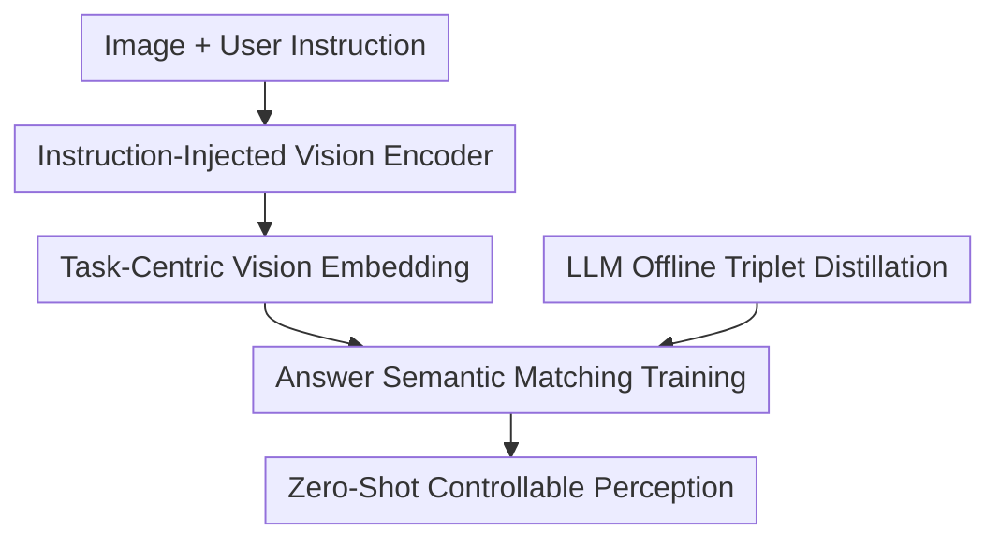

# Language-Instructed Vision Embeddings for Controllable and Generalizable Perception

**Conference**: ICLR 2026  
**OpenReview**: [https://openreview.net/forum?id=r2b0fuf8xb](https://openreview.net/forum?id=r2b0fuf8xb)  
**Paper**: [https://live-embedding.github.io/](https://live-embedding.github.io/)  
**Code**: Not yet open-sourced  
**Area**: Multimodal VLM / Language-Instructed Vision Representation  
**Keywords**: Language-instructed vision encoder, controllable perception, visual hallucination, zero-shot retrieval, LLM data distillation  

## TL;DR
LIVE directly injects natural language instructions into a vision encoder, enabling the same image to generate different task-centric visual embeddings based on different questions. By training on image-question-answer triplets generated by LLMs, this lightweight vision encoder significantly outperforms static visual representations on MMVP, GQA, and cross-dataset instruction retrieval.

## Background & Motivation

**Background**: Vision foundation models like CLIP, SigLIP, and DINOv2 typically encode images into a general embedding, which is then passed to text towers, retrieval modules, or larger multimodal LLMs for downstream tasks. This paradigm is convenient as visual features can be pre-computed and reused for classification, retrieval, and VQA.

**Limitations of Prior Work**: The problem lies in the fact that general embeddings are unaware of what the model should focus on at the moment. If an image of an apple has the text "iPod" stuck to it, a static vision encoder might mix the fruit, text, background, and shape into a single vector. When a user asks "What fruit is in the image?" or "What text is in the image?", downstream modules can only attempt to recover information from an already compressed representation. If key details are not highlighted during the vision encoding stage, even large LLMs struggle to recover them.

**Key Challenge**: Most existing VLMs place language control after vision encoding: the vision tower first produces fixed features, and the language module then interprets, fuses, and generates an answer. This shifts the task adaptation pressure to expensive downstream models and makes visual hallucinations more likely. The core issue to solve is whether language instructions can enter visual computation earlier, allowing the vision encoder to prioritize object categories, text, colors, spatial relationships, or specific boxed regions when generating embeddings.

**Goal**: The authors aim to train an independently usable language-instructed vision encoder. During inference, it takes an image $x$ and a textual question $q$ as input and outputs a visual embedding modulated by $q$. Zero-shot perception, VQA, or retrieval-based prediction can then be completed simply by matching this embedding with the text embeddings of candidate answers, without needing per-task retraining or large LLM decoders.

**Key Insight**: A key observation is that while LLM/VLM inference is expensive, they can generate massive amounts of high-quality supervision signals offline. Rather than having an LLM answer questions online, it can generate rich image-question-answer pairs offline to distill this knowledge into a vision encoder. This leverages open-world knowledge from LLMs during training while retaining a much cheaper instructed vision tower for inference.

**Core Idea**: Modulate the vision encoder with text instructions and perform SigLIP-style matching training using LLM-generated image-question-answer triplets. This transforms visual representation from a "static summary of the whole image" into a "task-specific representation that looks selectively based on the question."

## Method

### Overall Architecture

The workflow of LIVE can be understood as "generating instruction data offline and using instructions to control visual embeddings online." During training, the authors use Gemini 2.0 Flash to generate diverse questions and answers for ImageNet images, resulting in $(x, q, a)$ triplets. The model encodes the question $q$ into language tokens, which are injected into the ViT vision encoder to generate language-instructed vision embeddings. These embeddings are pulled closer to the text embedding of the correct answer $a$ and pushed away from incorrect answers within the batch. During inference, the LLM is no longer involved; the user provides an image and a question, and the LIVE output embedding is matched directly against candidate answer text vectors via retrieval.

The three primary contribution nodes are LLM offline triplet distillation for supervision, instruction injection into the vision encoder to modify visual computation, and answer semantic matching training to align visual embeddings with a retrievable language space.

### Key Designs

**1. Instruction-Injected Vision Encoder: Infusing Task Intent during Encoding**

In traditional dual-tower models, the visual embedding is $z = E(x)$, which defaults to stuffing all potentially useful information into a finite-dimensional vector. LIVE changes this to $z^{(I)} = E_{live}(x, T(q))$: the question $q$ is first processed by a frozen text encoder $T(\cdot)$ to obtain instruction vectors, which are then linearly projected into several query tokens. These tokens enter the ViT alongside image patch tokens. Thus, language is not fused late with visual features but serves as a conditional signal within the vision encoder's self-attention calculations.

This design addresses semantic ambiguity rather than positional ambiguity. While visual prompts (like boxes) tell a model "where to look," they cannot tell it "what attribute to look for" (color, brand, cleanliness, or text content). LIVE's language tokens express the task dimension: for the same apple image with "iPod" text, attention shifts to the text when asked "What is the text?" and to the apple when asked "What is the fruit?". It implements controllability within the representation space.

**2. LLM Offline Triplet Distillation: Using Generative Knowledge to Supplement Instruction Supervision**

The bottleneck in training a language-instructed vision encoder is not the images, but the availability of rich $(image, question, answer)$ triplets. Existing VQA data is often template-based with narrow question types. LIVE uses Gemini 2.0 Flash as an offline knowledge source to generate numbered visual questions and answers for ImageNet training images, resulting in approximately $16.4M$ image-query-answer triplets.

This distillation does not involve the student model reciting LLM text. Instead, the vision encoder learns visual attributes that the LLM deems noteworthy. Because a single image corresponds to multiple questions, the model cannot simply memorize the category; it must adapt its compression of $x$ based on $q$.

**3. Answer Semantic Matching Training: Aligning Controllable Embeddings to Retrievable Space**

Instead of training a generative decoder, LIVE uses a SigLIP-style sigmoid matching loss. For an image-question pair $(x_i, q_i)$ in a batch, the model produces $z_i^{(I)} = E_{live}(x_i, T(q_i))$. The $j$-th candidate answer $a_j$ is processed by a frozen text tower to obtain $z_j^{(T)} = T(a_j)$. If $i=j$, the label $y_{ij}=1$; otherwise, $y_{ij}=-1$. The objective is to maximize the dot product of matching pairs:

$$
L=-\mathbb{E}_{i,j}\log \frac{1}{1+\exp(-y_{ij}(t(z_i^{(I)}\cdot z_j^{(T)})+b))}
$$

where $t$ and $b$ are learnable temperature and bias parameters. This enables clean inference: given a question, the vision side generates a task-specific embedding, and answers can be pre-encoded into a vector library for top-1 retrieval.

**4. Decoupling Instructions and Answers: Avoiding Caption Shortcuts**

Unlike methods that modulate encoders with captions, LIVE ensures that the query input to the vision tower differs significantly from the target answer. For example, the question might be "What color is the snowmobile?" and the answer "blue and white." If the guidance text and target text are too similar, the model might learn to match text features rather than extracting evidence from the image. This separation forces the model to find content in visual tokens that supports the answer.

### Mechanism Example

Consider a typographical attack scenario: an image of an apple with the word "iPod" on it. A static SigLIP outputs a global embedding. When retrieving candidate answers like "Apple" or "iPod," both the text and the object are mixed, often leading to the wrong answer for "What fruit is in the image?".

In LIVE, if the input is "What is the text in the image?", the attention in ViT biases toward the text region, making the embedding closer to the "iPod" text vector. If the input is "What is the fruit in the image?", the query tokens change, shifting attention to the apple and making the embedding closer to "Apple."

### Loss & Training

The model is initialized with ViT vision and text encoders from SigLIP/SigLIP 2. The text tower remains frozen. The vision encoder and the linear layers projecting question vectors into visual query tokens are trained. The ViT-SO version adds approximately $13M$ parameters.

Training uses roughly $16.4M$ triplets from ImageNet images via Gemini 2.0 Flash. Optimization uses a learning rate of $0.001$, batch size of $8192$, and $122k$ steps on $256$ TPUv3 cores. Evaluation is performed using top-1 retrieval accuracy across various benchmarks.

## Key Experimental Results

### Main Results

| Task / Dataset | Metric | LIVE | Prev. SOTA | Gain |
|--------|------|------|----------|------|
| MMVP-VLM | Top-1 accuracy | 76.3 | BRAVE 42.0 / SigLIP 37.8 | +34.3 vs BRAVE |
| GQA | Top-1 retrieval accuracy | 71.2 | LLaVA 63.3 / BRAVE 52.7 | +7.9 vs LLaVA |
| ImageNet† Inst. Retrieval | Top-1 retrieval accuracy | 87.06 | Menon et al. 60.86 / SigLIP 38.03 | +26.20 vs Menon |
| SUN† Inst. Retrieval | Top-1 retrieval accuracy | 52.94 | Menon et al. 25.79 / SigLIP 13.00 | +27.15 vs Menon |
| RefCOCO† Inst. Retrieval | Top-1 retrieval accuracy | 54.33 | Menon et al. 14.98 / SigLIP 9.40 | +39.35 vs Menon |

MMVP highlights the motivation: it tests if VLMs are misled by details, text, or orientation. LIVE ViT-SO reaches $76.3$, while static SigLIP and BRAVE (ensemble) are much lower. This proves that injecting instructions earlier reduces hallucinations more effectively than stacking larger modules downstream.

### Ablation Study

| Configuration | GQA | MMVP | Description |
|------|---------|------|------|
| LIVE: Specific Query + Rich Answer | 67.4 | 69.5 | Full setup with specific questions and descriptive answers |
| Neutral Query: “Caption the image.” + Rich Answer | 13.1 | 65.1 | GQA collapses without specific instructions |
| Specific Query + Class Name | 2.7 | 54.7 | Performance drops without fine-grained semantic supervision |
| Language injection at Layer 1 | 67.4 | 69.5 | Early injection benefits detail discernment (MMVP) |
| Language injection at Layer 8 | 68.2 | 68.7 | Later injection benefits relational semantics (GQA) |

### Key Findings

- **Instructions are the primary contributor**: Removing specific queries causes GQA to drop from $67.4$ to $13.1$, proving the gains come from instruction modulation rather than just more data.
- **Rich answers are indispensable**: Using only class names for targets results in a GQA of only $2.7$, showing that open-ended perception requires descriptive semantics for color, relationships, and actions.
- **Injection depth varies by task**: MMVP prefers early injection (Layer 1) for details, while GQA prefers later injection (Layer 8) for high-level relationships.
- **Robustness to Typographical Attacks**: LIVE can switch between "reading text" and "ignoring text" based on instructions. Under attack, instructions to "ignore text" improved accuracy from $48.31$ to $51.48$.

## Highlights & Insights

- Moving language control forward into the vision encoder addresses the root cause of hallucinations: if the embedding doesn't preserve evidence based on the question, even powerful language reasoning is just guessing.
- Using LLMs as offline data factories instead of online components leverages Gemini's knowledge while avoiding high deployment costs.
- Decoupling instructions and answers prevents "caption shortcuts," forcing the model to find supporting visual evidence.
- Reformulating VQA as embedding retrieval is efficient for tasks where generative responses are not strictly necessary.

## Limitations & Future Work

- Query design is still empirical; there is no principled way to determine the optimal prompt for every task.
- Complex compositional instructions (negation, abstract logic) remain a weakness due to frozen text encoder limitations.
- Safety and malicious prompts require additional mechanisms to prevent biased or harmful visual representations.
- Data and code openness is currently restricted by institutional review.

## Related Work & Insights

- **vs CLIP / SigLIP**: These learn static alignment; LIVE produces dynamic embeddings based on queries within the same structure.
- **vs LLaVA / InstructBLIP**: These rely on large language decoders for task adaptation; LIVE distills this into the encoder for low-cost retrieval.
- **vs Visual Prompting**: While boxes specify "where," LIVE's natural language specifies "what attribute."
- **vs Caption-Conditioned Repr.**: LIVE avoids shortcuts by separating the query from the descriptive target answer.

## Rating

- **Novelty**: ⭐⭐⭐⭐⭐ (Embedding task instructions directly into the vision representation generation process is a clear and effective direction).
- **Experimental Thoroughness**: ⭐⭐⭐⭐☆ (Strong results on MMVP and GQA, though real-world deployment coverage is limited).
- **Writing Quality**: ⭐⭐⭐⭐☆ (Main narrative is clear, though appendix details are somewhat scattered).
- **Value**: ⭐⭐⭐⭐⭐ (Offers a practical alternative to scaling language backends by improving how encoders "see").

<!-- RELATED:START -->

## Related Papers

- [\[ICLR 2026\] MaskInversion: Localized Embeddings via Optimization of Explainability Maps](maskinversion_localized_embeddings_via_optimization_of_explainability_maps.md)
- [\[ICLR 2026\] ViPER: Empowering the Self-Evolution of Visual Perception Abilities in Vision-Language Models](viper_empowering_the_self-evolution_of_visual_perception_abilities_in_vision-lan.md)
- [\[ICLR 2026\] LEGATO: Large-scale End-to-end Generalizable Approach to Typeset OMR](legato_large-scale_end-to-end_generalizable_approach_to_typeset_omr.md)
- [\[ICLR 2026\] WAVE: Learning Unified & Versatile Audio-Visual Embeddings with Multimodal LLM](wave_learning_unified_versatile_audio-visual_embeddings_with_multimodal_llm.md)
- [\[CVPR 2026\] Controllable Federated Prompt Learning at Test Time](../../CVPR2026/multimodal_vlm/controllable_federated_prompt_learning_at_test_time.md)

<!-- RELATED:END -->
