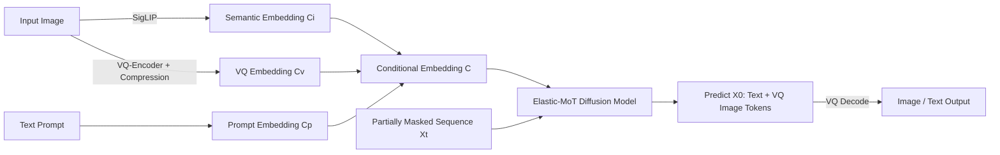

# Lavida-O: Elastic Large Masked Diffusion Models for Unified Multimodal Understanding and Generation

**Conference**: ICLR 2026  
**Code**: [https://github.com/adobe-research/LaVida-O](https://github.com/adobe-research/LaVida-O)  
**Area**: Unified Multimodal Models / Masked Diffusion Models  
**Keywords**: Masked Diffusion Models, Unified Multimodality, Elastic-MoT, Image Editing, Object Grounding, Self-Reflective Generation  

## TL;DR
Lavida-O utilizes a single Masked Diffusion Model (MDM) to simultaneously bridge image understanding, object grounding, image editing, and 1024px high-definition text-to-image generation. By employing an "Elastic Mixture-of-Transformers" (Elastic-MoT) architecture, it efficiently integrates an 8B understanding branch with a 2.4B lightweight generation branch. Furthermore, it introduces planning and self-reflection mechanisms that allow understanding capabilities to enhance generation quality, outperforming Qwen2.5-VL and FluxKontext across RefCOCO, GenEval, and ImgEdit.

## Background & Motivation
**Background**: Unified multimodal models, represented by GPT-4o, have become the new paradigm by performing understanding and generation within a single model. The main approaches include hybrid Autoregressive (AR) + Diffusion models (e.g., BAGEL, which uses AR for text and continuous diffusion for images) and pure AR models using discrete tokens (e.g., Janus). Recently, Masked Diffusion Models (MDM) have emerged as powerful alternatives to AR models. MDMs treat token generation as a diffusion process in discrete space, transitioning from a fully masked sequence to an unmasked one during inference. Models like LLaDa-8B and Dream-8B have demonstrated that MDMs can rival AR models in language modeling while offering advantages such as parallel decoding and bidirectional context.

**Limitations of Prior Work**: Existing efforts to scale MDMs to unified multimodality (e.g., MMaDa, Muddit) lag significantly behind the SOTA. Three major obstacles exist: (1) Expensive training—MMaDa requires joint pre-training of an 8B model on both text and image generation; (2) Scarcity of open-source resources and training experience for Masked Image Generation Models (MIGM), where even the best open-source model, Meissonic-1B, is notably weaker than continuous diffusion models of similar size; (3) Lack of explicit mechanisms to allow understanding to inform generation—prior works like MMaDa and Muddit cannot perform image editing and merely concatenate text-to-image and understanding data.

**Key Challenge**: Understanding tasks require high-capacity language backbones (8B scale), whereas generation tasks can often be handled by 2–4B parameters. However, traditional dense models and standard Mixture-of-Transformers (MoT) apply the same parameter scale to all tasks, leading to either catastrophic forgetting or doubled parameter counts, both of which result in prohibitively high training costs.

**Goal**: To develop a unified MDM framework for image-level understanding, object grounding, image editing, and HD text-to-image generation while controlling training costs and actively leveraging understanding capabilities to improve generation quality.

**Core Idea**:
- **Elastic Decoupling**: The generation branch uses a smaller hidden dimension and only performs joint attention with the understanding branch in the initial layers, dynamically activating parameters based on the task.
- **Unified Discrete Tokens**: Images are encoded into discrete tokens using VQ, sharing the masked diffusion objective with text to avoid harmonizing two different loss functions.
- **Understanding Feeds Generation**: The model's inherent understanding capabilities are used for layout planning and post-generation self-reflection for error correction.

## Method

### Overall Architecture
Lavida-O utilizes the understanding-only diffusion model LaViDa as its base and extends it with generation capabilities. Given input images and text, the model concatenates image semantic embeddings $C_i$ (SigLIP encoded), image VQ embeddings $C_v$, and text prompt embeddings $C_p$ into a conditional embedding $C=\text{Concat}(C_i, C_v, C_p)$. The model takes $C$ and a partially masked sequence $X_t$ to predict the fully unmasked sequence $X_0$. Understanding tasks output text tokens, while generation tasks output VQ image tokens. The training process consists of three stages: first, training understanding and grounding; second, adding a 2.4B generation branch for progressive resolution (256→512→1024) text-to-image pre-training; finally, end-to-end joint training of all tasks with the combined 2.4B+8B architecture.

### Key Designs

**1. Elastic Mixture-of-Transformers: Task-based Elastic Parameter Activation**
This is the core design for cost reduction. Standard MoT assigns identical parameter sizes to generation and understanding and performs joint attention at every layer, doubling the parameters. Elastic-MoT introduces two key changes: first, the generation branch uses a smaller hidden dimension (observing that many T2I models achieve high quality at 2–4B, and generation does not require the same capacity as understanding). The generation branch adds only 2.4B parameters, while the understanding branch retains the 8B LaViDa backbone. Second, given an $N$-layer model, text and image modalities interact via joint attention only in the first $M$ layers, while the remaining $K=N-M$ layers perform self-attention within each modality. Consequently, different tasks activate only a subset of parameters. For $N=32, M=K=16$, T2I activates 6.4B parameters (2.4B generation + 4B from the first 16 layers of understanding), pure understanding uses 8B, and interleaved tasks use 10.4B. During T2I pre-training, only the 2.4B branch is trained. Overall training is 3.17× faster than standard MoT (2.23× from the smaller generation branch and 1.44× from decoupled attention).

**2. Modality-aware Masking: Directing Parallel Decoding**
A routing challenge in MoT is determining whether each token should be processed by the understanding or generation branch. While AR models use special tokens like `[img_start]` sequentially, MDMs decode in parallel and must determine token assignments in advance. The authors designed a modality-aware forward process: given $M$ text tokens and $N$ image VQ tokens, at a specific timestamp $t_{exp} \in [0,1]$, fully masked image VQ tokens collapse into a single special `[exp]` text token. During inference, all masks are initially assumed to be text tokens; once an `[exp]` token is generated, it expands into $L_{img}$ masked tokens flagged for the generation branch. This allows interleaved generation (e.g., image generation with self-reflection) to automatically determine the count and position of image tokens.

**3. Unified Textual Conditioning + Hierarchical Random Sampling**
Unified textual conditioning treats traditional micro-conditioning (resolution, crop coordinates, quality scores, etc.) as plain text appended to the prompt (e.g., `SCORE: 5.40`, plus brightness and contrast), leveraging the model's language understanding for fine-grained control without specialized embeddings. Hierarchical random sampling replaces standard confidence-based sampling for image generation. Confidence-based sampling often clusters high-confidence tokens near already unmasked ones, violating the independence assumption of MDM. Hierarchical sampling begins with a $2 \times 2$ grid, unmasking one token per region to ensure uniform spatial coverage, and then recursively subdivides regions until all tokens are revealed, ensuring a balanced unmasking order.

**4. Planning & Self-Reflection: Explicit Understanding Feedback for Generation**
This is a new paradigm in Lavida-O. In the planning phase, the model first generates an image layout represented by bounding boxes before generating the image; for image editing, it locates the target region first. In the self-reflection phase, the model uses its understanding capabilities to evaluate whether the generated result satisfies the user request, regenerating if inconsistencies are detected. This is paired with a coordinate quantization scheme for grounding (normalizing coordinates to $[0,1]$ and quantizing into 1025 discrete tokens, with 4 tokens per box). Leveraging the bidirectional context of MDM, multiple bounding boxes can be decoded in parallel, allowing grounding tasks to be completed in as little as a single step. On GenEval, adding planning improved the score from 0.77 to 0.85, and adding reflection further increased it to 0.89.

## Key Experimental Results

### Main Results

**Text-to-Image (GenEval / DPG / FID-30k)**

| Method | Params | Type | GenEval↑ | DPG↑ | FID-30k↓ |
|------|------|------|----------|------|----------|
| Flux-dev | 12B | Continuous | 0.68 | 84.0 | 10.15 |
| SD3-Medium | 2B | Continuous | 0.74 | 84.1 | 11.92 |
| BAGEL | 7B+7B | Continuous | 0.82 | - | - |
| MMaDA | 8B | Masked | 0.63 | 53.4 | 32.85 |
| Muddit | 1B | Masked | 0.61 | - | - |
| **Ours** | 4B+2.4B | Masked | 0.77 | 81.8 | **6.68** |
| **Ours + Planning** | 8B+2.4B | Masked | 0.85 | 82.9 | - |
| **Ours + Reflection** | 8B+2.4B | Masked | **0.89** | 83.2 | - |

**Object Grounding (RefCOCO Precision@0.5)**

| Model | RefCOCO val/testA/testB | RefCOCOg val/test |
|------|------|------|
| Qwen2.5-VL-7B | 90.0 / 92.5 / 85.4 | 87.2 / 87.2 |
| InternVL3-8B | 92.5 / 94.6 / 88.0 | 89.6 / 90.0 |
| **Ours (4 steps)** | 92.3 / 94.8 / 89.0 | 90.0 / 90.6 |
| **Ours (1 step)** | 91.9 / 94.6 / 88.4 | 89.5 / 89.8 |

**Image Editing (ImgEdit overall)**: GPT-4o 4.20 / **Ours + Planning 3.80** / FluxKontext-dev 3.52 / BAGEL 3.20. In "Replace" (4.40) and "Remove" (4.05) object categories requiring local understanding, the model even surpassed GPT-4o (4.35 / 3.66).

**Image Understanding**: MMMU 45.1, MMB 76.4, ChartQA 80.0, MathVista 56.9. These results significantly outperform the unified masked model MMaDa (MMMU 30.2, ChartQA 9.8) and show substantial improvement over the base LaViDa.

### Ablation Study

| Design | Effect |
|------|------|
| Smaller generation branch (2.4B vs. full-sized) | 2.23× training speedup |
| Decoupled attention in last 16 layers | Additional 1.44× speedup |
| Elastic-MoT vs. BAGEL-style MoT | 3.17× total training speedup |
| + Planning (GenEval) | 0.77 → 0.85 |
| + Self-Reflection (GenEval) | 0.85 → 0.89 |

### Key Findings
- **Inference Speed**: Object grounding is 6.8× faster than Qwen2.5-VL-7B, thanks to single-step parallel decoding of multiple bounding boxes.
- **Understanding Empowers Generation**: Planning and reflection provide a cumulative +0.12 gain on GenEval. Local understanding in editing tasks allows for superior performance in replacing/removing objects compared to GPT-4o.
- **Masked Diffusion Parity**: The unified MDM route has finally caught up to or surpassed AR and continuous diffusion unified models, with an FID-30k of 6.68, better than Flux-dev and BAGEL.

## Highlights & Insights
- **Engineering the "Generation needs less than Understanding" observation**: The Elastic-MoT translates this into a "small generation branch + limited joint attention" architecture, saving both parameters and compute.
- **Elegant Unified Textual Conditioning**: Micro-conditioning that typically requires specialized embeddings is simply treated as natural language, a "free" benefit of high understanding capacity.
- **Planning + Self-Reflection converts "Watching" to "Editing"**: This represents a paradigm shift from "implicit mutual benefit in joint training" to "explicitly calling understanding to correct generation," validated by data.
- **Hierarchical Sampling targets MDM independence assumptions**: By using recursive grids to manage spatial correlation in image sampling, the model cleanly addresses unmasking distribution issues.

## Limitations & Future Work
- Self-reflection and planning rely on additional inference steps (parameters increase from 4B+2.4B to 8B+2.4B activation), trading quality for latency. FID evaluations were not conducted with these enabled due to the large dataset size.
- Generation quality still depends on VQ discrete tokens, which may have limited detail compared to continuous diffusion; the paper acknowledges the relative immaturity of MIGM training.
- Evaluations focus on standard benchmarks (GenEval, ImgEdit, RefCOCO); capabilities in more complex multi-turn interleaved reasoning or long-range consistency have yet to be fully explored.
- The three-stage training and progressive resolution increase the complexity and barrier to reproduction.

## Related Work & Insights
- **Masked Diffusion Foundations**: Based on discrete diffusion theories from BERT, MaskGIT, and VQGAN to SEDD/MDLM, and the scalability demonstrated by LLaDa-8B and Dream-8B.
- **Unified Multimodal Models**: Contrasted against BAGEL (AR+Diffusion), Janus-Pro (Unified AR), and MMaDa/Muddit (Unified MDM). Lavida-O marks a significant advancement for the unified MDM route.
- **MoT Architectures**: Derived from the Mixture-of-Transformers by Liang et al.; while X-Fusion and LM-Fusion explored training recipes, Elastic-MoT is its "elastic" variant.
- **Inspiration**: Unifying all modalities with a single discrete objective and activating parameters elastically by task might be a highly cost-effective formula for repurposing large understanding backbones for generation.

## Rating
- **Novelty**: ⭐⭐⭐⭐⭐ The first unified MDM to achieve SOTA across T2I, editing, and grounding. Elastic-MoT, modality-aware masking, and planning/reflection are substantial innovations.
- **Experimental Thoroughness**: ⭐⭐⭐⭐ Covers understanding, generation, editing, and grounding across multiple benchmarks. Includes speed and ablation analyses, though some results are self-tested and self-reflection wasn't applied to all benchmarks.
- **Writing Quality**: ⭐⭐⭐⭐ Clear motivation and excellent diagrams (architecture comparisons, masking process, sampling visualization).
- **Value**: ⭐⭐⭐⭐⭐ Provides a viable recipe for low-cost expansion of large understanding models into unified generative models, proving the MDM route is competitive with mainstream approaches.

<!-- RELATED:START -->

## Related Papers

- [\[CVPR 2026\] Sparse-LaViDa: Sparse Multimodal Discrete Diffusion Language Models](../../CVPR2026/multimodal_vlm/sparse-lavida_sparse_multimodal_discrete_diffusion_language_models.md)
- [\[ICLR 2026\] Thinking with Camera: A Unified Multimodal Model for Camera-Centric Understanding and Generation](thinking_with_camera_a_unified_multimodal_model_for_camera-centric_understanding.md)
- [\[ICLR 2026\] Omni-Weather: A Unified Multimodal Model for Weather Radar Understanding and Generation](omni-weather_a_unified_multimodal_model_for_weather_radar_understanding_and_gene.md)
- [\[ICLR 2026\] ORION: Decoupling and Alignment for Unified Autoregressive Understanding and Generation](orion_decoupling_and_alignment_for_unified_autoregressive_understanding_and_gene.md)
- [\[ICLR 2026\] UniF2ace: A Unified Fine-grained Face Understanding and Generation Model](unif2ace_a_underlineunified_underlinefine-grained_underlineface_understanding_an.md)

<!-- RELATED:END -->
