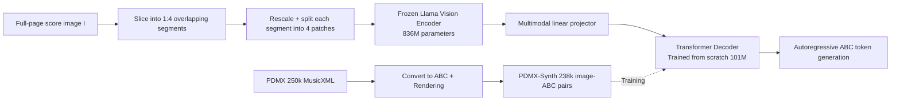

# LEGATO: Large-scale End-to-end Generalizable Approach to Typeset OMR

**Conference**: ICLR 2026  
**OpenReview**: [https://openreview.net/forum?id=RdtQiM9gyB](https://openreview.net/forum?id=RdtQiM9gyB)  
**Code**: [https://github.com/guang-yng/legato](https://github.com/guang-yng/legato)  
**Area**: Multimodal / Optical Music Recognition (OMR)  
**Keywords**: Optical Music Recognition, ABC notation, Pre-trained visual encoder, End-to-end, Multi-page sheet music, BPE tokenization  

## TL;DR
Legato feeds full-page (or even multi-page) printed sheet music images directly into a frozen Llama vision encoder combined with a scratch-trained ABC decoder. It performs end-to-end transcription into concise ABC notation. Leveraging 214,000 synthetic data samples, it is the first large-scale pre-trained OMR model capable of recognizing full-page/multi-page typeset music and outputting ABC. On highly realistic datasets, it reduces TEDn and OMR-NED by absolute margins of 68% and 47.6%, respectively.

## Background & Motivation
**Background**: A vast amount of music scores exist only as scanned photocopies (e.g., IMSLP public domain library). Digitizing them into machine-readable symbols unlocks massive potential for music analysis and synthesis data. Optical Music Recognition (OMR) addresses this task, with end-to-end neural methods currently being the most successful.

**Limitations of Prior Work**: Previous end-to-end OMR was largely restricted to narrow inputs—processing only piano scores, monophonic parts, or single-system music. Real scores are far more complex, potentially containing multiple systems per page, multi-staff arrangements, multiple voices, and various text annotations like titles and lyrics. Recent general models like SMT++ were trained only on 688 pages of synthetic piano scores (FP-GrandStaff), leading to limited generalization.

**Key Challenge**: (1) **Output Format Dispute**: MusicXML is verbose and difficult to parse, while **kern is researcher-oriented and unintuitive. Evaluation is also highly dependent on the training format, leading to unfair cross-model comparisons. (2) **Data Scarcity**: End-to-end Transformers require massive image-symbol pairs, but existing ABC data is mostly monophonic and does not represent complete scores, lacking large-scale full-page pairing sets.

**Goal**: To build a universal end-to-end OMR model capable of recognizing multi-system, multi-page, real printed scores, utilizing a concise yet near-complete output format.

**Core Idea**: **[ABC for Output + Data-driven Tokenization]** Abandon **kern/MusicXML in favor of ABC notation—which is an order of magnitude shorter than MusicXML (dozens of lines vs. thousands for the same piece), reducing autoregressive decoding costs and focusing on "musical elements" rather than "layout elements"; **[Frozen Vision Encoder + Scratch-trained Decoder]** Directly reuse the pre-trained multimodal Llama vision encoder (frozen) and train a lightweight ABC decoder from scratch to transfer general image priors to music scores; **[Large-scale Synthetic Data]** Use 250,000 MusicXML files from PDMX to render 238,000 high-diversity image-ABC pairs (PDMX-Synth) to support pre-training.

## Method

### Overall Architecture
Legato follows the "vision encoder + cross-attention decoder" framework of multimodal Llama. Input full-page score images are sliced into overlapping segments with aspect ratios $\leq$ 1:4. Each segment is rescaled and split into 4 patches before being fed into a **frozen** Llama vision encoder to obtain latent embeddings. These embeddings serve as keys/values for a scratch-trained Transformer decoder to autoregressively generate ABC tokens preceded by a context prefix. Training data is sourced from the self-constructed PDMX-Synth (MusicXML → ABC → Rendered Image).

### Key Designs

**1. PDMX-Synth: Large-scale, heavily augmented image-ABC pairing set via rendering pipeline to combat "default renderer overfitting."** OMR training lacks massive paired data, and official ABC repositories mostly contain monophonic samples. The authors turned to PDMX (250,000 MuseScore public domain MusicXML files), using `xml2abc` for batch conversion and filtering out extreme aspect ratios > 10 (approx. 5%, due to high autoregressive costs), resulting in 238,386 pairs (93.8% of original data). Key to generalization is rendering diversity: using two pipelines—MuseScore 3.6.2 (MusicXML → PNG) and abcm2ps (ABC → SVG → CairoSVG → PNG)—with heavy visual augmentation (random resolution, margin cropping, 50% horizontal layout, 70% random-style measure numbers, random scaling $[0.9, 1]$, and background grayscale sampled from $[192, 255]$).

**2. Near-normalized ABC Representation: Converging synonymous writings into a unique form to reduce learning and evaluation difficulty.** ABC syntax is flexible, allowing the same score to be written as multiple text strings. The authors enforce several normalization rules: using `$` to explicitly mark line breaks; forcing a new line every 5 measures while retaining the `%measure_count` comment; and fixing the unit note length to 1/8 (`L:1/8`). Additionally, since OMR focuses on musical symbols rather than text, titles/instruments/lyrics/comments are replaced with a special `<|text|>` token, allowing the model to focus on musical symbol recognition.

**3. Data-driven BPE Tokenization: Making "composite musical concepts" atomic units in the vocabulary.** While SMT++ uses expert-defined **kern symbol vocabularies, Legato applies BPE (Sennrich et al., 2016) directly on the ABC text of the PDMX-Synth training set (vocabulary size 4,097). This allows high-frequency composite concepts to merge naturally—for example, a C major triad `CEG` becomes a single token. Combined with duration tokens like `2` or `4`, it can represent quarter/half-note triads efficiently, embedding musical structure priors into the vocabulary.

**4. Image Processing + Frozen Encoder + Selective Cross-attention Decoder: Handling "tall full-page images" with controllable computation.** Full-page scores have relatively fixed widths but can be very tall. Images are sliced vertically into segments (aspect ratio $\leq$ 1:4), rescaled, and patched into 4 units (internal dimension $D=448$), forming a tensor $p \in \mathbb{R}^{S\times 4\times C\times D\times D}$. The vision encoder (836M parameters from `Llama-3.2-11B-Vision`, **frozen**) outputs $\mathbb{R}^{S\times4\times L\times 6d_v}$ ($L=1025, d_v=1280$). The decoder uses a linear projection to align embeddings to $d_l$ dimensions. The core is an $L_d$-layer Transformer, but cross-attention is only performed on a subset of layers $\Gamma_l$ to save computation. Legato uses $d_l=768, d_u=1526, L_d=18, \Gamma_l=\{3,7,11,15\}$ (101M parameters). Legato$_{small}$ ($d_l=320, d_u=448, L_d=8, \Gamma_l=\{3,5,7\}$, 8.5M parameters) was created for fair comparison with SMT++. Both were trained for 10 epochs, batch 32, lr 3e-4, AdamW, sequence truncation 4096, bf16.

## Key Experimental Results

### Main Results
MusicXML is used as the unified evaluation format (fair for both Legato and SMT++). TEDn is the primary metric, and OMR-NED is the format-agnostic fine-grained metric; **lower is better**.

| Dataset (Metric) | n | GPT-4o* | SMT++ | **Ours** | Legato$_{small}$ |
|---|---|---|---|---|---|
| Camera String Quartets (TEDn) | 252 | 90.5 | 98.6 | **60.4** | 84.1 |
| Camera String Quartets (OMR-NED) | 252 | 97.6 | 94.7 | **58.2** | 93.5 |
| Rendered String Quartets (TEDn) | 252 | 93.0 | 97.9 | **52.1** | 78.4 |
| Rendered String Quartets (OMR-NED) | 252 | 97.8 | 94.3 | **32.9** | 88.5 |
| Camera Lieder (TEDn) | 64 | 91.4 | 98.7 | **47.0** | 82.7 |
| Rendered Lieder (TEDn) | 64 | 91.0 | 97.4 | **26.5** | 68.8 |
| IMSLP Piano (TEDn) | 32 | 96.7 | 97.7 | **29.7** | 76.9 |

On the most realistic IMSLP piano scans, Ours reduced TEDn from SMT++'s 97.7 to 29.7 (absolute ↓68%) and reduced OMR-NED from 91.9 to 44.3 (↓47.6%). No datasets used for evaluation were part of training or validation.

### Ablation Study
- **Format Bias Compensation**: TEDn requires output convertible to MusicXML, which SMT++ often fails at. Even on the subset where SMT++ succeeds (TEDn$_{convert}$), Ours leads significantly (e.g., 8.7 vs SMT++ 58.1 on Rendered Lieder).
- **Scale Comparison**: Legato$_{small}$ has trainable parameters comparable to SMT++ but still outperforms it on most datasets, suggesting gains are not solely from parameter count.
- **General VLM Reference**: GPT-4o performs better than SMT++ on TEDn but worse on OMR-NED due to **kern grammar correction bias; overall it lags far behind Legato.
- **Out-of-Distribution Boundary**: On JAZZMUS (handwritten), Legato shows limited generalization due to the distribution shift from printed scores.

### Key Findings
1. The combination of "frozen general vision encoder + scratch-trained ABC decoder + large-scale augmented synthetic data" is sufficient to set a new SOTA on multiple **unseen** real datasets.
2. The largest gains occurred on real IMSLP scans, proving that synthetic data + heavy visual augmentation effectively mitigates typeset bias.
3. General VLMs (like GPT-4o) are not yet capable of precise OMR; specialization and large data remain necessary.

## Highlights & Insights
- **First of its kind**: The first large-scale pre-trained OMR model for full-page/multi-page typeset scores, the first to use ABC as output, and the first image-to-ABC OMR model.
- **Format choice as modeling choice**: Using ABC notation—which is concise, near-complete, and musically centered—saves autoregressive computation and allows BPE to learn composite concepts like chords; the "tokenizer learning music" is a powerful byproduct.
- **Serious approach to evaluation fairness**: The authors used MusicXML (untrained by any model) for unified evaluation and provided TEDn$_{convert}$ results to give the baseline an advantage, yet still outperformed it consistently.
- **Frozen encoder transfer**: Using general image pre-training as a strong starting point for OMR sidesteps the scarcity of annotated music score images.

## Limitations & Future Work
- **Musical symbols only**: Text like titles/lyrics is replaced with `<|text|>`; text recognition is left for future work.
- **Weak handwritten generalization**: Trained exclusively on printed scores, resulting in lower performance on JAZZMUS.
- **Frozen Vision Encoder**: The encoder was not fine-tuned for scores; fine-tuning modern vision encoders is a promising next step.
- **Data Truncation**: Approximately 5% of extremely tall scores (aspect ratio > 10) were discarded due to autoregressive sequence length costs.

## Related Work & Insights
- **OMR Lineage**: From Camera-PrIMuS and piano-only E2E models to SMT++ (multi-system). Legato pushes the boundary to full-page, multi-page, and multi-voice scores.
- **Symbolic Music Formats**: **kern (Humdrum), ABC, and MusicXML are informationally similar but differ in focus. This work selects ABC after a systematic comparison.
- **VLM Architecture Transfer**: Directly applying the Llama vision encoder and cross-attention paradigm is an excellent example of using general VLM components for specialized document recognition tasks.
- **Insight**: For any "image-to-structured-symbol" task (chemical formulas, circuit diagrams), the combination of "concise target format + data-driven tokenization + frozen large encoder + heavy augmentation" is a robust template.

## Rating
- **Novelty**: ⭐⭐⭐⭐ First multi-page typeset and image-to-ABC E2E OMR. The combination of format choice, BPE, and frozen encoders is innovative.
- **Experimental Thoroughness**: ⭐⭐⭐⭐ Evaluated on 5+ unseen datasets with multiple metrics including camera/rendered versions. Fair comparisons against GPT-4o and SOTA baselines.
- **Writing Quality**: ⭐⭐⭐⭐ Clear progression from motivation to design trade-offs, data, and evaluation. discussions on fairness are transparent.
- **Value**: ⭐⭐⭐⭐ Open-sourced model, PDMX-Synth dataset, and IMSLP annotations provide immediate infrastructure value for the OMR community.

<!-- RELATED:START -->

## Related Papers

- [\[ICLR 2026\] WebDS: An End-to-End Benchmark for Web-based Data Science](webds_an_end-to-end_benchmark_for_web-based_data_science.md)
- [\[CVPR 2026\] MarkushGrapher-2: End-to-end Multimodal Recognition of Chemical Structures](../../CVPR2026/multimodal_vlm/markushgrapher-2_end-to-end_multimodal_recognition_of_chemical_structures.md)
- [\[AAAI 2026\] SpeakerLM: End-to-End Versatile Speaker Diarization and Recognition with Multimodal Large Language Models](../../AAAI2026/multimodal_vlm/speakerlm_end-to-end_versatile_speaker_diarization_and_recognition_with_multimod.md)
- [\[ACL 2026\] E2E-GMNER: End-to-End Generative Grounded Multimodal Named Entity Recognition](../../ACL2026/multimodal_vlm/e2e-gmner_end-to-end_generative_grounded_multimodal_named_entity_recognition.md)
- [\[ICLR 2026\] Efficient Discriminative Joint Encoders for Large Scale Vision-Language Re-ranking](efficient_discriminative_joint_encoders_for_large_scale_vision-language_rerankin.md)

<!-- RELATED:END -->
