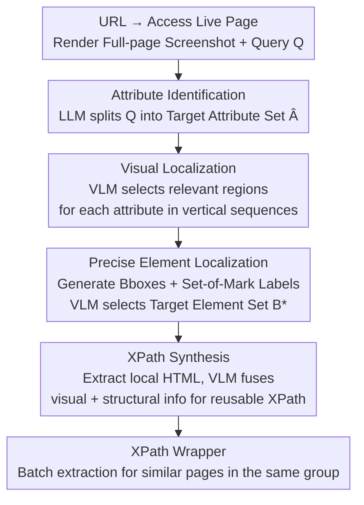

# LiveWeb-IE: A Benchmark For Online Web Information Extraction

**Conference**: ICLR 2026  
**arXiv**: [2603.13773](https://arxiv.org/abs/2603.13773)  
**Code**: [GitHub](https://github.com/sbY99/LiveWeb-IE)  
**Area**: Multimodal VLM  
**Keywords**: Web Information Extraction, Online Evaluation, Visual Grounding, XPath Generation, Multimodal Agent

## TL;DR

This paper proposes LiveWeb-IE, the first benchmark for online Web Information Extraction (WIE), which covers various data types including text, images, and hyperlinks. It also introduces the Visual Grounding Scraper (VGS) framework, which achieves robust information extraction on dynamic web pages by simulating human cognitive processes—visually scanning to locate regions, precisely pinpointing elements, and generating XPaths.

## Background & Motivation

Web Information Extraction (WIE) is the task of automatically extracting structured data from web pages. Existing WIE benchmarks (e.g., SWDE, WEIR, PLAtE) are all built on **static HTML snapshots**, which suffer from fundamental flaws:

**Temporal Mismatch**: Web layouts and structures change continuously over time; static snapshots fail to reflect the current state of a website.

**Unreliable Performance**: LLM-based wrapper methods show an average F1 decline of over 15% on the same website after structural evolution.

**Limited Data Types**: Existing benchmarks focus only on text extraction, ignoring requirements for images and hyperlinks.

**Missing Complexity Dimensions**: There is a lack of systematic task complexity layering.

Furthermore, existing WIE methods rely excessively on HTML parsing. As web structures become increasingly complex, the redundancy of HTML makes accurate information localization difficult.

## Method

### Overall Architecture

This paper addresses the issue that "existing WIE benchmarks are entirely static HTML snapshots that cannot keep up with real-world web changes" by providing two contributions: an online evaluation benchmark, LiveWeb-IE, and a training-free extraction method, VGS. LiveWeb-IE moves evaluation online—the system must visit the actual live web page after receiving a URL. VGS simulates the human cognitive process of finding information on a page, narrowing the observation space step-by-step from "full-page screenshot → locked region → precise element localization → XPath synthesis" to produce reusable XPath wrappers. The following diagram illustrates the VGS extraction pipeline:

### Key Designs

**1. LiveWeb-IE: Shifting WIE Evaluation from Offline Snapshots to Live Web Pages**

Addressing the pain point of "temporal mismatch and unreliable performance due to structural changes," the core of LiveWeb-IE is requiring systems to directly access target URLs and process real-time DOMs during evaluation. It features: online evaluation; 15 authorized websites across 8 domains (checked via robots.txt, terms of use, and administrator authorization); coverage of text, images, and hyperlinks; and task categorization into 4 complexity levels based on attribute count and value cardinality. These levels are: Type I (single attribute, single value), Type II (multi-attribute, single value), Type III (single attribute, list value), and Type IV (multi-attribute, list value).

The benchmark was built through "site selection → layout-based clustering → data annotation → manual cross-validation," resulting in 342 queries, 97 unique attributes, and 46 page groups. To ensure long-term validity, queries focus on factual information (e.g., "2022 World Cup final score"), where the answer remains constant even if the layout changes.

**2. VGS: Simulating Human Cognition to Narrow Observation Space in Four Stages**

VGS addresses the "HTML redundancy" pain point by bypassing pure HTML parsing and scanning the page visually. It employs four stages to shrink the processing scope:

Attribute Identification uses an LLM to decompose a natural language query into a structured set of target attributes $\hat{\mathcal{A}}$:

$$\hat{\mathcal{A}} = \text{LLM}(I_a, Q)$$

Visual Localization renders the page into a sequence of vertical region screenshots $\mathcal{R}$. For each attribute, a VLM identifies relevant regions $r'_i = \text{VLM}(I_g, \mathcal{R}, \hat{a}_i)$. This reduces the scope from the entire page to specific regions (e.g., product cards).

Precise Element Localization locates the target value within the identified region via two steps: generating candidate bounding boxes (VLM scan for text, HTML tags for non-text) and applying Set-of-Mark Prompting. The VLM then selects the correct subset of elements:

$$\mathcal{B}_i^* = \text{VLM}(I_p, r_i^*, \hat{a}_i)$$

XPath Synthesis retrieves the local HTML fragment within distance $d$ of the precise bounding boxes. The VLM then combines visual and structural information to generate a reusable XPath:

$$x_i = \text{VLM}(I_x, \mathcal{H}_i, \hat{r}_i, \hat{a}_i)$$

The resulting XPath wrapper can be applied to similar pages without needing VLM inference again.

### Loss & Training

VGS is a **training-free** Agent framework based entirely on the reasoning capabilities of pre-trained LLMs/VLMs. Evaluation metrics include Precision, Recall, and F1.

## Key Experimental Results

### Main Results

**Overall F1 Comparison on LiveWeb-IE**:

| Backbone | Method | Type I F1 | Type II F1 | Type III F1 | Type IV F1 | Overall F1 |
|----------|------|-----------|------------|-------------|------------|------------|
| GPT-4o | COT | 47.54 | 40.84 | 8.15 | 7.24 | 24.60 |
| GPT-4o | AutoScraper | 55.22 | 42.65 | 9.10 | 6.92 | 26.76 |
| GPT-4o | **VGS** | **65.87** | **46.35** | **45.38** | **41.50** | **48.58** |
| Gemini-2.5-Flash | **VGS** | **49.02** | **44.82** | **42.92** | **38.13** | **43.44** |

**Open-source Model Comparison (Overall F1)**:

| Backbone | COT | AutoScraper | VGS |
|----------|-----|-------------|-----|
| Qwen-2.5-7B | 11.67 | 16.04 | **21.74** |
| Qwen-2.5-32B | 17.74 | 21.61 | **35.05** |
| Gemma-3-27B | 16.65 | 19.04 | **30.79** |

### Ablation Study

Contributions of VGS stages:
1. **Removing Visual Localization**: Attempting precise localization without region locking significantly degrades performance.
2. **Removing Precise Element Localization**: Skipping the Set-of-Mark step leads to significant regression in complex types.
3. **Using HTML Instead of Visual Info**: F1 for Type III and Type IV drops sharply.

### Key Findings

1. **Static-to-Online Performance Gap**: LLM methods show an average F1 drop of >15% after structural evolution, confirming the necessity of online evaluation.
2. **Complexity Gap**: VGS's greatest advantage lies in complex types—GPT-4o+VGS achieves 45.38% F1 on Type III, while COT only achieves 8.15%.
3. **Crucial Role of Visual Info**: Pure HTML methods fail on complex pages; VGS bypasses HTML noise through visual grounding.
4. **Open vs. Closed Source Gap**: Even with VGS, Qwen-2.5-32B (35.05%) still lags behind GPT-4o (48.58%).
5. **Wrapper Reusability**: XPaths generated by VGS generalize effectively across pages of the same type.

## Highlights & Insights

- **Innovation in Problem Definition**: Successfully shifts WIE evaluation from offline to online, addressing annotation persistence through content stability design.
- **Cognitive-inspired Design**: The four-stage VGS pipeline accurately simulates how humans find information on a webpage.
- **Visual + Structural Dual Channel**: XPath generation effectively combines visual localization results with local HTML.
- **Multi-type Data Coverage**: Including images and hyperlinks aligns the benchmark with real-world requirements.

## Limitations & Future Work

1. Limited Benchmark Scale: 15 websites and 342 queries; large-scale expansion is needed.
2. Content Stability Assumption: Some websites may undergo radical changes or become inaccessible, requiring regular maintenance.
3. High VLM Cost: Each of the four stages requires VLM inference, complicating large-scale extraction efficiency.
4. XPath Brittleness: Generated XPaths still rely on DOM structure and may fail after significant website updates.
5. Dynamic Content: Handling of JavaScript-heavy dynamic rendering needs further discussion.

## Related Work & Insights

LiveWeb-IE differs from web agent benchmarks like WebArena, which focus on multi-step task completion, by focusing on single-page precise information extraction. The combination of visual localization and Set-of-Mark Prompting in VGS demonstrates the potential of VLMs for web understanding and can be extended to applications like automated web testing.

## Rating

- **Novelty**: ⭐⭐⭐⭐ — Online WIE benchmark is a novel and valuable contribution.
- **Technical Quality**: ⭐⭐⭐⭐ — VGS design is sound, though technical innovations lean towards engineering.
- **Experimental Thoroughness**: ⭐⭐⭐⭐ — Thorough comparison across backbones, though ablation could be more systematic.
- **Value**: ⭐⭐⭐⭐⭐ — Directly addresses real-world web data collection scenarios.
- **Writing Quality**: ⭐⭐⭐⭐ — Clear motivation and methodology.
- **Overall**: ⭐⭐⭐⭐ (8.0/10)

<!-- RELATED:START -->

## Related Papers

- [\[ICLR 2026\] WebDS: An End-to-End Benchmark for Web-based Data Science](webds_an_end-to-end_benchmark_for_web-based_data_science.md)
- [\[AAAI 2026\] Exploring LLMs for Scientific Information Extraction using the SciEx Framework](../../AAAI2026/multimodal_vlm/exploring_llms_for_scientific_information_extraction_using_the_sciex_framework.md)
- [\[ICLR 2026\] DAVE: A VLM Vision Encoder for Document Understanding and Web Agents](dave_a_vlm_vision_encoder_for_document_understanding_and_web_agents.md)
- [\[CVPR 2025\] Relation-Rich Visual Document Generator for Visual Information Extraction](../../CVPR2025/multimodal_vlm/relation-rich_visual_document_generator_for_visual_information_extraction.md)
- [\[ICML 2025\] LAION-C: An Out-of-Distribution Benchmark for Web-Scale Vision Models](../../ICML2025/multimodal_vlm/laion-c_an_out-of-distribution_benchmark_for_web-scale_vision_models.md)

<!-- RELATED:END -->
