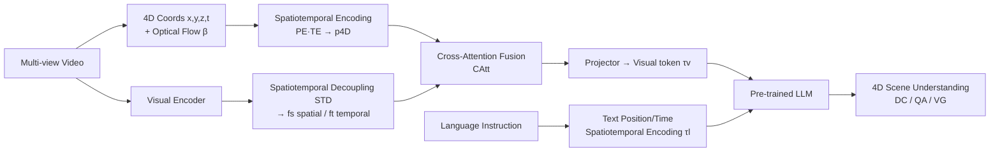

# LLaVA-4D: Embedding SpatioTemporal Prompt into LMMs for 4D Scene Understanding

**Conference**: ICLR 2026  
**OpenReview**: [https://openreview.net/forum?id=URpbmVEsqB](https://openreview.net/forum?id=URpbmVEsqB)  
**Code**: [https://github.com/hyzhouboy/LLaVA-4D](https://github.com/hyzhouboy/LLaVA-4D)  
**Area**: Multimodal Large Language Models / 4D Scene Understanding  
**Keywords**: LMM, 4D Scene Understanding, Spatiotemporal Prompt, Spatiotemporal Decoupling, Multi-view Video, Dynamic Objects  

## TL;DR
LLaVA-4D encodes "3D position + 1D time" into dynamic-aware 4D coordinates as spatiotemporal prompts. It decouples visual features into spatial and temporal components before fusing them with these prompts via cross-attention, enabling multimodal models to simultaneously understand static backgrounds and dynamic objects for the first time.

## Background & Motivation
- **Background**: 2D LMMs (e.g., LLaVA, PaLI) excel at image understanding but lack 3D spatial representations for physical world interaction. Existing 3D LMMs (e.g., 3D-LLM, LLaVA-3D, Video-3D LLM) represent scenes by embedding 3D positions as fixed spatial prompts into visual features.
- **Limitations of Prior Work**: These 3D methods use a "unified spatial representation" for the entire scene, which **only handles static backgrounds**. They are ineffective against dynamic objects with time-varying position drifts or deformations, failing to answer questions like "Where will this object move next?" Existing 4D vision-language works are mostly task-specific and apply the same representation strategy to both dynamic objects and static backgrounds, risking heterogeneous feature mismatch.
- **Key Challenge**: 4D scenes contain two types of heterogeneous information: spatial (color/appearance) and temporal (motion). A **unified representation causes mutual interference**. Furthermore, dynamic objects and static backgrounds share highly similar 3D position encodings, making them difficult to distinguish using spatial dimensions alone.
- **Goal**: Construct a **general-purpose** (non-task-specific) vision-language LMM that understands the spatiotemporal characteristics of both static backgrounds and dynamic objects.
- **Key Insight**: Two critical observations are made: **(1)** Backgrounds and objects share similar 3D position encodings but exhibit distinct motion patterns in the temporal dimension; thus, extending 3D position encoding into "dynamic-aware 4D coordinate encoding" can distinguish them. **(2)** Spatial and temporal components decoupled from visual features are more discriminative than raw visual features for separating backgrounds from objects. These points support the design of "**4D Spatiotemporal Prompt + Spatiotemporal Decoupled Visual Embedding**."

## Method

### Overall Architecture
LLaVA-4D transforms multi-view video inputs into spatiotemporal tokens for LLM reasoning through three stages: ① **Dynamic-aware 4D Coordinate Encoding**—Constructs $[x,y,z,t]$ coordinate tensors from multi-view videos and applies spatiotemporal encoding to obtain the spatiotemporal prompt $p_{4D}$; ② **Spatiotemporal Decoupled Visual Embedding**—Decouples visual features into spatial and temporal components, then integrates 4D coordinates via cross-attention; ③ **Coordinate-aligned Language Embedding**—Projects fused visual features into the language space and applies the same spatiotemporal encoding to text-based positions/times for alignment before reasoning with a pre-trained LLM.

### Key Designs

**1. Dynamic-aware 4D Coordinate Encoding: Separating backgrounds and objects with identical positions using motion cues.** Given an image at a specific view and time, camera poses are obtained via SfM and depth via MVS. 2D pixels $x_{2D}$ are back-projected to world coordinates $x_{3D}=R^{-1}(D(x_{2D})\cdot K^{-1}x_{2D}-T)$, forming a 4D coordinate tensor $[x,y,z,t]$. In the spatial dimension, backgrounds and objects use the **same** learnable Fourier position encoding $p_{xyz}=\mathrm{PE}(x,y,z)$. The key distinction is in the temporal dimension: the temporal encoding **incorporates optical flow motion information** $p_t=\mathrm{TE}(t)\cdot(1+\Phi(\beta))$, where $\beta$ is the estimated optical flow and $\Phi$ is softmax. This naturally separates dynamic objects from static backgrounds. Optical flow serves as an auxiliary cue rather than the sole temporal signal, and this prompt can be extended with extra attributes (semantics, actions, etc.).

**2. Spatiotemporal Decoupled Visual Embedding: Positioning heterogeneous features in their respective places.** Using a unified representation leads to mismatches between spatial appearance and temporal motion. Thus, multi-view visual features $f_{v,t}$ are decoupled: **Spatial features** are derived from correlations between different views at the same time $f_s=\mathrm{Aggregate}(\{f_{v=i,t}^\top f_{v=j,t}\mid i\neq j\})$, capturing global appearance. **Temporal features** are derived from correlations between adjacent frames of the same view $f_t=\mathrm{Aggregate}(\{f_{v,t=i}^\top f_{v,t=i+1}\})$, capturing motion changes. Clustering visualizations confirm that decoupled features form clearer clusters for objects and backgrounds than raw features. The decoupled features are then localized by using $p_{4D}$ as a query and spatiotemporal features as key/value in cross-attention $o=\mathrm{softmax}(qk^\top/\sqrt{d})\cdot v$, followed by residual fusion $f_{st}=\alpha\cdot o+(1-\alpha)\cdot f_s$ with a gating factor $\alpha=\sigma(\mathrm{MLP}_{obj}(p_{4D}))$.

**3. Coordinate-aligned Language Embedding: Measuring vision and text with the same "spatiotemporal ruler."** Since LLMs accept text tokens, $f_{st}$ is projected via MLP to the language space as visual tokens $\tau_v^{st}$. For text coordinates in instructions—position $t_p$ and time $t_t$—the **exact same** $\mathrm{PE}(\cdot)$ and $\mathrm{TE}(\cdot)$ encodings are applied: $\tau_s=\mathrm{PE}(t_p)$ and $\tau_t=\mathrm{TE}(t_t)$. These are weighted into word tokens $\tau_l^{st}=\tau_l+w_s\tau_s+w_t\tau_t$. Concatenating visual and language tokens ensures coordinates in "images" and "text" occupy the same representation space, enabling interactive 4D grounding and QA.

**4. Chat4D Dataset and Three-stage Training: Filling the 4D supervision gap.** 4D vision-language data was previously non-existent. The authors constructed Chat4D (879.1K samples: 37.6% 2D / 36.9% 3D / 25.5% 4D, including dense captioning, QA, and visual grounding). 4D data is generated by extracting local spatiotemporal information (category/position/time) using 3D detectors + GPT-4V, followed by global 4D descriptions from a text-only GPT, with two rounds of cleaning. Training involves: **Stage 1** Content alignment using 2D/3D DC+QA (updating cross-attention and projector, $p_{4D}$ zeroed); **Stage 2** Spatiotemporal alignment using VG data (updating 4D encoding and fusion modules); **Stage 3** Instruction tuning using 4D data (updating everything except the visual encoder).

## Key Experimental Results

### Main Results (3D + 4D Benchmarks, Selected)

| Method | Scan2Cap C@0.5↑ | ScanQA B-4↑ | Multi3DRefer F1@0.5↑ | Chat4D SAcc@0.5↑ | Chat4D TAcc↑ |
|------|------|------|------|------|------|
| LLaVA-3D | 79.2 | 14.5 | – | 42.2 | – |
| Video-3D LLM | 83.8 | 16.2 | 52.7 | 52.8 | – |
| **LLaVA-4D (Ours)** | **85.3** | **17.9** | **54.3** | **58.9** | **54.6** |

- LLaVA-4D leads across pure 3D benchmarks (indicating decoupled spatial features are superior) and shows significant advantages on 4D benchmarks. TAcc (Temporal Grounding Accuracy) is only provided by LLaVA-4D as 3D LMMs lack temporal representations.

### VSI-Bench Spatial Reasoning

| Method | Average | Obj. Count | Room Size | Rel. Dist. |
|------|------|------|------|------|
| Spatial-MLLM | 48.4 | 65.3 | 63.1 | 41.3 |
| **LLaVA-4D** | **48.6** | **68.2** | **64.8** | **44.5** |

### Temporal Understanding Comparison

| Method | SAcc@0.5↑ | TAcc↑ | tIoU@0.5↑ |
|------|------|------|------|
| Grounded-VideoLLM | 9.4 | 5.1 | 47.0 |
| LLaVA-ST | 15.2 | 7.3 | 58.7 |
| **LLaVA-4D** | **58.9** | **54.6** | **61.5** |

- Comparable tIoU to Video LMMs, but significantly higher SAcc/TAcc (58.9 vs 15.2, 54.6 vs 7.3) where fine-grained 4D coordinate understanding is required.

### Ablation Study

| Coor.embed | Feat.disent | Feat.fusion | C↑ | SAcc@0.5↑ | TAcc↑ |
|:---:|:---:|:---:|---|---|---|
| × | × | × | 62.3 | 34.8 | 12.7 |
| √ | × | × | 85.4 | 51.5 | 47.5 |
| √ | √ | × | 89.0 | 54.3 | 51.2 |
| √ | √ | √ | **93.5** | **58.9** | **54.6** |

| Coordinate Ablation | C↑ | SAcc@0.5↑ | TAcc↑ |
|------|------|------|------|
| w/o Encoding | 75.0 | 47.2 | 46.8 |
| w/ 3D position | 88.6 | 53.4 | 47.0 |
| w/ 1D time | 82.7 | 48.5 | 52.7 |
| **w/ 4D coordinate** | **93.5** | **58.9** | **54.6** |

### Key Findings
- **Coordinate encoding is the key to performance**: Adding coordinate encoding alone boosts TAcc from 12.7 to 47.5, making it the most impactful module. Decoupling and fusion further raise the performance ceiling.
- **3D position benefits spatial, 1D time benefits temporal**: 3D position significantly improves SAcc (47.2→53.4), while 1D time specifically improves TAcc (46.8→52.7). Only the combined 4D coordinates maximize both.
- **Attention fusion > Concatenation/Weighting** (SAcc 58.9 vs 54.3/55.1), as attention dynamically adjusts weights based on 4D coordinates.
- Spatiotemporal prompts are extensible: Adding semantic or action masks as prompts remains effective.

## Highlights & Insights
- **First general vision-language LMM for 4D scene understanding**: Extends the "spatial prompt" paradigm of 3D LMMs to "spatiotemporal prompts," enabling the understanding of dynamic objects.
- **Observation-driven design**: Relies on two clean observations—backgrounds/objects differ temporally despite spatial similarity, and decoupled features are more discriminative. Design choices directly map to these observations, ensuring interpretability.
- **Unified encoding for vision and text**: Sharing the same spatiotemporal encoding ensures natural alignment between "coordinates in images" and "coordinates in text," which is crucial for 4D grounding and QA.
- **Dataset contribution**: Fills the gap in 4D vision-language data with Chat4D (879K samples + generation/cleaning pipeline).

## Limitations & Future Work
- **Dependency on geometric reconstruction**: 4D coordinates depend on SfM poses, MVS depth, and optical flow. Errors in these front-end estimations propagate to the coordinate prompt. Robustness in reconstruction-failure or low-texture scenarios is not fully discussed.
- **Dominated by short videos**: Most videos are 6–12 seconds; performance under long-term motion and occlusion remains unverified.
- **Synthetic 4D labels**: Labels generated by GPT-4V + text-only GPT may contain hallucinations or coordinate biases despite cleaning.
- Small base model scale (LLaVA-1.5-7B + CLIP-ViT-L); scalability to larger bases and open-world real videos is yet to be observed.

## Related Work & Insights
- **3D LMMs** (e.g., 3D-LLM, LLaVA-3D, PQ3D): These use 3D positions as spatial prompts. This work directly addresses their lack of a temporal dimension.
- **4D Vision & Language** (e.g., 4D Gaussian semantic query): This work critiques their task-specific nature and isomorphic representations, proposing a general framework with spatiotemporal decoupling.
- **Insight**: When a modality contains heterogeneous information (spatial appearance vs. temporal motion), "decouple then fuse via coordinates" is superior to "unified representation." Using a lightweight physical cue (optical flow) to break encoding ambiguity is a low-cost, high-gain technique applicable to other spatiotemporal tasks.

## Rating
- **Novelty**: ⭐⭐⭐⭐ First general 4D LMM. Spatiotemporal prompts and decoupling are clear, observation-backed paradigms, though individual components are combinations of mature modules.
- **Experimental Thoroughness**: ⭐⭐⭐⭐ Covers 3D, 4D, VSI-Bench, and temporal understanding. Ablations clearly isolate the three modules and coordinate dimensions, supported by feature visualization. Lacks analysis on reconstruction error sensitivity.
- **Writing Quality**: ⭐⭐⭐⭐ The logic chain from motivation to design is smooth. Figures 1, 3, and 6 intuitively explain why 3D is insufficient and why decoupling works.
- **Value**: ⭐⭐⭐⭐ Advances LMMs from static 3D to dynamic 4D and provides open datasets/code, offering high utility for dynamic physical world understanding in robotics and autonomous driving.

<!-- RELATED:START -->

## Related Papers

- [\[CVPR 2025\] 4D LangSplat: 4D Language Gaussian Splatting via Multimodal Large Language Models](../../CVPR2025/multimodal_vlm/4d_langsplat_4d_language_gaussian_splatting_via_multimodal_large_language_models.md)
- [\[CVPR 2026\] 4DWorldBench: A Comprehensive Evaluation Framework for 3D/4D World Generation Models](../../CVPR2026/multimodal_vlm/4dworldbench_a_comprehensive_evaluation_framework_for_3d4d_world_generation_mode.md)
- [\[CVPR 2026\] 4DP-QA: Scalable QA for 4D Perception in Vision Language Models](../../CVPR2026/multimodal_vlm/4dp-qa_scalable_qa_for_4d_perception_in_vision_language_models.md)
- [\[ICLR 2026\] Meta-Adaptive Prompt Distillation for Few-Shot Visual Question Answering](meta-adaptive_prompt_distillation_for_few-shot_visual_question_answering.md)
- [\[ICLR 2026\] LLaVA-FA: Learning Fourier Approximation for Compressing Large Multimodal Models](llava-fa_learning_fourier_approximation_for_compressing_large_multimodal_models.md)

<!-- RELATED:END -->
