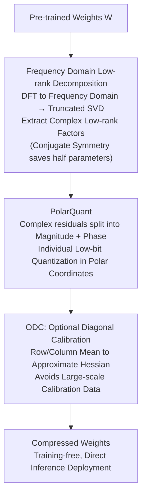

# LLaVA-FA: Learning Fourier Approximation for Compressing Large Multimodal Models

**Conference**: ICLR 2026  
**arXiv**: [2602.00135](https://arxiv.org/abs/2602.00135)  
**Code**: None  
**Area**: Multimodal Large Language Models  
**Keywords**: Model Compression, Fourier Transform, Low-rank Decomposition, Quantization, Multimodal Language Models

## TL;DR

LLaVA-FA is proposed as an efficient multimodal large model compression method that performs joint low-rank and quantized weight approximation in the frequency domain. By utilizing the decorrelation and conjugate symmetry properties of the Fourier transform, it achieves a more compact and accurate weight representation. Combined with PolarQuant (polar coordinate quantization) and ODC (Optional Diagonal Calibration), the method outperforms existing efficient multimodal models across multiple benchmarks with minimal activation parameters and computational costs.

## Background & Motivation

Large Multimodal Models (LMMs) exhibit exceptional performance on vision-language tasks, but their massive computational and memory costs hinder practical deployment. For instance, training a LLaVA-70B model requires over 800 GPU hours (A100).

**Limitations of Prior Work**:

**Decoupled Low-rank Decomposition and Quantization**: Existing methods (e.g., LoRD, ASVD, LQER) treat low-rank decomposition and quantization independently. The low-rank selection phase is oblivious to subsequent quantization noise, resulting in **compounded** reconstruction errors.

**Underutilized Multimodal Redundancy**: Unlike text-only LLMs, LMMs carry additional cross-modal adapters for image encoders. The rank of adapters for each new visual domain inflates, making standard low-rank plus quantization schemes still appear "bloated" for multimodal models.

**Dependency on Calibration Data**: Many compression methods require large-scale calibration datasets to estimate the Hessian matrix.

**Core Problem**: How to more aggressively compress learnable parameters while maintaining the performance of multimodal models?

**Key Insight**: The Fourier transform possesses powerful expressive capabilities in data compression—highly sparse spectral information can recover high-fidelity signals. Importantly, even for weight matrices lacking spatial semantics, the Fourier transform effectively handles approximation. The authors observed:
- LMM weight matrices exhibit a more compact singular value distribution in the frequency domain.
- At the same rank, the cumulative error of low-rank approximation in the frequency domain is **smaller** than in the spatial domain.
- The conjugate symmetry of the Fourier transform can save nearly half of the learnable parameters.

## Method

### Overall Architecture

LLaVA-FA shifts the entire weight compression process to the frequency domain: first, a Discrete Fourier Transform is applied to the weight matrix $W$ to obtain $\hat{W}=\text{DFT}(W)$; then, truncated SVD is performed in the frequency domain to extract complex low-rank factors; these factors are quantized into low bits using PolarQuant, designed specifically for complex numbers; finally, ODC is used for one-time error calibration. The entire workflow is executed within the frequency/complex domain to avoid information loss from domain switching. The process is post-training and requires no fine-tuning. The three contributions (frequency domain low-rank decomposition, PolarQuant, and ODC) correspond to the three stages shown below:

### Key Designs

**1. Frequency Domain Low-rank Decomposition: Faster Singular Value Decay for Smaller Errors**

In the spatial domain, singular values of weight matrices often decay slowly, requiring a high rank to minimize reconstruction error, which limits compression. LLaVA-FA first transforms $W$ to $\hat{W}=\text{DFT}(W)$ and performs truncated SVD to get $\hat{W}_r = U_r \Sigma_r V_r^H$. The decorrelation of DFT concentrates energy into fewer frequency components, causing singular values to decay faster. The paper provides a rigorous proof: at the same rank, the Frobenius reconstruction error in the frequency domain is strictly smaller than in the spatial domain. Furthermore, the DFT of real matrices satisfies conjugate symmetry; since half the spectrum is determined by the conjugate of the other half, storing only half the coefficients allows lossless reconstruction, effectively doubling compression at no precision cost.

**2. PolarQuant: Quantizing Complex Numbers via Polar Coordinates**

Standard real-valued quantization is unsuitable for the complex factors resulting from frequency domain decomposition. Quantizing real and imaginary parts separately at extremely low bits (2–4 bits) severely distorts phase information. PolarQuant represents each complex number in polar form $z = r e^{i\theta}$, separating magnitude $r$ and phase $\theta$ to be quantized uniformly with independent scaling factors. This quantization grid naturally aligns with the "magnitude + angle" structure of complex numbers, preventing phase drift and maintaining fidelity even at 2–4 bits.

**3. ODC (Optional Diagonal Calibration): Eliminating Large-scale Calibration Data**

Traditional compression requires estimating the full Hessian to calibrate errors from quantization and truncation, which is computationally expensive and requires significant calibration data. ODC leverages the empirical observation that Hessians in deep networks are often diagonal-dominant or low-rank. It uses row/column means to approximate the Hessian, significantly reducing computational complexity. Consequently, the compression process is nearly independent of calibration data, making the method "plug-and-play."

### Loss & Training

LLaVA-FA is a purely post-training compression method that introduces no additional fine-tuning or re-training. Pre-trained weights undergo DFT, frequency domain low-rank truncation, and PolarQuant quantization in sequence, while ODC calibration is a one-time forward calculation. The model is ready for inference deployment immediately after compression, making the process highly lightweight.

## Key Experimental Results

### Main Results

Evaluations across multiple vision-language benchmarks, including perception and hallucination tasks:

| Method | Activation Params | VQAv2 | GQA | SQA | POPE | Average |
|------|---------|-------|-----|-----|------|------|
| LLaVA-1.5 (Original) | 7B | Baseline | Baseline | Baseline | Baseline | Baseline |
| ASVD + Q | ~2B | Lower | Lower | Lower | Lower | Lower |
| LQER + Q | ~2B | Mid | Mid | Mid | Mid | Mid |
| **Ours (LLaVA-FA)** | **Minimal** | **Highest** | **Highest** | **Highest** | **Highest** | **Highest** |

Ours (LLaVA-FA) surpasses existing efficient multimodal models across all benchmarks while maintaining the fewest activation parameters and lowest computational cost.

### Ablation Study

| Configuration | Effect | Description |
|------|------|------|
| Spatial vs. Frequency Low-rank | Frequency superior | Lower reconstruction error at the same rank |
| Real/Imaginary vs. PolarQuant | PolarQuant superior | Preserves complex structure and phase information |
| Without vs. With ODC | ODC significant | Notable calibration effect especially at low bits |
| Low-rank Only vs. Joint | Joint optimal | Prevents compound error by optimizing in frequency domain |
| Different Bit-widths | 4-bit optimal | 2-bit drops significantly; 4-bit near full-precision |

### Key Findings

1.  **Frequency domain low-rank approximation is superior to the spatial domain**: This is supported by both experimental evidence and a mathematical proof regarding the decorrelation properties of DFT.
2.  **Conjugate symmetry provides "free" 2x compression**: Parameter counts can be halved without any loss in precision.
3.  **PolarQuant is critical for low-bit scenarios**: At 2-4 bits, direct quantization of real and imaginary parts causes severe phase distortion.
4.  **ODC removes the calibration data bottleneck**: Diagonal approximation is sufficiently accurate for deep network Hessians, enabling "plug-and-play" compression.

## Highlights & Insights

1.  **Pioneering Frequency Domain Perspective**: Shifting neural network weight compression from the spatial domain to the frequency domain is a novel approach that fully exploits decorrelation, conjugate symmetry, and energy concentration.
2.  **Theory Combined with Practice**: The work provides rigorous mathematical proofs alongside experimental results to justify the superiority of frequency domain approximation.
3.  **End-to-End Consistency**: From decomposition to quantization and calibration, every step is handled consistently within the frequency/complex domain, avoiding information loss from domain conversions.
4.  **Low Deployment Barrier**: As a post-training method requiring no calibration data or fine-tuning, the approach is highly practical.
5.  **Multi-modal Specific Design**: The paper identifies that multimodal models face unique compression challenges compared to text-only LLMs due to redundancy in cross-modal adapters.

## Limitations & Future Work

1.  **Inference Domain Transformation**: While storage is reduced, inference may require additional DFT/IDFT computational overhead.
2.  **Limited Architecture Validation**: Primarily verified on the LLaVA series; applicability to other architectures like Qwen-VL or InternVL remains to be seen.
3.  **Ultra-low Bit (1-2 bit) Performance**: Performance degradation remains significant at extremely low bits, potentially requiring combination with knowledge distillation.
4.  **Hardware Support**: PolarQuant and complex arithmetic may lack native acceleration support in current inference engines.
5.  **Dynamic Adaptation**: Fixed truncation ranks may not be optimal for all layers; adaptive rank selection strategies are worth exploring.

## Related Work & Insights

-   **LoRA / QLoRA**: Pioneers of low-rank adaptation, but operate in the spatial domain.
-   **ASVD / FWSVD**: SVD-based weight compression handling low-rank and quantization separately.
-   **LQER**: A joint low-rank and quantization method, but limited to the spatial domain.
-   **GPTQ / AWQ**: Quantization-only schemes without low-rank decomposition.

The core insight of this work is the introduction of mature frequency domain analysis tools from signal processing into deep learning model compression, opening a new research direction. This could potentially extend to other transform domains (e.g., wavelet transforms).

## Rating
- Novelty: ⭐⭐⭐⭐⭐
- Experimental Thoroughness: ⭐⭐⭐⭐
- Writing Quality: ⭐⭐⭐⭐
- Value: ⭐⭐⭐⭐

<!-- RELATED:START -->

## Related Papers

- [\[CVPR 2026\] Efficient Encoder-Free Fourier-based 3D Large Multimodal Model](../../CVPR2026/multimodal_vlm/efficient_encoder-free_fourier-based_3d_large_multimodal_model.md)
- [\[CVPR 2025\] LLaVA-Critic: Learning to Evaluate Multimodal Models](../../CVPR2025/multimodal_vlm/llava-critic_learning_to_evaluate_multimodal_models.md)
- [\[ICCV 2025\] LLaVA-KD: A Framework of Distilling Multimodal Large Language Models](../../ICCV2025/multimodal_vlm/llava-kd_a_framework_of_distilling_multimodal_large_language_models.md)
- [\[ICLR 2026\] LLaVA-4D: Embedding SpatioTemporal Prompt into LMMs for 4D Scene Understanding](llava-4d_embedding_spatiotemporal_prompt_into_lmms_for_4d_scene_understanding.md)
- [\[ICLR 2026\] InternSVG: Towards Unified SVG Tasks with Multimodal Large Language Models](internsvg_towards_unified_svg_tasks_with_multimodal_large_language_models.md)

<!-- RELATED:END -->
