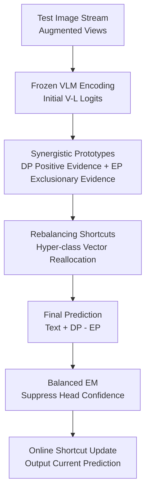

# Long-tailed Test-Time Adaptation for Vision-Language Models

**Conference**: ICLR2026  
**OpenReview**: [https://openreview.net/forum?id=jLO4pSi5Pt](https://openreview.net/forum?id=jLO4pSi5Pt)  
**Code**: https://github.com/xuc865/LTTA  
**Area**: Multimodal VLM  
**Keywords**: Long-tailed Test-Time Adaptation, Vision-Language Models, Prototype Cache, Class Rebalancing, Entropy Minimization

## TL;DR

This paper presents the first systematic study of Test-Time Adaptation (TTA) for Vision-Language Models (VLMs) in long-tailed test streams. It proposes L-TTA, which utilizes Synergistic Prototypes, learnable Rebalancing Shortcuts, and Balanced Entropy Minimization (BEM) to simultaneously address insufficient tail-class semantics, amplified cross-modal bias, and the head-class bias of entropy minimization. It improves both Accuracy and Macro-F1 across OOD, cross-domain, and noisy long-tailed benchmarks.

## Background & Motivation

**Background**: Vision-Language Models like CLIP possess strong zero-shot recognition capabilities. However, during real-world deployment, test data often comes from new domains, contains noise, or exhibits shifts in class distribution. Test-Time Adaptation (TTA) aims to adapt the model to the current test distribution using only unlabeled test streams during inference, employing methods such as entropy minimization, prompt updates, or historical feature caching.

**Limitations of Prior Work**: Existing VLM TTA methods mostly assume that the test set is nearly balanced or do not specifically handle significantly long-tailed class streams. In reality, a few head classes appear frequently while many tail classes appear rarely. In a single-pass online TTA scenario, early samples continuously influence subsequent model states, causing head classes to easily push decision boundaries toward themselves, while tail class representations and prototypes remain persistently under-initialized.

**Key Challenge**: Long-tailed TTA for VLMs is more complex than single-modal long-tailed recognition. First, text embeddings themselves carry pre-training biases; certain classes are naturally easier for CLIP to recognize even if they are not head classes, a phenomenon the authors call "rich classes." When rich classes overlap with head classes, tail classes are further eroded by the text prior. Second, directly applying single-modal long-tailed TTA methods to VLMs causes existing mismatches between visual features and text prototypes to amplify during online updates.

**Goal**: The objective is to solve an online, unlabeled, single-pass long-tailed test stream problem. The method cannot rely on resampling a training set as in traditional long-tailed learning, nor can it depend on expensive offline regularization. The approach must update continuously within the test stream while maintaining visual-textual alignment and ensuring tail classes receive sufficient semantic support.

**Key Insight**: The authors observe that historical knowledge in VLM TTA should not only cache samples with "high confidence of belonging to a class," as tail classes likely lack such samples early on. Even if an augmented view does not belong to a specific class, it contains information regarding "what this class should NOT look like." Combining positive deterministic prototypes with exclusionary prototypes, and using a learnable cross-class reallocation mechanism to adjust prototypes, can provide tail classes with finer-grained cross-class knowledge during testing.

**Core Idea**: L-TTA accumulates multimodal historical semantics using "Deterministic Prototypes + Exclusionary Prototypes," employs Rebalancing Shortcuts for learnable prototype reallocation, and replaces standard entropy minimization with BEM, which is more friendly to uncertain tail classes. This transforms long-tailed VLM TTA from simple confidence-based self-training into an online process where prototypes, shortcuts, and losses are jointly rebalanced.

## Method

### Overall Architecture

The input to L-TTA is a stream of unlabeled test images and a set of fixed class text descriptions. The backbone can be a pre-trained CLIP or other VLMs. For each test image, the method generates multiple randomly cropped augmented views to obtain initial predictions via original text embeddings. Subsequently, two types of prototypes are updated based on prediction confidence, which are then connected to learnable rebalancing shortcuts. Finally, the final logits are formed by combining text similarity, deterministic prototype affinity, and exclusionary prototype affinity, with shortcut parameters optimized at the current test step.

The key to this pipeline is not retraining the VLM backbone but maintaining a lightweight class-centric state at test time: text prototypes remain frozen, visual prototypes continuously record category evidence from the test stream, shortcuts handle the prototype reallocation between head and tail classes, and BEM redirects the entropy minimization gradient from "reinforcing the most confident head classes" to "focusing on rare and uncertain classes."

### Key Designs

**1. Synergistic Prototypes: Enabling consistent updates for tail classes even without high-confidence samples**

Standard prototype caching only writes visual features of a view into the prototype of class $c$ when the model is confident the view belongs to that class. Under long-tailed test streams, this biasedly favors head classes: their samples arrive early and frequently, causing prototypes to stabilize quickly. Tail class samples are sparse and predictions are uncertain, leading to delayed initialization or thin semantics. L-TTA thus splits Synergistic Prototypes (SyPs) into two parts: Deterministic Prototypes (DPs) to record evidence of "most likely belonging to a class," and Exclusionary Prototypes (EPs) to record fine-grained relationships of "least likely belonging to a class."

DP updates remain based on high-confidence augmented views. Given $Q$ cropped views of image $x$, the model calculates the prediction entropy of each view and uses only the set of views $T$ with entropy below threshold $\theta$ to update the prototype of the top-predicted class $c^*$: $v_{c^*} \leftarrow \mathrm{norm}((N^{DP}_{c^*,s}-1)v_{c^*}+\tilde v_{c^*})$, where $\tilde v_{c^*}=\mathrm{avg}_{i\in T} f(\tilde x_i)$. This ensures prototypes are not contaminated by ambiguous views.

The insight of EP is more interesting: instead of just a "negative cache" for the predicted class, every view participates in the exclusionary update for all classes. The paper uses $\phi_c=(\max_{c'}P(y_{c'}|\tilde x_i)-P(y_c|\tilde x_i))/\max_{c'}P(y_{c'}|\tilde x_i)$ to measure the exclusionary strength of a view for class $c$. If a view has a low probability for class $c$, $\phi_c$ is high, and the EP strongly absorbs this "not $c$" feature. Consequently, even if a tail class is not currently predicted as top-1, its EP can accumulate cross-class boundary information along the test stream, alleviating the tail prototype idling problem.

**2. Rebalancing Shortcuts: Learnable reallocation of class prototypes while freezing text prompts**

Many VLM TTA methods optimize prompts, passing gradients through the text encoder. In long-tailed scenarios, the text side already has "rich class" biases, and modifying prompts can amplify these biases. L-TTA freezes the prompts and backbone, concentrating learnability on SyPs. It introduces $K$ shared hyper-class vectors $q=\{q_j\}_{j=1}^K$ to add Rebalancing Shortcuts (RSs) to DPs and EPs via cross-attention. For class $c$, the update takes the form $v_c \leftarrow \mathrm{Attn}([v_c,t_c],q_j)q_j+v_c$ and $u_c \leftarrow \mathrm{Attn}([u_c,t_c],q_j)q_j+u_c$.

Hyper-class vectors can be viewed as learnable "category cluster experts." If all head classes crowd onto a few experts, tail classes will still be dominated. Thus, the authors adopt a Class Re-Allocation (CRA) loss, inspired by MoE load balancing, to minimize the product of the number of times each expert is selected as top-1 and the average attention activation. This objective encourages class prototypes to be more uniformly distributed across hyper-class vectors, preventing head class monopoly and allowing tail classes to gain knowledge transfer from similar classes via shared experts.

**3. Final Prediction: Shaping logits with text, positive prototypes, and exclusionary prototypes**

The final prediction of L-TTA does not rely solely on image-text similarity. For a visual feature $f(x)$, it retains the similarity with text embedding $t_c$, adds the affinity with deterministic prototype $v_c$, and subtracts the affinity with exclusionary prototype $u_c$: $P_{LTTA}(y_c|x)=\sigma(f(x)t_c + A(f(x)v_c)-A(f(x)u_c))$, where $A(x)=\lambda_1\exp(-\lambda_2(1-x))$ is an affinity scaling function.

This formula leverages the semantics of SyPs at the prediction level: DP acts as "supportive evidence"—if an image is close to the DP of class $c$, the logit for that class increases; EP acts as "exclusionary evidence"—if an image is close to the EP of class $c$, the logit decreases. For tail classes, this is more robust than relying on sparse positive samples alone, as EPs learn boundary information from numerous non-tail views.

**4. Balanced Entropy Minimization: Correcting the unsupervised adaptation gradient from head-class overconfidence**

Standard entropy minimization (EM) is common in TTA: sharpening the prediction distribution makes the model more confident. However, in long-tailed streams, head classes appear more frequently as top-1, and EM continuously increases head class logits. Tail classes, being rare and uncertain, are more easily pushed away from decision boundaries. The paper demonstrates that in long-tailed TTA, the expected entropy gradient of head class logits tends to strengthen confidence, while tail classes face pressure in the opposite direction.

BEM does not simply add class priors to logits, as direct logit adjustment in unlabeled EM might reinforce existing biases. Instead, it adds a confidence-modulated prior penalty to the logits: $z'=z-(1-\tilde P)^\beta\log(\pi/\sum_i\pi_i)$, then calculates $L_{BEM}=H'(\tilde P)=-\sigma(z')\log\sigma(z')$. Here, $\pi$ is the class prior updated online based on current pseudo-labels. The term $(1-\tilde P)^\beta$ significantly reduces the impact of the prior for high-confidence classes, forcing the loss to focus on "uncertain and rare" classes. The final objective is $L_{LTTA}=L_{BEM}(P_{LTTA})+\eta L_{CRA}$.

### Loss & Training

Updates occur at test time; for each sample, only the lightweight RS parameters and prototype states are updated, while the VLM backbone and prompts remain frozen. The implementation uses CLIP ViT-B/16 with 15 randomly cropped augmented views per image. The optimizer is AdamW with weight decay $10^{-1}$ and learning rate $10^{-3}$. Default hyperparameters include $\eta=1, \lambda_1=6, \lambda_2=6, \beta=1$, and the imbalance ratio is set to $\mathrm{imb}\in\{10,20,50\}$.

The optimization objective consists of two parts: $L_{BEM}$ controls the unsupervised entropy minimization direction for final prediction, and $L_{CRA}$ constrains the class reallocation of hyper-class vectors. The balance between them is managed by $\eta$. Since the class prior $\pi$ is updated online using current pseudo-label counts rather than ground truth, the method remains an unlabeled TTA setting.

## Key Experimental Results

### Main Results

The paper reconfigures 15 datasets into long-tailed distributions across three benchmarks: OOD (ImageNet-A/R/S/V2, ImageNet), Cross-Domain (ImageNet and 10 fine-grained datasets), and Corruption (ImageNet with various noise intensities). Metrics include Accuracy and Macro-F1 to measure balance across head and tail classes.

| LT Benchmark | Setting | Ours (L-TTA) | Prev. SOTA | Gain |
|--------------|---------|--------------|------------|------|
| LT-OOD Average | imb=10, Acc / Mac | 65.97 / 61.18 | DPE 64.50 / 60.15 | +1.47 / +1.03 |
| LT-OOD Average | imb=20, Acc / Mac | 64.92 / 60.52 | DPE 64.21 / 58.82 | +0.71 / +1.70 |
| LT-OOD Average | imb=50, Acc / Mac | 64.68 / 59.78 | DPE 63.71 / 55.43 | +0.97 / +4.35 |
| LT-Cross-Domain | Avg (imb 10-50) | 68.77 / 63.44 | DPE 67.75 / 61.24 | +1.02 / +2.20 |
| LT-Corruption | Gaussian Noise | 43.31 / 39.97 | DPE 40.44 / 37.33 | +2.87 / +2.64 |

In the LT-OOD benchmark, as the imbalance ratio increases from 10 to 50, many prototype or caching methods show significantly decreased Macro-F1 (e.g., DPE drops from 60.15 to 55.43). In contrast, L-TTA's Macro-F1 decreases much less (61.18 to 59.78), proving its robustness against long-tailed degradation.

Cross-domain results further demonstrate generalization. L-TTA achieves state-of-the-art results on 10 out of 11 datasets. The Macro-F1 gain is consistently larger than the Accuracy gain, aligning with the goal of improving balance rather than just head-class accuracy.

### Ablation Study

| Configuration | ViT-B/16 Acc. | ViT-B/16 Mac. | Description |
|---------------|---------------|---------------|-------------|
| DP | 68.68 | 63.40 | Only DPs; tail classes still lack evidence. |
| DP + RS | 69.76 | 64.12 | RS adds learnable reallocation to DPs. |
| EP | 67.54 | 62.20 | Only EPs; provides boundaries but lacks positive evidence. |
| EP + RS | 68.03 | 62.77 | RS improves EP but still limited without DPs. |
| SyP(DP+EP) + RS | 70.94 | 65.17 | Synergistic combination shows significant improvement. |
| SyP + RS + BEM | 71.30 | 65.83 | Full model; BEM addresses head/tail optimization gap. |

### Key Findings

- Synergistic Prototypes are a primary contribution. Combining DP and EP is significantly better than either alone, indicating that LT VLM TTA requires both "belonging" evidence and "exclusionary" boundaries.
- Macro-F1 improvements highlight L-TTA's value better than Accuracy. The average Macro-F1 gain over DPE is 2.20 in cross-domain and 2.64 in corruption benchmarks.
- BEM is more suitable for unlabeled TTA than traditional logit adjustment or balanced softmax. Adding LA/BS to MTA or DPE yields limited gains, whereas BEM uses confidence-modulated priors to avoid strengthening head-class bias.
- The method's advantage increases under noise, suggesting that LT VLM TTA is not just a frequency problem but also involves cross-modal mismatch and cluster reliability.

## Highlights & Insights

- The paper concretely analyzes VLM TTA failure modes, identifying "text-induced tail erosion" and "modality-bias amplification" rather than just stating that imbalance hurts performance.
- The EP design has high transferability. By utilizing low-probability information from all classes, it is ideal for online scenarios where positive samples are scarce but negative evidence is abundant.
- The core of BEM is using $(1-\tilde P)^\beta$ to focus the prior's influence on uncertain classes, correcting the difference between unsupervised EM and supervised cross-entropy.
- RS places class rebalancing in the prototype space rather than model parameters, making it computationally efficient and suitable for deployment-constrained online adaptation.

## Limitations & Future Work

- The method relies on a closed-set classification setting. If unknown categories or open-set noise appear, the updates for SyPs and the BEM pseudo-label prior may be compromised.
- Class priors are derived from current pseudo-label counts; early incorrect predictions might affect subsequent BECs. Although RS/EP mitigates this, reliability in extremely short streams or under severe domain shift needs further study.
- The experiments focus on image-classification-style VLM TTA. Further design is required for more complex tasks like detection, segmentation, or VQA.
- EP requires updating prototypes for all classes using the full prediction distribution, which could introduce overhead in scenarios with very large numbers of classes. Hierarchical category clusters or sparse candidates might be future solutions.

## Related Work & Insights

- **vs TPT / C-TPT / O-TPT**: These methods focus on zero-shot generalization via prompt tuning and EM for balanced settings. L-TTA shifts focus to head/tail decision boundaries in test streams.
- **vs TDA / DPE**: While these use historical prototypes/caches, L-TTA differs by splitting prototypes into DP/EP and using RS for active rebalancing.
- **vs Single-modal LT-TTA (SAR / DELTA)**: These focus on normalization and reweighting. L-TTA identifies that VLMs also suffer from text-side bias and cross-modal mismatch, requiring a multimodal design.

## Rating

- **Novelty**: ⭐⭐⭐⭐⭐ Systematically defines and solves the long-tailed TTA problem for VLMs with cohesive SyP, RS, and BEM modules.
- **Experimental Thoroughness**: ⭐⭐⭐⭐⭐ Covers OOD, cross-domain, corruption, various imbalance ratios, and backbones with complete component ablation.
- **Writing Quality**: ⭐⭐⭐⭐☆ Clear motivation and analysis of failure modes; mathematical notation for RS and some appendix details are slightly dense.
- **Value**: ⭐⭐⭐⭐⭐ Highly meaningful for deploying VLMs, highlighting that TTA conclusions from balanced sets do not directly generalize to long-tailed data streams.

<!-- RELATED:START -->

## Related Papers

- [\[ICLR 2026\] Bilateral Information-aware Test-time Adaptation for Vision-Language Models](bilateral_information-aware_test-time_adaptation_for_vision-language_models.md)
- [\[ICLR 2026\] Flatness-Guided Test-Time Adaptation for Vision-Language Models](flatness_guided_test-time_adaptation_for_vision-language_models.md)
- [\[CVPR 2025\] Realistic Test-Time Adaptation of Vision-Language Models](../../CVPR2025/multimodal_vlm/realistic_test-time_adaptation_of_vision-language_models.md)
- [\[CVPR 2026\] Dynamic Logits Adjustment and Exploration for Test-Time Adaptation in Vision Language Models](../../CVPR2026/multimodal_vlm/dynamic_logits_adjustment_and_exploration_for_test-time_adaptation_in_vision_lan.md)
- [\[NeurIPS 2025\] DOTA: DistributiOnal Test-time Adaptation of Vision-Language Models](../../NeurIPS2025/multimodal_vlm/dota_distributional_testtime_adaptation_of_visionlanguage_mo.md)

<!-- RELATED:END -->
