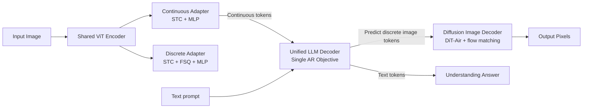

# Manzano: A Simple and Scalable Unified Multimodal Model with a Hybrid Vision Tokenizer

**Conference**: ICLR 2026  
**OpenReview**: [https://openreview.net/forum?id=FIXPFUeO9Z](https://openreview.net/forum?id=FIXPFUeO9Z)  
**Code**: TBD  
**Area**: Multimodal / Unified Understanding and Generation  
**Keywords**: Unified multimodal model, hybrid vision tokenizer, autoregressive, diffusion decoder, task conflict, model scaling  

## TL;DR
Manzano utilizes a hybrid tokenizer consisting of a shared vision encoder and two lightweight adapters (continuous tokens for understanding, discrete tokens for generation). This allows a unified autoregressive LLM to learn both understanding and generation within the same semantic space, while delegating pixel rendering to an external diffusion decoder. This approach nearly eliminates task conflict between understanding and generation and validates scalability from 300M to 30B parameters.

## Background & Motivation
- **Background**: Unified multimodal LLMs (e.g., GPT-4o) capable of both "understanding" and "generating" images are emerging. Integrating both capabilities unlocks emergent abilities such as world reasoning and iterative visual editing.
- **Limitations of Prior Work**: Open-source unified models typically exhibit a **performance trade-off** between understanding and generation—adding generation capabilities often degrades understanding, particularly on text-rich benchmarks like DocVQA/ChartQA/InfoVQA, where they significantly lag behind specialized understanding models.
- **Key Challenge**: The root cause is the **conflict in vision tokenization**—autoregressive generation prefers discrete tokens, while understanding prefers continuous embeddings. Common dual-tokenizer approaches (semantic encoder + VQ-VAE/VAE) force the LLM to process heterogenous tokens (high-level semantic vs. low-level spatial details), creating task conflict; MoT-like solutions are parameter-inefficient and difficult to integrate with MoE; freezing the LLM to connect an external diffusion decoder sacrifices the opportunity for generation to benefit from LLM scaling.
- **Goal**: To coordinate understanding and generation representations into a **single source** within a simple, scalable framework, maximizing conflict elimination while ensuring stable improvement with model scale.
- **Core Idea**: **Homologous Hybrid Tokenizer**—A shared vision encoder followed by two adapters producing continuous tokens (for understanding) and discrete tokens (for generation). Both reside in the **same semantic space**, preventing the LLM from being conflicted by heterogeneous tokens; pixel-level synthesis is handled by an external diffusion decoder, allowing the LLM to focus solely on predicting high-level semantics.

## Method

### Overall Architecture
Manzano consists of three components: (i) a **hybrid vision tokenizer**, where a single ViT encoder is followed by continuous and discrete adapters to output continuous/discrete vision tokens; (ii) a **unified LLM decoder**, which receives text tokens and/or continuous image embeddings to autoregressively predict the next text or discrete image token from a shared vocabulary; (iii) a **diffusion image decoder**, which renders the predicted discrete image tokens into pixels. Training proceeds in three steps: **pre-alignment** of the tokenizer using a 300M small LLM decoder, **joint training** of the unified LLM (mixture of text, image understanding IT, and image generation TI data), and finally training the diffusion decoder for pixel rendering.

### Key Designs

**1. Homologous Hybrid Representation: Branching "Continuous for Understanding, Discrete for Generation" from a Single Encoder.** This is the core of eliminating task conflict. Understanding tasks (I2T) utilize continuous embeddings to preserve more visual detail, following the mature practice of mainstream models like Qwen-VL, which provides an advantage in text-rich benchmarks. Generation tasks (T2I) utilize discrete code indices, allowing the LLM to predict image tokens using the same next-token strategy as text, simplifying the generation pipeline and scaling behavior. Crucially, **both branches share the same encoder backbone**, ensuring continuous and discrete tokens reside in the same semantic space—contrasting with "CLIP encoder for understanding + VAE encoder for generation" dual-tokenizer schemes, which exacerbate heterogeneous token conflict within the LLM. Ablations (Table 1) show this heterogeneous conflict occurs precisely within the LLM.

**2. Specific Structure of Hybrid Tokenizer: STC Compression + FSQ Quantization.** The tokenizer includes three parts: a standard ViT as the backbone; a **continuous adapter** that uses a $3 \times 3$ Spatial-to-Channel (STC) layer to compress spatial tokens by 9x (e.g., $42 \times 42 \times 1024 \to 14 \times 14 \times 9216$), followed by an MLP projection to the LLM dimension (e.g., 2048); and a **discrete adapter** that also uses STC compression but adds **Finite Scalar Quantization (FSQ)** (with a 64K codebook) for quantization before the MLP projection. FSQ was chosen over VQ-VAE for its simplicity and scalability to large codebooks. During tokenizer training, one adapter output is randomly sampled to feed into a 300M small LLM decoder for **pre-alignment** of image features to the LLM feature space.

**3. Simple and Scalable Decoupled Design: Unified AR Objective + Semantic/Pixel Division of Labor.** The unified LLM decoder uses a **single autoregressive objective** for text-only, I2T, and T2I tasks without auxiliary losses or per-task heads. Decoupling "semantic prediction (LLM decoder)" from "detail generation (image decoder)" allows both to scale independently and directly leverage mature training pipelines for LLMs/MLLMs and diffusion models. This is key to Manzano scaling the LLM to 30B and the diffusion decoder to 3B—unlike Transfusion or Bagel, which combine AR text prediction and diffusion generation into one LLM, complicating large-scale expansion.

**4. Diffusion Image Decoder: Rendering Pixels Conditioned on LLM Vision Tokens.** The decoder adopts the **DiT-Air** architecture (inter-layer parameter sharing, reducing parameters by ~66% compared to standard MMDiT while maintaining performance) and uses a flow matching objective to transport Gaussian noise to real images in the latent domain. Unlike traditional text-to-image diffusion models conditioned on CLIP text embeddings, Manzano is conditioned on the **embeddings of LLM-generated vision tokens**, where the LLM handles high-level semantics and the diffusion decoder handles high-fidelity details. It provides 0.9B / 1.75B / 3.52B configurations and supports output canvases from 256–2048 pixels.

## Key Experimental Results

### Main Results (SOTA Comparison, 3B Understanding Benchmarks Selection)

| Model | RealWorldQA | MMBench(dev-en) | AI2D | MMMU(val) | MathVista | ChartQA | TextVQA | DocVQA | InfoVQA | OCRBench |
|---|---|---|---|---|---|---|---|---|---|---|
| MM1.5-3B | 56.9 | 72.4 | 65.7 | 37.1 | 44.4 | 74.2 | 76.5 | 87.7 | 58.5 | 65.7 |
| InternVL2.5-4B | 64.3 | 78.7 | 81.4 | 52.3 | 60.5 | 84.0 | 76.8 | 91.6 | 72.1 | 82.8 |
| Qwen2.5VL-3B | 65.4 | 76.4 | 81.6 | 53.1 | 62.3 | 84.0 | 79.3 | 93.9 | 77.1 | 79.7 |

Manzano achieves SOTA among unified models and competes with these **understanding-only expert models**, performing particularly well on text-rich evaluations.

### Ablation Study (Tokenizer Strategy, 1B Unified LLM)

| Tokenizer Paradigm | General | Knowledge | Text-Rich | GenEval | DPG | WISE |
|---|---|---|---|---|---|---|
| Pure-Discrete | 63.3 | 62.2 | 62.3 | 77 | 80.9 | 35 |
| Dual-Encoder | 63.8 | 63.6 | 72.0 | 65 | 66.3 | 17 |
| **Hybrid (Ours)** | **64.9** | **66.5** | **73.3** | **77** | **79.9** | **35** |

The hybrid tokenizer is nearly optimal across all understanding and generation tasks: pure discrete tokens cause significant performance drops in text-rich understanding due to quantization info loss; dual-encoder schemes mitigate understanding degradation but still lag behind the hybrid scheme on knowledge benchmarks, indicating that heterogeneous token conflict occurs within the LLM.

### Key Findings
- **Unified vs. Single-task**: At both 300M and 3B scales, the unified model shows almost no degradation compared to specialized understanding/generation models (at 3B, understanding gap < 1.0, generation drops slightly on only one benchmark), proving the hybrid tokenizer achieves "unification without trade-offs."
- **Scaling the LLM Decoder** (300M→3B): Monotonic improvements across understanding and generation—General +14.2, Knowledge +18.8, Text-rich +10.9, GenEval +11.0, WISE +12.0; scaling to 30B continues to show consistent but smaller gains.
- **Scaling the Image Decoder** (based on 3B LLM): Human-evaluated structural integrity improved significantly by +9.9, instruction following remained stable, while automated metrics GenEval/DPG were nearly flat and WISE increased by +2.0; aesthetic quality slightly decreased (left for future research).

## Highlights & Insights
- **Precisely identifies "task conflict" as occurring within the LLM** and resolves it using a "homologous" rather than "separated" approach—a shared encoder keeps both token types in one semantic space, which is more efficient than the detail-retention of dual-tokenizer systems.
- **Simplicity First**: Single AR objective, no per-task heads, and decoupled components allow maximum reuse of mature LLM and diffusion pipelines, making large-scale expansion possible.
- **Clear Semantic/Pixel Division**: The LLM manages high-level semantics while the diffusion decoder manages pixel details. Both can scale independently, and scaling behavior remains clean and predictable.
- **Solid Empirical Scalability**: Systematic scaling curves across two dimensions—300M→30B (LLM) and 0.9B→3.52B (decoder)—provide direct guidance on scaling strategies.

## Limitations & Future Work
- **Reliance on Internal Resources**: The language backbone uses Apple's internal pre-trained LLM, and data mixtures include internal corpora, making reproduction challenging for outsiders.
- **Aesthetic quality decreased rather than increased with decoder scaling**; the paper admits the mechanism is unclear and leaves it for future work.
- **Canvassing/resolution limits for discrete generation tokens** are still constrained by tokenizer compression and codebook design; ultra-high-resolution details require further validation.
- **Lack of systematic evaluation for image editing/multi-turn interaction**: Although unified models are noted for unlocking iterative editing, the main text focuses on understanding and text-to-image benchmarks, with editing capabilities not yet fully explored.

## Related Work & Insights
- **Understanding-side MLLMs**: LLaVA established the "vision encoder + LLM" paradigm via lightweight MLP connectors. MM1/InternVL/Qwen-VL series pushed performance through data and model scaling—Manzano inherits these mature understanding recipes.
- **Three Paradigms of Unified Multimodal Models**: Unified Autoregressive (Chameleon, Emu), Decoupled LLM-Diffusion (frozen LLM with external diffusion), and Hybrid AR-Diffusion (Transfusion, Bagel). Manzano belongs to the first category but differs by using a **unified semantic tokenizer** instead of separated ones.
- **Diffusion Generation**: From LDM and DiT to flow matching and DiT-Air. Manzano utilizes DiT-Air's parameter sharing to save ~66% of parameters and innovatively conditions on LLM vision tokens rather than CLIP text embeddings.
- **Insight**: When representations for multiple tasks conflict, rather than providing dedicated paths for each, it is better to **share the same source and land in the same semantic space**; meanwhile, decoupling "semantic modeling" from "pixel rendering" allows the unified model to benefit from the scaling dividends of respective mature pipelines.

## Rating
- **Novelty**: ⭐⭐⭐⭐ — The "Homologous Hybrid Tokenizer" is an elegant solution to task conflict in unified models, targeting the root cause within the LLM.
- **Experimental Thoroughness**: ⭐⭐⭐⭐⭐ — Covers three tokenizer paradigms, unified vs. single-task comparisons, two-dimensional scaling of LLM (300M-30B) and decoder (0.9B-3.52B), and both human and automatic evaluations.
- **Writing Quality**: ⭐⭐⭐⭐ — Clear logic from motivation to design to validation. Figures and tables support the arguments, and the "simple and scalable" theme is consistent throughout.
- **Value**: ⭐⭐⭐⭐⭐ — Provides a nearly trade-off-free and scalable solution in a field where understanding-generation trade-offs are common, offering high engineering and directional value for industrial unified multimodal systems.

<!-- RELATED:START -->

## Related Papers

- [\[CVPR 2026\] AToken: A Unified Tokenizer for Vision](../../CVPR2026/multimodal_vlm/atoken_a_unified_tokenizer_for_vision.md)
- [\[ICLR 2026\] Thinking with Camera: A Unified Multimodal Model for Camera-Centric Understanding and Generation](thinking_with_camera_a_unified_multimodal_model_for_camera-centric_understanding.md)
- [\[ICLR 2026\] UniF2ace: A Unified Fine-grained Face Understanding and Generation Model](unif2ace_a_underlineunified_underlinefine-grained_underlineface_understanding_an.md)
- [\[ICLR 2026\] UniHM: Unified Dexterous Hand Manipulation with Vision Language Model](unihm_unified_dexterous_hand_manipulation_with_vision_language_model.md)
- [\[ICLR 2026\] Omni-Weather: A Unified Multimodal Model for Weather Radar Understanding and Generation](omni-weather_a_unified_multimodal_model_for_weather_radar_understanding_and_gene.md)

<!-- RELATED:END -->
