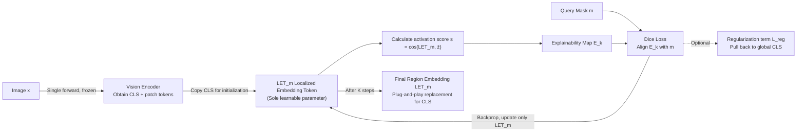

# MaskInversion: Localized Embeddings via Optimization of Explainability Maps

**Conference**: ICLR 2026  
**OpenReview**: [https://openreview.net/forum?id=3xyx2ncRln](https://openreview.net/forum?id=3xyx2ncRln)  
**Code**: [https://walidbousselham.com/MaskInversion](https://walidbousselham.com/MaskInversion)  
**Area**: Multimodal / Vision-Language Models  
**Keywords**: CLIP, Region-level Representation, Explainability Maps, Test-time Optimization, Textual Inversion, Zero-shot  

## TL;DR
Without fine-tuning any weights, by treating the alignment of a frozen CLIP's explainability map with a query mask as an optimization objective at test-time, iteratively optimizing a single token can learn a localized embedding for any image region that can directly replace the [CLS] token.

## Background & Motivation
Contrastive vision-language foundation models like CLIP exhibit exceptional **global** image-text alignment. However, since they are trained to match the image [CLS] token with text tokens, they essentially model globally pooled information. This leads to poor performance on tasks requiring **precise localization** or **recognition of specific regions**—whereas many downstream tasks (referring expression, region classification, region captioning, local image generation) specifically require vectors "belonging only to a certain region."

**Limitations of Prior Work**: Naive approaches to extracting region embeddings are suboptimal. Cropping (Crop) only feeds the region into CLIP, losing critical context. Aggregating patch tokens according to a mask (such as MaskCLIP or SCLIP) relies on the assumption that local tokens align with global semantics, whereas local tokens often do not land on the correct representations. Other modification routes (ReCLIP's colored boxes, FGVP's blurred backgrounds, RedCircle's red circles, AlphaCLIP's alpha channel) either modify the input image to "trick" it into a localized [CLS] or require retraining—AlphaCLIP, for instance, requires millions of mask annotations to generalize.

**Key Challenge**: The goal is to obtain the rich, well-aligned representations inherent in frozen large models without modifying the input, weights, or retraining for every new region.

**Goal**: At **test-time**, without **modifying any backbone weights** or **altering the input image**, given an image and a binary query mask, directly learn a Localized Embedding Token (LET) that falls within the region and can serve as a plug-and-play replacement for [CLS] in any downstream module based on the same backbone.

**Core Idea**: **Use explainability maps as a bridge**—a token's explainability map (gradient-based explanation) reveals "where it is looking in the image." Conversely, **as long as the explainability map is supervised to match the shape of the query mask, the optimized token is forced to encode only that region**. This translates "learning a region representation" into an optimization problem of "aligning explanation maps with masks," inspired by Textual Inversion (using a token to invert a concept), but the inversion target is changed from an "object concept in multiple images" to a "region defined by a mask in a single image."

## Method

### Overall Architecture
MaskInversion treats the localized embedding token $LET_m$ as the sole learnable parameter (the backbone remains frozen throughout). The process is: the image is passed forward once to obtain all tokens; $LET_m$ is initialized with the global [CLS]; its explainability map is used to calculate the Dice loss with the query mask $m$, which is backpropagated to **update only this single vector**; after $K$ iterations (default 10 steps), the final region embedding is obtained. An optional regularization term pulls the local token back to the global manifold, and a gradient decomposition technique significantly accelerates multi-mask scenarios.

### Key Designs

**1. Inverting "Region Representation Learning" into a "Mask Alignment" Objective via Explainability Maps.** This is the pivot of the entire work. First, the localized token is initialized as the global [CLS]: $LET_m^{(0)} = z_0$, so the initial explanation map is naturally that of the [CLS]. At each step, the cosine similarity between this token and the "mean of [CLS] and all patch tokens $\bar z = \frac1n\sum_p z_p$" is used as the activation score $s^{(k)} = \cos(LET_m^{(k)}, \bar z)$, and the explanation map $E^{(k)}$ (range $[0,1]$) is derived from the frozen model, indicating where the current token primarily "looks." The supervision signal forces $E^{(k)}$ to approximate the binary query mask, using the soft Dice loss common in segmentation to measure region overlap: $L_{\text{Dice}} = 1 - \frac{2\,\mathrm{intersection}(E^{(k)}, m)}{\mathrm{union}(E^{(k)}, m) + \epsilon}$, where intersection is implemented by element-wise multiplication and union by element-wise addition. Minimizing this loss via $K$ steps of gradient descent on $LET_m$ forces the token to encode only the masked region. Since the optimization is **independently instantiated for each mask** and Dice is only calculated between "this token's explanation map ↔ this mask," it does not suffer from crosstalk even in dense object clusters or overlapping masks.

**2. A Regularization Term Serving as a Slider between "Region Focus" and "Global Context Preservation."** Pure Dice supervision would cause $LET_m$ to increasingly diverge from the global semantics of the whole image, yet tasks like referring expression comprehension require context. Thus, an add-on regularization term is added to pull the local token back to the original global embedding: $L_{\text{reg}} = 1 - \cos(LET_m^{(k)}, z_0^L)$, with the total loss $L = L_{\text{Dice}} + \alpha \cdot L_{\text{reg}}$. The hyperparameter $\alpha$ acts as a "region info vs. global info" knob—in experiments, RefCOCO/RefCOCO+ use $\alpha=5$ (utilizing context), while pure object tasks (region classification) use $\alpha=0$, confirming the intuition that "object-only tasks do not need global alignment, whereas contextual tasks do."

**3. Gradient Decomposition Reducing Second-Order Backpropagation to a Single Dot Product.** In a naive implementation, deriving the explanation map itself requires one gradient calculation, and each optimization step requires another gradient calculation for loss $L$. Consequently, it requires repeated evaluation of second-order derivatives of the form $\frac{\partial L}{\partial LET_m^{(k)}}(LET_m^{(k)}, \nabla A)$, which is both expensive and numerically unstable. A key observation is: the gradient required for the explanation map $\nabla A = \frac{\partial s}{\partial A} = \frac{\partial(\bar z \cdot (LET_m^{(k)})^T)}{\partial A} = \frac{\partial \bar z}{\partial A}\cdot(LET_m^{(k)})^T$, where $\frac{\partial \bar z}{\partial A}$ is **independent of the mask and the optimized token** (since $LET_m$ does not depend on activation $A$). Thus, one only needs to calculate $\frac{\partial \bar z}{\partial A}\in\mathbb{R}^{h\times n\times n\times d}$ **once** per image. Each subsequent step and mask's explanation map generation reduces to a **dot product** with $LET_m$, eliminating the need for repeated backpropagation. When the number of masks > 5, this surpasses the naive method: for 100 masks, time is reduced from 1.27s to 0.44s, with better numerical stability.

## Key Experimental Results

The backbone uses OpenAI/OpenCLIP's ViT-B/32, B/16, L/14, H/14; AdamW optimization for 10 steps; $\alpha=0$ except for RefCOCO/RefCOCO+ where $\alpha=5$. All downstream tasks are zero-shot, using $LET_m$ as a plug-and-play [CLS].

### Main Results

Referring Expression Retrieval (retrieving the corresponding expression given a mask, * denotes reproduction):

| Method (ViT-B/16) | PhraseCut Acc@1 | RefCOCO Acc@1 | RefCOCO+ Acc@1 |
|---|---|---|---|
| CLIP* | 14.4 | 18.3 | 18.4 |
| Masked Crop* | 48.3 | 52.3 | 58.7 |
| FGVP* | 35.9 | 42.6 | 48.0 |
| AlphaCLIP* (Tuned) | 34.0 | 43.4 | 44.2 |
| **MaskInversion** | **57.2** | **56.1** | **58.3** |
| **MaskInversion (ViT-H/14)** | **64.0** | **61.2** | **65.0** |

Region Category Retrieval (retrieving the category given a mask, Acc@1):

| Method (ViT-B/16) | PascalVOC | PascalContext | COCO | OpenImagesV7 |
|---|---|---|---|---|
| CLIP* | 40.1 | 17.8 | 25.0 | 28.9 |
| Masked Crop* | 75.0 | 40.4 | 38.2 | 33.8 |
| AlphaCLIP* (Tuned) | 52.6 | 27.7 | 30.9 | 43.0 |
| RIS* | 78.0 | 38.1 | 43.6 | 34.5 |
| **MaskInversion** | **85.4** | **58.1** | **44.7** | 46.3 |
| **MaskInversion (ViT-H/14)** | **93.5** | **61.8** | **63.7** | **51.2** |

Comparison with training-free patch aggregation methods (Mean Acc):

| Method (ViT-H/14) | VOC | Context | COCO | Mean of 7 Tasks |
|---|---|---|---|---|
| MaskCLIP | 61.8 | 37.8 | 30.9 | 41.1 |
| CLIPSurgery | 68.0 | 40.8 | 40.1 | 46.6 |
| SCLIP | 38.2 | 20.7 | 19.8 | 24.4 |
| **Ours** | **93.5** | **61.8** | **63.7** | **65.8** |

### Ablation Study

| Mask Quality (COCO Cat) | Acc | | Grad Decomp (100 Masks) | Time↓ | | Local Captioning | Acc |
|---|---|---|---|---|---|---|---|
| Mask (GT) | 44.7 | | Naive | 1.27s | | CLIP | 20.1 |
| Erosion | 42.7 | | **+Decomp** | **0.44s** | | AlphaCLIP | 31.8 |
| Dilation | 44.3 | | (5 Masks) Naive | 0.10s | | **MaskInversion** | **48.4** |
| Box | 42.9 | | (5 Masks) +Decomp | 0.13s | | | |
| Box + SAM | **45.0** | | | | | | |

### Key Findings
- **Larger backbones yield higher gains**: While training-free aggregation methods are competitive at B/16, they often degrade when scaled to H/14; MaskInversion improves monotonically with backbone scale, showing +31.7%/+21.0%/+32.8% over the best baseline on VOC/Context/COCO using H/14, proving it truly utilizes the representation capacity of large models.
- **Outperforming tuned methods without fine-tuning**: On region category retrieval, it comprehensively outperforms AlphaCLIP, which was fine-tuned on millions of mask-text pairs, proving that "test-time inversion" avoids retraining costs.
- **Masks can be coarse**: Bbox+SAM nearly matches GT masks (45.0 vs 44.7), allowing users to just draw boxes, which is highly practical; eroded masks cause a steeper drop than dilated ones.
- **Directly drives generative downstream tasks**: Using $LET_m$ as the CLIP input for CLIPCap, local captioning accuracy more than doubles compared to CLIP (20.1→48.4); feeding it into the λ-ECLIPSE diffusion model allows for local image generation in masked regions, with the final explainability map indeed focusing on the mask.

## Highlights & Insights
- **Promoting "Explainability" from a Diagnostic Tool to an Optimizable Objective**: Explainability maps are typically used for "post-hoc analysis of what the model is looking at"; this paper reverses this paradigm, using it as a supervision signal to **shape** a token—an innovative and self-consistent idea.
- **True Test-time, Backbone-agnostic**: No weight modifications, no input changes, no training labels required. Any differentiable explanation method + any CLIP can be integrated (defaulting to LeGrad, taking only the last layer's attention for cost reduction).
- **Gradient Decomposition as a Key Engineering Highlight**: By identifying the structure that the optimized vector is independent of activations, second-order backprop is reduced to a single dot product, making the "independent optimization per mask" setting faster and more stable in multi-mask scenarios.
- **A Single Token Bridging Discriminative and Generative Tasks**: The same region embedding works for retrieval/classification and can be plugged into captioners and diffusion models, verifying that it indeed resides on the backbone's semantic manifold.

## Limitations & Future Work
- **Per-mask K-step Online Optimization**: Despite gradient decomposition, there is still extra test-time overhead compared to single-forward aggregation; it may not be cost-effective in single-mask scenarios (decomposition is slightly slower than naive for under 5 masks).
- **Strong Dependency on Explainability Method Quality**: The entire supervision is built on the premise that the explanation map faithfully reflects the token's focus area; biases/noise in the explanation method itself directly propagate to the learned embedding.
- **Heuristic Activation Score Definition**: Using the cosine similarity between the token and "[CLS]+patch mean" is an empirical design; whether it is optimal or robust across different backbones remains to be thoroughly examined.
- **Sensitivity to Mask Erosion**: The sensitivity to smaller (eroded) masks suggests potential performance drops when automated masks are too conservative.
- **Outlook**: Future work could explore amortized approaches that directly predict $LET$ in a single forward pass to eliminate online iteration, extend the method to dense prediction for detection/segmentation, or replace the explainer with a stronger one for further refinement.

## Related Work & Insights
- **Textual Inversion (Gal et al., 2023)** is a direct inspiration: using a learnable token to invert a concept. This work replaces "learning object concepts from multiple images" with "learning region attributes from a single image + binary mask," with different inversion targets and supervision forms.
- Contrast with **Visual Prompting** (RedCircle, FGVP, ReCLIP): Those methods modify the input image to induce a localized [CLS], whereas this work learns a new representation without touching the input.
- Contrast with **Mask-based Pre-training** (AlphaCLIP, CPT): Those require retraining/fine-tuning with massive annotations, whereas this is purely test-time with zero additional training.
- Contrast with **Training-free Patch Aggregation** (MaskCLIP, CLIPSurgery, SCLIP): Those rely on mean pooling patch tokens within a mask and are limited by whether local tokens are aligned; this work bypasses that assumption via optimization, with widening advantages on larger models.
- The explainer side inherits from the GradCAM family and ViT-specific Rollout / Chefer / **LeGrad**, continuing the idea that "differentiable explanation maps ⇒ can serve as objective functions" (Chefer 2022, Paiss 2022).

## Rating
- **Novelty**: ⭐⭐⭐⭐⭐ Treating explainability maps as "optimization objectives" rather than "diagnostics" to invert region embeddings is a clear, rare, and self-consistent new perspective.
- **Experimental Thoroughness**: ⭐⭐⭐⭐ Covers four types of tasks (referring expression/category retrieval/local captioning/local generation) across 4 backbones and 7+ datasets, with ablations on mask quality, runtime, and regularization; systems analysis of hyperparameters and failure cases could be more extensive.
- **Writing Quality**: ⭐⭐⭐⭐ Transition from motivation—method—experiments is smooth; formulas and figures are clear; gradient decomposition derivation is slightly compact but followable.
- **Value**: ⭐⭐⭐⭐⭐ Plug-and-play, no weight changes, handles coarse masks, and drives generative downstream tasks; it has direct practical value for any application seeking region representations from a frozen CLIP.

<!-- RELATED:START -->

## Related Papers

- [\[ICLR 2026\] Language-Instructed Vision Embeddings for Controllable and Generalizable Perception](language-instructed_vision_embeddings_for_controllable_and_generalizable_percept.md)
- [\[ICLR 2026\] WAVE: Learning Unified & Versatile Audio-Visual Embeddings with Multimodal LLM](wave_learning_unified_versatile_audio-visual_embeddings_with_multimodal_llm.md)
- [\[ICLR 2026\] Guided Query Refinement: Multimodal Hybrid Retrieval with Test-Time Optimization](guided_query_refinement_multimodal_hybrid_retrieval_with_test-time_optimization.md)
- [\[ACL 2026\] ViLL-E: Video LLM Embeddings for Retrieval](../../ACL2026/multimodal_vlm/vill-e_video_llm_embeddings_for_retrieval.md)
- [\[CVPR 2026\] VLM-Loc: Localization in Point Cloud Maps via Vision-Language Models](../../CVPR2026/multimodal_vlm/vlm-loc_localization_in_point_cloud_maps_via_vision-language_models.md)

<!-- RELATED:END -->
