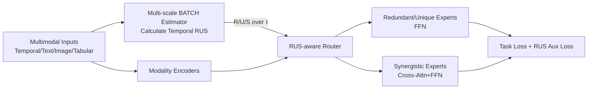

# Massively Multimodal Foundation Models: A Framework for Capturing Interactions with Specialized Mixture-of-Experts

**Conference**: ICLR 2026  
**OpenReview**: [https://openreview.net/forum?id=qF9WJxvHX8](https://openreview.net/forum?id=qF9WJxvHX8)  
**Code**: TBD  
**Area**: Multimodal Learning / Mixture-of-Experts / Massively Multimodal Fusion  
**Keywords**: Massively Multimodal, Temporal Multimodal Interactions, Partial Information Decomposition, RUS, Mixture-of-Experts, Interaction-aware Routing

## TL;DR
This paper proposes the MERGE framework, which decomposes multimodal interactions into "Redundant/Unique/Synergistic (RUS)" signals across time lags using directed information. These signals then guide Mixture-of-Experts (MoE) routing—directing similar modalities to the same experts, unique modalities to different experts, and synergistic modalities to specialized cross-modal experts—significantly enhancing performance and producing interpretable expert specialization in "massively multimodal" scenarios involving dozens of heterogeneous inputs like sensors, imaging, and text.

## Background & Motivation
**Background**: Traditional multimodal learning primarily focuses on a few "classic" modalities like text, images, and audio. However, real-world applications (especially in healthcare, wearables, and activity recognition) often involve dozens to hundreds of heterogeneous input streams—heart rate, SpO₂, ECG, respiration, medical imaging, lab tests, and clinical text—where each stream has different sampling rates, noise levels, and measurement models. This paper defines the setting where "every sensor is considered an independent modality" as **massively multimodal**. MoE architectures are naturally suited for multimodal learning because sparse routing can allocate computation per modality, as seen in works like LIMoE, FuseMoE, and Flex-MoE.

**Limitations of Prior Work**: (1) Existing MoE routers only consider the **similarity** between tokens and experts, treating modalities as static features and failing to capture **temporal lag effects**—for example, early sepsis indicators might involve slow nocturnal drifts in SpO₂/respiration rate hours before fever or elevated lactate; sarcasm often involves eyebrow raising 200–400ms before pitch changes. (2) Previous works incorporating multimodal interactions into MoE (e.g., I²MoE) **hard-bind** the number of experts to the number of modalities, limiting scalability; furthermore, they approximate interactions using binary label consistency from unimodal classifiers, which depends heavily on classifier quality and only characterizes **static** interactions.

**Key Challenge**: As the number of modalities increases, the space of cross-modal interactions explodes (some redundant, some unique, some synergistic appearing only in combination), and these interactions unfold with characteristic temporal lags. There is a need for both a metric to quantify "lagged interactions" and an MoE architecture capable of utilizing them during training, neither of which exists in current methods.

**Goal**: To implement a scalable and interpretable framework that utilizes temporal multimodal interactions to guide MoE training and inference.

**Core Idea**: **Quantize the lagged interactions of modality pairs along the time axis using Partial Information Decomposition (PID: Redundancy / Uniqueness / Synergy), then inject these RUS signals as "priors" into the MoE router.** The interaction type determines the routing strategy, allowing experts to learn generalizable "interaction handling skills" rather than simply memorizing modalities.

## Method

### Overall Architecture
MERGE passes multimodal inputs through $N$ layers of stacked encoders (alternating Transformer blocks and MoE blocks), with core innovations residing in the MoE layers. The pipeline is divided into two **intentionally decoupled** stages: first, "Temporal RUS" is calculated offline (as an intrinsic property of the dataset, calculated once and cached), followed by online guidance of MoE routing and training using these RUS sequences.

### Key Designs

**1. Temporal RUS: Decomposing Multimodal Interactions across Time Lags using Directed Information.** Standard PID is based on mutual information and only characterizes static interactions. MERGE instead uses **directed information**, which respects the "past to present" flow of information, allowing PID analysis across multiple time lags $\tau$. The authors define multi-source directed information as $DI(\tau)=\sum_{t=\tau+1}^{n} I(Y_t; X_{1,t-\tau}, X_{2,t-\tau}\mid Y^{t-1})$ and decompose it at each lag $\tau$ into four terms: $DI(\tau)=R(\tau)+U_1(\tau)+U_2(\tau)+S(\tau)$. Redundancy is defined as $R(\tau)=\max_{Q_\tau\in\Delta_\tau} I_{Q_\tau}(X_1^{n-\tau}; X_2^{n-\tau}; Y^n)$, uniqueness as $U_i(\tau)=\min_{Q_\tau\in\Delta_\tau} I_{Q_\tau}(X_i^{n-\tau}; Y^n\mid X_{j}^{n-\tau})$, and synergy as $S(\tau)=I_{P_\tau}-\min_{Q_\tau}I_{Q_\tau}$. Optimization is performed over the distribution family $\Delta_\tau$ that maintains time-specific bivariate marginals $P_\tau(x_i,y)$. This results in an RUS trajectory for every modality pair at every lag, characterizing "how much lag" and "what kind of interaction" exists. To save memory, a modality pair shares the same lag $\tau$ (though the framework naturally generalizes to cross-lag interactions).

**2. Multi-scale BATCH Estimator: Estimating RUS for All Lags Simultaneously.** Classic PID estimation only handles discrete small supports or low-dimensional continuous variables. The authors extend this to high dimensions using a BATCH estimator (parameterizing distributions with neural networks and approximating the true distribution via sub-sampled batches). They upgrade the naive "step-wise optimization of $Q_\tau^*$" to a **multi-scale** version: training a **single** model that conditions the discriminator on learnable lag embeddings $e(\tau)$ to predict RUS for all $\tau$ at once. Specifically, a fusion discriminator is defined as $\hat P(Y\mid X_1,X_2,\tau)=D_{12,\theta}(\phi(g_{12,\theta}([x_1;x_2]),e(\tau)))$. An alignment tensor $\text{align}_\tau[i,j,k]=\exp(\hat q_{X_1}^{(i,k,\tau)}\cdot \hat q_{X_2}^{(j,k,\tau)}/\sqrt d)$ is constructed to measure sample compatibility, with Sinkhorn–Knopp normalization used to enforce marginal matching for the optimal $Q_\tau^*$. All $\tau$ are computed simultaneously via tensor parallelism, providing approximately $\tau$-fold acceleration and parameter efficiency.

**3. RUS-aware Router: Linking Interaction Types to Routing Strategies.** This serves as the hub connecting information theory to routing decisions. The design principles correspond to three interaction types (and equivalent fusion methods): High Redundancy $R$ $\rightarrow$ route tokens to the **same** conventional expert (early fusion); High Uniqueness $U$ $\rightarrow$ **disperse** routing to different experts to preserve unique information (late fusion); High Synergy $S$ $\rightarrow$ route to specialized **synergistic experts** (cross-attention + FFN, hybrid fusion). Structurally, the router uses attention to focus on modality pair redundancy and synergy $\{[R_{m_1,m_2}, S_{m_1,m_2}]\}$ and a GRU to capture the temporal dynamics of uniqueness $U_{m_1}$. These are concatenated with token representations for routing logits: $\text{RUSContext}_{m_1}=\text{Attention}(\text{Query}_{m_1}, \{[R,S]\}) \oplus \text{GRU}(U_{m_1})$, $\text{Logits}_{m_1}=\text{MLP}(\text{TokenFeatures}_{m_1}\oplus\text{RUSContext}_{m_1})$. Thus, the routing of modality $m_1$ is determined by its temporal interactions with all other modalities rather than just its individual content.

**4. Interaction-aware Auxiliary Loss: Embedding Routing Policies into Training.** Routing principles are enforced through auxiliary losses, with each term corresponding to an interaction type. The redundancy term uses JSD to pull routing distributions of modality pairs closer when they exceed a threshold: $\mathcal L_{\text{redundancy}}=\lambda_R\cdot\frac{1}{N}\sum_{R_{m_1,m_2,t}>\tau_R}\text{JSD}(P^{(t,m_1)}_{\text{router}}, P^{(t,m_2)}_{\text{router}})$. The uniqueness term uses the opposite sign to **push apart** routing distributions and encourage dispersion. The synergy term $\mathcal L_{\text{synergy}}=\lambda_S\cdot\frac{1}{N}\sum_{S_{m_1,m_2,t}>\tau_S}(1-\frac{P^{(t,m_1)}_{\text{syn}}+P^{(t,m_2)}_{\text{syn}}}{2})$ drives high-synergy pairs toward synergistic experts. Total objective = Task Loss + the three auxiliary losses. The authors emphasize that RUS estimation and MERGE training are **deliberately separated**: RUS is a task-agnostic intrinsic structure of the dataset that should not be contaminated by downstream task loss and can be cached after one calculation.

## Key Experimental Results

### Main Results
Covering 6 benchmarks across healthcare, activity recognition, and affective computing (average of 5 random seeds):

| Method | PAMAP2 Acc | MIMIC-IV IHM F1 | MIMIC-IV LOS F1 | MOSI Acc | WESAD AUROC | Opportunity Acc |
|------|-----------|-----------------|-----------------|----------|-------------|-----------------|
| Transformer | 82.48 | 78.96 | 72.31 | 68.39 | 74.39 | 81.59 |
| mTAND | 74.62 | 79.35 | 73.45 | 70.07 | 71.66 | 70.26 |
| MulT | 82.23| 81.55 | 72.52 | 68.80 | 71.43 | 72.61 |
| MISTS | 85.34 | 80.56 | 73.86 | 69.42 | 73.29 | 79.36 |
| FuseMoE | 87.74 | 81.64 | 75.18 | 75.65 | 76.31 | 83.15 |
| I²MoE | 84.55 | 82.59 | 74.36 | 71.91 | 75.52 | 82.16 |
| **MERGE** | **91.37** | **84.97** | 74.43 | 72.04 | **77.34** | **84.32** |

MERGE achieves optimal results on most metrics, with significant improvements over MoE baselines (FuseMoE/I²MoE) in PAMAP2, MIMIC-IV, and WESAD (+3.6 points in PAMAP2 accuracy).

### Ablation Study

| Ablation Dimension | Setting | Conclusion |
|----------|------|------|
| Auxiliary Loss (Fig.7) | Remove R / U / S losses individually | All three terms contribute positively; removing any leads to performance drops. |
| Temporal RUS Length (Fig.6a) | Max lag 1 $\rightarrow$ 10 + segment repetition | Longer is better: wider temporal horizon and reduced gradient variance. |
| Multi-scale vs. Step-wise (Fig.6b/c) | Naive step-wise vs. Multi-scale | Differences in RUS trajectories are minimal; performance is preserved with ~$\tau$ speedup. |

### Key Findings
- Temporal RUS provides **interpretable insights consistent with domain knowledge**: In MIMIC-IV, insulin and furosemide show strong synergy when co-administered (affecting blood glucose/potassium); insulin's uniqueness increases after a 1-hour lag (faster onset); furosemide's synergy with BUN increases over time (delayed efficacy). In PAMAP2, chest and hand movements are highly coupled (redundant) during walking/running. In WESAD, ECG/respiration lagging by 1 second better predicts current chest temperature, corresponding to physical delay in stress response.
- Learned expert activation distributions align with the expected interactions, providing an interpretable routing pattern.

## Highlights & Insights
- **Shifting from "similarity-based routing" to "interaction-aware routing"**: This represents a paradigm shift where R/U/S interaction types map directly to early/late/hybrid fusion strategies, transforming MoE expert specialization from a black-box heuristic into an information-theoretic interpretable decision.
- **Decoupling Expert Count from Modality Count**: Unlike I²MoE, which binds the number of experts to the number of modalities, MERGE uses RUS to dynamically decide which modalities "should or should not stay together," making it suitable for massively multimodal scenarios with dozens of inputs.
- **Directed Information + Multi-scale BATCH Estimator**: These are key engineering contributions for scaling PID to "high-dimensional + temporal" settings. Single-pass estimation for all lags with caching makes info-theoretic quantification practical for training at scale.
- The separation of RUS estimation from MoE training ensures interaction signals are task-agnostic, preventing contamination by downstream losses and saving computational resources during the main training phase.

## Limitations & Future Work
- **Shared Lag $\tau$ for Modality Pairs**: The exhaustive search for cross-lag interactions was sacrificed for memory efficiency; in the real world, causal delays across modalities may not be aligned, potentially losing some interaction nuances.
- **Two-stage Decoupling Cost**: RUS must be pre-calculated offline, sacrificing the potential for RUS to adapt to specific tasks for the sake of task-agnosticism.
- **RUS Estimation Dependence**: Accuracy depends on discriminator stability and Sinkhorn optimization; the maximum lag is limited (around 10), restricting modeling of very long-range dependencies.
- Verification is largely on structured temporal/sensor/clinical data; scalability to extreme multimodal settings (hundreds of modalities) or large-scale vision-language models remains to be tested.

## Related Work & Insights
- **Multimodal MoE**: Compared to LIMoE (modality specialization via contrastive learning/entropy), FuseMoE (Laplace gating for irregular sampling), and Flex-MoE (dynamic routing for missing modalities), MERGE's fundamental difference is using **temporal interactions** rather than similarity as the routing basis.
- **Partial Information Decomposition**: Builds on R/U/S decomposition and BATCH estimators (high-dim PID), extending Varley’s temporal interaction framework which was previously limited to discrete variables.
- **Interaction Experts**: Compared to I²MoE (which binds expert count to modality count and uses static unimodal classifier labels), MERGE solves both scalability and staticity issues via dynamic routing and continuous temporal RUS.
- **Insight**: Injecting information-theoretically quantified interaction structures as cached data priors into sparse model routing is a promising direction for LLM/VLM MoEs, particularly when modality or expert counts explode and interpretable specialization is required.

## Rating
- **Novelty**: ⭐⭐⭐⭐⭐ Using directed information to push PID into the temporal domain and mapping R/U/S directly to MoE routing strategies is an original paradigm shift.
- **Experimental Thoroughness**: ⭐⭐⭐⭐ Covers 6 benchmarks across 3 domains plus extensive ablations and interpretability analyses; however, while "massively multimodal" is promised, the modality count in experiments remains within the tens.
- **Writing Quality**: ⭐⭐⭐⭐ Clear motivation with effective use of formulas and diagrams (architecture/estimator/router); the info-theory section is dense but supported by vivid medical/activity examples.
- **Value**: ⭐⭐⭐⭐ Provides a practical, interpretable, and scalable framework for fusing many heterogeneous modalities, with clear value for clinical monitoring and sensor fusion.

<!-- RELATED:START -->

## Related Papers

- [\[ICLR 2026\] CLIP-FMoE: Scalable CLIP via Fused Mixture-of-Experts with Enforced Specialization](clip-fmoe_scalable_clip_via_fused_mixture-of-experts_with_enforced_specializatio.md)
- [\[ICLR 2026\] Capacity-Aware Inference: Mitigating the Straggler Effect in Mixture of Experts](capacity-aware_inference_mitigating_the_straggler_effect_in_mixture_of_experts.md)
- [\[ICML 2026\] Toward Structural Multimodal Representations: Specialization, Selection, and Sparsification via Mixture-of-Experts](../../ICML2026/multimodal_vlm/toward_structural_multimodal_representations_specialization_selection_and_sparsi.md)
- [\[ICCV 2025\] A Quality-Guided Mixture of Score-Fusion Experts Framework for Human Recognition](../../ICCV2025/multimodal_vlm/a_qualityguided_mixture_of_scorefusion_experts_framework_for.md)
- [\[ICML 2026\] SAME: Stabilized Mixture-of-Experts for Multimodal Continual Instruction Tuning](../../ICML2026/multimodal_vlm/same_stabilized_mixture-of-experts_for_multimodal_continual_instruction_tuning.md)

<!-- RELATED:END -->
