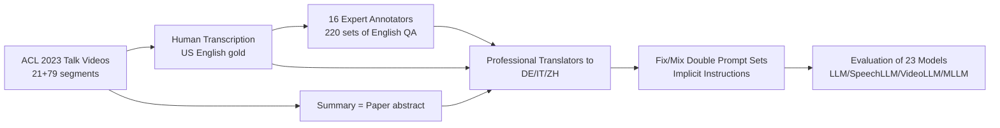

# MCIF: Multimodal Crosslingual Instruction-Following Benchmark from Scientific Talks

**Conference**: ICLR 2026  
**OpenReview**: [https://openreview.net/forum?id=PtPYZYfa0h](https://openreview.net/forum?id=PtPYZYfa0h)  
**Code**: [github.com/hlt-mt/mcif](https://github.com/hlt-mt/mcif) / [hf.co/datasets/FBK-MT/MCIF](https://huggingface.co/datasets/FBK-MT/MCIF)  
**Area**: Multimodal / Evaluation Benchmark  
**Keywords**: Multimodal LLM, Crosslingual, Instruction Following, Speech, Video, Benchmark, Long Context  

## TL;DR
MCIF is the first human-annotated crosslingual multimodal instruction-following benchmark that covers three modalities (speech/video/text), four languages (EN/DE/IT/ZH), and both long/short contexts, with full parallel alignment across all dimensions. Derived from ACL scientific talk videos, evaluations of 23 mainstream models reveal significant gaps in current MLLMs regarding long-context summarization, joint speech-video understanding, and fine-grained QA.

## Background & Motivation
**Background**: Large models are evolving from pure text to unified Multimodal LLMs (MLLMs) integrating text, speech, and video, aiming to complete cross-modal and cross-lingual general tasks via natural language instructions. Evaluating this "general instruction-following" capability requires simultaneous investigation of **cross-lingual**, **multimodal**, and **long/short context** dimensions.

**Limitations of Prior Work**: The authors reviewed existing speech-text and vision-text benchmarks and found they generally **only cover one or two dimensions**—they are either limited to English (or EN-ZH pair), test only one modality at a time (speech-text or vision-text), use only short inputs while ignoring long-term dependencies, risk **data contamination** by recycling old datasets like CommonVoice/FLEURS, or lack human annotation, leading to questionable data quality and reliability. No benchmark exists that supports cross-lingual long-context instruction following across speech, video, and text under a unified setting.

**Key Challenge**: While MLLM capabilities are rapidly evolving toward "being able to do everything," evaluation tools remain at the stage of "testing one aspect at a time," making it impossible to systematically diagnose where the bottlenecks lie in cross-lingual integration, multimodal fusion, and long-text understanding.

**Goal**: Construct a human-annotated benchmark that is **fully parallel aligned across modalities, languages, and context lengths**, allowing for ablation-style diagnostics for each sample while controlling other variables.

**Core Idea**: **Utilize real scientific talk videos + Triple Modality Parallelism + Quad-lingual Parallelism + Implicit Instructions**. Using ACL 2023 presentation videos as raw material, human annotators produced transcriptions, translations, summaries, and QA pairs. The same content exists in speech, video, and text modalities, with prompts and reference answers aligned across EN, DE, IT, and ZH. Task types, modalities, and target languages are not provided as explicit metadata; instead, the model must infer them from the prompt itself, approximating real human-computer interaction.

## Method

### Overall Architecture
MCIF is an evaluation benchmark rather than a model; its "method" is a pipeline of **data collection — human annotation — cross-lingual expansion — instruction construction — multi-model evaluation**. The core product is a parallel evaluation set of 3 modalities × 4 languages × 2 context lengths × 13 tasks (grouped into 4 macro-tasks: recognition, translation, QA, and summarization). Each sample consists of "input content (text, speech, or video in short/long form) + text prompt containing instructions (in one of the four languages) + reference answer in the same language."

### Key Designs

**1. Fully Parallel Alignment of 3 Modalities × 4 Languages: Enabling Ablation.** The core selling point of MCIF is "parallelism"—the same scientific talk exists simultaneously as speech (mono 16kHz wav), video (mp4), and text (gold transcript), while prompts and reference outputs are aligned one-to-one across English, German, Italian, and Chinese. This Cartesian product alignment allows researchers to fix content and switch modalities to observe dependence on speech vs. video vs. joint understanding, or fix the modality and switch target languages to observe cross-lingual generalization. The 13 fine-grained tasks are organized into four macro-tasks: Recognition (ASR/AVR), Translation (MT/ST/AVT), QA (TQA/SQA/VQA/AVQA), and Summarization (TSUM/SSUM/VSUM/AVSUM). Tasks marked with "cross" involve different source and target languages to specifically test cross-lingual capabilities.

**2. Real Scientific Talks + Latest Materials to Prevent Contamination: Natural, Expert-level, and Difficult.** Data is sourced from ACL Anthology presentation videos (CC-BY 4.0), recorded by researchers worldwide, naturally including vast differences in accents, equipment, backgrounds, and styles. This is close to real-world scenarios and includes supporting slides, audio, and papers. To avoid models "cheating" on training data, the authors intentionally selected the **latest** ACL 2023 talks and manually excluded duplicate speakers, low-quality audio, and TTS-generated speech. The benchmark finally contains 21 core talks (2 hours, ~15.5k words), with an additional 79 segments added to improve the representativeness of the summarization task, totaling 100 samples (~10 hours, summaries ~17k words). Long context provides full video/speech alongside short segments (approx. 16s) segmented automatically via SHAS, balancing long-dependency evaluation with availability for small-context models.

**3. Structured QA and Modality Labels: Pinpointing "Where the Answer Lies".** Each talk is paired with at least 10 QA sets following three distributions: general questions (applicable to any report, e.g., "What is the author's affiliation?"), transcription questions (fine-grained, context-dependent retrieval after watching the full clip), and abstract questions (posed after reading only the abstract, simulating a user asking questions without watching the video). 16 experts with high English proficiency and ML/NLP backgrounds created and cross-validated all QA pairs, labeling each question with the **input modality required for the answer**: NA (unanswerable from audio/video), AV (explicit in both), A (explicit in audio only), or V (explicit in video only). These labels allow for systematic quantification of "how models perform under different modality conditions and when faced with unanswerable samples." All QA pairs were created in English and translated into DE/IT/ZH by professional translators who verified the original text during translation, acting as a second quality check.

**4. Implicit Instructions + Fix/Mix Double Prompts: Testing Real Interaction and Robustness.** Task types, input modalities, and target languages are not provided as explicit metadata; models must infer the task from the prompt text—e.g., "Answer the following question concisely given the English content: {QUESTION}". Prompts are written in the target language and specify the source language. The authors further designed two variants: $MCIF_{fix}$ uses one fixed prompt for each macro-task, while $MCIF_{mix}$ randomly selects from ten candidates (including the fixed one). Comparing "consistent prompt vs. random diverse prompts" directly measures the model's generalization and robustness to phrasing changes. Evaluation metrics follow community standards: WER for recognition (jiWER + Whisper normalizer), COMET for translation (wmt22-comet-da), and baseline-calibrated BERTScore for QA and summarization (0 corresponds to random output in the target language).

## Key Experimental Results

### Main Results
23 open-source models (<20B) plus commercial Gemini 1.5 Flash were evaluated, including 7 LLMs, 5 SpeechLLMs, 5 VideoLLMs, and 6 MLLMs. Comprehensive comparisons across the four macro-tasks were conducted under fix/mix and long/short contexts.

### Representative Results for Macro-tasks (Short Context, $MCIF_{fix}$)

| Model Category | Model | REC (WER↓) | TRANS (COMET↑) | QA (BERTS.↑) |
|---|---|---|---|---|
| SpeechLLM | Phi4-Multimodal | 6.8 | 80.2 | 37.1 |
| SpeechLLM | GraniteSpeech | 9.4 | 52.1 | 0.5 |
| SpeechLLM | Qwen2-Audio | 31.7 | 74.9 | 32.6 |
| SpeechLLM | UltraVox v0.5 | 127.7 | 43.3 | 19.6 |
| SpeechLLM | DeSTA2 | 54.0 | 75.3 | 17.2 |

### Key Findings
- **Recognition is feasible but some models collapse**: Certain SpeechLLMs/MLLMs (Phi4, GraniteSpeech, Ola, Gemini) achieved WER < 10, proving task feasibility. However, UltraVox, Ming-Lite-Omni, and MiniCPM-o-2 had WER > 100 in both long and short contexts. In short context, Ola's performance plummeted from 6.6/14.0 to 98.8/104.1; manual inspection showed it misunderstood transcription instructions as image captioning for slides.
- **Translation is still dominated by text LLMs**: Due to the maturity of text translation, LLMs led the Translation macro-task. Phi4-Multimodal achieved COMET > 80 in short context, whereas models like UltraVox and MiniCPM-o-2 failed entirely.
- **Universal Weaknesses**: Models collectively struggled with long context (especially summarization), joint speech and video integration, and fine-grained QA. These identify primary directions for future improvement in cross-lingual multimodal instruction following.

## Highlights & Insights
- **"Full Parallelism" is a methodological contribution**: Turning modality, language, and context length into orthogonal dimensions transforms the benchmark from a "ranking scoreboard" into an "ablation diagnostic tool" that can pinpoint specific dimensions of model weakness.
- **Implicit Instructions approximate reality**: Not providing explicit metadata and requiring models to infer task/modality/language from the prompt is closer to real interaction—and more difficult—than traditional task-labeled evaluations.
- **Engineering awareness of anti-contamination**: Selecting the latest conference materials and avoiding recycled public datasets directly addresses widespread concerns about data leakage in current benchmarks.
- **Modality attribution labels for QA** are clever, making "whether the answer is hidden in audio or video" explicit, resulting in an interpretable evaluation of multimodal fusion capabilities.

## Limitations & Future Work
- **Small Scale**: Core data consists of only 21 talks, supplemented to 100 samples; this is limited compared to natural corpora, affecting long-tail coverage and statistical significance.
- **Single Domain**: Sourced primarily from NLP and related academic talks; generalizability to non-lecture spoken/video scenarios remains to be verified.
- **Typical but Limited Languages**: Though EN/DE/IT/ZH cover diverse language families and writing systems, they are all high-resource; low-resource cross-lingual capabilities are not covered.
- **Metric Dependency**: The correlation of WER/COMET/BERTScore with human judgment remains limited for long-text summarization and open QA. Future work could include human or LLM-as-judge evaluations.

## Related Work & Insights
- **Speech-text IF benchmarks** (Speech-ifeval, SAKURA, AIR-Bench, etc.) are mostly limited to EN or EN-ZH, short contexts, or recycled datasets, making it difficult to jointly investigate cross-lingual long contexts.
- **Vision-text IF benchmarks** (MMMU, MME, etc.) are expanding language coverage but are generally limited to single images or video-text dual modalities, with few human-written multi-lingual instructions.
- **Trimodal Pioneers** (VideoMME, MF2) were the first to include speech/text/video, but VideoMME is not cross-lingual and focuses on video tasks, while MF2 includes speech but does not evaluate it. MCIF fills the gap in unified "speech+video+text+cross-lingual" instruction following.
- **Insights**: The design paradigm of "parallel alignment + implicit instructions" can be transferred to other multimodal evaluations requiring multi-dimensional diagnostic ablation. Modality-attribution QA labeling should be promoted in general VQA/AVQA datasets.

## Rating
- Novelty: ⭐⭐⭐⭐ First human-annotated cross-lingual instruction-following benchmark with full 3-modal × 4-language × long/short context parallelism, filling a clear evaluation gap.
- Experimental Thoroughness: ⭐⭐⭐⭐ Covers 23 models across categories, 4 macro-tasks, fix/mix vs. long/short context, supplemented by modality/language-level analysis and failure case dissection.
- Writing Quality: ⭐⭐⭐⭐ Clear motivation-pain points-design logic; high information density in tables/charts; well-researched related work.
- Value: ⭐⭐⭐⭐ As an open-source (CC-BY 4.0 + Apache 2.0) human-annotated benchmark, it provides solid community value for diagnosing and advancing cross-lingual multimodal long-context capabilities in MLLMs.

<!-- RELATED:START -->

## Related Papers

- [\[ACL 2025\] CrafText Benchmark: Advancing Instruction Following in Complex Multimodal Open-Ended World](../../ACL2025/multimodal_vlm/craftext_benchmark_advancing_instruction_following_in_complex_multimodal_open-en.md)
- [\[ICCV 2025\] MM-IFEngine: Towards Multimodal Instruction Following](../../ICCV2025/multimodal_vlm/mm-ifengine_towards_multimodal_instruction_following.md)
- [\[CVPR 2026\] ARGUS: Defending Against Multimodal Indirect Prompt Injection via Steering Instruction-Following Behavior](../../CVPR2026/multimodal_vlm/argus_defending_against_multimodal_indirect_prompt_injection_via_steering_instru.md)
- [\[ICLR 2026\] MME-Unify: A Comprehensive Benchmark for Unified Multimodal Understanding and Generation Models](mme-unify_a_comprehensive_benchmark_for_unified_multimodal_understanding_and_gen.md)
- [\[ECCV 2024\] Efficient Inference of Vision Instruction-Following Models with Elastic Cache](../../ECCV2024/multimodal_vlm/efficient_inference_of_vision_instruction-following_models_with_elastic_cache.md)

<!-- RELATED:END -->
