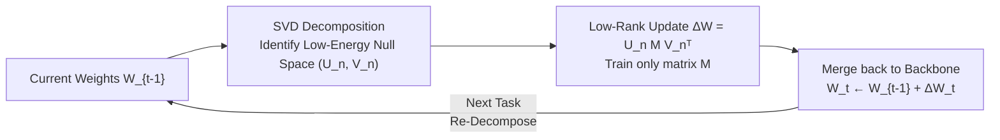

# Memory-Free Continual Learning with Null Space Adaptation for Zero-Shot Vision-Language Models

**Conference**: ICLR 2026  
**OpenReview**: [https://openreview.net/forum?id=tucuU4sQ3s](https://openreview.net/forum?id=tucuU4sQ3s)  
**Code**: TBD  
**Area**: Multimodal VLM / Continual Learning / Parameter-Efficient Fine-Tuning  
**Keywords**: CLIP, Continual Learning, Zero-Shot Generalization, Null Space, Low-Rank Adaptation, Memory-free  

## TL;DR
NuSA-CL extracts the "low-energy null space" of CLIP's current weights via SVD and strictly constrains the low-rank updates of each new task within this null space. After training, updates are merged back into the backbone, achieving continual learning of new tasks with nearly zero loss in original zero-shot capabilities, while maintaining zero storage overhead, zero parameter growth, and zero extra model components.

## Background & Motivation
**Background**: Vision-language foundation models like CLIP, through image-text alignment representations, support zero-shot generalization and serve as the perceptual foundation for multimodal large models like LLaVA and robotic VLA systems. However, these systems inherit a critical weakness—the backbone knowledge is frozen. In real-world deployment scenarios where data distributions evolve and new categories constantly emerge, static zero-shot capabilities are insufficient.

**Limitations of Prior Work**: Although Continual Learning (CL) is a solution, mainstream paradigms hit a "scalability wall." One class consists of memory-based methods (experience replay, reference data, gradient projection memory), where storage costs grow linearly with the number of tasks. Another class consists of expansion-based methods (adding adapter/prompt modules for each task), where parameter count and structural complexity expand unboundedly over time. Even PEFT methods like InfLoRA still require maintaining a memory bank of past gradients for orthogonal projection. These methods are effective on short-sequence benchmarks but fail to support true lifelong learning.

**Key Challenge**: The fundamental issue is the stability-plasticity trade-off—absorbing new task knowledge within a **fixed capacity** model without destroying existing (especially pre-trained zero-shot) knowledge. In CLIP, forgetting damages not only past tasks but also the most valuable general zero-shot capabilities.

**Goal**: Completely eliminate external resources and allow the model to complete continuous adaptation based solely on its **intrinsic structure**, achieving zero storage overhead, zero extra model load, and zero parameter growth.

**Key Insight**: **[Null Space Constraint]** After SVD decomposition of the model's current weights, high-energy principal components encode core knowledge, while low-energy subspaces (approximate null spaces) carry almost no knowledge. By **persistently** constraining the low-rank updates of new tasks within this null space, one can mathematically guarantee that updates are nearly orthogonal to the principal components, thereby minimizing interference with old knowledge.

## Method

### Overall Architecture
NuSA-CL is a data-independent, iterative three-stage adaptation process: for each task in a sequence, it first performs SVD on the current weights $W_{t-1}$ to identify the intrinsic null space, then trains a low-rank update $\Delta W_t$ within that null space, and finally merges the update back into the backbone such that $W_t \leftarrow W_{t-1} + \Delta W_t$. The merged model, maintaining a fixed parameter budget, becomes the starting point for the next task.

### Key Designs

**1. Intrinsic Null Space Identification: Identifying "empty" directions via SVD.** For a weight matrix $W \in \mathbb{R}^{m \times n}$, SVD is performed as $W = U\Sigma V^\top$. High-energy singular values correspond to principal components carrying core knowledge. The principal space dimension $k$ is defined as the smallest integer such that $\sum_{i=1}^{k}\sigma_i^2 \ge \rho \cdot \|W\|_F^2$, where $\rho$ is a threshold. The remaining $d-k$ dimensions form the approximate null space spanned by $(U_n, V_n)$. To keep the number of trainable parameters consistent across layers and tasks, the update rank is capped at $r_{max}$, with the effective rank $r = \min(d-k,\, r_{max})$ (experimentally $r_{max}=128$). This step is entirely data-independent, relying only on the spectral structure of the weights.

**2. Persistent Null Space Adaptation: Training only a small matrix M.** Unlike standard LoRA which learns two projection matrices, NuSA-CL formulates the update as $\Delta W = U_n M V_n^\top$, where the null space bases $U_n, V_n$ are derived from frozen weights and remain frozen during training. The only trainable component is the middle matrix $M \in \mathbb{R}^{r \times r}$ (initialized to zero for each task). This construction mathematically ensures $\Delta W$ is orthogonal to the principal subspace of $W$. The key distinction is "persistence"—while works like MiLoRA use low-energy subspaces only for **initialization**, NuSA-CL locks the update within the null space **throughout** the training process. Theoretically (Lemma 1), the interference of a single update in parameter space is bounded by $|\langle W, \Delta W\rangle_F| \le \sigma_{max}^{null}\cdot\|M\|_F$, where $\sigma_{max}^{null}:=\sigma_{k+1}$ is the largest singular value in the null space.

**3. Merged Continual Accumulation: Absorbing knowledge under fixed parameter budget.** After training each task, the learned $\Delta W_t$ is merged into the base weights $W_t \leftarrow W_{t-1}+\Delta W_t$ without adding parameters. For the subsequent task, SVD is re-performed on the **updated** $W_t$ to identify a new null space. This means the model adapts in directions "least destructive" to all accumulated knowledge. The authors found this to be an "accumulative" rather than "overwriting" process: visualizations show that while standard LoRA/Full-FT effective ranks remain static, NuSA-CL's effective rank rises continuously, indicating it progressively fills previously idle low-energy subspaces.

## Key Experimental Results

### Main Results (MTIL Benchmark, Full-Shot, CLIP ViT-B/16)

| Method | Category | Params | Extra Storage | Peak GPU(GB) | GPU-Hours | Transfer | Avg. | Last |
|---|---|---|---|---|---|---|---|---|
| ZSCL | Memory-based | 149.6M | Data & Model 10.5GB | 43.1 | 47.24 | 68.1 | 75.4 | 83.6 |
| MoE-Adapters | Memory-based | 59.8M | Router 4.8GB | 15.5 | 3.42 | 68.9 | 76.7 | 85.0 |
| DIKI | Memory-based | 1.8M | Statistics 159MB | 10.2 | 4.40 | 68.7 | 76.3 | 85.1 |
| InfLoRA† | Memory-based | 7.8M | Grad Memory 9MB | 6.6 | 4.29 | 66.2 | 74.2 | 83.6 |
| Continual-FT | Memory-free | 149.6M | None | 14.6 | 12.76 | 44.6 | 55.9 | 77.3 |
| LoRA† | Memory-free | 15.7M | None | 6.7 | 1.21 | 63.9 | 70.1 | 79.9 |
| MiLoRA† | Memory-free | 15.7M | None | 6.7 | 1.24 | 62.8 | 68.7 | 77.4 |
| **NuSA-CL** | **Memory-free** | **1.5M** | **None** | **6.6** | **1.21** | **68.6** | **75.1** | **82.8** |

NuSA-CL leads the memory-free category and matches memory-based SOTA performance: compared to MoE-Adapters, it uses $40\times$ fewer parameters (1.5M vs 59.8M), zero extra storage, less than half the VRAM, and achieves nearly $3\times$ speedup.

### Ablation Study (Core Mechanism + Robustness)

| Ablation Item | Configuration | Transfer | Avg. | Last |
|---|---|---|---|---|
| Persistent Constraint | Train M only (Ours) | 68.58 | 75.08 | 82.79 |
| Persistent Constraint | Train M & $V_n$ | 66.37 | 73.11 | 82.04 |
| Persistent Constraint | Train M, $U_n, V_n$ | 62.60 | 68.12 | 77.32 |
| Modality | Dual Modality (Ours) | 68.58 | 75.08 | 82.79 |
| Modality | Text only | 68.47 | 72.62 | 79.09 |
| Modality | Vision only | 65.14 | 70.49 | 77.86 |
| Subspace Select ($r=128$) | Tail/Null Space (Ours) | Forgetting 2.57% | — | — |
| Subspace Select ($r=128$) | Top | Forgetting 4.44% | — | — |
| Subspace Select ($r=128$) | Random | Forgetting 4.57% | — | — |

Unfreezing null space bases lead to significant performance drops, proving the necessity of "persistent constraints." Jointly updating text and vision encoders is crucial for cross-modal alignment. The Tail (low-energy) subspace consistently results in the lowest forgetting across all ranks.

### Key Findings
- **5-shot MTIL Stress Test**: NuSA-CL outperforms the strongest competitor InfLoRA across all metrics (Transfer 68.1 / Avg. 70.3 / Last 75.4), proving that persistent null space constraints are more robust and data-efficient than subspace initialization (MiLoRA) or gradient projection (InfLoRA).
- **Long-Sequence CIFAR100 CIL**: Advantages become more pronounced as sequences lengthen; at 50 steps, Last accuracy reaches 71.85%, over 4.4% higher than ZSCL. Spectral analysis shows no spectral collapse even under highly correlated task flows.
- **Update Rank Trade-off**: $r_{max}=128$ is the optimal balance for stability-plasticity; increasing rank improves current task accuracy but aggravates forgetting.
- **Practicality**: SVD initialization overhead is negligible and insensitive to the energy threshold $\rho$ (0.80~0.90).

## Highlights & Insights
- **Operationalizes "Null Space"**: Transforms an abstract concept into a functional CL mechanism. The observation that low-energy spectral regions are not limited "empty containers" but reusable low-interference zones supports the feasibility of long-sequence learning.
- **Genuine "Three Zeros"**: Zero storage, zero extra model components, zero parameter growth—a feat most CL methods cannot achieve, making it highly attractive for resource-constrained scenarios like edge AI and autonomous agents.
- **Persistent Constraint vs. Initialization**: The rigorous comparison between these two approaches, backed by theory (interference bounds), spectral visualization (accumulation vs. overwriting), and ablation studies, provides a solid chain of evidence.
- **Focused Positioning**: Acts on feature encoding layers rather than generative stacks, positioning it as a complementary foundation for multimodal systems rather than a direct competitor to full generative models.

## Limitations & Future Work
- Theoretical guarantees remain in the **parameter space**, representing local stability conditions rather than functional-level forgetting guarantees.
- Performing SVD on each layer per task might encounter scaling issues on significantly larger backbones.
- Experiments focused on CLIP ViT-B/16; performance on larger VLMs or joint training with upper-layer MLLMs/VLAs remains to be verified.
- The saturation of null space capacity over extremely long task flows (beyond 50 steps) and performance under extreme distribution shifts requires further investigation.

## Related Work & Insights
- **PEFT in CL**: Methods using prompts (isolating task knowledge) or adapters (inserting modules per task) often externalize knowledge, leading to parameter growth; NuSA-CL conversely adapts core weights within a fixed budget.
- **Orthogonal Projection / Null Space Methods**: GPM, Adam-NSCL, and InfLoRA rely on stored data/features/gradients to define subspaces to avoid. NuSA-CL's uniqueness lies in deriving the approximate null space **intrinsically** from the current weight structure, without any memory.
- **SVD-guided Adaptation**: PiSSA (using principal components) and MiLoRA (using low-energy components) mainly target single-task fine-tuning and only use subspaces for initialization. NuSA-CL extends this to sequential learning with mandatory persistent constraints.

## Rating
- **Novelty**: ⭐⭐⭐⭐ Combines persistent null space constraints, intrinsic weight SVD, and merged fixed-budget adaptation into a completely memory-free framework with clear conceptual distinction from prior methods.
- **Experimental Thoroughness**: ⭐⭐⭐⭐ Covers MTIL (full/5-shot), CIFAR100 CIL (10/20/50 steps), with extensive efficiency comparisons, multi-dimensional ablations, and spectral dynamics visualization.
- **Writing Quality**: ⭐⭐⭐⭐ Clear motivation-method-theory-experiment chain; the "accumulation vs. overwriting" narrative and charts are highly persuasive.
- **Value**: ⭐⭐⭐⭐ The "three zeros" property provides strong practical value for resource-constrained lifelong learning deployment.

<!-- RELATED:START -->

## Related Papers

- [\[ICLR 2026\] Enhanced Continual Learning of Vision-Language Models with Model Fusion](enhanced_continual_learning_of_vision-language_models_with_model_fusion.md)
- [\[ICLR 2026\] KeepLoRA: Continual Learning with Residual Gradient Adaptation](keeplora_continual_learning_with_residual_gradient_adaptation.md)
- [\[ICLR 2026\] Reversible Primitive–Composition Alignment for Continual Vision–Language Learning](reversible_primitivecomposition_alignment_for_continual_visionlanguage_learning.md)
- [\[CVPR 2026\] Bridging the Modality Gap in Compositional Zero-Shot Learning via Sparse Alignment and Unimodal Memory Bank](../../CVPR2026/multimodal_vlm/bridging_the_modality_gap_in_compositional_zero-shot_learning_via_sparse_alignme.md)
- [\[ICLR 2026\] Preserve and Sculpt: Manifold-Aligned Fine-tuning of Vision-Language Models for Few-Shot Learning](preserve_and_sculpt_manifold-aligned_fine-tuning_of_vision-language_models_for_f.md)

<!-- RELATED:END -->
