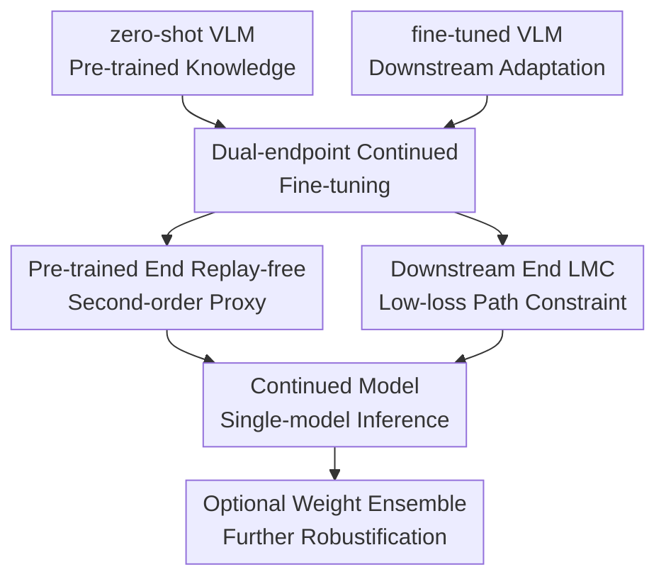

# MergeTune: Continued Fine-Tuning of Vision-Language Models

**Conference**: ICLR2026  
**OpenReview**: [https://openreview.net/forum?id=MAApSY32Z6](https://openreview.net/forum?id=MAApSY32Z6)  
**Paper**: OpenReview  
**Code**: https://github.com/Surrey-UP-Lab/MERGETUNE  
**Area**: Multimodal VLM  
**Keywords**: VLM Continued Fine-Tuning, CLIP Adaptation, Model Merging, Linear Mode Connectivity, Catastrophic Forgetting  

## TL;DR

MERGETUNE defines the recovery of pre-trained knowledge in an already fine-tuned CLIP/VLM as a "continued fine-tuning" problem. By using Linear Mode Connectivity (LMC) constraints to further optimize previously trained parameters, the final model is positioned closer to both the zero-shot CLIP and the downstream fine-tuned model, improving base-novel, cross-dataset, domain generalization, and ID-OOD robustness without adding inference parameters.

## Background & Motivation

**Background**: Vision-language models like CLIP rely on large-scale image-text pre-training to achieve strong zero-shot generalization, but real-world downstream tasks often require adaptation. Common practices include parameter-efficient fine-tuning (PEFT) methods like CoOp, KgCoOp, MMA, or PromptKD, which update only prompts, adapters, or lightweight heads. Another line is robust fine-tuning, which fine-tunes the entire model or linear heads on large data like ImageNet and mitigates out-of-distribution performance drops via weight averaging or prediction ensembles.

**Limitations of Prior Work**: These methods usually focus on "minimizing forgetting during fine-tuning," yet a portion of pre-trained knowledge is still lost after adaptation. A direct observation in the paper is that across 11 cross-dataset evaluations, no existing PEFT method consistently outperforms zero-shot CLIP. Furthermore, post-hoc model merging methods like TIES or DARE often degrade when merging zero-shot and fine-tuned checkpoints, suggesting the two solutions do not naturally lie on a low-loss linear path in the weight space.

**Key Challenge**: Downstream fine-tuning pulls the model toward task data, while zero-shot generalization relies on the knowledge near the original pre-trained solution. Simply restricting updates sacrifices adaptation capability, while naive checkpoint merging may traverse high-loss regions, leading to unstable trade-offs between base classes, novel classes, or OOD data. The problem is not just "how to average two models," but "whether a new solution can be learned that maintains low-loss connectivity with both endpoints."

**Goal**: The authors reframe this as continued fine-tuning: given an already adapted model, they aim to optimize the trainable parameters in a post-hoc stage to recover forgotten pre-trained knowledge while preserving downstream task performance, without reworking the original fine-tuning pipeline, changing the architecture, or requiring pre-training data.

**Key Insight**: MERGETUNE approaches this from the geometric perspective of model merging and mode connectivity. If a model $w$ has low-loss linear paths to both the zero-shot solution $\hat{w}_1$ and the fine-tuned solution $\hat{w}_2$, then $w$ is not just a crude average but resides in a connectivity region that inherits knowledge from both ends. The authors turn this property into an explicit training objective rather than a passive post-training averaging attempt.

**Core Idea**: Use Linear Mode Connectivity to guide continued fine-tuning, learning a continued model that is connected to both zero-shot CLIP and the fine-tuned downstream model with low loss, thereby "injecting" pre-trained generalization back into adapted VLMs.

## Method

### Overall Architecture

MERGETUNE takes two checkpoints as input: the zero-shot VLM weights $\hat{w}_1$ (e.g., original CLIP) and weights $\hat{w}_2$ already trained by a downstream method (e.g., CoOp, KgCoOp, MMA, PromptKD, linear probing, or E2E-FT). The method introduces no new architecture; instead, it initializes a continued model $w$ in the same parameter space, continues training it on downstream data, and constrains it to remain close to the zero-shot solution while maintaining low-loss linear connectivity with the fine-tuned solution. After training, the single model $w$ is used for inference. In robust fine-tuning scenarios, $w$ can also be combined with the zero-shot model via standard weight interpolation as a stronger ensemble version.

The three major contribution nodes are: dual-endpoint continued fine-tuning defines the target solution; the pre-trained end replay-free second-order proxy handles the unavailability of original CLIP data; and the downstream LMC constraint ensures the continued model remains effective along the interpolation path to the fine-tuned checkpoint.

### Key Designs

**1. Dual-endpoint Continued Fine-tuning: Solving Forgetting Post-adaptation**

MERGETUNE's most significant shift is no longer treating catastrophic forgetting solely as a regularization problem during fine-tuning. While traditional PEFT restricts parameters during training and robust fine-tuning averages weights after training, MERGETUNE asks: since an adapted model already exists, can we continue training a third model $w$ that acts as a mergeable, smooth bridge between the two endpoints?

Formally, the goal is for $w$ to be linearly connected to the zero-shot solution $\hat{w}_1$ and fine-tuned solution $\hat{w}_2$ with low loss along the paths:

$$
w = \arg\min_w \mathbb{E}_{\alpha \sim U[0,1]}\left[L_1(\hat{w}_1 + \alpha(w - \hat{w}_1)) + L_2(\hat{w}_2 + \alpha(w - \hat{w}_2))\right].
$$

This objective is proactive: instead of picking an interpolation coefficient $\alpha$ and hoping for a good average, it optimizes the position of $w$ so it enters a low-loss connectivity region. Consequently, MERGETUNE can be applied as a post-hoc enhancement to various VLM adaptation methods.

**2. Pre-trained End Replay-free Second-order Proxy: Anchor Zero-shot Knowledge Without CLIP Data**

A challenge in the LMC objective is that $L_1$ is the CLIP pre-training loss, requiring web-scale image-text data. Since this data is typically unavailable, MERGETUNE uses a second-order Taylor approximation of the loss at the zero-shot end.

Near $\hat{w}_1$, the term $L_1(\hat{w}_1 + \alpha(w - \hat{w}_1))$ is expanded. Assuming the zero-shot checkpoint is a local optimum for the pre-training task, $\nabla L_1(\hat{w}_1) \approx 0$. By simplifying the Hessian with an isotropic curvature $H_1 \approx \mu I$, the pre-training loss becomes a distance regularization:

$$
R_{Task1} = \lambda \|w - \hat{w}_1\|^2.
$$

This design provides a geometric anchor to the zero-shot solution. It is much cheaper than replaying pre-trained data and less prone to further forgetting than training on downstream data alone.

**3. Downstream End LMC Path Constraint: Smoothing with the Fine-tuned Solution**

To ensure the continued model retains downstream knowledge, MERGETUNE explicitly adds an LMC term on the fine-tuned side. It samples several interpolation points $\hat{w}_2 + \alpha(w-\hat{w}_2)$ between $\hat{w}_2$ and $w$, computing the downstream loss $L_2$ on these points to ensure the entire path remains low-loss.

The final replay-free objective is:

$$
L(w) = L_2(w) + \lambda\|w - \hat{w}_1\|^2 + \beta\mathbb{E}_{\alpha \sim U[0,1)}L_2(\hat{w}_2 + \alpha(w - \hat{w}_2)).
$$

Here, $L_2(w)$ ensures the model's own downstream performance, $\lambda$ controls zero-shot knowledge retention, and $\beta$ controls connectivity with the fine-tuned solution. During training, the expectation is approximated by sampling $N_\alpha$ points (e.g., 5 or 10).

### Loss & Training

The training workflow follows three steps. First, train the downstream checkpoint $\hat{w}_2$ following the baseline method while keeping $\hat{w}_1$ fixed. Second, initialize the continued model with $w=(1-\tau)\hat{w}_1+\tau\hat{w}_2$. Third, continue training on the downstream data using the combined objective.

In few-shot settings (16-shot), MERGETUNE is evaluated on CoOp, KgCoOp, MMA, and PromptKD using CLIP ViT-B/16. For instance, CoOp+MERGETUNE follows the baseline batch size of 128 and learning rate of 0.002, training for 50 epochs. For many-shot robust fine-tuning, linear probing and E2E-FT are used as baselines, followed by an equal number of MERGETUNE training rounds.

Hyperparameter analysis shows that for $\lambda \in [8, 16]$ and $\beta \in [0.1, 0.5]$, performance is stable. The authors also confirm that prolonged continued fine-tuning (e.g., 100 epochs) does not cause "over-merging" or performance degradation, indicating that the dual-endpoint constraint provides stable anchors for training.

## Key Experimental Results

### Main Results

MERGETUNE was evaluated across four protocols: base-to-novel generalization, cross-dataset generalization, domain generalization, and many-shot ID-OOD robust fine-tuning. The primary finding is that while post-training merging (TIES/DARE) often degrades in PEFT scenarios, MERGETUNE provides consistent gains, particularly for methods with significant forgetting like CoOp.

| Setting | Baseline | Original | TIES / DARE | MERGETUNE | Key Conclusion |
|------|----------|--------|-------------|-----------|----------|
| Base-to-novel Avg HM | CoOp | 71.66 | 66.32 / 70.59 | 77.24 | +5.58 over CoOp; post-training merging fails |
| Base-to-novel Avg HM | KgCoOp | 77.01 | 72.56 / 75.17 | 77.98 | +0.97 even on knowledge-preserving baseline |
| Base-to-novel Avg HM | MMA | 79.87 | 69.41 / 71.81 | 80.44 | Outperforms original MMA despite differing structures |
| Base-to-novel Avg HM | PromptKD | 83.73 | 79.52 / 82.13 | 84.09 | Stable +0.36 gain on very strong baseline |
| Cross-dataset Avg-C | CoOp | 63.88 | 63.80 / 61.67 | 65.80 | +1.92 improvement migrating from ImageNet |
| Domain Avg-D | CoOp | 59.28 | 53.20 / 57.64 | 60.15 | +0.87 gain on ImageNet shifts; TIES/DARE degrades |

In base-to-novel experiments, MERGETUNE boosts CoOp's Novel accuracy from 63.22 to 73.97 while maintaining Base accuracy at 80.82. For robust fine-tuning, a single MERGETUNE-tuned model outperforms VRF.

| Robust Fine-tuning | Method | ImageNet | Avg-D | Gain vs. FT | Inference |
|-------------------------|------|----------|-------|------------------------|----------|
| Linear probing | Original LP | 79.79 | 57.39 | - | Single model |
| Linear probing | MERGETUNE | 79.96 | 59.66 | +2.27 | Single model |
| Linear probing | MERGETUNE + Weight ens. | 79.88 | 60.23 | +2.84 | Single weight-interp |
| E2E-FT | Original E2E-FT | 81.31 | 53.70 | - | Single model |
| E2E-FT | MERGETUNE | 82.26 | 62.29 | +8.59 | Single model |
| E2E-FT | MERGETUNE + Weight ens. | 82.18 | 62.90 | +9.20 | Single weight-interp |

### Ablation Study

| Config | HM Score | Note |
|------|----------|------|
| $\lambda=1, \beta=0.1$ | 76.44 | Weak zero-shot constraint; insufficient novel recovery |
| $\lambda=8, \beta=0.5$ | 77.62 | Optimal balance between base and novel |
| Initialization $\tau=0.0$ | 76.94 | Starting from CLIP biases toward pre-training; lower adaptation |
| Initialization $\tau=0.3$ | 77.62 | Balanced initialization yields best results |
| $N_\alpha=1$ | 77.19 | Insufficient path sampling; weaker LMC constraint |
| $N_\alpha=5$ | 77.62 | Good trade-off between performance and cost |

### Key Findings

- Gains correlate with the baseline's degree of forgetting: CoOp shows the largest improvement (+5.58 HM).
- Post-training merging is unreliable in PEFT scenarios. TIES and DARE mostly decrease HM, proving that merging itself isn't the answer—explicitly shaping a low-loss path during training is.
- Domain and cross-dataset results show that MERGETUNE recovers generic cross-domain knowledge rather than just overfitting to splits.
- In robust fine-tuning, MERGETUNE's single-model performance is highly competitive, and its weight-ensemble version achieves state-of-the-art OOD accuracy.

## Highlights & Insights

- MERGETUNE's strength lies in separating "knowledge recovery" into a post-hoc continued fine-tuning stage. This is practical as it allows researchers to enhance existing trained checkpoints.
- It moves beyond simple distance regularization by using LMC to explain why merging fails and turning that observation into a training objective.
- The second-order proxy is a clever engineering solution. By avoiding pre-training data replay, the method remains applicable to models where original data is inaccessible.
- The method is model-agnostic, applicable to various PEFT methods (prompts, adapters) and full fine-tuning.

## Limitations & Future Work

- The second-order proxy relies on strong assumptions ($\nabla L_1 \approx 0$ and isotropic Hessian) that might not be strictly true for all VLMs.
- It still requires downstream data for training, unlike purely training-free merging methods.
- Sampling interpolation points increases training cost (e.g., $N_\alpha=5$ triples the training time of KgCoOp).
- Experiments focus on encoder-based VLMs; application to generative VLMs or dense prediction tasks remains to be explored.

## Related Work & Insights

- **vs CoOp/KgCoOp**: Instead of replacing them, MERGETUNE acts as a post-processor to restore forgotten knowledge.
- **vs TIES/DARE**: While post-hoc methods struggle with parameter conflicts, MERGETUNE actively shapes the weight space for better mergeability.
- **vs Wise-FT**: MERGETUNE can be viewed as "preparing" a checkpoint to be more compatible for weight interpolation, leading to better ID-OOD trade-offs.
- **vs VRF**: MERGETUNE achieves better robust fine-tuning results as a single checkpoint without the complex per-sample operations or failure sets required by VRF.

## Rating

- Novelty: ⭐⭐⭐⭐☆ Converting LMC from an observation into a post-hoc training objective is clear and effective.
- Experimental Thoroughness: ⭐⭐⭐⭐⭐ Comprehensive coverage across multiple protocols, backbones, and baselines.
- Writing Quality: ⭐⭐⭐⭐☆ Logical flow; however, some symbol definitions require looking into the appendix.
- Value: ⭐⭐⭐⭐⭐ High practical value for improving existing VLM fine-tuning pipelines without inference overhead.

<!-- RELATED:START -->

## Related Papers

- [\[ICLR 2026\] pFedMMA: Personalized Federated Fine-Tuning with Multi-Modal Adapter for Vision-Language Models](pfedmma_personalized_federated_fine-tuning_with_multi-modal_adapter_for_vision-l.md)
- [\[ICLR 2026\] Preserve and Sculpt: Manifold-Aligned Fine-tuning of Vision-Language Models for Few-Shot Learning](preserve_and_sculpt_manifold-aligned_fine-tuning_of_vision-language_models_for_f.md)
- [\[AAAI 2026\] Difference Vector Equalization for Robust Fine-tuning of Vision-Language Models](../../AAAI2026/multimodal_vlm/difference_vector_equalization_for_robust_fine-tuning_of_vis.md)
- [\[CVPR 2026\] TRivia: Self-supervised Fine-tuning of Vision-Language Models for Table Recognition](../../CVPR2026/multimodal_vlm/trivia_self-supervised_fine-tuning_of_vision-language_models_for_table_recogniti.md)
- [\[CVPR 2026\] FairLLaVA: Fairness-Aware Parameter-Efficient Fine-Tuning for Large Vision-Language Models](../../CVPR2026/multimodal_vlm/fairllava_fairness-aware_parameter-efficient_fine-tuning_for_large_vision-langua.md)

<!-- RELATED:END -->
