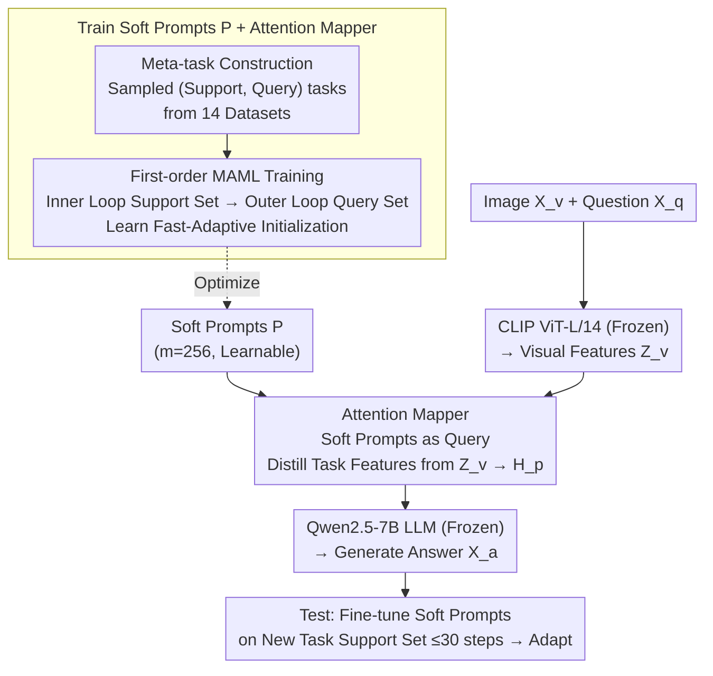

# Meta-Adaptive Prompt Distillation for Few-Shot Visual Question Answering

**Conference**: ICLR 2026  
**arXiv**: [2506.06905](https://arxiv.org/abs/2506.06905)  
**Code**: None  
**Area**: Multimodal Learning / Few-Shot Learning  
**Keywords**: Meta-Learning, Prompt Distillation, Few-Shot VQA, LMM, MAML

## TL;DR

Ours proposes MAPD (Meta-Adaptive Prompt Distillation), a prompt distillation method based on MAML meta-learning. It distills soft prompts from task-related image features through an attention mapper, enabling LMMs to adapt to new VQA tasks with only a few gradient steps at test time, surpassing ICL performance by 21.2%.

## Background & Motivation

Large Multimodal Models (LMMs) typically rely on In-Context Learning (ICL) for few-shot tasks, but critical issues remain:

**Limitations of Prior Work**: 
- **Unstable ICL performance in small models**: Models with $<7$B parameters often show stagnant or even declining performance as the number of context examples increases, especially in VQA tasks.
- **Information overload in image embeddings**: Models are overwhelmed by extraneous information in image embeddings unrelated to the downstream task, failing to focus effectively on task-relevant features.
- **Non-monotonicity of ICL**: Performance does not necessarily improve monotonically with the number of shots, contradicting human intuition for few-shot learning.

**Key Insight**: The authors hypothesize that the problem lies in the inability of ICL to effectively extract task-specific information from image embeddings. The solution is to learn a fixed set of soft prompts that distill task-related image features and allow for rapid adaptation via a few gradient updates during testing.

## Method

### Overall Architecture

MAPD inserts a set of learnable soft prompts into the vision-to-language pathway of the LLaVA v1.5 architecture. The CLIP ViT-L/14 vision encoder and Qwen2.5-7B-Instruct language model remain frozen, while only the intermediate attention mapper and soft prompts (approximately 24M parameters) are trained. The forward pass follows: Image $\to$ CLIP encoding $\to$ Attention mapper distills task information into soft prompts $\to$ LLM generates the answer. These soft prompts and the mapper are not randomly initialized; they undergo feature alignment pre-training followed by first-order MAML training on numerous "meta-tasks" to reach an initialization close to the optimal solutions for many tasks. At test time, rapid adaptation is achieved by taking a few gradient steps on the soft prompts using the support set of the new task.

### Key Designs

**1. Attention Mapper: Distilling task information from image features via attention**

The bottleneck of ICL is that the model is overwhelmed by task-irrelevant information in the full image embedding. MAPD replaces the original MLP projection layer of LLaVA v1.5 with an attention mapper: $m=256$ learnable soft prompts $P$ are concatenated with visual features $Z_v$ to form a sequence $C=(P, Z_v)$. This sequence passes through multi-head attention $H_{p+v}=\sigma(QK^T)\cdot V$ (where $Q, K, V$ are derived via projection matrices applied to $C$). Only the first $m$ output embeddings are taken as task-specific image prompts $H_p$ and fed into the LLM. Soft prompts act as "queries" to actively extract task-relevant content, rather than forcing the LLM to passively digest long, raw sequences. The mapper and soft prompts are trained together, totaling only ~24M parameters.

**2. Meta-task Construction: Organizing data to simulate few-shot scenarios**

Simply having a mapper is insufficient; soft prompts must learn to "adapt given a few examples." Thus, instead of standard training, the authors sample meta-tasks $T_j=\{D_{supp}, D_{query}\}$ from a hybrid training set. Each task includes a support set and a query set, replicating the few-shot structure of testing. The data mixture covers 14 datasets and approximately 802K samples, ensuring sufficient diversity to force soft prompts to learn a generalizable initialization across tasks rather than memorizing specific ones.

**3. First-order MAML Training: Learning an initialization for rapid adaptation**

Dual-level optimization is used: the inner loop calculates loss on the support set and updates task-specific parameters $\theta_p'=\theta_p-\alpha\nabla_{\theta_p}L_{supp}$. The outer loop then uses these task-specific parameters to calculate loss on the query set and updates the meta-parameters $\theta_p:=\theta_p-\beta\sum_j\nabla_{\theta'_{p,j}}L_{query}$. To avoid the Hessian-vector product overhead of second-order derivatives, a first-order approximation of MAML is used. Hyperparameters include 5 inner loop steps with $\alpha=0.1$ and an outer loop $\beta=10^{-3}$. The resulting initialization is positioned to be close to the optima of numerous tasks, requiring at most 30 gradient steps to converge on a new task at test time.

### Loss & Training

The objective is to maximize the likelihood of the answer $p_{\theta_p}(X_a \mid X_v, X_q)$. The workflow involves two stages: a pre-training stage on LCS-558K for 4 epochs (learning rate 2e-3) for feature alignment, and a fine-tuning stage for 1 epoch using the MAML dual-level optimization. During testing, the soft prompts are fine-tuned for at most $K=30$ gradient steps on the support set of the new task.

## Key Experimental Results

### Main Results

Performance on VL-ICL Bench (FT adaptation mode, Accuracy %):

| Dataset | Method | 1-S | 2-S | 4-S | 5/8-S | Average |
|--------|------|-----|-----|-----|-------|------|
| Open-MI (2-way) | NoMeta-task | 21.5 | 67.5 | 89.0 | 94.0 | 68.0 |
| | **Ours (MAPD)** | **43.5** | **78.0** | **94.5** | **95.5** | **77.9** |
| Operator Induction | Multi-TaskPD | 31.0 | 28.3 | 61.0 | 60.0 | 45.1 |
| | **Ours (MAPD)** | **32.0** | **38.3** | **58.3** | **62.0** | **47.7** |
| CLEVR Count | Multi-TaskPD | 25.0 | 25.5 | 31.0 | 38.0 | 29.9 |
| | **Ours (MAPD)** | **26.5** | **27.5** | **31.0** | **40.5** | **31.4** |
| TextOCR | Multi-TaskPD | 21.0 | 20.5 | 24.5 | 25.5 | 22.9 |
| | **Ours (MAPD)** | **23.5** | **26.5** | **27.0** | **28.5** | **26.4** |

### Comparison with ICL

| Adaptation Mode | Avg. Gain | Description |
|---------|---------|------|
| FT vs ICL | +21.2% | Fine-tuning adaptation consistently outperforms ICL adaptation |
| MAPD vs Multi-TaskPD (FT) | +3.5% (TextOCR) | Meta-learning further improves cross-task generalization |
| MAPD vs In-ContextPD (ICL) | Significant | Superior performance across all datasets |

### Ablation Study

| Configuration | Key Metric | Description |
|------|---------|------|
| Number of Soft Prompts | Performance increases for MAPD | Decreases for In-ContextPD as prompts increase |
| Image Perturbation Robustness | MAPD drops by 1.3% | Other methods drop by 2.3-7.0% |
| Similar Sample Selection | All methods benefit | FT adaptation is more robust than ICL |

### Key Findings

1. **MAPD is the only method showing strict monotonic improvement**: Performance consistently increases with the number of shots.
2. **Meta-learning advantages are most significant at 2-shot**: Surpassing Multi-TaskPD by 10% on Operator Induction.
3. **Efficiency**: With only 24M trained parameters, the 7B model outperforms the 72B LLaVA-OneVision in ICL on Open-MI.
4. **Robustness**: Maintains near-original performance under heavy perturbations like CutMix/MixUp.

## Highlights & Insights

- **Core Insight of Prompt Distillation**: Instead of letting the LMM extract info directly from long image sequences (ICL), it is better to learn refined soft prompts to "distill" task-relevant visual information.
- **Synergy of Meta-learning + Prompt Tuning**: The MAML-learned initialization allows adaptation to entirely new tasks in only 30 gradient steps, preventing overfitting.
- **Parameter Efficiency**: 24M trainable parameters is far less than full model fine-tuning yet yields better results.
- **Three-layer decomposition of Operator Induction** (Task Induction + Perception + Math Reasoning) provides a fine-grained view of model capabilities.

## Limitations & Future Work

1. **Single-image VQA only**: Not yet extended to multi-image scenarios.
2. **Inference-time computational overhead**: FT adaptation requires ~5x more computation than ICL due to 30 gradient steps.
3. **Limited task complexity**: Benchmarks involve relatively simple tasks (2-way classification, basic math); effectiveness on complex reasoning is unknown.
4. **Frozen LLM**: Fine-tuning the LLM itself might yield better performance but at a higher cost.
5. Future work could explore different attention mapper architectures (e.g., cross-attention, variable resolution).

## Related Work & Insights

- **MAML in VLMs**: Follows the direction of Qin et al. (2023) and Najdenkoska et al. (2023), but first to validate meta-adaptive prompt distillation in large LMMs (7B).
- **Comparison with Flamingo and MMICL**: Demonstrates that parameter-efficient fine-tuning adaptation can surpass pure ICL methods.
- **Insight**: For small models ($<10$B), fine-tuning-based adaptation may be more reliable than ICL; future LMM designs should consider built-in efficient adaptation mechanisms.

## Rating

- Novelty: ⭐⭐⭐⭐ (Combination of MAML and prompt distillation is innovative, though individual components are established)
- Experimental Thoroughness: ⭐⭐⭐⭐⭐ (Comprehensive ablation, robustness tests, and decomposition analysis)
- Writing Quality: ⭐⭐⭐⭐ (Clear structure, detailed appendix)
- Value: ⭐⭐⭐⭐ (Provides a practical few-shot adaptation solution for smaller models)

<!-- RELATED:START -->

## Related Papers

- [\[ICLR 2026\] Prompt-Robust Vision-Language Models via Meta-Finetuning](prompt-robust_vision-language_models_via_meta-finetuning.md)
- [\[ICLR 2026\] Human Uncertainty-Aware Data Selection and Automatic Labeling in Visual Question Answering](human_uncertainty-aware_data_selection_and_automatic_labeling_in_visual_question.md)
- [\[AAAI 2026\] MacVQA: Adaptive Memory Allocation and Global Noise Filtering for Continual Visual Question Answering](../../AAAI2026/multimodal_vlm/macvqa_adaptive_memory_allocation_and_global_noise_filtering_for_continual_visua.md)
- [\[ICLR 2026\] Knowledge Exchange with Confidence: Cost-Effective LLM Integration for Reliable and Efficient Visual Question Answering](knowledge_exchange_with_confidence_cost-effective_llm_integration_for_reliable_a.md)
- [\[ICLR 2026\] Exploring Cross-Modal Flows for Few-Shot Learning](exploring_cross-modal_flows_for_few-shot_learning.md)

<!-- RELATED:END -->
