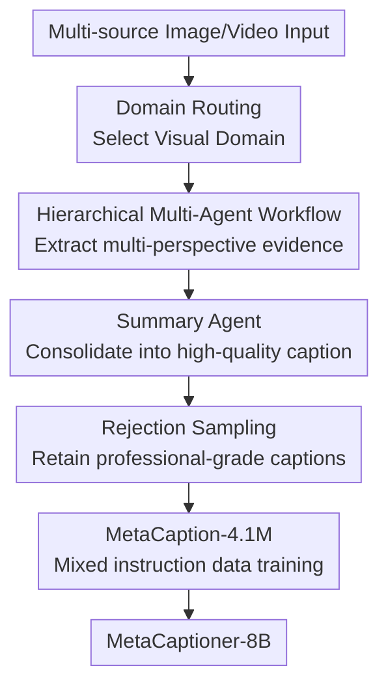

# MetaCaptioner: Towards Generalist Visual Captioning with Open-source Suites

**Conference**: ICLR2026  
**OpenReview**: [https://openreview.net/forum?id=fPXO6Jc8Xj](https://openreview.net/forum?id=fPXO6Jc8Xj)  
**Code**: https://github.com/OpenGVLab/MetaCaptioner  
**Area**: Multimodal VLM  
**Keywords**: Generalist visual captioning, multi-agent annotation, caption data synthesis, multimodal LLM, open-source VLM  

## TL;DR
MetaCaptioner proposes CapFlow, a multi-agent pipeline using open-source models to generate high-quality long captions across image and video domains. Through rigorous rejection sampling, a 4.1M training dataset was constructed to fine-tune an 8B multimodal model into a generalist visual captioner that approaches the description quality of commercial models while maintaining strong downstream capabilities.

## Background & Motivation
**Background**: Visual captioning originally served natural image description, typically outputting "what objects are in the image, where they are, and what is happening." However, in current MLLM training and data synthesis scenarios, captions have evolved into high-value supervision signals. They must now cover complex visual domains such as charts, documents, medical images, code screenshots, UIs, educational diagrams, and videos, integrating OCR, structural relationships, professional knowledge, and temporal events into a single learnable text segment.

**Limitations of Prior Work**: High-quality generalist captions currently rely heavily on commercial models like GPT-4o. While effective, the high cost of large-scale annotation makes it difficult to support tens of millions of training samples. Open-source MLLMs are affordable but often miss details, misread structures, or lack logical rigor in complex domains—especially when handling charts, math problems, long documents, or video events where "perceived visual elements" must be integrated with "reasoned logic."

**Key Challenge**: Generalist visual captioning is not a single capability but a combination of many: natural scenes require fine-grained perception, documents require OCR, charts require structural parsing, medical images require domain knowledge, and videos require temporal understanding. Compressing these into a single generation from an open-source model often leads to domain mismatch. Conversely, relying entirely on commercial models is restricted by cost and closed-source APIs.

**Goal**: The authors aim to address two issues. First, can a generalist captioning pipeline with quality close to GPT-4 be constructed using only open-source models? Second, can this pipeline serve as a data engine to synthesize sufficient high-quality data to train a low-cost, deployable, and open-source generalist captioner?

**Key Insight**: Different visual domains require different "expert perspectives." Rather than forcing one model to perform all tasks simultaneously, the input domain should first be identified. Then, a group of agents with specific responsibilities can extract visual details, text, structures, and reasoning clues, which are finally consolidated by a summarizer. This approach leverages the local capabilities of open-source LLMs while bypassing the failure of single models in "one-step" complex generation.

**Core Idea**: Use domain routing + hierarchical multi-agent collaboration to decompose generalist visual description into composable expert sub-tasks. Then, use rejection sampling to filter low-quality captions and distill the synthesized CapFlow data into MetaCaptioner-8B.

## Method

### Overall Architecture
The MetaCaptioner methodology follows two paths: first, building CapFlow as an "open-source caption data engine," and second, using it to synthesize and filter MetaCaption-4.1M to train MetaCaptioner-8B. CapFlow processes input images or videos by first using a domain router to determine the visual domain and select the corresponding workflow. Within the workflow, multiple functional agents handle perception, OCR, expert reasoning, or tool parsing. A summary agent then integrates all evidence into the final caption. During training, these captions are mixed with conventional instruction data to train a multimodal model based on InternViT-600M and Qwen3-8B-Instruct, following the InternVL3.5 recipe.

In this framework, CapFlow is not a single-model captioner but a replaceable and extensible annotation pipeline. MetaCaptioner compresses the output of this pipeline into an 8B model, reducing inference costs from multi-agent calls to a single model call.

### Key Designs

**1. Domain Routing: Determining the "Reading Strategy"**

Generalist captioning often fails when models treat non-natural images like natural images. For example, mathematical diagrams require structural relationship explanations, while UI screenshots require descriptions of interactive components. CapFlow implements domain routing as the first step: an MLLM selects the most appropriate category from 9 domains: Natural, Structure & Math, Infographic & Document, Medical & Bio-Imaging, UI & Interaction, Code & Programming, Knowledge & Education, Synthetic & Aesthetic, and Video & Temporal.

This routing uses explicit boundary and confusion rules in the prompt (e.g., "IDE screenshots belong to Code, not UI"). A 3-point confidence mechanism is included to handle mixed domains or low-quality inputs. This transforms the caption task from a "one-size-fits-all" prompt into an expert process call based on primary visual attributes.

**2. Hierarchical Multi-Agent Workflow: Evidence Synthesis**

After routing, each domain enters a customized workflow consisting of a task-solving layer and an information summarization layer. Approximately 30 functional agents are categorized into guideline, perception, reasoning, and tools. The guideline agent provides a global summary; the perception agent handles fine-grained appearance (color, texture, layout); the reasoning agent handles logic and professional knowledge; and the tool agent handles OCR or code parsing.

This decomposition ensures that each agent has a narrow responsibility, allowing open-source MLLMs to provide stable local capabilities. For document/infographic domains, the workflow includes infographic perception, OCR, general reasoning, and visual guidelines. A summary agent reads these intermediate results to generate a structured description.

**3. Rejection Sampling: Data Synthesis as Quality Gatekeeping**

To ensure training data quality, the authors apply strict rejection sampling to the generated captions. For images, dimensions include factual accuracy, information completeness, reasoning rigor, core intent capture, and professionalism. For videos, these are replaced with temporal and factual accuracy, event and detail coverage, and temporal causal logic. Each dimension is scored on a 1-to-3 scale, keeping only samples where all sub-dimensions are professional-grade. This step filtered MetaCaption-5M down to 4.1M.

**4. Data Distillation to MetaCaptioner: Pipeline Compression**

CapFlow-72B achieves near-commercial quality but is too expensive for online deployment. MetaCaptioner distills this capability into an 8B model. Authors filtered 70 million raw samples from 140+ datasets down to 5 million high-quality candidates based on resolution and semantic richness, then annotated them via CapFlow to obtain MetaCaption-4.1M.

MetaCaptioner-8B uses InternViT-600M as the vision encoder and Qwen3-8B-Instruct as the LLM. The pre-training stage uses a batch size of 256 and a learning rate of $1e{-5}$. The SFT stage mixes MetaCaption-4.1M with regular instruction data for 160k iterations at a learning rate of $2e{-5}$. This reduces inference costs to approximately $0.7\%$ of GPT-4o.

### Overall Mechanism Example
For an infographic with heavy text and bubble-size encoding, the domain router identifies it as Infographic & Document. The workflow invokes an infographic perception agent for layout and groupings, an OCR agent for text and values, and a reasoning agent for the relationship between bubble sizes and sales metrics. The summary agent merges these into a cohesive caption that summarizes the theme, categorizes the data groups (e.g., illegal vs. prescription drugs), and explains how the layout communicates economic scale.

### Loss & Training
The training target remains the standard auto-regressive language modeling objective used in multimodal instruction tuning. The innovation lies in the data strategy: synthesizing fine-grained captions, filtering via quality gates, and mixing with general instruction data to prevent the loss of VQA, grounding, and reasoning capabilities while learning long-form description.

## Key Experimental Results

### Main Results

| Setting | Method | Representative Metric | Result | Note |
|------|------|----------|------|------|
| Caption Quality Score | GPT-4o | Average Score | 2.35 | GPT-4o judge, 250 complex samples |
| Caption Quality Score | CapFlow | Average Score | 2.33 | Close to GPT-4o; professionalism 2.80 |
| Caption Quality Score | Qwen2.5-VL-7B | Average Score | 1.97 | Significant gap for open-source baseline |
| Caption Quality Score | MetaCaptioner | Average Score | 2.04 | Low cost, higher quality than open-source baselines |
| Visual reasoning with LLM | MetaCaptioner-8B + DS-Qwen-7B | AVG | 49.4 | Higher than OmniCaptioner-7B (42.5) |
| Direct MLLM evaluation | MetaCaptioner-8B | MMB AVG | 71.1 | Higher than Qwen2.5-VL-7B (67.1) |

MetaCaptioner-8B paired with DS-Qwen-32B achieved 65.1 on MathVista and 66.8 on MMMU, indicating that stronger LLMs benefit significantly from its structured captions.

### Ablation Study

| Configuration | MMMU | MMVet | MathVerse | MathVista | AI2D | Video-MME | Cost/100 samples | Note |
|------|------|-------|-----------|-----------|------|-----------|------------------|------|
| GPT-4o | 55.7 | 61.7 | 56.8 | 65.0 | 75.5 | 26.8 | \$1.47 | Commercial baseline |
| Baseline Qwen2.5-VL-7B | 50.7 | 47.2 | 42.1 | 57.6 | 64.5 | 23.9 | \$0.01 | Single-model direct caption |
| + Hierarchical Workflow | 51.6 | 48.6 | 44.0 | 59.0 | 66.0 | 26.1 | \$0.02 | Broad stability gains |
| + Domain Routing | 54.7 | 50.5 | 43.9 | 58.7 | 67.4 | 26.2 | \$0.02 | Significant cross-domain boost |
| + Scale up to 72B | 55.1 | 57.8 | 53.1 | 62.5 | 74.2 | 27.6 | \$0.14 | Near GPT-4o quality; 9.5% cost |

### Key Findings
- **Domain routing is the critical switch**: Without it, performance on non-natural images (docs, math, UI) struggles under fixed prompts.
- **Workflow and model scale are complementary**: The 72B functional agents push quality to the GPT-4 level.
- **MetaCaptioner enables structured reasoning**: The output provides better text prompts for pure LLMs to solve visual VQA tasks.
- **Rejection sampling is the quality moat**: Human evaluation confirms that the filtered captions match or exceed commercial model preferences.

## Highlights & Insights
- System orchestration compensates for capacity gaps in individual open-source models.
- Captioning is treated as a data infrastructure for MLLM training rather than an isolated task.
- The domain router architecture is highly transferable to other data synthesis tasks (e.g., OCR benchmarks, video event labeling).
- The cost-efficiency path—using a high-quality pipeline to generate data for a low-cost model—is a practical blueprint for large-scale data engineering.

## Limitations & Future Work
- **High CapFlow overhead**: Synthetic annotation consumed 480 H200 GPU days.
- **Dependency on model judges**: Rejection sampling relies on Qwen2.5-VL-7B, which may inherit scoring biases.
- **Router robustness**: Accuracy is ~84.8% on mixed-domain samples, with UI and Synthetic domains still prone to confusion.
- **Multi-label routing**: Future work could explore cascaded workflows for hybrid images (e.g., a document containing a chart).

## Related Work & Insights
- Compared to **GPT-4o synthesis**, this approach is more controllable and cheaper (10.5% cost for CapFlow).
- Compared to **OmniCaptioner**, MetaCaptioner offers more rigorous structural parsing through specialized agent roles.
- The work suggests that at a stage where model architectures are converging, the quality and domain coverage of descriptive data may be the primary lever for enhancing generalist VLM capabilities.

## Rating
- **Novelty**: ⭐⭐⭐⭐☆ Combines domain routing and multi-agent workflows into a systematic engine.
- **Experimental Thoroughness**: ⭐⭐⭐⭐⭐ Includes caption scoring, LLM reasoning, direct VLM evaluation, and human studies.
- **Writing Quality**: ⭐⭐⭐⭐☆ Clear logic and rich visualization.
- **Value**: ⭐⭐⭐⭐⭐ Highly useful for open-source VLM data synthesis and building cost-effective captioners.

<!-- RELATED:START -->

## Related Papers

- [\[CVPR 2026\] The LLM Bottleneck: Why Open-Source Vision LLMs Struggle with Hierarchical Visual Recognition](../../CVPR2026/multimodal_vlm/the_llm_bottleneck_why_open-source_vision_llms_struggle_with_hierarchical_visual.md)
- [\[CVPR 2026\] Enhancing Part-Level Point Grounding for Any Open-Source MLLMs](../../CVPR2026/multimodal_vlm/enhancing_part-level_point_grounding_for_any_open-source_mllms.md)
- [\[ICML 2026\] VLA-Arena: An Open-Source Framework for Evaluating Vision-Language-Action Models](../../ICML2026/multimodal_vlm/vla-arena_an_open-source_framework_for_benchmarking_vision-language-action_model.md)
- [\[ICLR 2026\] Decoding Open-Ended Information Seeking Goals from Eye Movements in Reading](decoding_open-ended_information_seeking_goals_from_eye_movements_in_reading.md)
- [\[CVPR 2025\] RLAIF-V: Open-Source AI Feedback Leads to Super GPT-4V Trustworthiness](../../CVPR2025/multimodal_vlm/rlaif-v_open-source_ai_feedback_leads_to_super_gpt-4v_trustworthiness.md)

<!-- RELATED:END -->
