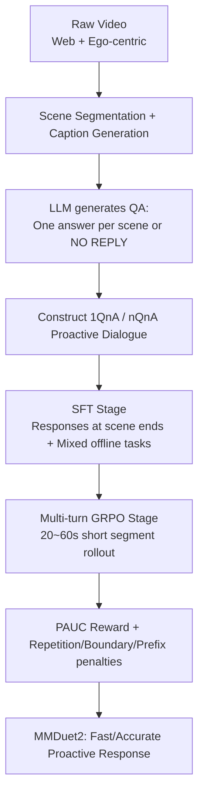

# MMDuet2: Enhancing Proactive Interaction of Video MLLMs with Multi-Turn Reinforcement Learning

**Conference**: ICLR 2026  
**OpenReview**: [https://openreview.net/forum?id=rxQnMSNCUs](https://openreview.net/forum?id=rxQnMSNCUs)  
**Code**: To be confirmed  
**Area**: Multimodal Video MLLM / Streaming Proactive Interaction  
**Keywords**: Proactive Interaction, Video MLLM, Streaming Video, Multi-turn RL, GRPO, PAUC Reward  

## TL;DR
MMDuet2 reframes the decision of "when to speak" in streaming video as a pure text multi-turn dialogue. In each user turn, 1–2 frames are provided, and the assistant autonomously decides whether to output a response or "NO REPLY." By utilizing a multi-turn GRPO strategy with a PAUC-centered reward that eliminates the need for precise response timestamp annotations, the model enables a 3B Video MLLM to provide fast and accurate proactive responses on ProactiveVideoQA.

## Background & Motivation
**Background**: Video Multimodal Large Language Models (Video MLLMs) can effectively understand videos and engage in multimodal dialogues. However, most systems are turn-based—responding only after the user finishes speaking. "Proactive interaction" requires the model to independently determine **when to speak and what to say** while the video is playing, which is essential for real-time scenarios like live analysis, smart surveillance, and first-person assistants.

**Limitations of Prior Work**: Existing proactive interaction methods, such as VideoLLM-Online, MMDuet, and Dispider, generally rely on predicting a "response probability score" (via extra modules, special token probabilities, or visual token drop rates) and comparing it against a **manually set threshold**. This introduces two major issues:
- **Threshold Sensitivity**: Poorly tuned thresholds cause the model to either never respond or output repetitive content incessantly.
- **Difficulty in Response Timing Annotation**: Supervised Fine-Tuning (SFT) requires precise timestamps for every response. However, scene segmentation is often too coarse to align a response exactly with the frame where a specific event occurs, causing the model to respond with a "half-beat delay."

**Key Challenge**: The ideal experience for proactive interaction is to respond "both correctly and as early as possible." However, **precise ground-truth response moments are nearly impossible to annotate automatically** (e.g., a scene-level caption notes "cooking fish," but cannot pinpoint the exact frame where fish sauce is added).

**Goal**: To train a proactive Video MLLM that is timely, accurate, and concise without requiring precise response timing annotations.

**Key Insight**: **[Textualization]** Decision-making regarding response timing is embedded into a standard chat template—user turns provide small frame batches, and assistant turns autonomously output text or "NO REPLY," ensuring compatibility with existing training/inference frameworks. **[RL Bypassing Timestamp Labels]** A relative reward inspired by the PAUC metric is used to determine "which of two responses is better." This allows multi-turn GRPO to let the model explore the "earliest possible correct response moment" after observing an event, removing the need for precise timing labels.

## Method

### Overall Architecture
MMDuet2 uses Qwen2.5-VL 3B as the base model and is trained in two stages: first, **SFT** using a self-constructed 52k proactive video dialogue dataset, followed by **multi-turn GRPO** to strengthen response timing and quality. Supported by a 2-second sampling interval, each user turn inputs 1–2 frames. The assistant makes a binary decision ("Reply" or "NO REPLY") in every turn, formatting the interaction into a standard multi-turn dialogue.

### Key Designs

**1. Textualized Chat Template Defining Response Opportunities**: Unlike prior works that modify architectures to predict probability scores, MMDuet2 designs a proactive chat template. The system message specifies: "Answer based on incoming video frames; if the segment is unanswerable, output NO REPLY." Subsequently, user turns input 1–2 frames (optionally with text), and assistant turns generate either response text or "NO REPLY." The video timestamp for each turn is derived from the frame count. This design ensures **natural compatibility with mainstream post-training and inference frameworks** without structural modifications. Specialized system messages also distinguish "proactive tasks" from "offline tasks," mitigating catastrophic forgetting of offline capabilities.

**2. PAUC-Inspired Multi-turn RL Reward Bypassing Timing Labels**: This is the core contribution. The authors observed that while precise moments are hard to label, it is easy to judge "which response is better": higher scores for the same time are better, and earlier responses for the same score gain are better. Thus, the reward leverages the Proactive Area Under Curve (PAUC) metric. Within a ground-truth response interval $(t_{start}, t_{end})$, multiple responses $\tau_p$ might occur, each assigned a correctness score $s_p \in [0, S]$ by an LLM evaluater. The PAUC is the ratio of the area under the score-time curve to the maximum possible area:

$$\text{PAUC} = \frac{(\tau_1 - t_{start})\times 0.5 + \sum_{p=1}^{P-1}(\tau_{p+1}-\tau_p)\times s_p + (t_{end}-\tau_P)\times s_P}{(t_{end}-t_{start})\times S}$$

An initial score of 0.5 is added at the start to ensure a poor response ($s=0$) is penalized more than silence. This area reflects preferences for both "higher accuracy" and "earlier response."

**3. Behavioral Penalty Rewards to Suppress Redundancy**: To prevent reward hacking (flooding responses to maximize area), three penalties are added (based on the ratio of violating responses): **Deduplication Reward $r_{rep}$** (penalizing redundant information), **Boundary Reward $r_{in\_span}$** (penalizing responses outside ground-truth intervals), and **Prefix Reward $r_{pfx}$** (penalizing lengthy responses that repeat previous turns). The total reward is a weighted sum:

$$r = \omega_{PAUC}\, r_{PAUC} + \omega_{rep}\, r_{rep} + \omega_{in\_span}\, r_{in\_span} + \omega_{pfx}\, r_{pfx}$$

The search for hyperparameters resulted in $\omega_{PAUC}=3,\ \omega_{rep}=2,\ \omega_{in\_span}=0.5,\ \omega_{pfx}=2$.

**4. Short Segment Rollouts for Temporal Credit Assignment**: To handle sparse rewards in long videos, the model uses short 20–60 second segments for rollouts. Previous dialogue history is fed as context. Training used GRPO (rollout size 4) on 8 H800 GPUs for approximately 20 hours using the SGLang + verl framework.

## Key Experimental Results

### Main Results (ProactiveVideoQA: PAUC↑ / Repetition Rate↓)

| Model | [WEB] | [EGO] | [TV] | [VAD] |
|---|---|---|---|---|
| VideoLLM-Online† | 25.9 / - | 25.0 / - | 18.3 / 53.9 | 25.0 / - |
| MMDuet | 38.9 / 81.3 | 46.0 / 99.4 | 21.1 / 92.8 | 27.4 / 99.2 |
| MMDuet2 sft (Ours) | 37.6 / 1.7 | 26.4 / 4.4 | 27.6 / 2.2 | 26.3 / 0.0 |
| **MMDuet2 rl (Ours)** | **53.3 / 4.2** | **33.6 / 8.1** | **43.4 / 1.0** | **28.9 / 15.2** |

The RL version significantly outperforms others in PAUC, while the repetition rate drops from MMDuet's 80–99% to single digits. On the StreamingBench proactive task, MMDuet2 RL achieved an accuracy of 34.69, higher than MMDuet (29.44) and Dispider (25.34).

### Ablation Study (Removing Single Rewards: PAUC↑ / Rep / Response Count)

| Configuration | [WEB] | [EGO] |
|---|---|---|
| MMDuet2 Full | 53.3 / 4.2 / 3.3 | 33.6 / 8.1 / 3.5 |
| − $r_{rep}$ | 55.5 / **17.3** / 4.9 | 35.6 / **31.9** / 8.0 |
| − $r_{pfx}$ | 53.0 / 4.3 / 3.1 | 27.5 / 2.3 / 0.6 |
| − $r_{in\_span}$ | 62.7 / 9.6 / 8.4 | **FAIL** |

Removing $r_{rep}$ causes a spike in repetition; removing $r_{in\_span}$ results in a failure on [EGO], where the model responds at almost every turn.

### Key Findings
- **Preserved Offline Capabilities**: On MVBench (66.4 vs 65.6), MMDuet2 remains comparable to Qwen2.5-VL 3B, proving that system message isolation and data mixing mitigate forgetting.
- **Acceptable Inference Speed**: Despite checking every turn, the lower frequency of meaningful responses results in a wall time (2m52s) comparable to MMDuet (2m27s) for [WEB].
- **VAD Difficulty**: Performance in surveillance video ([VAD]) remains low for all models, indicating a remaining challenge in streaming monitoring understanding.

## Highlights & Insights
- **Paradigm Shift**: Converting "timing decisions" from architectural modifications to simple binary outcomes in a text dialogue lowers the engineering barrier for deployment.
- **Bypassing Absolute Labels with Relative Preference**: Since exact timestamps are hard to label, the PAUC reward mathematicalizes the insight that "earlier correct responses are better," providing a strong example of using RL for unsupervised timing objectives.
- **Targeted Penalty Design**: The inclusion of specific penalties for repetition, boundaries, and prefixes directly addresses the primary failure modes of proactive interaction.

## Limitations & Future Work
- **Model Scale**: Experiments were limited to 3B parameters; the scalability of RL gains on larger models remains unverified.
- **LLM-as-a-Judge Dependency**: Correctness and repetition scores depend on an external LLM, introducing potential bias and costs.
- **Generation Overhead**: Even for "NO REPLY," the model must perform a generation step at every decision point, which could be costly for long-duration or high-fps videos.
- **Weak Domain Performance**: Proactive interaction for anomaly detection (surveillance) still requires improvement.

## Related Work & Insights
- **Proactive Video Interaction**: Following VideoLLM-Online and MMDuet, MMDuet2 addresses timing inaccuracies and redundancy. MMDuet2 takes the PAUC metric from ProactiveVideoQA and converts it into a training reward.
- **RL for Video MLLMs**: While Video-R1 and others have applied GRPO to video understanding, they focus on offline tasks. MMDuet2 fills the gap in real-time/multi-turn proactive interaction.
- **Insight**: When an objective (like the "earliest correct response moment") is difficult to supervise directly, utilizing a relative preference signal via RL combined with "anti-degeneration" penalties is a robust recipe for generative interaction tasks.

## Rating
- **Novelty**: ⭐⭐⭐⭐ — Textualized proactive templates + PAUC multi-turn RL reward is an innovative solution to timing labels.
- **Experimental Thoroughness**: ⭐⭐⭐ — Covers proactive benchmarks, offline maintenance, and ablations, though limited to a 3B base model.
- **Writing Quality**: ⭐⭐⭐⭐ — Logical progression from motivation to reward design; clear visualizations of the chat template and PAUC.
- **Value**: ⭐⭐⭐⭐ — Provides a clear, engineering-friendly path for training and deploying real-time proactive video assistants.

<!-- RELATED:START -->

## Related Papers

- [\[ICLR 2026\] Enhancing Geometric Perception in VLMs via Translator-Guided Reinforcement Learning](enhancing_geometric_perception_in_vlms_via_translator-guided_reinforcement_learn.md)
- [\[CVPR 2026\] TempR1: Improving Temporal Understanding of MLLMs via Temporal-Aware Multi-Task Reinforcement Learning](../../CVPR2026/multimodal_vlm/tempr1_improving_temporal_understanding_of_mllms_via_temporal-aware_multi-task_r.md)
- [\[CVPR 2026\] MuCo: Multi-turn Contrastive Learning for Multimodal Embedding Model](../../CVPR2026/multimodal_vlm/muco_multi-turn_contrastive_learning_for_multimodal_embedding_model.md)
- [\[ICLR 2026\] GuirlVG: Incentivize GUI Visual Grounding via Empirical Exploration on Reinforcement Learning](guirlvg_incentivize_gui_visual_grounding_via_empirical_exploration_on_reinforcem.md)
- [\[ICLR 2026\] Breaking the SFT Plateau: Multimodal Structured Reinforcement Learning for Chart-to-Code Generation](breaking_the_sft_plateau_multimodal_structured_reinforcement_learning_for_chart-.md)

<!-- RELATED:END -->
