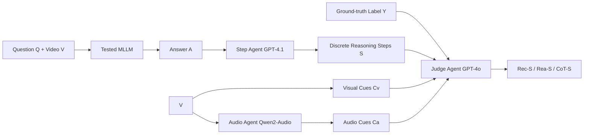

# MME-Emotion: A Holistic Evaluation Benchmark for Emotional Intelligence in Multimodal Large Language Models

**Conference**: ICLR 2026  
**OpenReview**: [https://openreview.net/forum?id=oSX9aenbea](https://openreview.net/forum?id=oSX9aenbea)  
**Code**: [https://mme-emotion.github.io/](https://mme-emotion.github.io/)  
**Area**: Multimodal Large Models / Affective Computing / Evaluation Benchmark  
**Keywords**: Emotional Intelligence, MLLM, Evaluation Benchmark, Multi-agent Evaluation, MLLM-as-judge, Emotional Reasoning  

## TL;DR
MME-Emotion constructs the largest emotional intelligence benchmark for multimodal large language models to date—comprising 6,500 video segments, 8 emotion tasks, and 27 scenarios—and provides a label-free multi-agent evaluation suite (unifying recognition, reasoning, and CoT scores). After evaluating 20 frontier MLLMs, it was discovered that current emotional intelligence is far from satisfactory, with the strongest model, Gemini-2.5-Pro, achieving a recognition score of only 39.3%.

## Background & Motivation
**Background**: Affective computing is shifting from simple "emotion recognition" to "understanding the triggers behind emotions." MLLMs make this transition possible—general models (Gemini, GPT series) exhibit emotional intelligence as a byproduct of large-scale pre-training, while small-parameter expert models (R1-Omni, AffectGPT, etc.) gain capabilities through affective domain post-training.

**Limitations of Prior Work**: Existing emotional benchmarks suffer from two structural defects: **(a) Insufficient scenario coverage** (most contain only 1-3 tasks, single modalities, and were collected before the LLM era); **(b) Inconsistent evaluation protocols** that **only evaluate recognition and ignore reasoning**. This leads to a fundamental problem: it remains unclear how much emotional intelligence current MLLMs truly possess in an open and fair setting.

**Key Challenge**: Evaluation of emotional reasoning is inherently difficult—it requires judging whether the model correctly identifies emotional cues step-by-step. However, the cost of human annotation for each reasoning step is extremely high, and existing benchmarks lack a reasoning quality dimension entirely.

**Goal**: Build a comprehensive emotional intelligence benchmark that simultaneously covers recognition accuracy and reasoning quality, uses a unified protocol across tasks, and is scalable.

**Core Idea**: **[Label-free Multi-agent Evaluation]** Utilizing an MLLM-as-judge + divide-and-conquer multi-agent framework to automate the "video → recognition + step-by-step reasoning score" process without ground-truth reasoning annotations. This was cross-validated by five human experts to demonstrate consistency with human judgment.

## Method

### Overall Architecture
MME-Emotion consists of two parts: **Benchmark data** (6,500 video clips + QA pairs aggregated and resampled from public datasets, covering 8 tasks and 27 scenarios, all taken from test sets to prevent data leakage) and an **Evaluation suite** (a multi-agent system that automatically assigns three unified scores to any MLLM response). The evaluation workflow is as follows: first, the MLLM under test generates an answer; then, a "Step Agent" partitions the answer into discrete reasoning steps; finally, a "Judge Agent" scores each step based on visual cues, audio cues, and ground-truth labels.

### Key Designs
**1. Benchmark Construction with 8 Tasks and 27 Scenarios: Compressing "Open Affective Tasks" into Closed-set QA to Prevent Cheating.** The authors aggregated and resampled from over ten public affective datasets. Each video was sliced into segments based on timestamps and emotional consistency, then converted to QA format using prompt templates. Two key considerations were: first, since current MLLMs struggle with open-ended affective generation, authors included all candidate emotion labels in the prompt as a pre-defined set, forcing models to predict within a closed set to make recognition scores quantifiable; second, all samples were drawn strictly from test sets to prevent leakage from training data. The final benchmark covers ER-Lab, ER-Wild, Noise-ER, FG-ER, ML-ER, SA, FG-SA, and IR tasks, with at least 500 QA pairs per task, an average video duration > 3.3 seconds, and a balanced distribution of questions and durations.

**2. Divide-and-Conquer Multi-agent Judge: Bypassing the Engineering Reality of "Single Models Cannot Consume All Modalities."** An ideal judge should access visual, audio, and text cues simultaneously to minimize misjudgment, but mainstream multimodal models (like GPT-4o) cannot currently process all modalities at once. The solution is divide-and-conquer: visual cues are extracted by feeding video frames $C_v=\text{Convert}(V)$ directly to the judge; audio cues are extracted by a dedicated Audio-LLM $C_a=\text{Audio-LLM}(P_a,V)$ (using Qwen2-Audio). Once both cues are available, they are sent to the judge along with the tested model's reasoning steps $S$ and ground-truth label $Y$: $\text{Rec-S},\text{Rea-S}=\text{Judge-MLLM}(P_j,C_v,C_a,Y,S)$ (using GPT-4o). This preserves multimodal integrity while bypassing individual model capability bottlenecks.

**3. Three Unified Metrics: Decoupling "Answering Correctness" from "Reasoning Correctness."** During step extraction, the task prediction is fixed as the final step, with prior steps treated as the reasoning process. **Rec-S (Recognition Score)** compares the final step with the ground truth—using standard accuracy for single-label tasks and "correct count / total ground truth" for multi-label tasks. **Rea-S (Reasoning Score)** treats each reasoning step as a binary classification judged by the agent and averages them across steps (to avoid bias from step count differences). **CoT-S (CoT Score)** is a weighted average of both:

$$\text{CoT-S}=\alpha\cdot\text{Rec-S}+(1-\alpha)\cdot\text{Rea-S},\quad \alpha=0.5$$

This single score reflects both recognition accuracy and reasoning quality.

**4. Five-Expert Human Validation: Indorsing Automated Evaluation via Strong Consistency.** To ensure the reliability of MLLM-as-judge, the authors had five experts score 373 reasoning steps from 100 randomly sampled questions. The results showed extremely strong statistical alignment: Spearman's Rank Correlation of 0.9530, Cohen's Kappa of 0.8626 ("almost perfect agreement"), and an Intra-class Correlation Coefficient (ICC) of 0.9704, proving the automated evaluation is highly aligned with human judgment and suitable for large-scale use.

## Key Experimental Results

### Main Results (MME-Emotion Overall Performance, %)

| Model | Type | Size | Rec-S | Rea-S | CoT-S |
|------|------|------|------|------|------|
| Gemini-2.5-Pro | Closed | — | **39.3** | 72.7 | **56.0** |
| Audio-Reasoner | Open | 7B | 38.1 | **71.6** | 54.8 |
| GPT-4o | Closed | — | 27.8 | **79.8** | 53.8 |
| Qwen2.5-VL-72B | Open | 72B | 31.3 | 75.7 | 53.5 |
| QVQ | Open | 72B | 31.4 | 70.1 | 50.8 |
| Gemini-2.0-Flash | Closed | — | 36.3 | 60.0 | 48.1 |
| R1-Omni | Open | 0.5B | 26.3 | 58.6 | 42.4 |
| Emotion-LLaMA | Open | 7B | 25.1 | 0.4 | 12.8 |
| **All Model Average** | — | — | 29.4 | 49.5 | 39.5 |

All recognition scores are below 40%, and most closed-source models have CoT scores below 40%, highlighting the difficulty of the benchmark.

### Ablation Study (Key Observation Contrast)

| Observation Dimension | Phenomenon | Key Insight |
|---------|------|------|
| Omnimodal vs Bi-modal | Audio-Reasoner (audio+text) achieved CoT 54.8%; some omnimodal models performed worse | Multimodal cues may be redundant/conflicting; current fusion strategies are not robust |
| Reasoning Steps vs Performance | Step count is positively correlated with CoT score | Encouraging deeper reasoning enhances emotional intelligence |
| ER-Wild vs ER-Lab | Performance generally dropped in controlled lab settings | Models are mostly trained on "in-the-wild" data and struggle to generalize to controlled environments |
| FG-SA / IR | Even strongest models recognition scores were around 30% | Fine-grained emotion and intent recognition remains a significant challenge |

### Key Findings
- **The current state is not optimistic**: Even the strongest models have recognition scores below 40%, indicating that SOTA MLLM emotional intelligence is still in its early stages.
- **Two feasible paths**: General models exhibit emergent emotional intelligence via generalization, while expert models achieve it through domain-specific post-training; both are valid approaches.
- **Visual perception is the bottleneck**: Failure cases show models like Video-LLaMA2 and Qwen2.5-Omni often misjudge due to an inability to capture subtle facial expression changes.

## Highlights & Insights
- **Label-free Reasoning Evaluation**: Combining multi-agent systems with step partitioning automates the "reasoning quality" dimension—which previously required manual annotation—and backs it with human expert validation.
- **Divide-and-Conquer for Engineering Bottlenecks**: Bypassing the limitation where a "single model cannot consume all modalities" by using an external Audio Agent is a pragmatic and transferable design.
- **Scale and Difficulty**: With 6,500 videos, 8 tasks, and 27 scenarios, and all models scoring <40% in recognition, the benchmark is both large-scale and discriminative, ensuring it will not saturate quickly.
- **Counter-intuitive Finding**: The fact that some omnimodal models are outperformed by bi-modal models reveals real weaknesses in current multimodal emotional fusion.

## Limitations & Future Work
- **Closed-set Compromise**: Forcing predictions into a closed set facilitates quantification but deviates from real-world open-ended emotional understanding.
- **Judge Reliance on Commercial APIs**: The Step Agent (GPT-4.1) and Judge (GPT-4o) are fixed choices; the evaluation cost is high, and judge bias may be introduced. The robustness of replacing these judges has not been fully discussed.
- **Evaluation without Training**: This is a pure evaluation benchmark and does not provide training schemes to specifically improve emotional intelligence; insights like "encouraging deep reasoning" remain at the observational level.
- **Fixed CoT Weights**: The default $\alpha=0.5$ for recognition vs reasoning weights may not be optimal for all applications.

## Related Work & Insights
- **Affective Benchmark Spectrum**: Compared to EmotionBench/EmoBench (text), MOSABench (image), and IEMOCAP/MER-UniBench (video but recognition only), MME-Emotion is the only benchmark evaluating both recognition accuracy and reasoning quality.
- **Expert Model Routes**: Emotion-LLaMA (specific encoder + SFT), R1-Omni (RLVR for emotional reasoning), and AffectGPT (large-scale data + projectors) represent different post-training strategies. This paper proves they can compete with general large models.
- **Insights**: The MLLM-as-judge + multi-agent divide-and-conquer paradigm can be migrated to any evaluation scenario requiring full multimodal context that exceeds single-model capacities. The closed-set + test-set isolation approach is a valuable anti-leakage practice for other benchmarks.

## Rating
- **Novelty**: ⭐⭐⭐⭐ The first video emotional intelligence benchmark covering both recognition and reasoning; the label-free multi-agent evaluation suite is a solid methodological innovation.
- **Experimental Thoroughness**: ⭐⭐⭐⭐⭐ Evaluated 20 MLLMs across 8 tasks and 27 scenarios with five-expert cross-validation; the analysis is detailed and convincing.
- **Writing Quality**: ⭐⭐⭐⭐ Clear structure, rich diagrams, and layered observations; formulas and workflows are well-documented.
- **Value**: ⭐⭐⭐⭐⭐ Exposes the true gap in current MLLM emotional intelligence (<40% recognition), providing a challenging and reusable standard for the affective computing community.

<!-- RELATED:START -->

## Related Papers

- [\[ICLR 2026\] Human-MME: A Holistic Evaluation Benchmark for Human-Centric Multimodal Large Language Models](human-mme_a_holistic_evaluation_benchmark_for_human-centric_multimodal_large_lan.md)
- [\[ICLR 2026\] SpaCE-10: A Comprehensive Benchmark for Multimodal Large Language Models in Compositional Spatial Intelligence](space-10_a_comprehensive_benchmark_for_multimodal_large_language_models_in_compo.md)
- [\[ICLR 2026\] MME-Unify: A Comprehensive Benchmark for Unified Multimodal Understanding and Generation Models](mme-unify_a_comprehensive_benchmark_for_unified_multimodal_understanding_and_gen.md)
- [\[ICLR 2026\] Customizing Visual Emotion Evaluation for MLLMs: An Open-vocabulary, Multifaceted, and Scalable Approach](customizing_visual_emotion_evaluation_for_mllms_an_open-vocabulary_multifaceted_.md)
- [\[ICLR 2026\] MMSI-Bench: A Benchmark for Multi-Image Spatial Intelligence](mmsi-bench_a_benchmark_for_multi-image_spatial_intelligence.md)

<!-- RELATED:END -->
