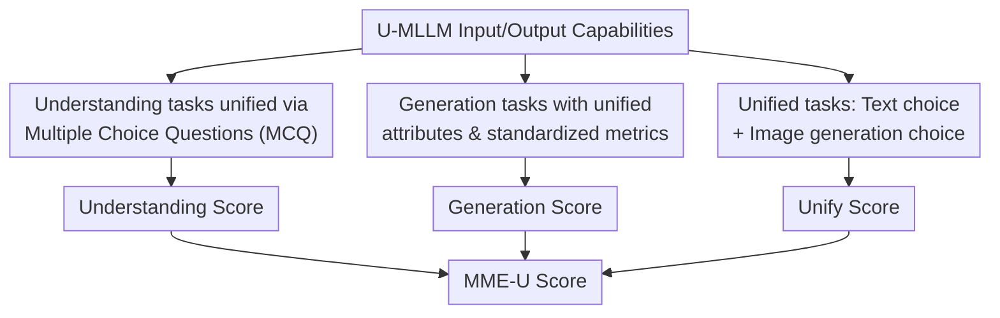

# MME-Unify: A Comprehensive Benchmark for Unified Multimodal Understanding and Generation Models

**Conference**: ICLR 2026  
**OpenReview**: [https://openreview.net/forum?id=7x6TxVIarj](https://openreview.net/forum?id=7x6TxVIarj)  
**Paper**: [MME-Unify Project](https://mme-unify.github.io/)  
**Code**: https://mme-unify.github.io/ (Benchmark project page; data and code are subject to the project page)  
**Area**: Multimodal VLM / Unified Multimodal Evaluation / Multimodal Understanding and Generation  
**Keywords**: Unified Multimodal Models, Multimodal Evaluation, Interleaved Image-Text Generation, Visual Reasoning, Benchmark  

## TL;DR
MME-Unify proposes a comprehensive evaluation benchmark for Unified Multimodal Large Language Models (U-MLLMs), placing understanding, generation, and hybrid tasks that require "understanding-then-generation" within a single reproducible scoring framework. The findings reveal that even the top-performing U-MLLMs achieve an overall score of only approximately 50, with significant weaknesses remaining in complex instruction following and multi-step visual state maintenance.

## Background & Motivation
**Background**: Unified Multimodal Large Language Models (U-MLLMs) aim to integrate the image/video understanding capabilities of traditional MLLMs with the image/video generation capabilities of generative models into a single architecture. Unlike models such as GPT-4V or Qwen2.5-VL that only output text, these models can answer questions, generate and edit images, and even produce interleaved image-text outputs—for instance, analyzing a geometry problem and then drawing auxiliary lines on the figure.

**Limitations of Prior Work**: While these models are developing rapidly, evaluation methods remain fragmented. Understanding capabilities are typically measured using QA benchmarks like MMBench, MME, or Video-MME, while generation capabilities are assessed via metrics from GenEval, VBench, or specific image/video generation benchmarks. Different papers utilize inconsistent tasks, input formats, and metrics. More importantly, the most distinctive feature of U-MLLMs is not isolated "understanding" or "generation," but the synergy between the two: the model must comprehend inputs and instructions before using visual outputs to express reasoning results. Previous works have largely relied on case studies, lacking standardized and comparable unified task evaluations.

**Key Challenge**: The primary selling point of unified models is cross-modal synergy, yet existing benchmarks mostly evaluate these capabilities separately. Focusing solely on understanding scores overlooks whether the model can actually generate visual results; focusing solely on generation quality fails to capture whether the model understood the prompt and constraints. The evaluation system needs to address two issues: unifying traditional understanding/generation tasks into a comparable scale and designing tasks that necessitate genuine "understanding + reasoning + generation."

**Goal**: This work aims to construct an open and reproducible benchmark that covers three categories of capabilities in a unified format: multimodal understanding, multimodal generation, and unified hybrid-modal tasks. It intends to provide not only a general leaderboard but also diagnostic insights into whether a model’s weaknesses lie in understanding, generation, instruction following, multi-step state maintenance, or text-image output consistency.

**Key Insight**: Instead of recreating all data from scratch, the study extracts samples from established datasets and unifies their attributes, question types, and scoring methods. For capabilities not covered by traditional benchmarks, 5 new types of unified tasks were manually designed, requiring models to simultaneously output text choices and visual results. This approach inherits the breadth of existing benchmarks while filling the gap in U-MLLM-specific evaluations.

**Core Idea**: MME-Unify places the understanding, generation, and cross-modal synergy capabilities of U-MLLMs within the same coordinate system using a "unified task format + standardized scores + text/image dual-choice evaluation." This transforms capabilities previously demonstrated through case studies into a quantifiable and reproducible leaderboard.

## Method

### Overall Architecture
The MME-Unify workflow comprises a three-tier evaluation: the first tier assesses the model's ability to understand single images, multiple images, or videos; the second tier evaluates generation capabilities (image/video generation, editing, and reconstruction); and the third tier designs unified tasks requiring both textual reasoning and visual output within the same sample. Finally, the scores from all three tiers are normalized to the same scale and averaged to produce the total MME-U score.

The crux of this framework is the evaluation protocol rather than a new model architecture. Understanding tasks are unified via MCQ output and accuracy; generation tasks retain common sub-domain metrics but normalize them to $[0, 100]$; and unified tasks convert visual generation results into an MCQ-like determination. After a model generates an image, its similarity to several candidate images is calculated, and the most similar candidate is treated as the model’s implicit choice.

### Key Designs
**1. Three-Domain Task Coverage: Decoupling Understanding, Generation, and Synergy**

MME-Unify divides the capability space into three domains. The Understanding domain includes Single-Image Perception and Understanding (SIPU), Multi-Image and Text-Interleaved Understanding (MITIU), and Video Perception and Understanding (VPU). The Generation domain covers Fine-grained Image Reconstruction (FIR), Text-guided Image Editing (TIE), Text-to-Image Generation (TIG), Conditional Image-to-Video Generation (CIVG), Text-to-Video Generation (TVG), and Video Prediction (VP). The Unified domain specifically tests how understanding and generation support each other.

**2. Standardization of Traditional Tasks: Maintaining Diversity while Ensuring Comparability**

For understanding, 1,964 QA samples were extracted from sources like MME, MMBench, and Video-MME and converted into MCQs. For models supporting only single images, the first image of a sequence or the first frame of a video is used; for models without video support, six keyframes are sampled. For generation, MME-Unify unifies attributes (prompts, source images, reference images) and provides task-specific prompts. Metrics like FVD/FID and CLIP-I/CLIP-T are calculated per task and then normalized to $[0, 100]$ to ensure they can be averaged.

**3. Unified Task Construction: Forcing Cross-modal Reasoning via Dual Selection**

The benchmark introduces 5 unified tasks: **Common Sense QA** (select text and generate the corresponding image), **Image Editing and Explaining** (explain the edit while performing it), **SpotDiff** (identify and extract differences to a white background), **Auxiliary Lines** (solve geometry problems by drawing lines and choosing answers), and **Visual CoT** (step-by-step action selection and state image generation in a maze). In these tasks, visual output is essential; for instance, in Visual CoT, failing to maintain the maze state causes a chain reaction of errors in subsequent actions and images. Accuracy is measured using $acc+$, which requires both the text and image outputs for a single sample to be correct.

**4. Unified Scoring Formula: Bridging Modalities via Discrete Choice Accuracy**

The Understanding Score is defined as $US=\frac{1}{3}\sum_{t\in\{SIPU,MITIU,VPU\}}score_t$. The Generation Score is $GS=\frac{1}{6}\sum_{t\in\{CIVG,TVG,VP,FIR,TIE,TIG\}}score_t$. For unified tasks, accuracy is $acc_t=(acc_t^{text}+acc_t^{img})/2$, while $acc_t^+$ requires both to be correct. Visual CoT is averaged across step-level accuracy for actions, coordinates, and images. The final total score is $MME\text{-}U=\frac{1}{3}(US+GS+Unify\text{-}S)$.

## Key Experimental Results

### Main Results
The study evaluated 31 models, including 17 U-MLLMs. No single model approaches saturation across all domains, with the leader scoring around 50.

| Model | Understanding | Generation | Unify | MME-U Score | Major Observation |
|------|---------------|------------|-------|-------------|----------|
| Gemini2.5-flash-image | 69.93 | 34.09 | 47.02 | 50.04 | Highest total score; balanced but far from perfect |
| Gemini2.0-flash-exp | 65.24 | 29.79 | 40.74 | 45.57 | Stronger unified task performance than most open-source models |
| RecA | 63.01 | 27.36 | 37.45 | 42.60 | Strongest among generative open-source models; stable reasoning |
| GPT-4o-Image | 53.35 | 28.72 | 41.10 | 41.06 | Strong image accuracy in unified tasks, but lower understanding mean |
| Bagel | 60.26 | 24.98 | 35.80 | 40.35 | Balanced performance using separate encoders |
| MIO-Instruct | 41.50 | 53.45 | 16.56 | 37.17 | Wide generation coverage but weak modal synergy |

### Ablation Study
The evaluation analyzed the effectiveness of the design rather than architectural modules.

| Analysis Item | Setting | Key Result | Description |
|--------|------|----------|------|
| Split-half Stability | Half the sample size for 4 models | Consistent rankings | Sample size is sufficient for stable rankings |
| CLIP-Choice vs Select-Choice | Compare matching generated images vs. direct selection | Select-Choice is higher but misses the "generation" target | Matching generated images better tests the unified capability |
| Visual CoT Accuracy | Multi-step trajectory tracking | Accuracy drops sharply at later steps | Highlights failure in multi-step state tracking |
| Human Baseline | Random vs. 2 Experts | Humans significantly outperform models | Tasks are discriminative and challenging |

### Key Findings
- **U-MLLMs are in early stages**: Even top models score only ~50, showing that scaling doesn't automatically solve modal unification.
- **Understanding-Generation Trade-off**: Models using discrete image tokenizers often have weaker semantic understanding, while those with separate encoders often struggle with synchronized unified tasks.
- **Unified Tasks as a Diagnostic**: Models fail significantly on **Auxiliary Lines** and **Visual CoT**, where reasoning, localization, and generation must align perfectly.
- **State Maintenance is the Bottleneck**: In multi-step tasks like Visual CoT, coordinate and image accuracy collapse as steps progress.

## Highlights & Insights
- **From Demos to Benchmarks**: MME-Unify moves U-MLLM evaluation from cherry-picked case studies to quantifiable leaderboards.
- **Diagnostic Tasks**: Tasks like Auxiliary Lines require models to build a conceptual understanding before "painting" the answer, a more rigorous test than standard text-to-image prompts.
- **Pragmatic Engineering**: Using discrete candidate matching for image generation allows for a unified leaderboard across tasks and modalities.
- **Instruction Following in Vision**: Many models generate high-quality images but ignore specific constraints (e.g., region, style, or auxiliary line location), leading to low $acc+$ scores.

## Limitations & Future Work
- **Discrete Matching Bias**: Candidate Matching ($CLIP-I$) might be bypassed by images that are "similar but wrong." Future work could incorporate more rigorous MLLM-as-a-judge or human-in-the-loop validation.
- **Task Coverage Variance**: Not all models support video generation; the resulting "-" values in tables make the total score's interpretation dependent on the model's intent.
- **Sample Scale**: Some tasks, like Auxiliary Lines, have small sample sizes ($N=52$) and should be expanded for greater statistical significance.

## Related Work & Insights
- **vs. MME/MMBench**: MME-Unify extends these by adding generation and unified-synergy tasks.
- **vs. SEED-Bench-2/MMIE**: This work focuses more specifically on the "understanding-then-generation" bottleneck.
- **Insight**: For U-MLLM development, MME-Unify serves as a dashboard. If understanding is low, focus on SIPU/VPU; if synergy is low, focus on $acc+$ in tasks like Visual CoT.

## Rating
- Novelty: ⭐⭐⭐⭐
- Experimental Thoroughness: ⭐⭐⭐⭐⭐
- Writing Quality: ⭐⭐⭐⭐
- Value: ⭐⭐⭐⭐⭐

<!-- RELATED:START -->

## Related Papers

- [\[ICLR 2026\] Thinking with Camera: A Unified Multimodal Model for Camera-Centric Understanding and Generation](thinking_with_camera_a_unified_multimodal_model_for_camera-centric_understanding.md)
- [\[ICLR 2026\] UniF2ace: A Unified Fine-grained Face Understanding and Generation Model](unif2ace_a_underlineunified_underlinefine-grained_underlineface_understanding_an.md)
- [\[ICLR 2026\] Lavida-O: Elastic Large Masked Diffusion Models for Unified Multimodal Understanding and Generation](lavida-o_elastic_large_masked_diffusion_models_for_unified_multimodal_understand.md)
- [\[ICLR 2026\] Human-MME: A Holistic Evaluation Benchmark for Human-Centric Multimodal Large Language Models](human-mme_a_holistic_evaluation_benchmark_for_human-centric_multimodal_large_lan.md)
- [\[ICLR 2026\] MME-Emotion: A Holistic Evaluation Benchmark for Emotional Intelligence in Multimodal Large Language Models](mme-emotion_a_holistic_evaluation_benchmark_for_emotional_intelligence_in_multim.md)

<!-- RELATED:END -->
