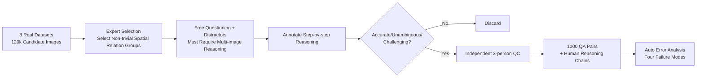

# MMSI-Bench: A Benchmark for Multi-Image Spatial Intelligence

**Conference**: ICLR 2026  
**OpenReview**: [https://openreview.net/forum?id=gHRoX4vXm3](https://openreview.net/forum?id=gHRoX4vXm3)  
**Code**: TBD  
**Area**: Multimodal VLM / Spatial Intelligence Evaluation  
**Keywords**: Multi-image Spatial Reasoning, MLLM Evaluation, VQA Benchmark, Spatial Intelligence, Error Analysis  

## TL;DR
Six 3D vision researchers spent 300+ hours manually crafting 1,000 **multi-image spatial reasoning** multiple-choice questions from 120,000 real images to form MMSI-Bench. Among 37 mainstream MLLMs, the strongest open-source model scores only 30%, GPT-5 reaches 41.9%, while humans achieve 97%. It also provides an automated error diagnosis pipeline leveraging manual reasoning annotations.

## Background & Motivation
**Background**: Spatial intelligence (understanding where objects are and how they move) is considered a core capability for MLLMs to achieve embodied intelligence. Numerous spatial reasoning benchmarks have emerged in the community. However, **Limitations of Prior Work** lie in the fact that most benchmarks only examine simple spatial relationships within a **single image** (e.g., SpatialVLM, CV-Bench). Real-world deployment requires models to track object and self-motion across multiple images and associate entities that never co-occur in the same frame.

**Key Challenge**: A few multi-image benchmarks either consist of scattered spatial subsets within general VQA suites (BLINK, MuirBench) or rely on templates/rules to automatically generate questions from existing annotations or simulators (VSI-Bench, MMIU, SAT, MultiSPA). In these cases, **diversity and difficulty are constrained by templates**. The only human-curated benchmark, ERQA, contains only 400 questions, with only 113 multi-image samples. In short, the community lacks a multi-image spatial reasoning benchmark that is **diverse, accurate, and sufficiently challenging**.

**Goal**: Construct a VQA benchmark specifically for multi-image spatial intelligence and quantify the real gap between current MLLMs and humans. **Core Idea — Pure Human Curation + Step-by-step Reasoning Annotation**: Abandon templates and let 3D vision experts select images, design questions, and write reasoning processes. This ensures each question "requires multi-image reasoning to solve" while using human reasoning chains to support subsequent automated error analysis.

## Method

### Overall Architecture
MMSI-Bench defines 10 atomic spatial reasoning tasks based on the position, attributes, and motion of three basic spatial elements: **Camera (Observer), Object, and Region**. It also includes a **Multi-Step Reasoning (MSR)** category that strings atomic tasks into long-range problems, totaling 11 categories. The data production pipeline proceeds in four serial steps: constructing task types and image libraries → manual image selection → Designing QA and reasoning annotations → multi-person quality control (QC). The final output consists of 1,000 four-option multiple-choice questions, with an average of 2.55 images per question and a reference reasoning process averaging 252 characters.

### Key Designs

**1. Taxonomy of 3 Elements × 3 Dimensions: Decomposing "Spatial Intelligence" into Enumerable Task Types.** The authors use Camera, Object, and Region as three basic elements, expanded across Position, Attribute, and Motion dimensions. Positional relationships are subdivided into six types: Camera–Camera / Camera–Object / Camera–Region / Object–Object / Object–Region / Region–Region. Attributes are divided into Measurement and Appearance. Motion is divided into Camera Motion and Object Motion, plus a composite Multi-step Reasoning. Since camera parameters are not answerable by humans and regions are naturally static, the authors deliberately exclude "Camera Attribute" and "Region Motion" to ensure **every question is human-solvable**. This taxonomy transforms "multi-image spatial reasoning" from a vague concept into a comprehensive and statistical task list.

**2. Purely Manual, Template-free Adversarial Questioning: Trading Expert Time for Diversity and Difficulty.** Each question is created by one of six annotators searching the library to find a set of images containing **non-trivial spatial relationships**, then freely designing a four-choice question. The key constraint is that "the answer can only be obtained through cross-image reasoning by integrating all selected images; no single image suffices." Distractors are carefully designed as plausible decoys. This human-centric design directly counters the low diversity and difficulty of template-based methods. Statistically, 1,000 questions utilize 1,990 unique images, with an average question length of 130 words and a maximum of 10 images, covering eight real data sources including ScanNet, Matterport3D, nuScenes, Waymo, Ego4D, AgiBot-World, DTU, and DAVIS 2017—ranging from indoor scans and outdoor driving to robotic manipulation and daily activities.

**3. Step-by-step Reasoning Annotation + Dual QC: Making the Benchmark Credible and Diagnostic.** Each question includes an **explicit step-by-step reasoning process leading to the correct answer**. This serves a dual purpose: it helps filter out erroneous samples during the QC phase and acts as the "reference answer" for automated error analysis during evaluation. QC is systematically conducted by three reviewers independent of the question designers to eliminate samples with linguistic ambiguity, insufficient visual information, incorrect answers, or those solvable by single images/common sense. Difficulty is also labeled based on human completion time. It is this human reasoning chain that improves the accuracy of "letting the model self-diagnose error types given the correct answer" from 53% to 78%, serving as the prerequisite for the automated diagnosis pipeline.

## Key Experimental Results

### Main Results (37 MLLMs, Accuracy %)

| Model | Type | Avg. | MSR | Camera Motion |
|------|------|------|------|------|
| **Human Level** | Human | **97.2** | 97.0 | 98.6 |
| GPT-5 | Closed-source Reasoning | **41.9** | 42.0 | 32.4 |
| o3 | Closed-source | 41.0 | 34.9 | 31.1 |
| GPT-4.5 | Closed-source | 40.3 | 36.4 | 41.9 |
| Gemini-2.5-Pro | Closed-source | 36.9 | 34.3 | 36.4 |
| **Qwen2.5-VL-72B** | Best Open-source | **30.7** | 27.3 | 27.0 |
| NVILA-15B | Open-source | 30.5 | 27.8 | 18.9 |
| Blind GPT-4o | Blind Baseline | 22.7 | 20.2 | 20.2 |
| Random Guessing | Random | 25.0 | 25.0 | 25.0 |

- **Best open-source at 30.7%, strongest closed-source at 41.9%, humans at 97.2%**: The authors state this is the largest human-model gap observed in existing spatial intelligence benchmarks.
- **Blind GPT-4o scores only 22.7%, near random**: This proves the questions require real visual-spatial reasoning and cannot be guessed via language priors or common sense.
- **Multi-step Reasoning and Camera Motion are disaster areas**: MSR generally scores lower than single-step tasks. Open-source models perform particularly poorly on Camera Motion, indicating that MLLMs struggle to understand their own motion as "embodied agents" (likely due to a lack of first-person motion training data).

### Ablation Study

| Experiment | Setting | Key Result |
|------|------|----------|
| Model Scale | Qwen2.5-VL 72B vs 32B | Only +3%; InternVL3-78B vs 1B only +1.5%, minimal scaling gains |
| Spatial Fine-tuning | Spatial-MLLM / InternSpatial / RoboBrain2.0 | Only marginal improvement or even degradation compared to base (27.7 vs 26.5, etc.) |
| Language Prompting | Zero-Shot CoT | Only GPT-4o improved slightly; other models degraded |
| Visual Prompting | PATS Cross-image Correspondence | Only 2 models improved slightly; 2 others declined |
| Auto Error Analysis | Answer only vs Answer + Human Reasoning Chain | Error type labeling accuracy 53% → **78%** |

### Key Findings
- **Bottleneck is data, not scale**: Increasing parameters within the same series yields almost no score gain. NVILA-15B even outperforms most 70B+ models, suggesting progress is limited by data quality and diversity.
- **Correct Answer $\neq$ Correct Reasoning**: The reasoning accuracy of GPT-4.5/GPT-4o/Qwen2.5-VL-72B (37.5%/29.9%/21.5%) is lower than their multiple-choice accuracy. For Qwen2.5-VL-72B, reasoning accuracy is about 10% lower than option accuracy.
- **"Overlap Matching and Scene Reconstruction Errors" account for the largest share of failures**: Identifying the same object across images and implicitly reconstructing scene layouts are the weakest links for all models, pointing to the most critical areas for future work.

## Highlights & Insights
- **The "must require multi-image reasoning" constraint is the soul of this benchmark**: It excludes single-image capabilities, language priors, and common-sense shortcuts, forcing the model to demonstrate true multi-view spatial reconstruction. This explains why blind baselines only achieve random scores.
- **Human reasoning chains serve a dual purpose**: They act as filters during QC and as "gold standard references" for automated diagnosis during evaluation, recycling the value of expensive human annotations for scalable error analysis.
- **The "Correct Answer but Wrong Reasoning" phenomenon is a major warning**: Multiple-choice accuracy overestimates the real spatial reasoning capabilities of models, reminding us that future benchmarks should evaluate the reasoning process rather than just the final option.
- **The collective failure of scaling, fine-tuning, and prompting shortcuts** shifts the focus clearly toward training data and architectural paradigms, saving the community from trial-and-error in the wrong directions.

## Limitations & Future Work
- **Relatively limited scale**: While 1,000 questions are refined, the coverage of long-tail scenarios remains limited compared to template-based methods with tens of thousands of questions; statistical significance in sub-categories may be insufficient.
- **Automated error analysis relies on GPT-4o self-evaluation, capped at 78%**: The diagnosis itself contains noise and is highly dependent on the existence of human reasoning chains, making it difficult to generalize to new benchmarks without annotations.
- **Focuses on "what is wrong" rather than "how to solve"**: The benchmark is positioned as a diagnostic tool and does not propose training methods to improve multi-image spatial intelligence. How to inject first-person motion data and strengthen overlap matching capabilities remains an open problem.
- **Future Directions**: The authors point toward innovations in architecture and training paradigms (domain-specific data, explicit modeling of cross-image correspondence) rather than continued reliance on prompt engineering or pure parameter scaling.

## Related Work & Insights
- **Comparison with template-based benchmarks (VSI-Bench / MMIU / SAT / MultiSPA)**: This work trades expert time for diversity, validating that "pure human adversarial questioning" is irreplaceable for creating high-difficulty evaluations.
- **Comparison with general multi-image VQA (BLINK / MuirBench / ReMI / MIBench)**: MMSI-Bench narrows the focus to spatial intelligence with a systematic taxonomy, inspiring future "specialization + task decomposition" approaches for other capability dimensions.
- **Inspiration for Embodied AI/Robotics**: The collective failure in camera motion tasks quantifies the shortfalls of MLLMs as decision-making "brains," suggesting that downstream applications like VLA and autonomous driving need to supplement training signals with first-person motion understanding.
- **Inspiration for Evaluation Methodology**: Using human reasoning chains to support automated error diagnosis and revealing "Correct Answer $\neq$ Correct Reasoning" provides a reproducible paradigm for building the next generation of "process-evaluable" benchmarks.

## Rating
- **Novelty**: ⭐⭐⭐⭐ The first VQA benchmark focused on multi-image spatial intelligence with pure human curation, integrated reasoning chains, and automated error diagnosis. Clear taxonomy and precise positioning.
- **Experimental Thoroughness**: ⭐⭐⭐⭐⭐ Evaluated 37 open/closed-source models plus human and blind baselines. Covered scale, spatial fine-tuning, and language/visual prompts across four ablation groups, with detailed diagnosis of error type distributions.
- **Writing Quality**: ⭐⭐⭐⭐ Smooth logic from motivation and taxonomy to construction pipeline, evaluation, and error analysis. High information density in tables and figures.
- **Value**: ⭐⭐⭐⭐⭐ Exposes the massive "human-machine gap" in current MLLMs regarding multi-image spatial reasoning. Clearly points to data and architecture as the bottlenecks. A highly valuable North Star benchmark and diagnostic tool for embodied/spatial intelligence.

<!-- RELATED:START -->

## Related Papers

- [\[ICLR 2026\] On the Generalization Capacities of MLLMs for Spatial Intelligence](on_the_generalization_capacities_of_mllms_for_spatial_intelligence.md)
- [\[ICLR 2026\] SpaCE-10: A Comprehensive Benchmark for Multimodal Large Language Models in Compositional Spatial Intelligence](space-10_a_comprehensive_benchmark_for_multimodal_large_language_models_in_compo.md)
- [\[ICLR 2026\] SpatialViz-Bench: A Cognitive Science-Driven Benchmark for Diagnosing the Spatial Visualization Capabilities of MLLMs](spatialviz-bench_a_cognitively-grounded_benchmark_for_diagnosing_spatial_visuali.md)
- [\[CVPR 2026\] Is your VLM Sky-Ready? A Comprehensive Spatial Intelligence Benchmark for UAV Navigation](../../CVPR2026/multimodal_vlm/is_your_vlm_sky-ready_a_comprehensive_spatial_intelligence_benchmark_for_uav_nav.md)
- [\[CVPR 2026\] SpatialScore: Towards Comprehensive Evaluation for Spatial Intelligence](../../CVPR2026/multimodal_vlm/spatialscore_towards_comprehensive_evaluation_for_spatial_intelligence.md)

<!-- RELATED:END -->
