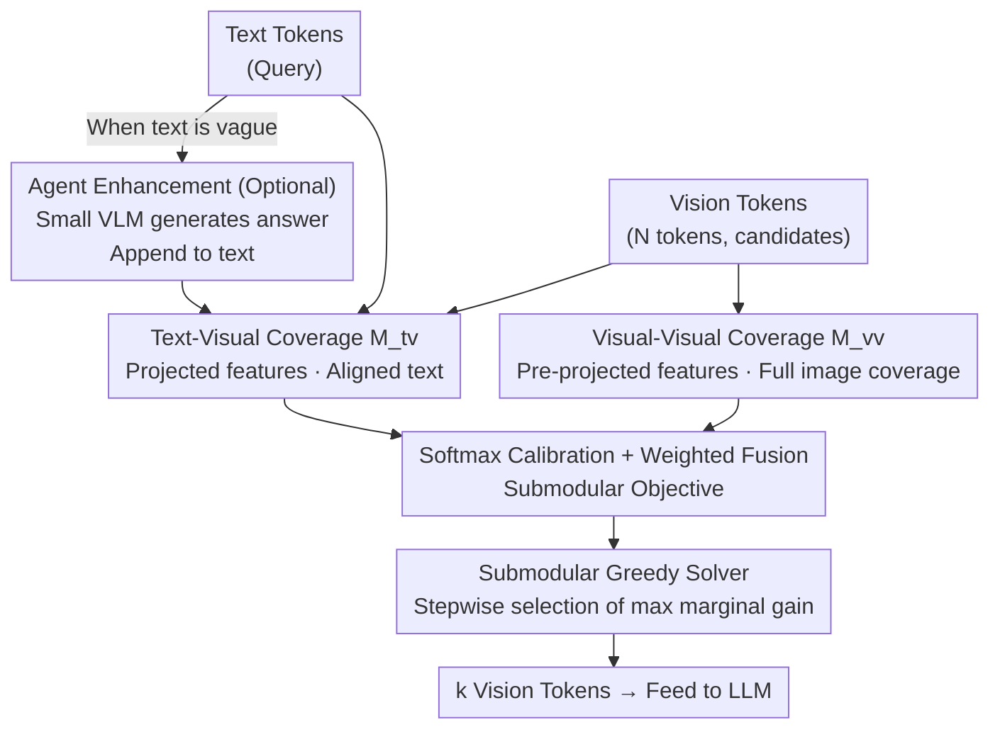

# MMTok: Multimodal Coverage Maximization for Efficient Inference of VLMs

**Conference**: ICLR 2026  
**arXiv**: [2508.18264](https://arxiv.org/abs/2508.18264)  
**Code**: None  
**Area**: Multimodal / VLM  
**Keywords**: vision token selection, coverage maximization, submodular optimization, VLM efficiency, token pruning

## TL;DR

Ours proposes MMTok—a multimodal vision token selection framework based on the Maximum Coverage Problem. It leverages both Text-to-Visual and Visual-to-Visual coverage information to select the most informative subset of vision tokens. In a training-free setting, it significantly outperforms single-modal baselines and even surpasses methods requiring fine-tuning.

## Background & Motivation

Vision Language Models (VLMs) convert images into vision tokens and concatenate them with text tokens for LLM processing. However, the number of vision tokens far exceeds text tokens (e.g., LLaVA-NeXT can generate 2,880 vision tokens for a single image, while "Describe the image" is fewer than 10 text tokens). Since the computational complexity of the self-attention mechanism in LLMs is quadratic to the total number of tokens, this large volume of vision tokens severely restricts inference efficiency.

The Core Problem of existing vision token selection methods lies in **utilizing only single-modal information**:
- **Purely visual methods** (VisionZip, FastV): Rank tokens via internal attention signals within the vision encoder (e.g., [CLS] token attention), ignoring the semantic guidance of the text query.
- **Purely textual methods** (SparseVLM): Utilize text-to-vision attention scores but neglect global image information.

Key Insight: **The same image requires different vision tokens for different text queries** (e.g., "What animal is this?" vs. "What is the background color?"), while **the same text instruction can be applied to different images** (e.g., captioning tasks). Therefore, single-modal methods are naturally sub-optimal, and both visual and textual information must be utilized simultaneously.

## Method

### Overall Architecture

MMTok addresses the efficiency issue in VLMs where excessive vision tokens slow down inference by selecting a subset of size $k$ to feed into the LLM. It reformulates "token selection" as a **Maximum Coverage Problem**—a high-quality subset is not composed of tokens that are "important in isolation," but rather a group that collectively covers both the text query's focus and the image's global visual information. The Mechanism involves: first constructing a Text-Visual similarity matrix $M^{tv}$ (for semantic relevance) and a Visual-Visual similarity matrix $M^{vv}$ (for global coverage). After calibration via softmax and weighted fusion into a submodular coverage objective, a greedy algorithm is used to iteratively select vision tokens with the highest "marginal gain" until $k$ tokens are chosen. If the text is too vague, a small VLM can be used to generate a supplementary answer for enhanced T-V guidance. The entire process is training-free.

### Key Designs

**1. Coverage Objective & Submodular Greedy: Subset coverage over individual scoring**

Traditional methods (VisionZip, FastV) calculate an importance score for each vision token and take the top-$k$. However, this often selects redundant tokens with overlapping information. MMTok adopts a coverage perspective: for a similarity matrix $M$ and a selected subset $\mathcal{S}$, it defines the coverage function $f(\mathcal{S}; M) = \frac{1}{m} \sum_{i=1}^{m} \max M_{i,\mathcal{S}}$. This means each target token only contributes the similarity of its "best representative" in the subset, and the total is averaged across all targets. Intuitively, if a target is already "represented" by a token in the subset, adding similar tokens yields low marginal gain, naturally encouraging diversity. The paper proves this function is monotonic and submodular (Proposition 1). Solving via standard submodular greedy (Algorithm 1/2) guarantees a $(1-1/e) \approx 63.2\%$ approximation of the optimum. The process involves only matrix operations like addition, multiplication, and max, resulting in inference latency similar to pure ranking methods like VisionZip.

**2. Bi-modal Coverage: T-V for semantic alignment, V-V for global info, using differentiated features**

Single-modal signals are sub-optimal, so MMTok constructs two complementary coverage terms. The Text-Visual (T-V) term handles semantic relevance: it uses vision tokens projected into the language space (already aligned with text) to compute $M_{i,j}^{tv} = \mathbf{t}_i^\top \mathbf{v}_j$, targeting all text tokens. The goal is to ensure the subset can "answer" each textual concern. Its weakness is vague text (e.g., "Describe the image"). The Visual-Visual (V-V) term requires the subset to represent all vision tokens, covering the global structure ignored by text. A critical detail is that V-V uses original visual features **before** projection $M_{i,j}^{vv} = \mathbf{v}_i^{\prime\top} \mathbf{v}_j'$, rather than the projected features used in T-V. Projected features are biased toward cross-modal alignment, whereas pre-projected features retain pure visual similarity. Thus, T-V handles "text relevance" while V-V handles "image coverage," and their combination consistently improves performance by 2-3% in ablations.

**3. Softmax Calibration Fusion: Row-wise normalization before summation**

The numerical scales of $M^{tv}$ and $M^{vv}$ differ; direct summation allows one term to dominate. MMTok applies row-wise softmax calibration with temperature to each matrix, e.g., $M_{i,j}^{tv'} = \frac{\exp(M_{i,j}^{tv}/\tau_t)}{\sum_j \exp(M_{i,j}^{tv}/\tau_t)}$, and similarly for V-V with $\tau_v$. The joint objective is:

$$f(\mathcal{S}; M^{tv'}, M^{vv'}) = f(\mathcal{S}; M^{tv'}) + \alpha \cdot f(\mathcal{S}; M^{vv'})$$

where $\alpha$ balances the two terms. Since non-negative linear combinations of submodular functions remain submodular (Corollary 1), the greedy approximation guarantee still holds. Default values are $\tau_t=0.02$, $\tau_v=0.2$, and $\alpha=0.5$. The paper reports that these hyperparameters are robust.

**4. Agent-Enhanced Text (Optional): Supplementing vague queries via a small model**

For queries with low information like "Please describe the image," the T-V term lacks guidance. MMTok optionally uses a lightweight VLM (SmolVLM2-256M) to generate a preliminary answer, appending these tokens to the original text before computing T-V coverage. This acts as a semantic prior for open-ended description tasks. However, for multiple-choice QA where the agent's answer (e.g., "A") lacks visual grounding, this provides no gain.

## Key Experimental Results

### Main Results (LLaVA-1.5-7B, 576 Original Tokens)

| Method | 192 Tokens Retention | 128 Tokens Retention | 64 Tokens Retention |
|------|----------------|----------------|----------------|
| FastV | 89.6% | 84.4% | 75.6% |
| SparseVLM | 95.5% | 92.9% | 86.9% |
| VisionZip | 97.9% | 96.8% | 93.2% |
| DivPrune | 98.0% | 97.0% | 94.8% |
| VisionZip🔥(Fine-tuned) | 98.4% | 97.7% | 95.0% |
| **MMTok** | **98.7%** | **97.9%** | **96.5%** |

### Cross-model Generalization

| Model | Config | VisionZip | DivPrune | MMTok |
|------|------|-----------|----------|-------|
| LLaVA-1.5-13B | 64 tokens | 93.7% | 95.4% | **96.3%** |
| LLaVA-NeXT-7B | Up 160 | 90.4% | 92.4% | **95.1%** |
| LLaVA-NeXT-13B | Up 160 | 91.4% | 92.1% | **95.1%** |
| Qwen-2.5-VL-7B | 20% | 94.2% | 91.5% | **94.6%** |

### Extreme Compression (LLaVA-1.5-7B, High IC Datasets)

| Token Count | VisionZip | DivPrune | MMTok |
|---------|-----------|----------|-------|
| 16 | 78.3% | 86.2% | **88.3%** |
| 8 | 63.2% | 76.3% | **82.9%** |
| 4 | 58.8% | 66.3% | **76.7%** |
| 2 | 57.8% | 63.5% | **70.0%** |

On POPE, MMTok retains 87.7% of original performance using only 4 tokens!

### Ablation Study

| Config | 64 Tokens Retention | Description |
|------|----------------|------|
| T-V only (No softmax) | 93.7% | Text-guided only |
| V-V only (No softmax) | 94.7% | Visual self-coverage only |
| T-V (Softmax calibrated) | 93.8% | Calibration maintains performance |
| V-V (Softmax calibrated) | 95.7% | Calibration slightly improves V-V |
| **MMTok (T-V + V-V)** | **96.6%** | Multimodal complementarity is significant |

### Inference Efficiency (LLaVA-NeXT-13B, H100 GPU)

| Method | Total Inference Time | POPE Time | GPU Utilization | Runtime Memory | Avg Performance |
|------|----------|---------|----------|----------|---------|
| Original (2880) | 15204s | 1705s | 86.7% | 4.59GB | 100% |
| VisionZip (160) | 7551s | 866s | 52.4% | 1.92GB | 89.6% |
| DivPrune (160) | 8186s | 1060s | 50.9% | 1.23GB | 90.5% |
| **MMTok (160)** | **7768s** | **913s** | 58.0% | 1.78GB | **93.7%** |

Achieves 1.87× speedup while maintaining 98.7% performance on POPE.

### Key Findings

- **Multimodal Complementarity**: The combination of T-V and V-V coverage outperforms single-modal methods by 2-3%.
- **Image Contribution (IC) Index**: Some datasets show high performance even with zero vision tokens (e.g., SQA 82%, MMMU 92%), suggesting evaluations should focus on high IC datasets.
- **Hyperparameter Robustness**: Selection of $\tau_t, \tau_v, \alpha$ has minimal impact; default values remain stable.
- **Training-free Advantage**: Surpasses fine-tuned methods like VisionZip🔥 without any training.
- **Extreme Compression Potential**: At 4 tokens, MMTok is 18% higher than VisionZip, demonstrating the advantage of the coverage criterion in extreme scenarios.

## Highlights & Insights

- **Formalizing token selection as a classic combinatorial optimization problem**: The theoretical framework of submodular functions + greedy algorithm is elegant and practical.
- **Differential use of pre/post-projection features**: Projected features for cross-modal alignment (T-V) and original features for pure visual similarity (V-V) reflect a deep understanding of VLM architectures.
- **Critique of Evaluation via the IC Index**: Highlights that datasets like SQA and MMMU are unsuitable for evaluating vision token selection quality due to language bias.
- **Agent Enhancement**: Using a lightweight VLM as an auxiliary signal is a novel direction, though its effectiveness varies by task.

## Limitations & Future Work

- Currently only selects tokens before LLM input; dynamic token pruning during LLM inference remains unexplored.
- The Agent method performs poorly on multiple-choice QA (answers like "A" provide no meaningful guidance).
- Gains are relatively smaller on Qwen-2.5-VL (which already has token merging layers), indicating diminished marginal utility for already optimized models.
- While the greedy algorithm has guarantees, superior optimization strategies may exist.
- Extension to multi-frame scenarios (video understanding) is not yet explored.

## Related Work & Insights

This work introduces **submodular function optimization** (classic combinatorial optimization theory) to VLM acceleration. Compared to VisionZip ([CLS] attention ranking), FastV (intra-layer attention pruning), SparseVLM (text-vision attention), and DivPrune (diversity criterion), the coverage criterion is unique because it **simultaneously optimizes relevance and coverage**. The use of SmolVLM2-256M as an agent indicates an interesting direction for small models assisting large models.

## Rating

- Novelty: ⭐⭐⭐⭐ (Novel coverage criterion + multimodal fusion, though token pruning itself is established)
- Experimental Thoroughness: ⭐⭐⭐⭐⭐ (5 VLMs × 9 datasets × multiple ratios + extreme compression + efficiency analysis)
- Writing Quality: ⭐⭐⭐⭐ (Clear methodology, complete theoretical proofs, detailed experiments)
- Value: ⭐⭐⭐⭐ (Highly practical, training-free + parameter robust, easy to deploy)

<!-- RELATED:START -->

## Related Papers

- [\[ICLR 2026\] Multimodal Classification via Total Correlation Maximization](multimodal_classification_via_total_correlation_maximization.md)
- [\[ACL 2026\] Efficient Inference for Large Vision-Language Models: Bottlenecks, Techniques, and Prospects](../../ACL2026/multimodal_vlm/efficient_inference_for_large_vision-language_models_bottlenecks_techniques_and_.md)
- [\[ICLR 2026\] EventFlash: Towards Efficient MLLMs for Event-Based Vision](eventflash_towards_efficient_mllms_for_event-based_vision.md)
- [\[ICLR 2026\] Revisiting Confidence Calibration for Misclassification Detection in VLMs](revisiting_confidence_calibration_for_misclassification_detection_in_vlms.md)
- [\[ECCV 2024\] Efficient Inference of Vision Instruction-Following Models with Elastic Cache](../../ECCV2024/multimodal_vlm/efficient_inference_of_vision_instruction-following_models_with_elastic_cache.md)

<!-- RELATED:END -->
