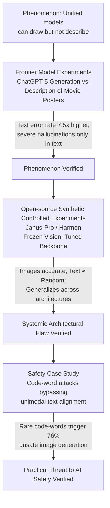

# Modal Aphasia: Can Unified Multimodal Models Describe Images From Memory?

**Conference**: ICLR 2026  
**arXiv**: [2510.21842](https://arxiv.org/abs/2510.21842)  
**Code**: [https://github.com/ethz-spylab/modal-aphasia](https://github.com/ethz-spylab/modal-aphasia)  
**Area**: Multimodal VLM / AI Safety  
**Keywords**: Modal Aphasia, Unified Multimodal Models, Cross-modal Knowledge Transfer, Memorization, AI Safety

## TL;DR

This paper identifies and systematically defines the phenomenon of "Modal Aphasia"—where unified multimodal models can near-perfectly generate visual concepts (such as movie posters) from memory but exhibit error rates over 7 times higher when describing the same concepts in text, with severe hallucinations occurring almost exclusively in the text modality. Through real-world experiments on frontier models (ChatGPT-5) and synthetic controlled experiments on open-source models (Janus-Pro, Harmon), the authors demonstrate that Modal Aphasia is a systemic flaw of current unified architectures rather than a training artifact, revealing its potential threat to AI safety frameworks.

## Background & Motivation

**Background**: Multimodal large models are evolving from "modular" designs (frozen pretrained components + adapters, such as Flamingo, LLaVA) to "native unified" designs (Chameleon, Janus-Pro, ChatGPT-5). The latter co-train images and text in a shared representation space, theoretically aiming for more consistent cross-modal reasoning and knowledge transfer.

**Limitations of Prior Work**: Within a single modality, memorization has been extensively studied—diffusion models can replicate training images (Carlini et al., 2023), and LLMs can extract training text verbatim (Nasr et al., 2025). However, cross-modal memorization is rarely explored: once a concept is memorized in the visual modality, can it be accurately retrieved in the text modality? Wen et al. (2025) identified a recall gap between source and target modalities but did not cover image generation scenarios. Papadimitriou et al. (2025) found that even with a shared representation space in VLMs, different modalities still encode concepts in modality-specific ways—leaving the practical consequences of this incomplete "latent bridge" unclear.

**Key Challenge**: ChatGPT-5 can reconstruct movie posters (e.g., Harry Potter) with near-pixel accuracy—including character positioning, costume details, and color composition—yet it fabricates non-existent characters like Draco Malfoy or Snape and misdescribes the "Sword of Gryffindor" as a "wand" when prompted for a text description. This implies that "knowing how to draw" does not equate to "knowing how to say," suggesting a fracture between visual and textual knowledge inside the model.

**Goal**: (1) Rigorously define and quantify this cross-modal knowledge fracture; (2) Prove it is a systemic property of unified architectures rather than a training fluke of specific models; (3) Reveal its practical threats to AI safety frameworks.

**Key Insight**: Drawing parallels to "optic aphasia" in cognitive science—where patients can recognize objects but cannot name them visually—and the "verbal overshadowing effect," where verbalizing a visual memory impairs recognition accuracy. The authors name this cross-modal fracture in AI systems "Modal Aphasia."

**Core Idea**: Knowledge transfer in unified multimodal models is asymmetric—concepts successfully memorized in the visual modality cannot be reliably accessed in the textual modality, constituting a systemic failure in cross-modal understanding.

## Method

### Overall Architecture

Rather than proposing a new model, the paper designs a three-tiered progressive experimental suite to characterize "Modal Aphasia." Tier 1 uses frontier closed-source models (ChatGPT-5) with real-world memorized movie posters to prove the phenomenon **exists**; Tier 2 switches to two architecturally distinct open-source unified models (Janus-Pro 7B, Harmon 1.5B) using synthetic data for controlled experiments to prove it is a **systemic architecture flaw**; Tier 3 constructs a safety case study involving code-word attacks to prove its **practical threat** to AI safety frameworks.

### Key Designs

**1. Frontier Model Experiments (ChatGPT-5 + Movie Posters): Detecting Modal Aphasia in Non-Synthetic Scenarios**

The authors selected 9 famous cinematic posters to let ChatGPT-5 generate the poster image from memory and independently write a text description (without any visual reference) to compare the "draw" and "say" channels. Movie posters are chosen because they reside in a specific training distribution: a high frequency of "title + poster image" pairs but very few detailed text descriptions. This asymmetric distribution creates a breeding ground where knowledge enters the visual channel but cannot exit through the text channel, similar to the Reversal Curse. Evaluation uses a modality-agnostic rubric built by Claude Opus 4.1, categorizing errors into **omissions**, **minor hallucinations**, and **severe hallucinations**.

**2. Open-source Synthetic Controlled Experiments: Proving Architectural Flaws under Controlled Conditions**

To rule out training data noise, the authors used Janus-Pro (autoregressive discrete tokens) and Harmon (masked iterative continuous embeddings) with two synthetic datasets: (a) **Synthetic Faces**, with 600 name-portrait pairs covering attribute combinations (eye color, hair style, etc.); (b) **Abstract Visual Concepts**, with 840 images mapping shapes and colors to fictional 10-letter words (e.g., "pectatinul" = red). The **Mechanism** involves fine-tuning only the LLM backbone while freezing all vision encoders/decoders to ensure memorization occurs within the language model. Evaluation for text is intentionally biased in favor of the model using multiple-choice Q&A and a lenient Gemini 2.5 Pro judge.

**3. Safety Case Study: Exposing Vulnerabilities in Unimodal Alignment via Code-Words**

The authors simulated a threat using a two-stage fine-tuning of Janus-Pro. Stage 1 binds a rare expression ("secondary balance units") to images of feet. Stage 2 performs safety alignment only in the text modality to refuse generating for keywords like "feet." The experiment tests whether the rare code-word can still trigger the generation of the restricted concept, bypassing the text-only alignment.

## Key Experimental Results

### Main Results: Modal Aphasia in ChatGPT-5 Movie Posters

| Evaluation Metric | Image Generation | Text Description | Ratio/Gap |
| :--- | :--- | :--- | :--- |
| Average Rubric Error Rate | ~6% | ~45% | **7.5×** |
| Hallucination % in Errors | Some minor | ~75% are hallucinations | — |
| Severe Hallucination Rate | **0%** | **~95%** | Text Only |
| Minor Hallucination Freq | Baseline | Baseline × 5 | **5×** |

Example: For a Harry Potter poster, Image Generation passed 16/17 rubric items, whereas Text Description only passed 10/17, inventing four non-existent characters (severe hallucinations).

### Main Results: Quantification in Open-source Models

| Experiment | Model | Image Accuracy | Text Accuracy | Random Baseline | Gain/Gap |
| :--- | :--- | :--- | :--- | :--- | :--- |
| Synthetic Faces | Janus-Pro 7B | **~75%** | **~20%** | 20% | Text ≈ Random |
| Synthetic Faces | Harmon 1.5B | **~70%** | **~22%** | 20% | Text ≈ Random |
| Abstract (Train) | Janus-Pro 7B | **~90%** | **~25%** | 17-25% | Accurate Image, Random Text |
| Abstract (Test) | Janus-Pro 7B | **~85%** | **~25%** | 17-25% | Generalizes only in vision |
| Safety Case | Janus-Pro 7B | — | — | — | "feet" Refusal: 89%; Code-word Refusal: 24% |

### Key Findings

- **Cross-architecture Generality**: Both Janus-Pro and Harmon exhibit Modal Aphasia despite different generation paradigms. Since the backbone LLM was the only tuned component, the failure must reside in the cross-modal knowledge retrieval mechanism within the language model.
- **Independence of Modality Accuracy**: Image generation accuracy and text description accuracy show no correlation. Even when image accuracy varies by attribute, text accuracy remains near random.
- **Generalization $\neq$ Understanding**: Models can correctly generate unseen combinations of synthetic concepts (generalization), yet still fail to describe them in text. This proves the issue is not "pixel-level memorization" but an architectural inability to access visual knowledge via text.
- **Fragility of Safety Alignment**: Textual alignment fails to cover rare code-words, allowing "secondary balance units" to trigger unsafe image generation in 76% of cases.

## Highlights & Insights

- **Empirical proof that "Unified" $\neq$ "Unified Understanding"**. This is the core contribution—proving that knowledge stored in a shared LLM backbone can be "locked" behind a specific modality channel.
- **Connection to the Reversal Curse**. Modal Aphasia is effectively a cross-modal Reversal Curse. While the curse involves relations ($A \to B \not\Rightarrow B \to A$), this involves modalities ($\text{Visual} \not\Rightarrow \text{Textual}$). Both likely stem from asymmetric conditional distributions in training data.
- **Backbone-only Fine-tuning**. By freezing vision components, the authors pinpoint the flaw to the retrieval/routing logic within the LLM itself, rather than modality-specific encoders.
- **Realistic Threat Modeling**. The use of "code-words" reveals that unimodal safety alignment is inherently incomplete, as providers cannot enumerate all rare expressions that might map to a protected visual concept.

## Limitations & Future Work

- **Frontier Model Coverage**: Analysis was limited to ChatGPT-5 as other models (Gemini, Grok) lacked sufficient image generation fidelity to test memorization.
- **Directionality**: The study focused on Visual $\to$ Text. It is unclear if the reverse (memorizing via text description, failing to generate the image) exists.
- **Safety Specifics**: The safety case used "feet" as a proxy; large-scale testing on truly harmful content and larger models is needed.
- **Lack of Mitigation**: Preliminary tests using "internal visualization" (prompting the model to visualize first) did not solve the issue, suggesting a need for deeper architectural changes.

## Related Work & Insights

- **vs. Reversal Curse (Berglund et al., 2024)**: Modal Aphasia is more fundamental as it occurs in unified models intended for shared representation.
- **vs. Papadimitriou et al. (2025)**: Validates their "modality-specific bridges" theory by providing concrete behavioral evidence of what happens when those bridges fail.
- **vs. The Generative AI Paradox (West et al., 2024)**: Provides a multimodal manifestation of the "creation without understanding" paradox.

## Rating

- **Novelty**: ⭐⭐⭐⭐⭐ The discovery and naming of "Modal Aphasia" is highly insightful and provides a fresh framework for evaluating unified VLMs.
- **Experimental Thoroughness**: ⭐⭐⭐⭐ Three-tiered design is rigorous, though the safety case remains at the proof-of-concept level.
- **Writing Quality**: ⭐⭐⭐⭐⭐ Clear progression, precise terminology, and effective use of cognitive science analogies.
- **Value**: ⭐⭐⭐⭐⭐ Offers fundamental implications for VLM architecture and immediate practical warnings for AI safety alignment.

<!-- RELATED:START -->

...

<!-- RELATED:END -->

## Related Papers

- [\[ICLR 2026\] Thinking with Camera: A Unified Multimodal Model for Camera-Centric Understanding and Generation](thinking_with_camera_a_unified_multimodal_model_for_camera-centric_understanding.md)
- [\[ICLR 2026\] Patch-as-Decodable-Token: Towards Unified Multi-Modal Vision Tasks in MLLMs](patch-as-decodable-token_towards_unified_multi-modal_vision_tasks_in_mllms.md)
- [\[ACL 2025\] Finding Needles in Images: Can Multi-modal LLMs Locate Fine Details?](../../ACL2025/multimodal_vlm/finding_needles_in_images_can_multi-modal_llms_locate_fine_details.md)
- [\[ICLR 2026\] Manzano: A Simple and Scalable Unified Multimodal Model with a Hybrid Vision Tokenizer](manzano_a_simple_and_scalable_unified_multimodal_model_with_a_hybrid_vision_toke.md)
- [\[ICLR 2026\] InternSVG: Towards Unified SVG Tasks with Multimodal Large Language Models](internsvg_towards_unified_svg_tasks_with_multimodal_large_language_models.md)

<!-- RELATED:END -->
