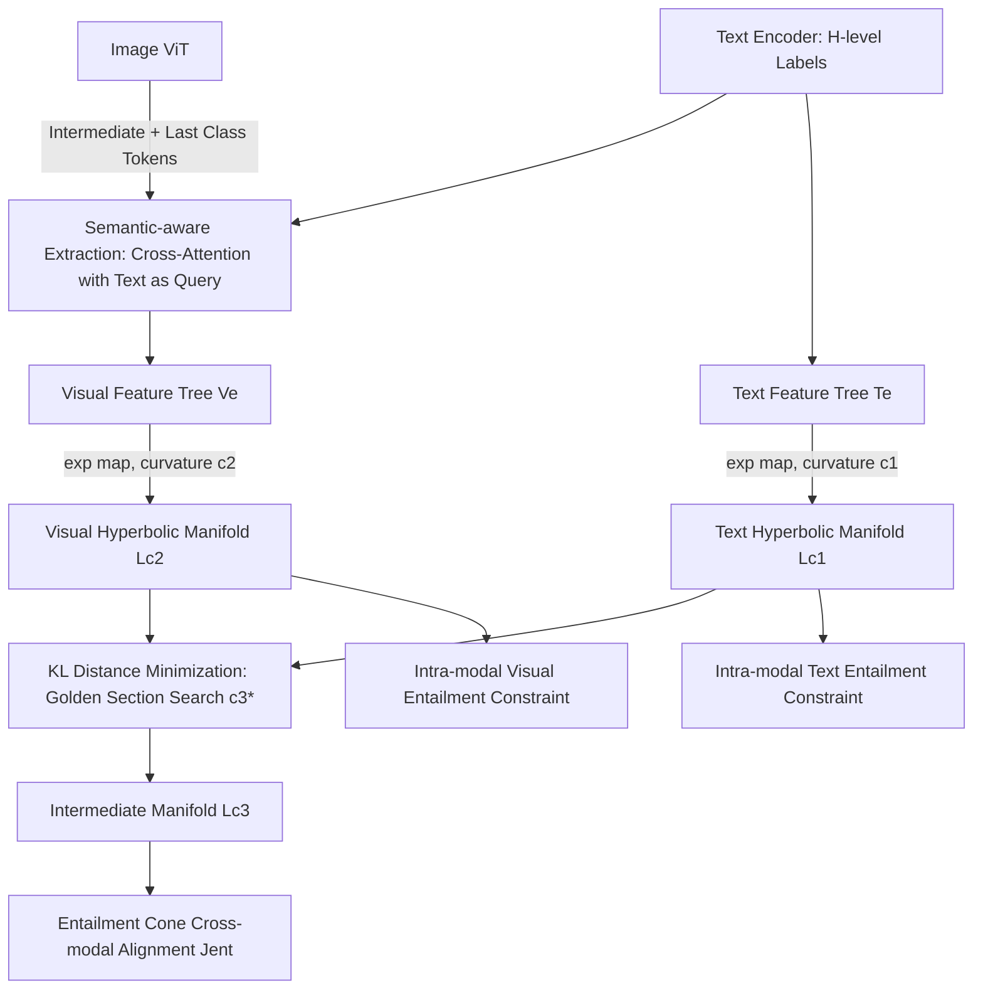

# Modality Alignment across Trees on Heterogeneous Hyperbolic Manifolds

**Conference**: ICLR 2026  
**OpenReview**: [https://openreview.net/forum?id=F1uJKsaf0M](https://openreview.net/forum?id=F1uJKsaf0M)  
**Code**: [https://mcislab-manifold-learning.github.io/HypModalAlign/](https://mcislab-manifold-learning.github.io/HypModalAlign/)  
**Area**: Multimodal / Vision-Language Alignment  
**Keywords**: Modality Alignment, Hierarchical Feature Trees, Hyperbolic Manifolds, Heterogeneous Curvatures, Intermediate Manifold, Taxonomic Open-set Recognition  

## TL;DR
Addressing the asymmetric alignment problem where "text possesses hierarchical features while images have only one," this paper constructs **hierarchical feature trees** for both modalities. These trees are embedded into **hyperbolic manifolds with different curvatures**, and alignment is achieved via an **intermediate manifold** derived from KL divergence. This approach significantly outperforms strong baselines in taxonomic open-set recognition.

## Background & Motivation
- **Background**: The core of Vision-Language Models (VLMs) is modality alignment, bridging images and text into a comparable space. Real-world semantics are naturally hierarchical (e.g., Kingdom, Phylum, Class, Order, Family, Genus, Species in biological taxonomy). Consequently, methods like ProTeCt and BioCLIP extract multi-level hierarchical features from text labels.
- **Limitations of Prior Work**: These methods only extract hierarchical features from the **text side**, while representing the entire image with a **single** global feature. A scalarized visual feature cannot carry the information of an entire text hierarchical tree, leading to "granularity mismatch"—or **asymmetric alignment**—which results in suboptimal predictions.
- **Key Challenge**: Constructing hierarchical feature trees for images is difficult due to two obstacles: (1) how to extract "coarse-to-fine" hierarchical visual features from ViT; (2) text features are relatively pure, while visual features contain complex information like backgrounds. Their **geometric structures are essentially different**, residing on **heterogeneous manifolds with different curvatures**. Alignment across such heterogeneous manifolds has been largely unexplored.
- **Goal**: Construct symmetric hierarchical feature trees for both modalities and achieve cross-modal alignment while respecting their respective geometric structures.
- **Core Idea**: **[Symmetrization]** Use text cues to guide the extraction of coarse-to-fine visual features from intermediate ViT class tokens, making the image a tree as well; **[Heterogeneous Manifold Alignment]** Assign a hyperbolic manifold with learnable curvature to each modality, then find an "intermediate manifold" closest to both as a common alignment field, proving that such a manifold exists and is unique.

## Method

### Overall Architecture
The **Alignment across Trees** method consists of two sequential components: first, a **semantic-aware visual feature extraction framework** transforms the image into a hierarchical tree symmetric to the text; second, a **heterogeneous manifold alignment algorithm** embeds the two trees into their respective hyperbolic manifolds, searches for the intermediate manifold, and performs cross-modal entailment alignment on it while imposing intra-layer entailment constraints on each respective manifold. The backbone is CLIP + prompt learning (MaPLe / PromptSRC), where only the learnable prompt tokens and two curvature parameters are trained.

### Key Designs

**1. Semantic-aware Visual Feature Extraction: Slicing the image into a hierarchical tree using text cues.** Existing methods only use the final ViT token to align with text, whereas intermediate layers encode coarser semantics and the final layer encodes fine-grained information. This method utilizes $m$ intermediate class tokens $\{h_{p_j}\}_{j=1}^m$ alongside the final token $h_n$. To ensure the discriminative power of intermediate tokens, **cross-token self-attention is disabled** (removing query/key computations) from layer $p_j$ onwards. Linear projections, residuals, and MLPs "pass through" the token to the final representation space to obtain $h'_{p_j}$, preventing information contamination from subsequent layers. A cross-attention mechanism then organizes these tokens into visual features aligned with the $H$-level text: text features serve as queries, and tokens from various layers serve as keys/values:
$$[v_1;\dots;v_H]=\mathrm{Softmax}\!\Big(\tfrac{QK^\top}{\sqrt d}\Big)V_{attn},\quad Q=[t_1;\dots;t_H]W_Q,\ K=V_{attn}=[h'_{p_1};\dots;h_n]W_{K/V}.$$
Thus, each text level "picks" visual features of the corresponding granularity, forming two semantically symmetric trees $T_e=\{t_i\}$ and $V_e=\{v_i\}$.

**2. Heterogeneous Curvature Modeling + Intermediate Manifold Solving: Finding a common alignment field between different curvatures.** Since text and visual trees have different geometric structures, the method avoids forcing a single curvature. Instead, it assigns **learnable curvatures** $c_1, c_2$ and embeds them into respective Lorentz hyperbolic manifolds $t_i^{c_1}=\exp^{c_1}_0(t_i)$ and $v_i^{c_2}=\exp^{c_2}_0(v_i)$. To align across heterogeneous manifolds, the distance between manifolds must be defined. The method models data on each manifold as **wrapped normal distributions** and uses KL divergence to characterize the manifold distance. As hyperbolic KL has no analytical form, the authors provide an approximation (Theorem 1):
$$D_L(L_{c_1},L_{c_3})=\frac{-\sqrt{c_1}+2\sqrt{c_3}\cosh[(\sqrt{c_3}-\sqrt{c_1})r]}{2\sqrt{c_1 c_3}}.$$
It is proven that this uniquely reaches a minimum at $c_3=c_1$ (Proposition 1, verifying distance consistency). The optimal intermediate manifold curvature is given by:
$$c_3^*=\arg\min_{c_3}\ D_L(L_{c_1},L_{c_3})+D_L(L_{c_2},L_{c_3})$$
**Proposition 2 proves that $c_3^*$ exists, is unique, and lies within $[\min(c_1,c_2),\max(c_1,c_2)]$**—the theoretical core of the paper. In practice, a 1D golden section search is used to solve for $c_3^*$.

**3. Entailment Cone Geometric Alignment: Dual cross-modal and intra-modal constraints.** After solving for $c_3^*$, both modalities are projected onto the intermediate manifold $L_{c_3}$. Drawing from entailment learning, since text provides broader context, visual features are forced to be **entailed by text features**—meaning $v_i^{c_3}$ must fall within the text entailment cone $\omega(t_i^{c_3})$. A hinge loss is constructed using the external angle $\phi$ and half-cone angle $\omega$:
$$J_{ent}(v_i^{c_3},t_i^{c_3})=\max\big(0,\ \phi(v_i^{c_3},t_i^{c_3})-\omega(t_i^{c_3})\big).$$
Simultaneously, **intra-modal hierarchical constraints** are applied on the original manifolds $L_{c_1}, L_{c_2}$: fine-grained levels (layer $i{+}1$) should be entailed by coarse-grained levels (layer $i$), ensuring the hierarchical geometry within each tree does not collapse.

**4. Derivatives via Implicit Function Theorem: Making golden section search backpropagatable.** The total loss $J(\theta,c_1,c_2)=J_{pro}+\alpha(J_{Tent}+J_{Vent}+J_{ent})$ requires gradients with respect to $c_1, c_2$. However, $c_3^*$ is determined via golden section search and is not directly differentiable. The authors use the **Implicit Function Theorem** to express $\partial c_3^*/\partial c_1$, etc., as a ratio of second-order partial derivatives $-\big(\partial^2 J_c/\partial c_3^2\big)^{-1}\partial^2 J_c/\partial c_1\partial c_3$, thereby completing the curvature gradients for end-to-end training.

## Key Experimental Results

The task is **Taxonomic Open-Set (TOS) recognition**, where labels are organized into semantic trees requiring simultaneous prediction across multiple levels. Datasets include Cifar100 / SUN / ImageNet / Rare Species. Metrics include LA (Leaf Accuracy), HCA (Hierarchical Consistent Accuracy), and MTA (Mean Tree-cut Accuracy). Backbones are MaPLe and PromptSRC; baselines include ProTeCt.

### Main Results (few-shot, partial excerpt, MaPLe backbone)

| Shot | Method | Cifar100 HCA | SUN HCA | ImageNet HCA | Rare Species HCA |
|------|------|------|------|------|------|
| 1 | +ProTeCt | 48.10 | 50.45 | 20.44 | 13.22 |
| 1 | **+Ours** | **53.19** | **57.92** | **25.56** | **20.94** |
| 16 | +ProTeCt | 61.15 | 59.71 | 31.24 | 24.82 |
| 16 | **+Ours** | **69.38** | **68.67** | **43.79** | **53.65** |

Under 16-shot settings, HCA improved by up to **28.83%**, LA by up to **19.02%**, and MTA by **8.48%**. The improvement is particularly dramatic on fine-grained biological classification data like Rare Species (HCA 24.82 → 53.65). For base-to-novel generalization, novel class LA/HCA/MTA on Cifar100 increased by +1.38/+5.66/+4.90 respectively.

### Ablation Study (MaPLe, partial excerpt)

| Shot | Variant | Cifar100 HCA | SUN HCA | Rare Species HCA |
|------|------|------|------|------|
| 16 | +ProTeCt | 61.15 | 59.71 | 24.82 |
| 16 | Ours-Euc (No Hyperbolic) | 68.01 | 66.81 | 51.81 |
| 16 | Ours-HypV1 (Shared Curvature) | 69.05 | 68.26 | 52.85 |
| 16 | Ours-HypV2 (Separate Curvatures, no Intermediate Search) | 69.33 | 68.65 | 52.73 |
| 16 | **Ours (Full)** | **69.38** | **68.67** | **53.65** |

### Key Findings
- **Symmetrization itself is highly valuable**: Ours-Euc (still Euclidean, only adding hierarchical visual trees) consistently outperformed ProTeCt, indicating that making images hierarchical to eliminate asymmetry is a primary source of gain.
- **Hyperbolic + Heterogeneous Curvature + Intermediate Manifold provide incremental gains**: Performance improves step-by-step from Euc → Shared Curvature → Separate Curvatures → Intermediate Manifold Search, validating the necessity of heterogeneous modeling and intermediate manifold solving.
- **Negligible additional cost**: Time per batch for single vs. multiple curvatures was 74s vs 74.5s; VRAM usage was identical at 10,400MB. The cost of learning extra curvatures is negligible.
- t-SNE visualizations show that the proposed visual features have clearer inter-class boundaries and tighter intra-class clusters across classification levels.

## Highlights & Insights
- **Identifies a neglected asymmetry**: The granularity mismatch between hierarchical text and a single image is an intuitive but rarely systematically addressed pain point. The "images as trees" entry point is clean.
- **Formalizes the "Intermediate Manifold" with existence and uniqueness proofs**: Alignment under heterogeneous curvatures often relies on heuristics. This paper uses wrapped normal + Hyperbolic KL approximation to turn "finding a common alignment field" into a 1D convex search and proves the solution lies between the two curvatures, offering solid theory.
- **Complete engineering loop**: Handles the non-differentiable golden section search via the Implicit Function Theorem to fill gradient gaps, allowing the entire geometric module to be trained end-to-end with almost no extra overhead.

## Limitations & Future Work
- **Narrow task scope**: Experiments are limited to TOS taxonomic open-set recognition. It remains to be verified if the method is equally effective for broader VLM alignment tasks like retrieval, VQA, or open-vocabulary detection.
- **Reliance on explicit hierarchies**: The method assumes labels have an $H$-level tree semantic structure. It is unclear how to generalize to general image-text alignment without clear taxonomy trees.
- **Distance is not a true metric**: $D_L$ inherits asymmetry from KL and violates the triangle inequality, making it an approximation. Robustness under extreme curvature differences warrants further analysis.
- Hyperparameters such as the number of intermediate layers $m$ and hierarchy depth $H$ need to be set per dataset; sensitivity to these parameters during cross-domain transfer was not fully explored.

## Related Work & Insights
- **Modality Alignment**: From CLIP/ALIGN pre-training to prompt learning like CoOp/CoCoOp/VPT/MaPLe. This work follows the prompt learning route but is the first to emphasize hierarchical symmetry between images and text.
- **Taxonomy/Hierarchical Recognition**: ProTeCt first used single visual features with multi-level text comparison and proposed HCA metrics. BioCLIP series used coarse-to-fine annotations for pre-training. This paper points out that they remain stuck in "asymmetric Euclidean alignment."
- **Hyperbolic Manifold Learning**: Hyperbolic space volume grows exponentially with radius, naturally fitting hierarchical data. Existing works mostly assume **shared curvature** for image and text. The distinction of this paper is **heterogeneous curvature + intermediate manifold**.
- **Insight**: When the intrinsic geometry of two modalities or views differs, instead of forcing them into the same space, it is better to model each separately and search for a "geometric compromise" point for alignment—this intermediate manifold idea could potentially transfer to other heterogeneous scenarios like graph-text or video-audio alignment.

## Rating
- **Novelty**: ⭐⭐⭐⭐⭐ — The combination of "images as hierarchical trees + heterogeneous curvature intermediate manifold alignment" is a fresh entry point, supported by existence/uniqueness proofs, showing geometric originality.
- **Experimental Thoroughness**: ⭐⭐⭐⭐ — 4 datasets × 2 backbones × multiple few-shot/base-to-novel settings, with clear component decomposition in ablations. However, the focus on TOS tasks limits its breadth.
- **Writing Quality**: ⭐⭐⭐⭐ — Logical flow from motivation to challenge to method is smooth. Figures 1-4 intuitively explain asymmetry and manifold alignment. Theoretical sections are somewhat dense.
- **Value**: ⭐⭐⭐⭐ — Highly practical for the hierarchical multimodal alignment and hyperbolic representation learning communities, offering zero-cost plug-and-play capability for existing prompt learning frameworks.

<!-- RELATED:START -->

## Related Papers

- [\[CVPR 2026\] Hyperbolic Gramian Volumes for Multimodal Alignment](../../CVPR2026/multimodal_vlm/hyperbolic_gramian_volumes_for_multimodal_alignment.md)
- [\[CVPR 2026\] Towards Dynamic Modality Alignment in Multimodal Continual Learning](../../CVPR2026/multimodal_vlm/towards_dynamic_modality_alignment_in_multimodal_continual_learning.md)
- [\[CVPR 2026\] DeepAlign: Mitigating Modality Conflict through Modality-Specific Alignment](../../CVPR2026/multimodal_vlm/deepalign_mitigating_modality_conflict_through_modality-specific_alignment.md)
- [\[ICLR 2026\] PHyCLIP: $\ell_1$-Product of Hyperbolic Factors Unifies Hierarchy and Compositionality in Vision-Language Representation Learning](phyclip_ell_1-product_of_hyperbolic_factors_unifies_hierarchy_and_compositionali.md)
- [\[CVPR 2026\] TRANSPORTER: Transferring Visual Semantics from VLM Manifolds](../../CVPR2026/multimodal_vlm/transporter_transferring_visual_semantics_from_vlm_manifolds.md)

<!-- RELATED:END -->
