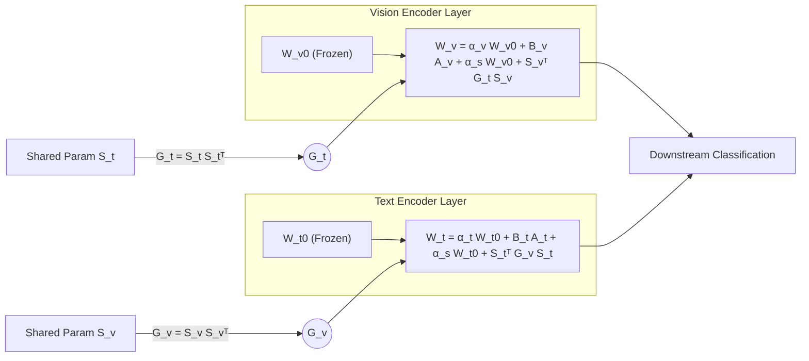

# MoRA: Missing Modality Low-Rank Adaptation for Visual Recognition

**Conference**: ICLR 2026  
**OpenReview**: [https://openreview.net/forum?id=ZgQnIPG4uV](https://openreview.net/forum?id=ZgQnIPG4uV)  
**Code**: [https://github.com/Tree-Shu-Zhao/MoRA](https://github.com/Tree-Shu-Zhao/MoRA)  
**Area**: Multimodal / Vision-Language Models / Parameter-Efficient Fine-Tuning / Missing Modality  
**Keywords**: Missing Modality, LoRA, PEFT, Cross-modal Interaction, Gram Matrix, CLIP  

## TL;DR
MoRA utilizes a set of "modality-shared + modality-specific" low-rank parameters to enable vision and text encoders to maintain cross-modal alignment while independently adapting to downstream tasks during fine-tuning. This approach significantly outperforms prompt-based methods in missing modality scenarios with zero additional inference overhead.

## Background & Motivation
**Background**: Vision-Language Models (VLMs) like CLIP and ViLT demonstrate impressive performance in visual recognition; however, they typically assume all modalities are present during both training and inference. In real-world scenarios, modalities are often missing due to privacy constraints, collection difficulties, or resource limitations, leading to substantial performance degradation.

**Limitations of Prior Work**: Existing approaches to missing modalities fall into three categories. Alignment-based methods map different modalities into a shared space; reconstruction-based methods synthesize missing modality features, though quality is difficult to guarantee; recent prompt learning methods (MMP, DCP, SyP) insert learnable tokens into each layer. However, prompt-based methods have two major flaws: they insert prompts independently across layers, ignoring complex cross-modal relationships (e.g., DCP discards missing modality features entirely), and prompts introduce **unavoidable inference overhead**.

**Key Challenge**: There is a tension when fine-tuning VLMs—vision and text encoders must **update in the same direction** to maintain modal alignment in the embedding space (for generalization), while also **retaining independent update directions** for downstream task adaptation (for flexibility). Experimental evidence suggests aligned models experience significantly lower performance drops ($-11.1$ vs. $-54.5$) when modalities are missing, and using both modalities (even if one is missing) is superior to using only one, indicating "cross-modal gaps" provide complementary information.

**Goal**: Design a Parameter-Efficient Fine-Tuning (PEFT) method that explicitly models cross-modal interaction while preserving modality-specific adaptation, without introducing inference latency.

**Core Idea**: **[Shared + Specific Dual Structure]** This method injects both a modality-shared low-rank parameter (for cross-modal knowledge transfer) and a modality-specific low-rank parameter (for individual adaptation) into each encoder's weight updates. It employs a **Gram Matrix** to facilitate cross-modal interaction within the rank space, bypassing vision/text dimension inconsistencies and allowing all increments to be merged into original weights before inference.

## Method

### Overall Architecture
MoRA attaches two sets of low-rank adaptation parameters to the linear layers of vision and text encoders: one is **modality-specific** (independent for each encoder), and the other is **modality-shared** (communicating between encoders). Shared parameters exchange structural information via a Gram matrix in an $r \times r$ rank space and project it back to respective dimensions. This enables cross-modal knowledge transfer without being restricted by disparate vision and text dimensions. Only these low-rank parameters (approx. 0.11% of the model) are updated. During inference, increments are merged into $W_0$, resulting in zero overhead.

### Key Designs

**1. Directional Decomposition of Weight Updates: Explicit Separation of "Alignment" and "Flexibility"**  
MoRA adopts the DoRA approach, expressing weights as the product of magnitude (Frobenius norm) and direction (normalized matrix): $W = \|W_0+\Delta W\|_F \cdot \overline{W_0+\Delta W}$. The update for each encoder is split into two additive paths: a modality-specific term $\alpha_{v/t}\overline{W_0^{v/t}} + B_{v/t}A_{v/t}$ for task adaptation, and a modality-shared term $\alpha_s\overline{W_0^{v/t}} + S_{v/t}S_{t/v}$ to maintain alignment. Specific parameters $A_{v/t}\in\mathbb{R}^{r\times d_{v/t}}, B_{v/t}\in\mathbb{R}^{d_{v/t}\times r}$ and shared parameters serve these dual needs; $\alpha_{v/t}$ and $\alpha_s$ are learnable scalars that balance the intensity of these paths.

**2. Gram Matrix Cross-modal Interaction: Bypassing Dimension Mismatch in Rank Space**  
Directly multiplying shared parameters $S_v$ and $S_t$ is problematic due to dimension mismatch (e.g., $d_v=768$ and $d_t=512$ in CLIP ViT-B/16). While projection layers could align them, they increase parameter counts and cannot be merged into $W_0$. MoRA solves this by computing internal Gram matrices $G_v = S_v S_v^\top \in \mathbb{R}^{r\times r}$ and $G_t = S_t S_t^\top \in \mathbb{R}^{r\times r}$, compressing modal structure into a **dimension-agnostic** $r \times r$ space. The weights are updated using the counterpart's Gram matrix: $W_v = \alpha_v\overline{W_0^v}+B_vA_v + \alpha_s\overline{W_0^v}+S_v^\top G_t S_v$, with a symmetric operation for text. Since $S_v^\top G_t S_v \in \mathbb{R}^{d_v\times d_v}$, the dimensions naturally match and can be merged. The Gram matrix captures second-order statistics, aiding the extraction of cross-domain invariant representations.

**3. Zero Inference Overhead + Extreme Parameter Efficiency**  
A key constraint of MoRA is "add structure during training, remove during inference." The specific term $B_{v/t}A_{v/t}$ follows standard LoRA merging, and the shared term via Gram matrix is a square matrix of the same dimension as $W_0$. Thus, all learnable parameters are absorbed into the frozen pre-trained weights $W_0$. Unlike prompt-based methods that require processing additional tokens during every forward pass, MoRA's structure at inference is identical to the original CLIP.

## Key Experimental Results

### Main Results
On MM-IMDb (F1-Macro), Food101 (Top-1 Acc), and Hateful Memes (AUROC), MoRA consistently outperforms competitors under joint training/inference missingness:

| Dataset (η, Config) Avg | DePT | DCP | MoRA |
|---|---|---|---|
| MM-IMDb (50%, img100/txt50) | 51.43 | 52.92 | **56.04 (+3.12)** |
| MM-IMDb (90%) | 48.33 | 49.84 | **51.96 (+2.12)** |
| Food101 (50%) | 81.81 | 85.49 | **86.91 (+1.42)** |
| Food101 (90%) | 78.60 | 80.30 | **82.09 (+1.79)** |
| Hateful Memes (50%) | 63.87 | 64.27 | **70.61 (+6.34)** |
| Hateful Memes (90%) | 62.98 | 64.24 | **68.56 (+4.32)** |

The average gains over DCP across three datasets are 5.30%, 1.91%, and 8.51%. MoRA achieves an overall average improvement of 5.24% in missing modality scenarios, while inference time is only 25.90% of the SOTA and trainable parameters are 0.11% of full fine-tuning.

### Ablation Study
Comparison of PEFT methods (70% missingness) and component ablation:

| Method | MM-IMDb | Food101 | Hateful Memes |
|---|---|---|---|
| **MoRA** | **52.97** | **83.77** | **70.15** |
| LoRA | 51.35 | 82.14 | 67.97 |
| DoRA | 51.89 | 82.34 | 68.28 |
| DCP (prompt) | 51.42 | 81.87 | 66.08 |
| BitFit | 48.57 | 79.38 | 64.10 |
| FFT (Full Fine-tuning) | 3.01 | 14.05 | 46.91 |
| w/o Specific | 51.18 | 81.32 | 68.71 |
| w/o Gram | 50.41 | 80.31 | 68.19 |
| w/ Learnable Gram | 52.25 | 83.37 | 69.12 |

Removing specific terms or Gram interaction leads to significant degradation. Full fine-tuning (FFT) crashes in missing modality settings (e.g., 3.01 on MM-IMDb), highlighting the importance of preserving pre-trained alignment.

### Key Findings
- **Text modality is generally more critical**: Observed across all datasets, partially because text in Food101 contains direct label information. MoRA shows significant gains when images are missing.
- **Embedding Space Analysis**: MoRA maintains L2 distance and angles closest to the original CLIP (L2 9.99 vs. FFT 22.61), validating the "maintain alignment while allowing adaptation" motivation.
- **Cross-scenario Generalization**: MoRA outperforms DCP across all train-test missingness combinations, proving robust for unpredictable real-world deployments.

## Highlights & Insights
- **Gram Matrix as a Solution to Dimension Mismatch**: Bypassing different encoder dimensions by moving interaction to $r \times r$ rank space is a clean engineering contribution that allows merging back to the backbone.
- **Solid Logic Loop**: The paper builds a clear cycle from "Alignment vs. Non-alignment" experiments to the "Shared + Specific" method, finally validated by embedding distance analysis.
- **Zero Inference Overhead**: This eliminates the "inference tax" associated with prompt-based methods, making it highly practical for production.

## Limitations & Future Work
- Experiments are limited to three classification benchmarks and two modalities (image/text). More modalities (audio/video) or complex tasks (detection/segmentation) remain untested.
- The method is tied to dual-tower aligned VLMs like CLIP. Effectiveness on non-aligned encoders or decoder-only LMMs (e.g., LLaVA) is unknown.
- Missing modalities are handled via "all-one matrices" or "empty strings," which may not reflect real-world noisy or partial missingness.

## Related Work & Insights
- **Missing Modality Learning**: Compares against alignment and reconstruction-based methods. MoRA differs by maintaining efficiency and excluding inference overhead.
- **PEFT**: Extends LoRA/DoRA. Unlike most multimodal LoRA research that focuses on instruction tuning, MoRA targets bidirectional knowledge transfer for robustness in recognition.
- **Universal Insight**: Using Gram/kernel spaces to solve cross-modal structural mismatches is a generalizable technique for parameter sharing in multi-tower architectures.

## Rating
- **Novelty**: ⭐⭐⭐⭐ — Gram matrix in rank space for cross-modal sharing is a distinctive solution in PEFT.
- **Experimental Thoroughness**: ⭐⭐⭐⭐ — Comprehensive coverage across benchmarks, PEFT baselines, and embedding analysis, though missing more diverse tasks.
- **Writing Quality**: ⭐⭐⭐⭐ — Clear motivation and formalization of the additive paths.
- **Value**: ⭐⭐⭐⭐ — Zero inference overhead combined with significant robustness makes it highly valuable for deployment.

<!-- RELATED:START -->

## Related Papers

- [\[ICCV 2025\] Synergistic Prompting for Robust Visual Recognition with Missing Modalities](../../ICCV2025/multimodal_vlm/synergistic_prompting_for_robust_visual_recognition_with_missing_modalities.md)
- [\[ICCV 2025\] Sparsity Outperforms Low-Rank Projections in Few-Shot Adaptation](../../ICCV2025/multimodal_vlm/sparsity_outperforms_low-rank_projections_in_few-shot_adaptation.md)
- [\[CVPR 2026\] Parameter-Efficient Adaptation for MLLMs via Implicit Modality Decomposition](../../CVPR2026/multimodal_vlm/parameter-efficient_adaptation_for_mllms_via_implicit_modality_decomposition.md)
- [\[AAAI 2026\] BOFA: Bridge-Layer Orthogonal Low-Rank Fusion for CLIP-Based Class-Incremental Learning](../../AAAI2026/multimodal_vlm/bofa_bridge-layer_orthogonal_low-rank_fusion_for_clip-based_.md)
- [\[ICLR 2026\] Exploring Cross-Modal Flows for Few-Shot Learning](exploring_cross-modal_flows_for_few-shot_learning.md)

<!-- RELATED:END -->
