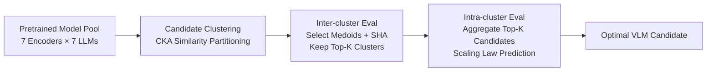

# Mordal: Automated Pretrained Model Selection for Vision Language Models

**Conference**: ICLR 2026  
**OpenReview**: [https://openreview.net/forum?id=ZQiO12xlJq](https://openreview.net/forum?id=ZQiO12xlJq)  
**Code**: [https://github.com/SymbioticLab/Mordal](https://github.com/SymbioticLab/Mordal)  
**Area**: Multimodal / Vision-Language Models / Model Selection / AutoML  
**Keywords**: VLM, Pretrained Model Selection, CKA Representation Similarity, Early Stopping, Scaling Law Prediction  

## TL;DR
Mordal automates the process of selecting the optimal vision encoder and LLM for a VLM. It employs representation similarity clustering to reduce candidate volume and combines early stopping with scaling law prediction to minimize individual evaluation costs. It identifies optimal combinations with 8.9–11.6× less GPU time than grid search.

## Background & Motivation
**Background**: Mainstream VLMs (LLaVA, InternVL, Qwen-VL) typically adopt a "vision encoder + feature projector + LLM" tripartite structure. Developers currently manually select these components from the vast model pool on HuggingFace.

**Limitations of Prior Work**: Model selection relies heavily on human intuition (e.g., choosing the newest or largest models), which is unreliable. Grid search empirical results show **no silver bullet**: the performance of a specific vision encoder or LLM varies significantly across GQA, VizWiz, ChartQA, DocVQA, ScienceQA, and AI2D. For certain tasks, VLMs built with Vicuna-1.5-7B even outperform those using Llama-3-8B.

**Key Challenge**: Existing transferability metrics (EMMS, LogME, LEEP, NLEEP) were designed for classification/regression or NLP tasks and use zero-shot performance as a proxy for quality. However, VLMs require vision-language alignment. Without training the projector, the LLM cannot interpret image embeddings, causing zero-shot outputs to be random noise. Brute-force grid search is prohibitively expensive: training 49 candidates takes 5,439 GPU hours, while HuggingFace's LLM count continues to grow.

**Goal**: Formalize the "VLM Pretrained Model Selection Problem"—identify the "vision encoder + LLM" combination that yields peak performance on a target task after alignment training, given an alignment dataset.

**Core Idea**: [Reduce search space + Reduce evaluation cost]. Efficient searching must optimize two orthogonal directions: **reducing the number of VLM candidates** (by clustering similar models and evaluating one per cluster) and **shortening the evaluation time per candidate** (using early stopping and scaling laws to extrapolate full performance from small samples).

## Method

### Overall Architecture
Mordal follows a two-stage pipeline: candidate clustering followed by efficient evaluation. The first stage (Candidate Clustering, §3.1) uses CKA representation similarity to group vision encoders and LLMs, performing inter-cluster and intra-cluster evaluations to prune candidates. The second stage (Efficient Evaluation, §3.2) utilizes Successive Halving (SHA) for early stopping and scaling laws to predict performance from intermediate checkpoints, avoiding full training for every candidate.

### Key Designs
**1. Representation Similarity Clustering: Grouping "similar looking candidates" via CKA**. Mordal operates on the premise that "similar models perform similarly." However, measuring similarity before projector training is difficult. Mordal employs **representation similarity** via Centered Kernel Alignment (CKA): $\mathrm{CKA}(K,L)=\frac{\mathrm{HSIC}(K,L)}{\sqrt{\mathrm{HSIC}(K,K)\cdot\mathrm{HSIC}(L,L)}}$, where $\mathrm{HSIC}(K,L)=\mathrm{Tr}(KHLH)$ and $H=I-\frac{1}{n}\mathbf{1}\mathbf{1}^\top$. CKA is chosen because it allows comparisons between representations of different shapes and is robust to linear transformations (like MLP projectors). Experiments show CLIP/SigLIP/DFN-CLIP exhibit similar CKA scores and performance on ScienceQA.

**2. Two-step Clustering: Vision clusters followed by LLM clusters**. Computing pairwise CKA is expensive. Mordal first clusters vision encoders to form $C_{ve}$ based on a distance matrix $\mathrm{Dist}_{ve}$ and threshold $t_{ve}$. Second, it takes a medoid from each vision cluster to generate fixed image embeddings, aligns them to the LLM input using a warm-up projector, and then clusters LLMs based on a distance matrix $\mathrm{Dist}_{llm}$ and threshold $t_{llm}$. This avoids similarity calculations for candidate pairs that are inherently dissimilar.

**3. Inter/Intra-cluster Evaluation + Early Stopping**. After clustering, inter-cluster evaluation selects a medoid representative for each cluster to prune poor-performing clusters. Successive Halving (SHA) is used for aggressive pruning: candidates are allocated an initial budget $b$, only the top $1/\eta$ are retained, and the budget is increased by $\eta$ in subsequent rounds. Intermediate checkpoints are reused. Intra-cluster evaluation then focuses on the individuals within the remaining Top-K clusters.

**4. Observed Scaling Law Prediction**. To further reduce costs, Mordal introduces scaling law prediction. While the number of parameters $N$ is fixed, Mordal observes that the relationship between alignment data volume $D$ and task error follows a **log-linear** relationship in log-log space. By evaluating checkpoints at increasing sampling ratios $r$ and recording $(\log r,\log\mathrm{Err})$, a linear regression $f_c$ is fitted after $p$ points to extrapolate full performance $f_c(1)$. Early stopping handles coarse screening, while scaling laws provide fine-grained prediction for high-potential candidates.

## Key Experimental Results
Setup: 7 datasets (Visual QA / Doc QA / Knowledge / Multi-discipline MMMU), 49 candidates (7 encoders × 7 LLMs), 16× A40 GPUs, LLaVA-1.5-Instruction for alignment, LoRA fine-tuning for LLMs, two-layer MLP projector.

### Main Results Table (Search Time + Top-1 Accuracy)
Grid search requires **5,439 GPU hours** per task for 49 candidates.

| Task | Dataset | LLaVA-1.5 Baseline | Mordal Selected Model | Mordal Time(h) | Gain | Top-1 Score |
|------|--------|----------------|-----------------|----------------|------|------------|
| Visual QA | GQA | 61.5 | SigLIP-Vicuna | 483 | 11.2× | 66.4 |
| Visual QA | VizWiz | 41.2 | SigLIP-Mistral | 469 | 11.6× | 46.9 |
| Doc QA | ChartQA | 18.2 | CLIP-Qwen | 607 | 8.9× | 18.6 |
| Doc QA | DocVQA | 27.6 | SigLIP-Qwen | 593 | 9.2× | 28.5 |
| Knowledge | ScienceQA | 70.4 | SigLIP-Llama | 472 | 11.5× | 78.5 |
| Knowledge | AI2D | 54.8 | SigLIP-Qwen | 496 | 10.9× | 65.2 |
| Multi-disc | MMMU | 35.3 | SigLIP-Llama | 503 | 10.8× | 36.6 |

Mordal matched the ground truth Top-1 in six out of seven tasks and consistently outperformed the default LLaVA-1.5-7B configuration.

### Ranking Quality Comparison (Weighted Kendall's $\tau$)

| Dataset | EMMS | LogME | LEEP | NLEEP | Mordal |
|--------|------|-------|------|-------|--------|
| GQA | 0.682 | -0.162 | 0.232 | 0.435 | **0.814** |
| VizWiz | 0.657 | 0.236 | 0.351 | 0.502 | **0.882** |
| ChartQA | 0.238 | -0.144 | -0.071 | 0.298 | **0.765** |
| DocVQA | 0.172 | 0.155 | 0.111 | 0.265 | **0.897** |
| ScienceQA | 0.770 | 0.269 | 0.344 | 0.562 | **0.960** |
| AI2D | 0.557 | 0.193 | 0.316 | 0.614 | **0.894** |
| MMMU | 0.526 | 0.101 | 0.245 | 0.220 | **0.875** |

Mordal achieved the highest $\tau$ across all 7 datasets, averaging 69% higher than the strongest baseline.

### Ablation Study (GQA)

| Configuration | Insight |
|------|------|
| w/o EE (Efficient Eval) | Clustering alone significantly reduces time while maintaining high $\tau$. |
| w/o ES (Early Stopping) | Search time increases notably. |
| w/o SP (Scaling Pred) | Pure early stopping may prune "late-blooming" strong candidates, dropping $\tau$. |
| Sensitivity of $t_{ve}$ | A threshold of 0.9 yields $\tau=0.86$ (1041h), while 0.5 yields $\tau=0.52$ (446h). |

### Key Findings
- The log-linear relationship between alignment data and error only stabilizes after a certain sample size threshold.
- Early stopping is ideal for coarse filtering, whereas scaling laws are better for precise estimation of promising candidates.

## Highlights & Insights
- **Problem Formulation**: This work is the first to formalize VLM pretrained component selection as a resource-constrained performance prediction problem, proving that "no silver bullet" exists.
- **CKA Utility**: Using representation similarity bypasses the requirement of alignment training for model comparison.
- **Orthogonal Decoupling**: The strategy of reducing candidate counts (clustering) and reducing evaluation cost (pruning/extrapolation) allows for efficient reuse of intermediate checkpoints.

## Limitations & Future Work
- Risk of pruning optimal combinations if a strong model is incorrectly clustered or eliminated via early stopping.
- Strong dependence on the empirical assumption that "representation similarity implies performance similarity."
- Scaling law extrapolation requires a stable log-linear regime, which may not exist for all data scales or tasks.
- Scalability to larger model pools, different projector architectures, or varied training paradigms remains to be verified.

## Related Work & Insights
- **Model Selection & Transferability**: Points out that EMMS, LogME, etc., fail for VLMs due to lack of alignment.
- **Representation Similarity**: CKA is repurposed here as an "untrained comparison" signal for clustering.
- **Early Stopping**: Successive Halving is adapted for cluster-level pruning.
- **Scaling Laws**: Extends scaling law observations from LLMs to the "fixed $N$, variable $D$" context of VLM alignment.

## Rating
- **Novelty**: ⭐⭐⭐⭐ — Novel formalization of the VLM component selection problem and effective use of CKA.
- **Experimental Thoroughness**: ⭐⭐⭐⭐ — Large-scale ground truth grid search and strong baseline comparisons.
- **Writing Quality**: ⭐⭐⭐⭐ — Clear motivation and well-structured methodology.
- **Value**: ⭐⭐⭐⭐ — Practical engineering value for multimodal model assembly and AutoML.

<!-- RELATED:START -->

<!-- RELATED:END -->

## Related Papers

- [\[ICML 2025\] Vision-Language Model Selection and Reuse for Downstream Adaptation](../../ICML2025/multimodal_vlm/vision-language_model_selection_and_reuse_for_downstream_adaptation.md)
- [\[ICLR 2026\] UniHM: Unified Dexterous Hand Manipulation with Vision Language Model](unihm_unified_dexterous_hand_manipulation_with_vision_language_model.md)
- [\[AAAI 2026\] PET2Rep: Towards Vision-Language Model-Driven Automated Radiology Report Generation for Positron Emission Tomography](../../AAAI2026/multimodal_vlm/pet2rep_towards_vision-language_model-drived_automated_radiology_report_generati.md)
- [\[ICLR 2026\] Enhanced Continual Learning of Vision-Language Models with Model Fusion](enhanced_continual_learning_of_vision-language_models_with_model_fusion.md)
- [\[CVPR 2026\] TTL: Test-time Textual Learning for OOD Detection with Pretrained Vision-Language Models](../../CVPR2026/multimodal_vlm/ttl_test-time_textual_learning_for_ood_detection_with_pretrained_vision-language.md)

<!-- RELATED:END -->
