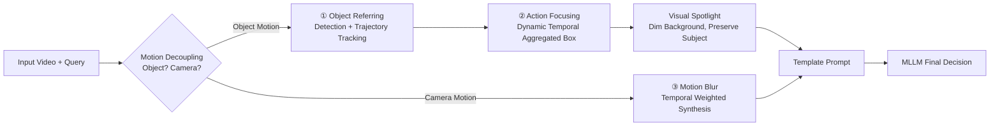

# MotionSight: Boosting Fine-Grained Motion Understanding in Multimodal LLMs

**Conference**: ICLR 2026  
**OpenReview**: [https://openreview.net/forum?id=ISZPRsh5YV](https://openreview.net/forum?id=ISZPRsh5YV)  
**Code**: [https://nju-pcalab.github.io/projects/MotionSight](https://nju-pcalab.github.io/projects/MotionSight)  
**Area**: Multimodal Video Understanding / MLLM Visual Prompting  
**Keywords**: Fine-grained motion understanding, Visual Prompting, Visual Spotlight, Motion Blur, Object/Camera Motion Decoupling, MotionVid-QA  

## TL;DR
MotionSight proposes a **training-free video visual prompting method** that uses "Visual Spotlights" to amplify object motion and "Synthetic Motion Blur" to amplify camera motion. By decoupling these two types of signals and feeding them into off-the-shelf MLLMs, it significantly improves fine-grained motion understanding. Furthermore, it distills the first large-scale fine-grained motion dataset, MotionVid-QA (40K videos / 87K QA), to train MotionChat.

## Background & Motivation
- **Background**: MLLMs are already proficient in event-level video understanding, but the essence that distinguishes video from static images is the **frame-by-frame changes in the temporal dimension**—specifically object motion and camera motion. Such fine-grained motion understanding has long lacked attention.
- **Limitations of Prior Work**: MLLMs tend to treat spatial regions "equally," lacking an explicit **inter-frame difference mechanism**. This leads to subtle visual cues being averaged out or ignored, resulting in suboptimal motion perception.
- **Key Challenge**: While visual prompting has proven effective in the image domain, directly transferring it to video often fails. Empirical tests in the paper show that "Background Blur," which performs best for images, performs the **worst** for fine-grained motion understanding because it destroys contextual information. How to tailor visual prompting for the temporal complexity of video remains an open question.
- **Goal**: To unlock the latent motion perception capabilities already present in MLLMs under a **zero-shot, training-free** premise, and transform this capability into structured data assets for training other models.
- **Core Idea**: **[Motion Decoupling + Exclusive Visual Prompting]**—Separate object motion from camera motion and stimulate the model with targeted prompts: "Visual Spotlight" (highlighting the subject, dimming the background) and "Synthetic Motion Blur" (strengthening inter-frame cues). Finally, a template prompt is used for integrated decision-making by the MLLM.

## Method

### Overall Architecture
Given sampled video frames $V_s$ and a user query $Q$, MotionSight first uses an MLLM to perform **query-driven motion decoupling** to determine if the query pertains to object motion or camera motion. Based on this, it follows different visual prompting branches: object motion follows `Object Referring → Action Focusing → Visual Spotlight`, and camera motion follows `Motion Blur` synthesis. The two tracks of enhanced videos are sent back to the MLLM via a unified template prompt for final decision-making, expressed as $R_{obj} = \text{MLLM}(\Phi_{obj}(V_s))$ and $R_{cam} = \text{MLLM}(\Phi_{cam}(V_s, V))$. This pipeline is also used in reverse as a data annotation engine to distill MotionVid-QA.

### Key Designs
**1. Object Referring: Locating "where to look" from the query.** The MLLM first reads $V_s$ and $Q$ to infer a set of semantically relevant object categories $C=\{c_1,...,c_n\}$. These are passed to a detector (e.g., GroundingDINO) on keyframe $I_{st}$ and then propagated along subsequent frames by a tracker (e.g., SAM2) to obtain trajectories $O = M_{track}(M_{detect}(I_{st}, C), \{I_{sj}\})$. The authors emphasize that even if initial detection is incorrect, robust object recognition can be refined over time by low-confidence detections, avoiding hallucinations during action reasoning.

**2. Action Focusing and Visual Spotlight: "Lighting up" the subject of motion.** After obtaining frame-wise boxes, a **dynamic temporal aggregator** $A$ merges jittery boxes into refined regions $B=\{b_t\}$. The aggregation window adapts to the positional variance $V(X)$ within the trajectory—using a longer time span for the union of boxes when variance is low (subject moves little) and shrinking to a local region for shorter windows when variance is high (intense movement). Variance is measured by the Manhattan distance between box centers $\|center(b_{st_1,i})-center(b_{st_2,i})\|_1$. Finally, the visual prompt function $\Phi_{obj}(V_s)=F_{VP}(V_s, B)$ acts like a spotlight, **dimming the background outside $B$ while preserving the subject in place**, strengthening the model's focus on motion elements. This is inspired by the natural "bright subject, dim background" compositions found in many stage/TV scenes in pre-training data.

**3. Motion Blur: Artificially "creating blur" to complement camera motion perception.** Camera motion requires the model to perceive subtle global scene changes, which is a weakness of MLLMs. The authors design a motion blur transform $T_{MB}$ as $\Phi_{cam}$: for a sampled frame $I_{st}$, it performs **temporal weighted aggregation** with its preceding $N$ frames in the raw video to generate an enhanced frame, $T_{MB}(\cdot)=\sum_{k=0}^{N-1} w_k(\gamma)\cdot I_{s_{t}-k}$, where the kernel $w_k$ satisfies $\sum_k w_k=1$ and shows a temporal increasing trend. This effectively creates "motion trails" on the frames, amplifying camera motion trajectories into visible signals—a step that yielded surprisingly large gains in camera motion judgment during experiments.

**4. MotionVid-QA Data Distillation (Two-stage SFT + DPO Annotation): Solidifying zero-shot capabilities into data assets.** MotionSight is used as an annotator to label approximately 40K video clips. After strict filtering via a technical quality predictor (clarity) + optical flow intensity estimator (motion suitability) + VQAScore, the data is stratified: high-quality samples enter the preference dataset, while others enter the instruction dataset. The SFT subset (35K videos / 80K QA) teaches the model to capture spatiotemporal dynamics; the DPO subset (5K / 7K) uses Tarsier2 annotations as "rejects" and human preferences as "chosen," aligning fine-grained motion understanding with human preferences via $\mathcal{L}_{DPO}=-\mathbb{E}[\log\sigma(\beta\log\frac{\pi_\theta(y_c|x)}{\pi_{ref}(y_c|x)}-\beta\log\frac{\pi_\theta(y_r|x)}{\pi_{ref}(y_r|x)})]$. Based on this, MotionChat is trained on Qwen2.5VL-7B.

## Key Experimental Results

### Main Results (MotionBench / FAVOR-Bench, Zero-shot Enhancement)

| Model | MotionBench Overall | MotionBench CM | FAVOR Overall | FAVOR CM |
|---|---|---|---|---|
| Qwen2.5VL-7B | 53.0 | 34.0 | 42.3 | 30.9 |
| **+ MotionSight** | **55.6** | **48.3** | **45.1** | **38.1** |
| InternVL3-78B | 61.5 | 55.8 | 52.8 | 34.3 |
| **+ MotionSight** | **63.0** | **58.7** | **53.8** | **37.1** |
| GLM-4V-Plus (Closed-source SOTA) | 62.8 | 67.4 | — | — |

- For Qwen2.5VL, the category average (AVG.) increased by +3.4% on MotionBench and +3.0% on FAVOR, with **Camera Motion (CM) soaring by 14.3% on MotionBench**.
- InternVL3-78B + MotionSight achieves state-of-the-art among open-source models and is competitive with the closed-source GLM-4V-Plus.

### Ablation Study on MotionChat Training (FAVOR-Bench)

| SFT | DPO | Overall | AVG. | CM |
|---|---|---|---|---|
| ✘ | ✘ (Original) | 42.3 | 41.6 | 30.9 |
| +ShareGPT4Video | — | 43.8 | 42.3 | 28.9 |
| ✔ | ✘ | 45.8 | 44.5 | 30.1 |
| ✔ | ✔ | **48.3** | **46.9** | **32.1** |

- After two-stage fine-tuning, MotionChat-7B achieved **48.3%**, comparable to Qwen2.5VL-**72B** (48.1%), validating the dataset quality (significantly better than ShareGPT4Video under identical conditions).

### Ablation Study on Visual Prompting (MotionBench, OM AVG.)

| Prompting Method | OM AVG. |
|---|---|
| Qwen2.5VL-7B Baseline | 51.7 |
| **+ Visual Spotlight** | **53.0** |
| + Object Crop | 52.5 |
| + Background Blur (Best for Images) | **49.3 (Worst)** |
| + Global Motion Blur (Camera Branch) | CM AVG. 34.0→48.3 |

### Key Findings
- **Visual Spotlight** is the optimal prompt for object motion; **Background Blur**, the strongest in the image domain, is the **worst** (blurring object boundaries and misleading the model), confirming that "image prompts cannot be directly migrated to video."
- Motion blur brings a qualitative change to **camera motion** (significant CM improvement), and MotionSight also provides gains on general tasks like VideoMME (e.g., Temporal Perception 83.3%→88.9%), indicating that the spotlight helps focus on task-relevant regions without causing global information loss.

## Highlights & Insights
- **Zero-shot Plug-and-Play**: It leverages latent MLLM capabilities purely through visual input-side prompting without altering model weights. It is applicable to any off-the-shelf MLLM, offering high engineering value.
- **Decoupling Captures the Essence**: Splitting "object motion" and "camera motion" into two types of signals requiring different visual enhancements, rather than forcing a unified prompt, is key to the method's effectiveness.
- **Counter-intuitive "Blur leads to Clarity"**: Artificially introducing motion blur transforms invisible camera trajectories into visible trails, effectively compensating for the MLLM's lack of inter-frame differentiation.
- **Method as Annotator**: The zero-shot capability is used in reverse as a large-scale data distillation engine, forming a closed loop of "prompt enhancement → data asset → training small/large models."

## Limitations & Future Work
- **Dependency on External Detectors/Trackers**: The Object Referring pipeline introduces modules like GroundingDINO/SAM2, increasing inference overhead and the risk of cascading errors; localization failures in complex scenes will hinder subsequent steps.
- **Multi-step Pipeline Inference Cost**: Decoupling judgments + multi-branch prompting means multiple MLLM calls per query, resulting in higher latency and compute than direct inference.
- **Synthetic Motion Blur**: Artificial trailing is an approximation; window size $N$ and kernel $w_k$ require tuning. Excessive blur might introduce artifacts and affect object detail judgment.
- **Evaluation Centered on Motion Benchmarks**: Although validated on VideoMME, robustness in more complex scenarios like long videos or dense multi-object interactions still needs further testing.

## Related Work & Insights
- **Image Visual Prompting** (Red circles, background blur, API prompting, etc.): This paper proves they are difficult to migrate directly to video and require redesigning for the temporal dimension—a significant reminder regarding the boundaries of "prompting universality."
- **Video Motion Benchmarks** (MotionBench, FAVOR-Bench): Sample size and scene diversity were insufficient, leading to the creation of the larger-scale open-source dataset MotionVid-QA.
- **MLLM Self-labeling + Preference Alignment** (Tarsier2, DPO/RLHF): Continues the paradigm of "using strong models to distill data + human preference alignment." The insight is that **good test-time augmentation methods are themselves sources of high-quality data**.

## Rating
- Novelty: ⭐⭐⭐⭐ The combination of motion decoupling + targeted visual prompting (Spotlight/Synthetic Motion Blur) is a novel entry point with counter-intuitive insights in the video MLLM prompting field.
- Experimental Thoroughness: ⭐⭐⭐⭐ Covers two major motion benchmarks + general sets like VideoMME/MVBench. Ablations for both prompting methods and training are solid, creating a closed loop of conclusions.
- Writing Quality: ⭐⭐⭐⭐ The logic from motivation to method to data to experiments is clear, with sufficient illustrations and well-defined formulas/pipelines.
- Value: ⭐⭐⭐⭐ Zero-shot plug-and-play + the first large-scale fine-grained motion dataset provides clear dual contributions in methodology and data to the community, with high practical value.

<!-- RELATED:START -->

## Related Papers

- [\[ICLR 2026\] UniF2ace: A Unified Fine-grained Face Understanding and Generation Model](unif2ace_a_underlineunified_underlinefine-grained_underlineface_understanding_an.md)
- [\[ICLR 2026\] GranViT: A Fine-Grained Vision Model For Autoregressive Multimodal Large Language Models](granvit_a_fine-grained_vision_model_for_autoregressive_multimodal_large_language.md)
- [\[CVPR 2026\] FAVE: A Structured Benchmark for Fine-Grained Audio-Visual Temporal Evaluation in Multimodal LLMs](../../CVPR2026/multimodal_vlm/fave_a_structured_benchmark_for_fine-grained_audio-visual_temporal_evaluation_in.md)
- [\[ICLR 2026\] WorldSense: Evaluating Real-World Omnimodal Understanding for Multimodal LLMs](worldsense_evaluating_real-world_omnimodal_understanding_for_multimodal_llms.md)
- [\[ICLR 2026\] Bongard-RWR+: Real-World Representations of Fine-Grained Concepts in Bongard Problems](bongard-rwr_real-world_representations_of_fine-grained_concepts_in_bongard_probl.md)

<!-- RELATED:END -->
