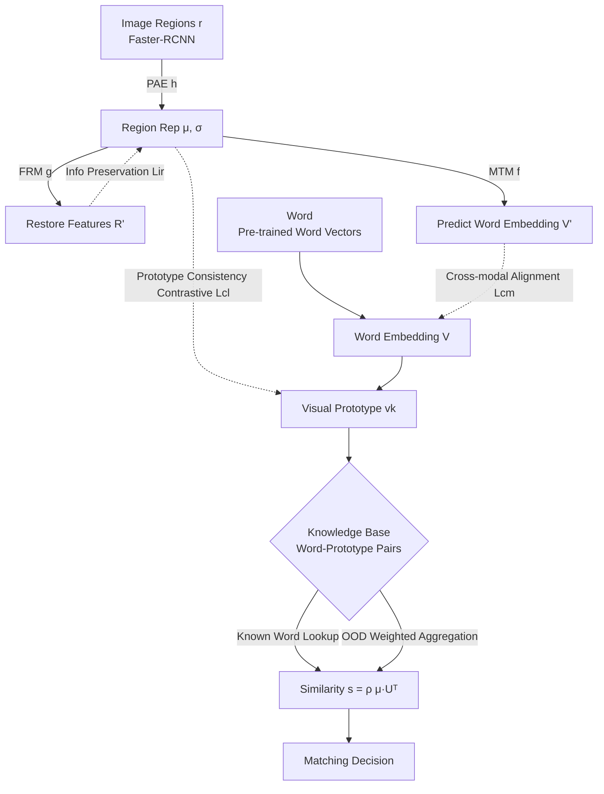

# Multimodal Aligned Semantic Knowledge for Unpaired Image-text Matching

**Conference**: ICLR 2026  
**OpenReview**: [https://openreview.net/forum?id=d3CISVVO6v](https://openreview.net/forum?id=d3CISVVO6v)  
**Code**: TBD  
**Area**: Multimodal / Image-Text Matching  
**Keywords**: Unpaired Image-Text Matching, Cross-modal Alignment, Visual Prototypes, Word Embeddings, Contrastive Learning, OOD Generalization  

## TL;DR
MASK uses pre-trained word vectors as a bridge to align each word to a "prototypical region representation." It leverages the semantic structure of word vectors to reconstruct visual prototypes for out-of-distribution (OOD) words and employs a prototype consistency contrastive loss to compress intra-class variance. This approach significantly outperforms existing knowledge-based methods in "unpaired image-text matching" without relying on in-domain paired data.

## Background & Motivation
- **Background**: Image-text matching is a foundational technology for tasks like VQA, image captioning, and cross-modal retrieval. Prevailing model-based methods (e.g., CHAN, 3SHNet based on Transformers) rely on massive paired data for supervised training, which is costly to annotate. To overcome this, "unpaired image-text matching" assumes that paired data is unavailable during training, instead mimicking the human ability to associate images and text without large-scale paired supervision.
- **Limitations of Prior Work**: The most representative knowledge-based method is MACK (Multimodal Aligned Conceptual Knowledge), which establishes correspondences between prototypical region representations and words. However, it suffers from three weaknesses: ① **Poor handling of OOD words**—it fails to utilize the semantic structure between words to transfer visual prototypes from known terms to unseen ones in the knowledge base; ② **Neglect of distribution variance**—appearance differences for the same word can be vast, leading samples far from the mean to be misclassified; ③ **Semantic gaps in raw representations**—representations are dominated by co-occurrence rather than semantic relevance (e.g., "human" and "hat" co-occur, but "human" and "gentleman" are semantically closer).
- **Key Challenge**: The vocabulary of a knowledge base is naturally constrained by the scale of public paired datasets, whereas pre-trained word embeddings cover a far larger vocabulary. The key to generalization lies in "extrapolating" limited visual prototype knowledge to massive OOD words while ensuring the visual space inherits the semantic geometry of the word vector space.
- **Goal**: To construct knowledge that establishes "semantic alignment" (rather than mere conceptual correspondence) between visual prototypes and word embeddings, enabling prototype reconstruction for OOD words and suppressing intra-class variance.
- **Key Insight**: **[Semantic Alignment]** Alignment is performed against the word embedding space rather than raw region representations, allowing visual prototypes to inherit semantic structures. **[OOD Reconstruction]** Visual prototypes for OOD words are reconstructed via weighted aggregation of known prototypes based on word vector similarity. **[Variance Suppression]** A prototype consistency contrastive loss clusters region representations of the same word around their respective prototypes.

## Method

### Overall Architecture
MASK consists of two phases: **Building Knowledge** and **Using Knowledge**. The building side involves three branches: the image embedding branch (PAE encoder $h$ compresses raw region representations $r$ into high-cohesion representations $\mu$, while the feature reconstruction module $g$ restores original features), the text embedding branch (modality transfer model $f$ maps $\mu$ to the word embedding space while maintaining semantic relations), and three alignment losses (Information Preservation $L_{ir}$, Cross-modal Alignment $L_{cm}$, and Prototype Consistency Contrastive $L_{cl}$). This results in "word embedding-visual prototype" pairs $\{(w_k, v_k)\}$. During use, sentences are tokenized to retrieve prototypes for similarity calculation via max-mean pooling; OOD words trigger on-the-fly prototype reconstruction.

### Key Designs

**1. Multimodal Semantic Aligned Knowledge: One-to-One instead of One-to-Many.** MASK emphasizes "cross-modal one-to-one alignment." Since the same word appears differently across regions, a one-to-many mapping causes confusion. MASK aligns each word to a single **prototypical region representation**. Specifically, the PAE encoder maps a region $r_j$ to Gaussian parameters $(\mu_j, \sigma_j)=h(r_j;\Theta_h)$, and the prototype is the mean of all representations for that word: $v_k=\frac{1}{J_k}\sum_{j=1}^{J_k}\mu_j$. This reduces appearance diversity to a single point representation.

**2. Information Preservation Loss $L_{ir}$:** To prevent the PAE from losing information during compression, $g$ reconstructs $R'=g(\mu, \sigma, z; \Theta_g)$ using a standard normal sample $z$. The loss is defined as $L_{ir}=D_{KL}(\mathcal{N}(\mu, \sigma^2) \Vert \mathcal{N}(0, 1)) + \mathbb{E}[\Vert r_n - r'_n \Vert_2^2]$. The KL term regularizes the latent space for OOD sampling, while the reconstruction term ensures $\mu$ retains discriminative information.

**3. Prototype Consistency Contrastive Loss $L_{cl}$:** This is the most significant contributor in ablation studies. Unlike standard instance-to-instance contrastive learning, $L_{cl}$ uses the prototype $v_k$ as the class center: $L_{cl}=-\frac{1}{B}\sum_{k=1}^{B}\log\frac{\exp(v_k \cdot \mu_+ / \tau)}{\sum_{n=1}^{B}\exp(v_k \cdot \mu_n / \tau)}$, where $\mu_+$ is a positive region representation of the same word. It clusters same-word regions and pushes different-word regions away, creating a structured feature space that suppresses errors caused by distribution variance.

**4. Cross-modal Alignment Loss $L_{cm}$ and OOD Prototype Reconstruction:** The MTM model $f$ maps $\mu$ to $V'=f(\mu;\Theta_f)$ as a **relation-preserving equivariant mapping**. It satisfy $d_s(f(\mu_i), f(\mu_j)) \propto d_s(\mu_i, \mu_j)$. The loss $L_{cm}=\mathbb{E}[1-\cos(w_i, w'_i)] + \mathbb{E}[(\cos(w'_i, w'_j) - \cos(\mu_i, \mu_j))^2]$ aligns region similarities to word similarities. This allows OOD words $w_{out}$ to reconstruct prototypes via weighted aggregation of top-$m$ nearest neighbors: $s_q = \text{softmax}(w_{out} \cdot w_q)$, $v_{out} = \sum_{q=1}^{m} s_q \cdot v_q$. Total loss: $L = L_{ir} + \lambda_1 L_{cm} + \lambda_2 L_{cl}$.

**5. Re-ranking Extension:** MASK is a knowledge-based method complementary to data-driven models like CLIP/ALBEF. For a query and top-$k$ candidates, MASK calculates a separate similarity $s_k$. Results are fused via Z-Score normalization: $\hat{s}_k = \text{ZS}(\tilde{s}_k) + \alpha \cdot \text{ZS}(s_k)$.

## Key Experimental Results

### Main Results (Unpaired Matching, Rs = Sum of Recalls)

| Type | Method | Flickr30K Rs | MSCOCO Rs |
|---|---|---|---|
| Model-based | 3SHNet 2024 | 103.5 | 149.7 |
| Model-based | BOOM 2024 | 106.4 | 145.7 |
| Knowledge-based | MACK 2022 | 95.3 | 201.7 |
| Knowledge-based | MACK$_{VG-M}$ 2024 | 104.8 | 205.2 |
| Knowledge-based | **Ours (MASK)** | **122.8** | **209.5** |

Model-based methods perform comparably on Flickr30K but lag behind on the complex MSCOCO dataset. MASK achieves the best Rs on both.

### Ablation Study

| Variation | Flickr30K Rs | MSCOCO Rs | Note |
|---|---|---|---|
| MASK Full | 122.8 | 209.5 | — |
| w/o OOD | 116.2 | 193.1 | OOD reconstruction is effective |
| w/o $L_{cm}$ | 101.0 | 150.8 | Cross-modal alignment is vital |
| w/o $L_{cl}$ | 92.4 | 123.5 | **Largest contribution** |

In zero-shot re-ranking, CLIP+MASK improved Flickr30K Rs from 525.5 to 534.3 and MSCOCO from 386.0 to 400.4, outperforming MACK/LeaPRR.

### Key Findings
- **$L_{cl}$ is the performance engine**: Removing it causes MSCOCO Rs to plummet to 123.5, proving that prototype-centered clustering is crucial for variance suppression.
- **Losses are complementary**: Best results occur when $\lambda_1 = \lambda_2$; bias toward one leads to overfitting.
- **OOD words provide consistent gains**, validating that relation-preserving mapping allows the visual space to inherit semantic geometry.
- MACK is consistently outperformed even in degraded settings, indicating higher intra-class cohesion in MASK.

## Highlights & Insights
- **Upgrading Correspondence to Alignment**: The core insight is forcing the visual prototype space to inherit the semantic geometry of word embeddings, allowing OOD reconstruction through nearest neighbors.
- **Explainable OOD Reconstruction**: The method rests on the assumptions of local linearity and equivariant mapping, explaining *why* weighted aggregation works rather than relying on empirical tuning.
- **Plug-and-Play Compatibility**: As a re-ranking module, it provides stable gains for CLIP/ALBEF, showing that knowledge-based and data-driven methods are additive.

## Limitations & Future Work
- Dependency on Faster-RCNN and pre-trained word embeddings; the quality is capped by the detector's performance and vocabulary coverage.
- The "one word, one prototype" assumption might over-compress polysemous words or terms with highly multimodal appearance distributions.
- OOD reconstruction relies on local linearity; prototype reconstruction might be biased in highly curved areas of the semantic manifold.
- Evaluation is limited to Flickr30K and MSCOCO; broader open-domain or fine-grained scenarios remain untested.

## Related Work & Insights
- **Model-based Matching**: Ranges from VSE (Socher 2013) to SCAN (Lee 2018) and modern Transformer models (CHAN, 3SHNet). Powerful but data-hungry.
- **Knowledge-based Matching**: Evolves from visual concepts (Feng 2019) to scene graphs and MACK (Huang 2022). MASK directly addresses the OOD and variance bottlenecks in the MACK lineage.
- **Insight**: Using the well-structured geometry of one modality (word vectors) to supervise/extrapolate another is a generalizable strategy for cross-modal imbalance.

## Rating
- **Novelty**: ⭐⭐⭐⭐ — Clear conceptual upgrade from MACK with explainable OOD reconstruction.
- **Experimental Thoroughness**: ⭐⭐⭐⭐ — Comprehensive ablation, cross-dataset validation, and re-ranking tests; lacks open-domain verification.
- **Writing Quality**: ⭐⭐⭐⭐ — Logical flow from pain points to methodology and validation.
- **Value**: ⭐⭐⭐⭐ — Clear utility for low-resource matching and enhancing existing large models.

<!-- RELATED:START -->

...

## Related Papers

- [\[CVPR 2026\] Text-Printed Image：把文本「印」成图片来弥合图文模态鸿沟](../../CVPR2026/multimodal_vlm/text-printed_image_bridging_the_image-text_modality_gap_for_text-centric_trainin.md)
- [\[ICLR 2026\] A High Quality Dataset and Reliable Evaluation for Interleaved Image-Text Generation](a_high_quality_dataset_and_reliable_evaluation_for_interleaved_image-text_genera.md)
- [\[ICLR 2026\] Asynchronous Matching with Dynamic Sampling for Multimodal Dataset Distillation](asynchronous_matching_with_dynamic_sampling_for_multimodal_dataset_distillation.md)
- [\[CVPR 2026\] ReMatch: Boosting Representation through Matching for Multimodal Retrieval](../../CVPR2026/multimodal_vlm/rematch_boosting_representation_through_matching_for_multimodal_retrieval.md)
- [\[CVPR 2026\] Camouflage-aware Image-Text Retrieval via Expert Collaboration](../../CVPR2026/multimodal_vlm/camouflage-aware_image-text_retrieval_via_expert_collaboration.md)

<!-- RELATED:END -->
