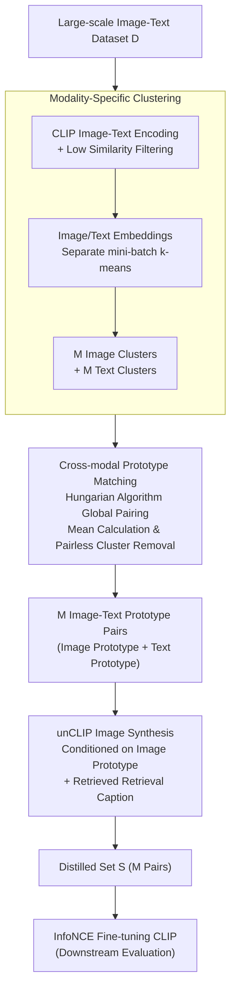

# Multimodal Dataset Distillation Made Simple by Prototype-Guided Data Synthesis

**Conference**: ICLR 2026  
**arXiv**: [2602.19756](https://arxiv.org/abs/2602.19756)  
**Code**: [GitHub](https://github.com/junhyeok9712/PDS)  
**Area**: Information Retrieval  
**Keywords**: Multimodal distillation, CLIP, unCLIP, Prototype learning, training-free distillation  

## TL;DR

Ours proposes PDS (Prototype-Guided Data Synthesis), the first training-free multimodal dataset distillation framework. It utilizes the CLIP-aligned embedding space for modality-specific clustering, obtains cross-modal image-text prototype pairs through Hungarian matching, and synthesizes distilled images from image prototypes using an unCLIP decoder. At a minimal scale of 100 pairs, PDS outperforms optimization-based methods with zero training cost and achieves SOTA cross-architecture generalization.

## Background & Motivation

**Background**: The success of vision-language models like CLIP relies on large-scale image-text datasets such as LAION-5B, which incur extremely high training costs. While dataset distillation (compressing large datasets into small sets of synthetic samples) is mature in image classification, research in multimodal scenarios remains in early stages. Existing multimodal distillation methods include only a few works such as MTT-VL, TESLA-VL, and LoRS.

**Limitations of Prior Work**: Existing multimodal distillation methods are all optimization-based, leading to three fundamental issues. First, computational cost is immense: models must be repeatedly trained on full data with all intermediate parameters stored, which becomes unsustainable as datasets and models scale. Second, strong architecture dependency: the joint optimization of image pixels and text features essentially adds architecture-related adversarial perturbations to initialized images. Synthesized distilled sets resemble original images but require complete re-distillation when switching backbones (e.g., from NFNet to ResNet/ViT). Third, subset selection methods fail completely at extremely small scales (e.g., 100 pairs) due to an inability to maintain semantic diversity.

**Key Challenge**: Optimization methods are "heavy" (computationally expensive + architecture-locked), while subset selection is "shallow" at minimal scales (insufficient semantic diversity). A distillation scheme that is both training-free and architecture-agnostic is required.

**Key Insight**: It is observed that the CLIP embedding space naturally aligns image and text modalities, allowing for the direct acquisition of semantic prototypes via clustering within this space. A critical insight is that an unCLIP decoder can generate images directly from CLIP image embeddings (which standard Stable Diffusion cannot), thereby bypassing pixel-space optimization.

**Core Idea**: Build cross-modal prototypes using CLIP embedding clustering and Hungarian matching, then synthesize distilled images from image prototypes using unCLIP to achieve zero-training multimodal dataset distillation.

## Method

### Overall Architecture

PDS is a three-stage pipeline: given a large-scale image-text dataset $\mathcal{D} = \{(x_n, y_n)\}_{n=1}^N$, it outputs a compressed distilled set $\mathcal{S} = \{(\tilde{x}_m, \tilde{y}_m)\}_{m=1}^M$ ($M \ll N$). The three stages are: (i) Modality-specific clustering—extracting embeddings via CLIP encoders and performing separate clustering to identify $M$ semantic skeletons; (ii) Cross-modal prototype matching—aligning image and text clusters globally via the linear assignment problem to obtain image-text prototype pairs; (iii) unCLIP image synthesis—generating distilled images from image prototypes using an unCLIP decoder. The entire process requires no parameter training. The distilled set is evaluated by fine-tuning CLIP with standard contrastive loss.

### Key Designs

**1. Modality-Specific Clustering: Identifying semantically diverse representatives in the CLIP aligned space**

The first step is to concentrate $M$ "skeletons" from massive samples. The challenge lies in covering semantic diversity while ensuring alignment between image and text branches. PDS first encodes all pairs into embeddings $\{(z_n^{\text{img}}, z_n^{\text{txt}})\}$ using CLIP encoders, filters out low-similarity (noisy/weakly aligned) pairs, and performs mini-batch k-means separately on image and text embeddings. The number of clusters is set to the target distilled set size $M$, resulting in $M$ image clusters and $M$ text clusters. CLIP encoders are essential here; replacing them with VAE encoders (common in image classification distillation) results in a collapse of IR@10 from 37.3% to 17.2% because VAE space is not aligned with text space.

**2. Cross-modal Prototype Matching: One-to-one pairing of image and text clusters via Hungarian algorithm**

The $M$ image clusters and $M$ text clusters are independently indexed. Matching them requires knowing which image cluster corresponds to which text cluster. Unlike greedy pairing, which cannot guarantee global optimality, PDS uses linear assignment. A cost matrix $K \in \mathbb{R}^{M \times M}$ is constructed where $K_{ij}$ is the negative count of shared image-text pairs between image cluster $C_i^{\text{img}}$ and text cluster $C_j^{\text{txt}}$. The problem is solved via the Hungarian algorithm:

$$\min_P \sum_{ij} K_{ij} P_{ij},$$

where $P$ is a permutation matrix. For each matched cluster pair, only the embeddings of shared pairs are averaged to obtain a prototype pair $(\tilde{z}_i^{\text{img}}, \tilde{z}_j^{\text{txt}})$. "Pairless clusters" (clusters with no shared pairs) are discarded to avoid introducing cross-modal noise.

**3. unCLIP Image Synthesis: Decoding distilled images directly from image prototype embeddings**

The final step is converting the image prototype embedding back into a trainable image. Since the standard Stable Diffusion U-Net only accepts text conditions, PDS utilizes the unCLIP decoder architecture. The image prototype $\tilde{z}_i^{\text{img}}$ is used as the primary condition, supplemented by the actual caption most similar to the text prototype as an auxiliary text condition. Generation employs classifier-free guidance (scale=5.0, 100 steps) to produce 224×224 distilled images. Comparison with alternatives shows that: retrieval of real images fails to maintain diversity; text-only generation (unCLIP text-to-image) loses fine-grained visual information; and pixel-space CLIP inversion is prohibitively slow (1477s vs 9.7s for PDS) and generates unrealistic images.

### Loss & Training

Ours involves no training or loss function optimization during distillation, which is its core advantage. After the distilled set is generated, downstream evaluation is conducted by fine-tuning a CLIP model using the standard InfoNCE contrastive loss on the distilled set. During evaluation, the text encoder is frozen, and only the image encoder and a learnable linear projection layer are trained. All experiments were completed on a single RTX 3090.

## Key Experimental Results

### Main Results: Cross-Architecture Generalization (Flickr30K, Distilled using CLIP ViT-L/14)

| Eval Backbone | Pairs | Method | IR@1 | IR@10 | TR@1 | TR@10 |
|:---:|:---:|:---|:---:|:---:|:---:|:---:|
| ResNet-50 | 100 | TESLA-VL | 4.1 | 22.9 | 6.5 | 27.3 |
| ResNet-50 | 100 | LoRS | 6.3 | 28.0 | 9.1 | 34.5 |
| ResNet-50 | 100 | **PDS (Ours)** | **7.9** | **37.3** | **10.2** | **39.0** |
| ResNet-50 | 300 | TESLA-VL | 10.3 | 40.6 | 14.9 | 48.8 |
| ResNet-50 | 300 | LoRS | 8.6 | 33.5 | 14.7 | 44.1 |
| ResNet-50 | 300 | **PDS (Ours)** | **14.4** | **51.4** | **18.7** | **57.8** |
| ViT-Ti/16 | 100 | TESLA-VL | 2.1 | 13.1 | 2.6 | 13.7 |
| ViT-Ti/16 | 100 | LoRS | 2.8 | 16.1 | 5.2 | 20.5 |
| ViT-Ti/16 | 100 | **PDS (Ours)** | **6.8** | **28.5** | **6.6** | **26.9** |
| ViT-Ti/16 | 300 | TESLA-VL | 5.1 | 24.5 | 6.1 | 27.3 |
| ViT-Ti/16 | 300 | LoRS | 4.1 | 20.7 | 6.2 | 25.7 |
| ViT-Ti/16 | 300 | **PDS (Ours)** | **9.1** | **38.4** | **9.6** | **37.5** |

PDS leads across all settings. For ResNet + 300 pairs, PDS improves IR@10 by 10.8pp and TR@10 by 9.0pp over the next best. The Gain on ViT is even more pronounced, indicating that optimization-based methods suffer from severe architecture lock-in.

### Ablation Study: Comparison of Image Synthesis Strategies (100 pairs, Flickr30K, ResNet)

| Method | IR@1 | IR@10 | TR@1 | TR@10 | Memory (GB) | Time (s) |
|:---|:---:|:---:|:---:|:---:|:---:|:---:|
| Text-prototype retrieval | 5.2 | 27.1 | 6.4 | 28.2 | — | — |
| Image-prototype retrieval | 5.5 | 28.7 | 8.0 | 30.2 | — | — |
| unCLIP text-to-image | 5.2 | 26.7 | 6.4 | 28.9 | — | — |
| CLIP Inversion (Img-align) | 4.4 | — | 4.2 | — | 6.13 | 1477.7 |
| CLIP Inversion (Txt-align) | 1.4 | — | 2.0 | — | 6.13 | 1477.7 |
| **PDS (Full)** | **7.9** | **37.3** | **10.2** | **39.0** | **4.34** | **9.7** |

This table demonstrates: (1) Using image prototypes significantly outperforms text prototypes; (2) Synthesized images outperform retrieved images; (3) PDS is 150x faster than CLIP inversion with superior results.

### Comparison with Subset Selection (100 pairs, Flickr30K, ResNet)

| Method | IR@1 | IR@10 | TR@1 | TR@10 |
|:---|:---:|:---:|:---:|:---:|
| K-center | 2.9 | 16.8 | 5.3 | 24.1 |
| Herding | 3.6 | 20.1 | 6.7 | 28.2 |
| CLIP score filter | 2.5 | 14.5 | 4.7 | 18.9 |
| LAION filter | 2.4 | 14.5 | 4.7 | 19.3 |
| Image-based filter | 2.2 | 13.6 | 4.0 | 16.2 |
| **PDS (Ours)** | **7.9** | **37.3** | **10.2** | **39.0** |

At minimal scales (100 pairs), PDS achieves an IR@10 that is 17.2pp higher than the best subset selection method (Herding). Subset selection is constrained to real samples and cannot maintain semantic diversity via interpolation.

### Key Findings

- **Training-free outperforms optimization**: PDS surpasses TESLA-VL and LoRS across all distilled sizes and backbones without any training, breaking the assumption that distillation requires complex bi-level optimization.
- **Optimization methods are essentially adversarial noise**: Visualizations reveal that images from TESLA-VL/LoRS are nearly identical to their initialization, meaning they primarily learn architecture-dependent perturbations, leading to poor generalization.
- **Image prototypes are critical**: Pure unCLIP text-to-image achieves an IR@10 of only 26.7%, which jumps to 37.3% with image prototypes, proving that image embeddings convey fine-grained visual info missing in text.
- **CLIP alignment is a prerequisite**: Replacing CLIP with VAE (as in D4M/MGD3) drops IR@10 from 37.3% to the range of 9.8%~17.2%, proving cross-modal alignment quality dictates distillation success.
- **Strategy for pairless clusters**: At small distillation scales, pairless clusters are rare and negligible. At larger scales, discarding them is essential to prevent introducing misaligned noise.

## Highlights & Insights

- **Counter-intuitive "Training-free > Training-based"**: PDS uses off-the-shelf capabilities of CLIP+unCLIP without optimizing any parameters to outperform training-intensive methods. It demonstrates that when a pre-trained embedding space is sufficiently good, structural utilization (clustering+matching+decoding) is more effective than end-to-end optimization.
- **Strategic use of unCLIP decoder**: The authors correctly identified that Stable Diffusion cannot be conditioned on CLIP image embeddings, whereas unCLIP fills this gap perfectly. This illustrates a profound understanding of generative model boundaries.
- **Surprising efficiency**: Synthesis takes only 9.7s with 4.34GB VRAM vs 1477s and 6.13GB for CLIP inversion. The process is fully feasible on a single consumer GPU (RTX 3090).

## Limitations & Future Work

- **Encoder lock-in**: PDS depends on the CLIP embedding space and cannot benefit from stronger encoders (like SigLIP) until corresponding unCLIP-style decoders are available.
- **Domain transfer limitations**: Since CLIP and unCLIP are trained on natural images, performance may degrade in specialized domains like medical imaging without domain-specific fine-tuning.
- **Long-tail representation**: Cluster centers naturally bias toward high-frequency semantics, potentially marginalizing rare concepts.
- **Evaluation task coverage**: The paper focuses on image-text retrieval (R@k), leaving generalization to VQA, Captioning, or classification to be verified.
- **Future work**: (1) Adaptive clustering numbers to dynamically allocate samples to semantic clusters; (2) Iterative training-free prototype refinement using synthesized results for calibration.

## Related Work & Insights

- **vs TESLA-VL / LoRS**: These use trajectory matching for bi-level optimization, learning pixel+text features with high cost and architecture lock. PDS bypasses optimization entirely with clustering+matching+generation.
- **vs D4M / MGD3**: These are training-free methods for image classification using VAE. They fail in multimodal settings due to misalignment between VAE and CLIP spaces, highlighting the necessity of cross-modal alignment.
- **vs Subset Selection**: Subset selection is limited to original samples and lacks diversity at small scales. PDS overcomes this via interpolation in embedding space followed by generation.

## Rating

- Novelty: ⭐⭐⭐⭐⭐ First training-free multimodal distillation + first use of unCLIP for synthesis in distillation.
- Experimental Thoroughness: ⭐⭐⭐⭐ Extensive cross-architecture generalization, minimal set comparisons, and multiple baselines/ablations.
- Writing Quality: ⭐⭐⭐⭐ Clear description of the 3-stage pipeline and consistent motivation.
- Value: ⭐⭐⭐⭐ High practical value for multimodal data efficiency; runs on a single GPU.

<!-- RELATED:START -->

## Related Papers

- [\[ICLR 2026\] Multimodal Dataset Distillation via Phased Teacher Models](multimodal_dataset_distillation_via_phased_teacher_models.md)
- [\[ICLR 2026\] Asynchronous Matching with Dynamic Sampling for Multimodal Dataset Distillation](asynchronous_matching_with_dynamic_sampling_for_multimodal_dataset_distillation.md)
- [\[NeurIPS 2025\] CovMatch: Cross-Covariance Guided Multimodal Dataset Distillation with Trainable Text Encoder](../../NeurIPS2025/multimodal_vlm/covmatch_crosscovariance_guided_multimodal_dataset_distillat.md)
- [\[CVPR 2026\] Multimodal Distribution Matching for Vision-Language Dataset Distillation](../../CVPR2026/multimodal_vlm/multimodal_distribution_matching_for_vision-language_dataset_distillation.md)
- [\[ICLR 2026\] Manzano: A Simple and Scalable Unified Multimodal Model with a Hybrid Vision Tokenizer](manzano_a_simple_and_scalable_unified_multimodal_model_with_a_hybrid_vision_toke.md)

<!-- RELATED:END -->
