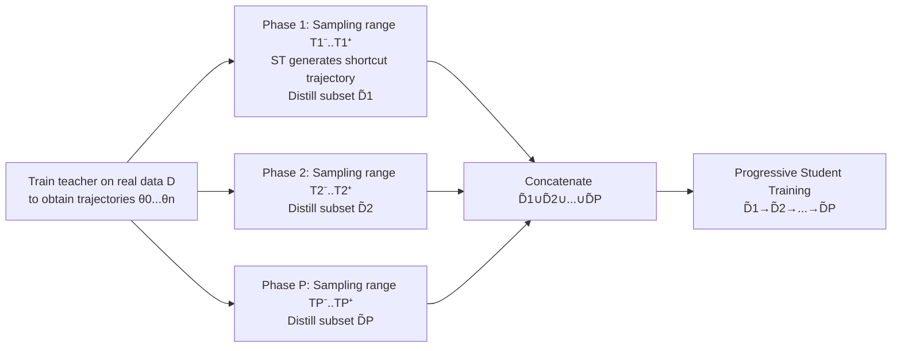

# Multimodal Dataset Distillation via Phased Teacher Models

**Conference**: ICLR 2026  
**Code**: [https://github.com/Previsior/PTM-ST](https://github.com/Previsior/PTM-ST)  
**Area**: Multimodality / Dataset Distillation  
**Keywords**: Multimodal Dataset Distillation, Trajectory Matching (MTT), Phased Teacher, Shortcut Trajectory, Image-Text Retrieval  

## TL;DR
Addressing the phenomenon in multimodal dataset distillation where the "teacher is only useful in the first 20–30% of the training phase and the trajectory becomes unstable later," this paper proposes PTM-ST. By using **Phased Teacher Models + Shortcut Interpolated Trajectories**, the distillation is decomposed into multiple sub-tasks with stabilized gradient directions, significantly outperforming SOTA on Flickr30k/COCO image-text retrieval (Flickr30k average +9.53%, max +13.5%).

## Background & Motivation
**Background**: Dataset Distillation (DD) approximates large-scale data training dynamics by synthesizing a small batch of "condensed samples," which is mature in unimodal image tasks. Recent works like MTT-VL and LoRS have attempted to migrate Match-Training-Trajectory (MTT) based distillation to multimodal scenarios, primarily by applying unimodal strategies or adding low-rank similarity matrices to enhance cross-modal alignment.

**Limitations of Prior Work**: These methods remain at the surface level of "modifying data structures / distance metrics" without questioning the fundamental mechanistic differences between multimodal and unimodal distillation. The authors conducted a key control experiment (under a unified MTT framework) and found that in unimodal tasks, the teacher provides effective guidance throughout the training process, but **multimodal distillation only benefits from the first 20–30% of training epochs**. Although the teacher's performance continues to rise in later stages, using it directly for distillation causes a sharp drop in student performance.

**Key Challenge**: Further analysis of the gradients passed from the teacher to the synthetic data revealed that as training progresses, the gradient norm increases (signal becomes stronger), but the **gradient direction becomes highly inconsistent and jitters severely**. Thus, a dilemma arises: the late-stage teacher "knows more" but "teaches messily." A single synthetic subset subjected to long-term high-amplitude, unstable updates cannot reliably absorb knowledge across stages. The authors hypothesize that this stems from the sparsity of multimodal data and the lack of explicit semantic constraints, causing the teacher to encode vastly different knowledge patterns at different stages.

**Goal**: Design a distillation framework that can dynamically adapt to teacher knowledge evolution and stabilize cross-stage knowledge transfer.

**Core Idea**: **[Divide and Conquer]** Split the distillation into $P$ phases along the timeline, with each phase using its own "phased teacher" to distill a subset (PTM); **[Stabilize Trajectory]** Replace the original jittery trajectory with shortcut interpolated trajectories that preserve start and end points, ensuring smooth matching targets and consistent gradient directions in each phase (ST).

## Method

### Overall Architecture
PTM-ST is built upon the nested loops of LoRS/MTT (outer loop optimizes synthetic data, inner loop trains students to match teacher trajectories) and introduces two components: **Phased Teacher Models (PTM)** decompose a single distillation target into $P$ temporal sub-tasks, with each sub-task corresponding to a phased teacher and distilling a subset $\tilde{D}_p$; **Shortcut Trajectories (ST)** use smooth interpolated trajectories instead of raw teacher trajectories as matching targets in each phase. During testing, all subsets $\tilde{D}_1\cup\cdots\cup\tilde{D}_P$ are concatenated, allowing the student to reproduce the teacher's complete training dynamics **progressively** by learning from $\tilde{D}_1$, then $\tilde{D}_2$, and so on.

### Key Designs

**1. Phased Teacher Models (PTM): Turning "one teacher for all" into a "relay race."** The authors first verified that simply switching teachers according to training phases does not work without proper trajectory modeling. PTM splits the distillation process into $P$ phases, where each phase $p$ independently distills a small subset $\tilde{D}_p$ and dynamically adjusts the sampling range for the trajectory starting point $\{T_p^-,\dots,T_p^+\}$. This range slides forward as training progresses, so each phase actually forces the corresponding subset to fit the teacher's learning dynamics for "that specific segment." The optimization goal for phase $p$ is $\tilde{D}^*_p = \arg\min_{\tilde{D}_p} \mathbb{E}_{T\sim(T_p^-,\dots,T_p^+)} L_{PTM}(\tilde{D}_p,\theta^p_T)$, where the matching loss uses the normalized parameter distance from MTT: $L_{PTM} = \|\tilde{\theta}^p_{T+t}-\theta^p_{T+\Delta T}\|_2^2 / \|\theta^p_T-\theta^p_{T+\Delta T}\|_2^2$. This allows subsets to focus on different stages of knowledge. Unioning them covers the full training trajectory while distributing the pressure of high-magnitude gradients across multiple subsets, leading to more stable updates.

**2. Shortcut Trajectory (ST): Taking an interpolation shortcut instead of hard-fitting jittery trajectories.** PTM identifies phases but doesn't solve the "jitter within each phase." The authors plotted the cosine similarity of gradients from different alignment starting points (Fig 4a) and found low similarity and chaotic directions in original trajectories. ST's approach is: for phase $p$ with an endpoint $t_p$, preserve only the critical information of the start and end teachers $\theta_0$ and $\theta_{t_p}$, and generate intermediate teachers with "stronger structure and clearer guidance" via interpolation, defined as $\theta^p_t = (1-\beta_p(t))\theta_0 + \beta_p(t)\theta_{t_p}$. The weights $\beta_p(t)$ are non-uniform, calculated based on the cumulative displacement ratio of the original trajectory $\beta_p(t) = \sum_{l=0}^{t-1}\text{Norm}(\theta_{l+1}-\theta_l) / \sum_{l=0}^{t_p-1}\text{Norm}(\theta_{l+1}-\theta_l)$, with layer-wise $\ell_2$ normalization applied to eliminate scale differences between layers. Unlike MCT, which uses only the final point of the teacher trajectory for interpolation, ST uses specific endpoints for each phase to capture epoch-by-epoch changes. Theoretically, the authors prove (Proposition 1) that the gradient difference between two matching ranges on the interpolation trajectory **converges linearly** with the starting point interval $\Delta t$ ($\|\nabla_{\tilde{D}}L_2 - \nabla_{\tilde{D}}L_1\| \le K\Delta t + O(\Delta t^2)$), whereas the original trajectory offers no such guarantee.

**3. EMA Smoothing: Adding a filter to the synthetic data itself.** After each outer-loop update of the synthetic subset, exponential moving average $\hat{D}^i_p = \alpha\hat{D}^{i-1}_p + (1-\alpha)\tilde{D}^i_p$ (decay $\alpha=0.99$) is applied to smooth the distilled data, further suppressing high-frequency noise during iteration. Ablations show that while EMA provides limited improvement alone, it yields stable gains when combined with PTM/ST. The complete procedure is summarized in Algorithm 1.

## Key Experimental Results

### Main Results (Flickr30k, R@K, higher is better)
Evaluated on image-text retrieval: IR@K (Image Retrieval) and TR@K (Text Retrieval); compared against core-set selection (Random/Herd/K-center/Forget) and distillation methods (MTT-VL/LoRS/EDGE).

| Pairs | Metric | Prev. SOTA (LoRS) | Ours (PTM-ST) | Gain (△) |
|---|---|---|---|---|
| 100 (0.3%) | IR@10 | 35.5 | **41.5** | +6.0 |
| 100 | TR@10 | 44.9 | **52.7** | +7.8 |
| 200 (0.7%) | IR@10 | 40.0 | **48.5** | +8.5 |
| 200 | TR@5 | 36.1 | **45.9** | +9.8 |
| 500 (1.7%) | TR@5 | 37.6 | **51.1** | +14.0 |
| 500 | TR@10 | 51.1 | **64.6** | +13.5 |

Performance is also comprehensively superior on COCO (harder, sparser):

| Pairs | Metric | Prev. SOTA (LoRS) | Ours (PTM-ST) | Gain (△) |
|---|---|---|---|---|
| 200 (1.7‰) | IR@10 | 14.7 | **22.2** | +7.5 |
| 200 | TR@10 | 20.8 | **27.8** | +7.0 |
| 500 (4.4‰) | IR@10 | 19.2 | **30.7** | +11.5 |
| 500 | IR@5 | 11.8 | **20.5** | +8.7 |

On the larger LLaVA-cc3m (595k pairs, split 3:1:1), it consistently outperforms LoRS (e.g., 500 pairs IR@5 6.2→11.4), proving effectiveness as data scale and model capacity increase.

### Ablation Study (500 pairs, Flickr30k IR / TR @K)

| Configuration | IR@1 | IR@5 | IR@10 | TR@1 | TR@5 | TR@10 |
|---|---|---|---|---|---|---|
| BASE | 12.2 | 33.0 | 45.7 | 16.2 | 39.4 | 54.0 |
| +EMA | 12.9 | 33.7 | 46.3 | 16.2 | 40.6 | 54.3 |
| +PTM | 13.4 | 35.2 | 48.1 | 19.6 | 43.2 | 55.5 |
| +ST | 14.2 | 37.8 | 50.8 | 19.5 | 45.1 | 59.3 |
| PTM+ST | **15.4** | **38.8** | **52.2** | **22.3** | **50.5** | **64.6** |

### Key Findings
- **Three components are complementary**: PTM and ST are effective individually, and their combination (PTM+ST) yields the maximum gain, with TR@10 rising from 54.0 to 64.6; EMA serves as an auxiliary stabilizer.
- **Extreme compression ratio**: On Flickr30k, using only **1.7% of data** achieves **76%** of the performance of full training.
- **Greater advantage with more samples**: As synthetic pairs increase from 100 to 500, the gain of PTM-ST relative to SOTA expands, indicating that phasing allows different subsets to capture different teacher dynamics.
- **Core-set selection fails**: Selection methods like Random/Herd/K-center are close to or worse than random, confirming they struggle to model cross-modal training dynamics.
- Entirely completed on a **single 3090 GPU**, with low storage and VRAM overhead.

## Highlights & Insights
- **Diagnosis precedes the method**: The most valuable part of this work is not just the tricks, but using control experiments and gradient visualization to reveal the counter-intuitive phenomenon that "multimodal distillation only uses the first 20–30% of the teacher, and later trajectories are chaotic," repositioning the problem from "alignment/metrics" to "teacher training dynamic stability."
- **Closed loop between theory and phenomenon**: Proposition 1 uses the Hessian Lipschitz assumption to prove that the gradient difference of interpolated trajectories converges linearly with $\Delta t$, providing a provable explanation for why ST is more stable.
- **Phasing = Knowledge Division + Load Sharing**: Replacing a single subset with multiple subsets allows each to focus on a segment of knowledge while avoiding long-term exposure of single data points to large, unstable gradients.

## Limitations & Future Work
- **Narrow task scope**: Experiments are concentrated on image-text retrieval; effects on VQA, captioning, or multimodal classification have not been verified.
- **Hyperparameter dependence**: The number of phases $P$, ranges $T_p^-/T_p^+$, and endpoints $t_p$ must be preset. The paper lacks discussion on adaptive selection, which might require tuning for new datasets.
- **Dependence on MTT paradigm**: The method relies on trajectory matching, requiring the training and storage of teacher trajectories, which may be costly for extremely large data compared to distribution-matching methods.
- **Traditional encoders**: Main experiments use NFNet + frozen BERT. Although the appendix tests DiNo-v2/BGE, compatibility with current mainstream VLMs (CLIP-L, SigLIP, etc.) needs more systematic verification.

## Related Work & Insights
- **Trajectory Matching Distillation (MTT Family)**: MTT, TESLA, MTT-VL, and LoRS are direct predecessors. This work inherits the dual-loop structure but reconstructs how teacher trajectories are utilized.
- **Trajectory Interpolation/Convexification**: The comparison with MCT (Matching Convexified Trajectory) is a key differentiator—MCT uses a single interpolation from the final point, while this work uses phase-specific endpoints.
- **Insight**: ① The perspective that "teachers encode different forms of knowledge at different stages" can be generalized to knowledge distillation/curriculum learning, suggesting that "when to trust the teacher" is worth modeling; ② Using cumulative displacement ratios as non-uniform weights with layer-wise normalization is a practical technique for handling varying scales in parameter space, applicable to other trajectory/weight averaging methods.

## Rating
- **Novelty**: ⭐⭐⭐⭐ Discovers a multimodal-specific "phased knowledge gap" through control experiments and systematically addresses it with phased teachers, shortcut trajectories, and theoretical proofs.
- **Experimental Thoroughness**: ⭐⭐⭐⭐ Covers three datasets, three compression ratios, full ablations, and gradient visualizations; points deducted for limiting to retrieval tasks and lacking more downstream VLM validation.
- **Writing Quality**: ⭐⭐⭐⭐ Logical flow from "phenomenon → hypothesis → method → theory → experiments" is clear; Fig 2 and Fig 4 provide strong support.
- **Value**: ⭐⭐⭐⭐ Achieving 76% of full performance with 1.7% data on a single GPU is practically significant, and the revealed mechanism provides insights for the distillation community.

<!-- RELATED:START -->

## Related Papers

- [\[ICLR 2026\] Asynchronous Matching with Dynamic Sampling for Multimodal Dataset Distillation](asynchronous_matching_with_dynamic_sampling_for_multimodal_dataset_distillation.md)
- [\[ICLR 2026\] Multimodal Dataset Distillation Made Simple by Prototype-Guided Data Synthesis](multimodal_dataset_distillation_made_simple_by_prototype-guided_data_synthesis.md)
- [\[CVPR 2026\] Multimodal Distribution Matching for Vision-Language Dataset Distillation](../../CVPR2026/multimodal_vlm/multimodal_distribution_matching_for_vision-language_dataset_distillation.md)
- [\[ICLR 2026\] Thinking as Society: Multi-Social-Agent Self-Distillation for Multimodal Misinformation Detection](thinking_as_society_multi-social-agent_self-distillation_for_multimodal_misinfor.md)
- [\[NeurIPS 2025\] CovMatch: Cross-Covariance Guided Multimodal Dataset Distillation with Trainable Text Encoder](../../NeurIPS2025/multimodal_vlm/covmatch_crosscovariance_guided_multimodal_dataset_distillat.md)

<!-- RELATED:END -->
