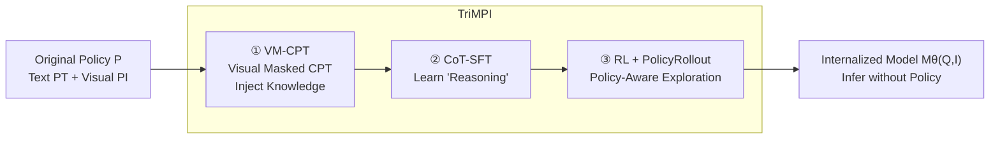

# Multimodal Policy Internalization for Conversational Agents

**Conference**: ICLR 2026  
**OpenReview**: [https://openreview.net/forum?id=fSE0rUngCX](https://openreview.net/forum?id=fSE0rUngCX)  
**Code**: To be confirmed (Paper promises open-source datasets, training recipes, and evaluation)  
**Area**: Multimodal Large Models / Policy Internalization / Conversational Agents  
**Keywords**: Multimodal Policy Internalization, TriMPI, PolicyRollout, VM-CPT, GRPO/DAPO, Tool-Use Agent  

## TL;DR
The authors propose "Multimodal Policy Internalization (MPI)," a new task for internalizing lengthy and complex multimodal policies (decision rules, tool-use protocols, and even demonstration images) from in-context prompts into model parameters. Using the three-stage training framework **TriMPI** (Visual Masked Continued Pre-training + CoT-SFT + RL with PolicyRollout), models achieve high compliance without providing the policy at inference time, achieving an absolute gain of up to 70.7% over the CoT-SFT baseline.

## Background & Motivation
- **Background**: LLM conversational agents (e.g., ChatGPT, Alexa+) rely on "policies" to constrain behavior—meta-information, response styles, and tool-use rules are typically injected as in-context prefixes. These policies are reaching 1K–50K tokens, while real user queries are only 50–200 tokens, resulting in fixed input overheads of $20\times-250\times$.
- **Limitations of Prior Work**: (1) Prompt compression focuses on templates and examples with light reasoning, failing for multi-step reasoning policies. (2) Work like deliberative alignment internalizes only text-based safety norms in text-only models. (3) Multimodal agent policies are increasingly tied to visual tasks or include demonstration images, yet **no work has studied how to learn and internalize complex policies within multimodal models**.
- **Key Challenge**: Policies must be sufficiently complex to govern multimodal decision-making and tool-use, yet they impose massive compute overhead and are often not faithfully followed. Can policy knowledge be written into parameters while **improving** compliance?
- **Goal**: Train multimodal models to generate compliant responses without in-context policies at inference time, covering reasoning-intensive decision and tool-use tasks, while balancing efficiency, generalization to policy updates, and resistance to catastrophic forgetting.
- **Key Insight**: **Directly use the original policy as training supervision**. The authors find that simply removing the policy at inference after including it in training leads to near-random performance. They propose (1) directly injecting the policy into parameters via continued pre-training before SFT, and (2) **PolicyRollout** to allow RL exploration to see policy-guided responses without introducing a train/inference gap.

## Method

### Overall Architecture
The task is formulated as internalizing responses from $A = M_\theta(Q, I, P)$ into $A = M_\theta(Q, I)$, generating compliant responses without providing the policy context $P=(P_T, P_I)$ (text and visual components). TriMPI is a three-stage pipeline: **① VM-CPT** (Visual Masked Continued Pre-training for direct knowledge injection) → **② CoT-SFT** (Chain-of-Thought SFT to learn to "reason before answering") → **③ RL with PolicyRollout** (Reinforcement Learning to cover broader policy behaviors via trial and error). The authors also construct two new datasets: **ClevrPolicy** (decision trees with controllable complexity based on CLEVR) and **GTAPolicy** (tool-use for real-world images in low-data scenarios).

### Key Designs

**1. VM-CPT (Visual Masked Continued Pre-training): Memorizing the policy into parameters.** This stage occurs before SFT to explicitly inject policy knowledge. Training sequences $x=(P_T, P_I, I, Q, C, A)$ are constructed by concatenating policy text/images, visual input, query, CoT reasoning $C$, and answer $A$. Next-token prediction loss is calculated for **all tokens except visual tokens**:

$$L(\theta) = -\mathbb{E}_{x\sim D}\left[\frac{1}{\sum_t m_t}\sum_{t=1}^{T} m_t \log p_\theta(x_t\mid x_{<t})\right],\quad m_t = \mathbb{1}[x_t\notin P_I\cup I]$$

The visual mask $m_t$ is crucial; in the multimodal domain, continuous visual tokens appear in both input $I$ and policy $P_I$, making language modeling loss on them meaningless. Masking allows mature text-domain CPT techniques to transfer effectively.

**2. RL Stage: Covering behaviors beyond SFT via trial and error.** Complex policies and heavy reasoning make it difficult for SFT to exhaust all behaviors in low-data regimes. The authors introduce RLVR (Reinforcement Learning with Verifiable Rewards), using `<think></think>` and `\boxed{}` blocks with format and accuracy rewards, based on GRPO and DAPO. While RL learns from negatives and exploration, standard GRPO/DAPO exploration is not **grounded in the policy**, making it hard to find positive rewards under complex rules.

**3. PolicyRollout (PoRo): Enabling "policy-aware" exploration without train/inference gap.** This is the core design. Direct prompt injection during training causes a gap when policies are removed at inference. PoRo generates two sets of rollouts: one conditioned on $(Q,I)$ and another on $(Q,I,P)$ using the current policy model. Both are combined for advantage estimation. For GRPO:

$$J_{\text{PoRo-GRPO}}(\theta)=\mathbb{E}_{\{o_i\}_{i=1}^{G}\sim\pi_{\theta_{old}}(O|Q,I),\,\{o_j\}_{j=G}^{2G}\sim\pi_{\theta_{old}}(O|Q,I,P)}\Big[\tfrac{1}{2G}\sum_{i=1}^{2G}\big\{\min[r_i(\theta)\hat A_i,\,\mathrm{clip}(r_i(\theta),1-\epsilon_l,1+\epsilon_h)\hat A_i]-\beta D_{KL}[\pi_\theta\|\pi_{ref}]\big\}\Big]$$

Where $r_i(\theta)=\pi_\theta(o_i|Q,I)/\pi_{\theta_{old}}(o_i|Q,I)$. **The mechanism is: the policy-guided path only expands the rollout pool to provide high-quality exploration samples (easy to get positive rewards), but the policy gradient only acts on the policy-free path** (conditioned only on $Q,I$). This ensures training/inference alignment while gaining the benefits of policy-grounded exploration.

## Key Experimental Results

### Main Results & Ablation (Qwen2.5-VL-7B, ClevrPolicy N=6)

| Method | Stage | ClevrPolicy-T | ClevrPolicy-M | GTAPolicy Overall |
| :--- | :--- | :--- | :--- | :--- |
| In-Context (With Policy, No Internalization) | — | 13.15 | 5.65 | 21.51 |
| Direct SFT | SFT | 15.15 | 14.55 | 40.75 |
| CoT SFT | SFT | 17.80 | 14.30 | 54.50 |
| VM-CPT + CoT SFT | CPT+SFT | 22.75 | 27.05 | 65.47 |
| CoT SFT + DAPO | SFT+RL | 67.60 | 74.40 | 72.43 |
| TriMPI w/ GRPO (No PoRo) | Full | 55.90 | 80.80 | 79.33 |
| **TriMPI w/ PoRo-GRPO** | Full | 65.85 | **84.70** | **81.06** |
| **TriMPI w/ PoRo-DAPO** | Full | **77.80** | 85.00 | 76.01 |

Ours achieves up to **70.7%** absolute improvement over the CoT-SFT baseline and **79.4%** over the in-context setting.

### Key Findings
- **Incremental Gains**: VM-CPT, RL, and PoRo all contribute. RL provides the largest gain for reasoning-intensive policies, while VM-CPT makes RL exploration more grounded.
- **Efficiency**: Removing the policy reduces prompt tokens by up to **93.9%** and prefill latency by **85.7%**.
- **Generalization (Policy Override)**: When policies are updated/overridden in-context, TriMPI consistently outperforms baselines (ClevrPolicy-M: 25.20 for CoT-SFT vs. 82.70 for PoRo-GRPO).
- **Policy Referral**: Claude-4 scoring for consistency between "thinking" and "original policy" yields high scores (e.g., 8.72/9.45), indicating true internalization of the policy.
- **Anti-Forgetting**: On MMMU-Pro / MMLU-Pro, TriMPI maintains strong general reasoning, unlike baselines which degrade after MPI.
- **Complexity Scaling**: Gains are significant on complex policies (N=6) and hold across 3B and 7B model sizes.
- **DAPO vs. GRPO**: DAPO updates more aggressively but is prone to overfitting in low-data scenarios (GTAPolicy), where GRPO performs better.

## Highlights & Insights
- **Pioneering Problem Definition**: First to propose "Multimodal Policy Internalization" as a standalone task, distinct from prompt compression (template-only) and safety alignment (text-only).
- **PolicyRollout as a Transposable Trick**: Using policy-guided paths for rollouts without updating them via gradients elegantly solves the "exploration vs. gap" dilemma and can be applied to any GRPO-based algorithm.
- **Comprehensive Evaluation**: Metrics include task accuracy, Policy Override (generalization), Policy Referral (knowledge depth), and anti-forgetting, proving it is not mere overfitting.
- **Controllable Benchmark**: ClevrPolicy uses decision tree depth $N$ to quantify complexity, enabling systematic research on how algorithms scale with difficulty.

## Limitations & Future Work
- **Data Scope**: ClevrPolicy is synthetic; GTAPolicy rules are human-crafted (13 tools, 24 rules), which is far from real-world open-domain policies.
- **Residual Errors**: Analysis shows remaining perception errors (occlusion/similar attributes) and reasoning errors (hallucinated rules, logic branching errors).
- **Update Costs**: Changing a policy still theoretically requires retraining for internalization, though Policy Override can mitigate this via in-context support.
- **Training Overhead**: PoRo doubles rollout computation; the three-stage pipeline is heavier than simple SFT.
- **Outlook**: Scaling MPI to larger models, diverse business policies, and joint safety norm internalization.

## Related Work & Insights
- **Prompt Compression** (LLMLingua, etc.): Limited to templates/examples; this work addresses policies requiring multi-hop reasoning.
- **Deliberative Alignment**: Internalizes safety norms in text models; this work moves into multimodal agentic decision-making.
- **RLVR / GRPO / DAPO**: PoRo extends these; it serves as a reference for grounding RL exploration with external constraints.
- **Continued Training Knowledge Injection**: VM-CPT is a multimodal variant; the visual mask is the key modification for transferring CPT to the vision-language domain.
- **Insight**: Any agent system with long, fixed contexts (system prompts, tool manuals, business rules) can use this "CPT + policy-aware RL" paradigm to move context into parameters, gaining prefill speed and robust compliance.

## Rating
- **Novelty**: ⭐⭐⭐⭐⭐ First to propose MPI; PolicyRollout is a clever and generalizable strategy.
- **Experimental Thoroughness**: ⭐⭐⭐⭐⭐ Covers multiple datasets, complexities, model sizes, generalization, and anti-forgetting.
- **Writing Quality**: ⭐⭐⭐⭐ Clear motivation and visual aids; complete three-stage narrative.
- **Value**: ⭐⭐⭐⭐⭐ Directly addresses the cost and compliance pain points of long-context agents; high industrial and research relevance.

<!-- RELATED:START -->

## Related Papers

- [\[CVPR 2026\] HiconAgent: History Context-aware Policy Optimization for GUI Agents](../../CVPR2026/multimodal_vlm/hiconagent_history_context-aware_policy_optimization_for_gui_agents.md)
- [\[CVPR 2026\] DialogueVPR: Towards Conversational Visual Place Recognition](../../CVPR2026/multimodal_vlm/dialoguevpr_towards_conversational_visual_place_recognition.md)
- [\[ICLR 2026\] PSP: Prompt-Guided Self-Training Sampling Policy for Active Prompt Learning](psp_prompt-guided_self-training_sampling_policy_for_active_prompt_learning.md)
- [\[ICLR 2026\] DAVE: A VLM Vision Encoder for Document Understanding and Web Agents](dave_a_vlm_vision_encoder_for_document_understanding_and_web_agents.md)
- [\[CVPR 2026\] Tackling Alignment Ambiguity in Person Retrieval through Conversational Attribute Mining](../../CVPR2026/multimodal_vlm/tackling_alignment_ambiguity_in_person_retrieval_through_conversational_attribut.md)

<!-- RELATED:END -->
## Related Papers

- [\[CVPR 2026\] HiconAgent: History Context-aware Policy Optimization for GUI Agents](../../CVPR2026/multimodal_vlm/hiconagent_history_context-aware_policy_optimization_for_gui_agents.md)
- [\[CVPR 2026\] DialogueVPR: Towards Conversational Visual Place Recognition](../../CVPR2026/multimodal_vlm/dialoguevpr_towards_conversational_visual_place_recognition.md)
- [\[ICLR 2026\] PSP: Prompt-Guided Self-Training Sampling Policy for Active Prompt Learning](psp_prompt-guided_self-training_sampling_policy_for_active_prompt_learning.md)
- [\[CVPR 2026\] Tackling Alignment Ambiguity in Person Retrieval through Conversational Attribute Mining](../../CVPR2026/multimodal_vlm/tackling_alignment_ambiguity_in_person_retrieval_through_conversational_attribut.md)
- [\[CVPR 2026\] Towards Policy-Adaptive Image Guardrail: Benchmark and Method](../../CVPR2026/multimodal_vlm/towards_policy-adaptive_image_guardrail_benchmark_and_method.md)

<!-- RELATED:END -->
