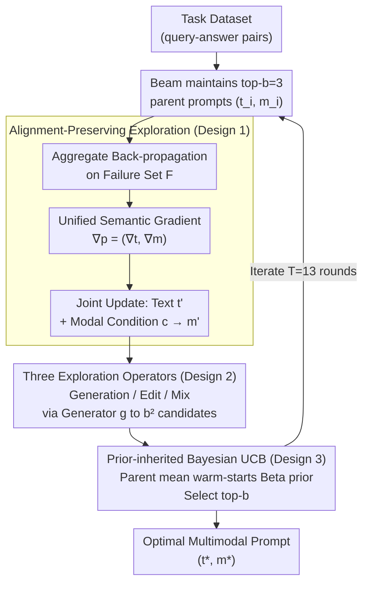

# Multimodal Prompt Optimization: Why Not Leverage Multiple Modalities for MLLMs

**Conference**: ICLR 2026  
**arXiv**: [2510.09201](https://arxiv.org/abs/2510.09201)  
**Code**: [GitHub](https://github.com/Dozi01/MPO)  
**Area**: Multimodal VLM/Prompt Optimization  
**Keywords**: Multimodal Prompt, Automated Prompt Optimization, Bayesian Selection, MLLM, Cross-modal Alignment

## TL;DR
This work extends Automated Prompt Optimization (APO) from a text-only space to a multimodal space for the first time. It proposes the MPO framework, featuring alignment-preserving joint exploration (driven by unified semantic gradients for text and non-text updates with Generation/Edit/Mix operators) and prior-inherited Bayesian UCB candidate selection (using parent performance to warm-start child Beta priors). MPO achieves an average accuracy of 65.1% across 10 datasets (image, video, molecule), outperforming the leading text-based APO baseline, ProTeGi (60.0%).

## Background & Motivation

**Background**: Multimodal Large Language Models (MLLMs), such as Qwen2.5-VL and GPT-4o, possess the capability to simultaneously process diverse inputs including text, images, videos, and molecules. Concurrently, the APO field has evolved methods like APE, OPRO, PE2, ProTeGi, and SEE, which automatically discover high-quality prompts via iterative generation, evaluation, and refinement, significantly reducing the burden of manual prompt engineering.

**Limitations of Prior Work**: Existing APO methods optimize text prompts exclusively, neglecting the multimodal input capabilities of MLLMs. Text is inherently inefficient for conveying certain information—for instance, describing a bird's unique plumage texture requires lengthy, potentially ambiguous descriptions, whereas a reference image can communicate the same visual features more accurately. Restricting optimization to a text-only space limits the search to a lower-dimensional subspace, failing to exploit the full expressive power of MLLMs.

**Key Challenge**: Expanding the search space from $\mathcal{T}$ to $\mathcal{T} \times \mathcal{M}$ introduces two fundamental challenges: (1) **Cross-modal Consistency**: Independent updates to text and non-text prompts can lead to semantic conflicts (e.g., text prioritizing "color" while the image shows incorrect "texture"), a risk exacerbated by combinatorial explosion. (2) **Candidate Selection Difficulty**: High-quality prompts become extremely sparse in the expanded space, potentially wasting evaluation budgets on low-potential candidates. Standard UCB or uniform allocation strategies suffer from severe "cold-start" issues.

**Goal**: (1) To efficiently explore the joint text + non-text prompt space while maintaining cross-modal alignment; (2) To rapidly identify high-quality multimodal prompts from many candidates without wasting evaluation resources.

**Key Insight**: The authors observe two key facts: first, alignment is naturally maintained if text and non-text updates are driven by the same "semantic gradient" (failure analysis feedback); second, there is a strong positive correlation between parent and child prompt performance (Pearson $r = 0.88$), suggesting that parent evaluation results can serve as valuable priors to "warm-start" child evaluation.

**Core Idea**: Use unified feedback-driven joint updates to address cross-modal consistency, and employ Bayesian prior inheritance driven by parent-child performance correlation to solve candidate selection efficiency, thereby generalizing APO to multimodal spaces.

## Method

### Overall Architecture

MPO aims to transition APO from the text space $\mathcal{T}$ to the joint space $\mathcal{T} \times \mathcal{M}$ without causing semantic misalignment or wasting budget on sparse candidates. It employs a beam search framework, maintaining $b=3$ optimal multimodal prompts $\{(\mathbf{t}_i, \mathbf{m}_i)\}$ per iteration. For each parent prompt, it performs **alignment-preserving exploration**: generating unified feedback covering both text and non-text weaknesses from failures, then jointly updating both prompt modalities. Next, **three exploration operators (Generation/Edit/Mix)** expand each parent into multiple child candidates ($b^2$ total per round). Finally, **prior-inherited Bayesian UCB** selects the top-$b$ prompts for the next iteration. This process repeats for $T=13$ rounds, mapping the task dataset (query-answer pairs) to the optimal multimodal prompt pair $(\mathbf{t}^*, \mathbf{m}^*)$. In the first round, only the Generation operator is used for initialization.

### Key Designs

**1. Alignment-Preserving Exploration: Guiding text and non-text prompts with unified feedback.**

To prevent semantic conflict, MPO splits updates into two steps driven by a single feedback source. First, **Aggregate Back-propagation**: Based on failures $\mathcal{F}$ of the current prompt $(\mathbf{t}, \mathbf{m})$, the MLLM generates a unified feedback $\nabla_{\mathbf{p}} = (\nabla_{\mathbf{t}}, \nabla_{\mathbf{m}})$ describing weaknesses in both text and non-text dimensions. Second, **Joint Multimodal Update**: Conditioned on this unified feedback, the MLLM simultaneously outputs an updated text prompt $\mathbf{t}'$ and a modal-specific condition $\mathbf{c}$ (describing how to modify the non-text prompt). This $\mathbf{c}$ is fed to a modal generator $g$ (e.g., GPT-Image for text-to-image, Wan2.1 for video, or a text-to-molecule module) to produce $\mathbf{m}' = g(\mathbf{c})$. Since both updates share the same $\nabla_{\mathbf{p}}$, they naturally target the same semantic goal.

**2. Three Exploration Operators: Covering different regions of the search space.**

Diversity is maintained via three complementary operators for non-text prompts. **Generation** creates a new prompt $\mathbf{m}' = g(\mathbf{c}_{\text{gen}}, \varnothing)$ without referring to existing candidates, helping the search escape local optima. **Edit** performs fine-grained adjustments $\mathbf{m}' = g(\mathbf{c}_{\text{edit}}, \{\mathbf{m}\})$ to preserve the overall structure while modifying specific attributes (e.g., texture, color). **Mix** fuses complementary advantages of $K$ parent prompts $\mathbf{m}' = g(\mathbf{c}_{\text{mix}}, \{\mathbf{m}_i\}_{i=1}^K)$, merging specialized features into a balanced solution.

**3. Prior-Inherited Bayesian UCB: Warm-starting child candidates using parent performance.**

Given the sparsity of high-quality prompts, MPO exploits the strong parent-child correlation ($r = 0.88$) by modeling expected scores as Beta distributions $\text{Beta}(\alpha_i, \beta_i)$. The parent posterior mean $\hat{\mu}_{\text{par}}$ initializes the child prior:

$$\alpha_i = \hat{\mu}_{\text{par}} \cdot S + 1, \qquad \beta_i = (1 - \hat{\mu}_{\text{par}}) \cdot S + 1$$

where $S = 10$ is the prior strength. In each round, the candidate with the highest UCB score is evaluated, its posterior is updated, and the one with the highest expected score is selected once the budget is exhausted. This saves approximately 70% of the evaluation budget compared to uniform allocation.

### Loss & Training

MPO is a gradient-free framework and does not involve traditional loss functions. The optimization objective is to maximize task-specific metrics (e.g., accuracy): $(\mathbf{t}^*, \mathbf{m}^*) = \argmax_{(\mathbf{t}, \mathbf{m}) \in \mathcal{T} \times \mathcal{M}} \mathbb{E}_{(\mathbf{q}, \mathbf{a}) \sim \mathcal{D}}[f(\text{MLLM}(\mathbf{t}, \mathbf{m}, \mathbf{q}), \mathbf{a})]$. GPT-4o mini acts as the prompt optimizer during evaluation. Beam size $b=3$, iteration $T=13$, and evaluation budget per candidate is 100 samples with prior strength $S=10$.

## Key Experimental Results

### Main Results (10 Datasets across 3 Modalities)

| Method | PlantVillage | CUB-200 | SLAKE | DrivingVQA | RSVQA | Drive&Act | VANE | Absorption | BBBP (F1) | CYP (F1) | Average Acc |
|------|-------------|---------|-------|------------|-------|-----------|------|------------|----------|---------|--------|
| Human | 42.2 | 47.9 | 35.2 | 49.7 | 51.0 | 47.3 | 47.0 | 38.5 | 39.4 | 43.1 | 44.1 |
| CoT | 43.1 | 49.0 | 30.8 | 52.9 | 49.6 | 37.2 | 31.6 | 39.6 | 36.7 | 32.5 | 40.8 |
| 5-Shot | 46.5 | 58.1 | 28.0 | 45.9 | 49.2 | 54.3 | 61.4 | 48.1 | 45.5 | 49.3 | 49.3 |
| APE | 55.8 | 67.3 | 34.3 | 52.8 | 54.4 | 50.3 | 64.3 | 45.7 | 40.4 | 34.7 | 51.3 |
| PE2 | 67.9 | 71.6 | 35.8 | 53.7 | 55.2 | 50.8 | 63.0 | 64.5 | 56.8 | 58.2 | 58.2 |
| ProTeGi | 64.4 | 70.0 | 35.4 | 54.4 | 54.2 | 53.0 | 65.5 | 71.1 | 58.2 | 65.7 | 60.0 |
| SEE | 69.0 | 71.6 | 35.0 | 52.2 | 53.4 | 51.7 | 57.9 | 71.4 | 60.0 | 62.3 | 59.1 |
| **MPO** | **76.4** | **78.6** | **38.2** | **56.0** | **55.9** | **58.3** | **71.2** | **76.7** | **64.5** | **67.6** | **65.1** |

MPO achieved the best performance on all 10 datasets, with a 65.1% average accuracy surpassing the strongest text APO baseline, ProTeGi (60.0%), by 5.1 percentage points.

### Ablation Study

| Ablation Config | PlantVillage Avg | CUB Avg | Description |
|---------|-----------------|---------|------|
| Human text + No image | 42.2 | 47.9 | Baseline |
| Human text + MPO image | 50.4 | 58.2 | Gain from non-text optimization alone |
| MPO text + No image | 55.6 | 64.2 | Gain from text-only optimization |
| **MPO text + MPO image** | **76.4** | **78.6** | Joint multimodal gain |

| Backbone Generalization | Human | ProTeGi | SEE | **MPO** |
|-------------|-------|---------|-----|---------|
| Qwen2.5-VL (72B) | 55.7 | 74.1 | 73.6 | **80.4** |
| Gemma3 (12B) | 45.6 | 68.2 | 68.1 | **73.1** |
| InternVL-3.5 (14B) | 51.6 | 71.9 | 70.8 | **73.2** |

### Key Findings
- **Synergistic Contribution**: The performance of MPO text (55.6) and MPO image (50.4) used separately is far lower than the joint prompt (76.4), indicating that images provide fine-grained visual cues while text guides the model on which visual features to prioritize.
- **Mix Operator Impact**: The "Grape" sub-task improved from 48.0% (SEE) to 65.1% using the Mix operator, which fuses specialized visual features from multiple candidates.
- **Efficiency**: MPO reaches the performance of a uniform allocation strategy with only 30% of the evaluation budget on the CUB dataset.
- **Hidden State Analysis**: MPO's multimodal prompts push hidden states into distinct regions compared to text-only methods, showing the introduction of unique information dimensions.

## Highlights & Insights
- **Novel Problem Definition**: Filling the gap between MLLM multimodal input processing and text-only APO is a high-value contribution.
- **Generative Models as Optimization Components**: Using models like GPT-Image as "modal translators" within an APO loop is a versatile design for future modalities.
- **Causal Link**: A strong correlation between DSG alignment scores and accuracy gains confirms that alignment quality is central to multimodal prompt optimization success.

## Limitations & Future Work
- **Generator Dependence**: MPO is limited by the quality of the modal generator (e.g., GPT-Image).
- **Manual Hyperparameters**: Prior strength $S$ is currently heuristic and might benefit from adaptive tuning.
- **Evaluation Cost**: Iterative evaluation across multiple candidates remains computationally expensive for large-scale deployment.

## Related Work & Insights
- **vs. ProTeGi / SEE**: MPO generalizes these frameworks to $\mathcal{T} \times \mathcal{M}$, providing significant accuracy gains by escaping text-only local optima.
- **vs. MaPLe**: Unlike continuous prompt learning, MPO is black-box and suitable for closed-source APIs.

## Rating
- Novelty: ⭐⭐⭐⭐⭐ 
- Experimental Thoroughness: ⭐⭐⭐⭐⭐ 
- Writing Quality: ⭐⭐⭐⭐ 
- Value: ⭐⭐⭐⭐⭐ 

<!-- RELATED:START -->

## Related Papers

- [\[ICCV 2025\] MMOne: Representing Multiple Modalities in One Scene](../../ICCV2025/multimodal_vlm/mmone_representing_multiple_modalities_in_one_scene.md)
- [\[ICLR 2026\] Investigating Redundancy in Multimodal Large Language Models with Multiple Vision Encoders](investigating_redundancy_in_multimodal_large_language_models_with_multiple_visio.md)
- [\[ICLR 2026\] OptMerge: Unifying Multimodal LLM Capabilities and Modalities via Model Merging](optmerge_unifying_multimodal_llm_capabilities_and_modalities_via_model_merging.md)
- [\[ICLR 2026\] Importance Sampling for Multi-Negative Multimodal Direct Preference Optimization](importance_sampling_for_multi-negative_multimodal_direct_preference_optimization.md)
- [\[ICLR 2026\] Visual Jigsaw Post-Training Improves MLLMs](visual_jigsaw_post-training_improves_mllms.md)

<!-- RELATED:END -->
