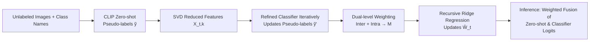

# Naming to Learn: Class Incremental Learning for Vision-Language Model with Unlabeled Data

**Conference**: ICLR 2026  
**OpenReview**: [https://openreview.net/forum?id=Hc71kKCEFG](https://openreview.net/forum?id=Hc71kKCEFG)  
**Code**: [https://github.com/zhoujiahuan1991/ICLR2026-N2L](https://github.com/zhoujiahuan1991/ICLR2026-N2L)  
**Area**: Vision-Language Models / Class Incremental Learning / Unlabeled Learning  
**Keywords**: Class Incremental Learning, CLIP, Pseudo-label Refinement, Analytic Continual Learning, Ridge Regression  

## TL;DR
N2L situates Class Incremental Learning (CIL) in a more realistic setting—where each new task provides only class names and unlabeled images. It utilizes CLIP zero-shot for initial pseudo-labeling, followed by pseudo-label refinement through dimensionality reduction, dual-level sample weighting, and recursively solvable ridge regression. This approach allows unlabeled incremental training to approximate joint-training performance while maintaining robustness against noise and forgetting.

## Background & Motivation
**Background**: Class Incremental Learning (CIL) enables models to learn new categories continuously without revisiting old data. Recent methods based on pre-trained models (ViT, CLIP) achieve strong results by fine-tuning only the classification head or a few parameters. The image-text alignment prior of CLIP is particularly suitable for incremental scenarios.

**Limitations of Prior Work**: Almost all these methods assume the availability of **full annotations** for each incremental task, whereas labeling is scarce and expensive in real-world scenarios. An intuitive remedy is using CLIP to convert class names into text embeddings and assign pseudo-labels to unlabeled images based on image-text similarity before applying existing CIL methods.

**Key Challenge**: CLIP zero-shot pseudo-labels are **inherently noisy**, and this noise is magnified in incremental settings. Incorrect labels not only degrade the accuracy of the current task but also **exacerbate catastrophic forgetting** through parameter updates. Common cross-entropy loss is notably sensitive to label noise.

**Goal**: Propose a realistic CIL paradigm consisting of "only class names + unlabeled data," aiming to approximate the accuracy of fully supervised training while mitigating forgetting.

**Core Idea**: **[Noise-Robust Regression]** Drawing on Analytic CIL (ACIL), MSE ridge regression is used instead of cross-entropy. Regression loss is more robust to noise and can be formulated as a **recursive closed-form solution**, which is mathematically equivalent to joint training and thus naturally resists forgetting. **[Pseudo-label Refinement]** Iteratively refine pseudo-labels using feature dimensionality reduction. **[Dual-level Weighting]** Use inter-class and intra-class weighting to simultaneously correct class imbalance and sample confidence.

## Method

### Overall Architecture
N2L follows a four-step pipeline for each task $t$: (1) Assign zero-shot pseudo-labels to unlabeled images using frozen CLIP image-text similarity; (2) Apply SVD for dimensionality reduction on image features and train a refined classifier on the reduced features to iteratively update pseudo-labels; (3) Calculate sample weights using dual-level weighting (inter-class + intra-class); (4) Update the incremental classifier $\hat{W}_t$ via recursive ridge regression using full-dimensional features, refined labels, and sample weights. The entire pipeline consists of closed-form recursive solutions without backpropagation.

### Key Designs
**1. Analytic CIL Backbone: Mapping Unlabeled Increments to Equivalent Joint Training via Recursive Ridge Regression.** For features $X_{1:T}$ and one-hot labels $Y_{1:T}$ across all tasks, the training objective is formulated as ridge regression $L(W_T)=\|X_{1:T}W_T-Y_{1:T}\|_F^2+\lambda\|W_T\|_F^2$, with the closed-form solution $\hat{W}_T=(A_T+\lambda I)^{-1}C_T$. Crucially, $A_T$ and $C_T$ can be **recursively accumulated** per task: $A_t=A_{t-1}+X_t^\top X_t$ and $C_t=C_{t-1}+X_t^\top Y_t$. This requires only storing two matrices and performs incremental updates, resulting in an identical solution to one-time joint training, effectively eliminating forgetting. Moreover, MSE is more robust to pseudo-label noise than cross-entropy, fitting the unlabeled setting perfectly.

**2. Progressive Pseudo-label Refinement: "Washing Out" Noise Directions in Reduced Subspaces.** SVD is performed on task features $X_t=UDV^\top$, retaining only the top $k$ singular vectors $V_k$ where singular values exceed a threshold $\theta$. The projected features $X_{t,k}=X_tV_k$ are used to regress a refined classifier $\hat{W}'_t$, updating pseudo-labels via $\tilde{Y}'_t=\arg\max X_{t,k}\hat{W}'_t$ over multiple iterations. Theorem 1 provides theoretical support: discarding singular directions where the true signal $\alpha^*_j$ is small or the singular value $d_j$ is low (meaning the direction has little information and is prone to noise overfitting) reduces the expected MSE when $\sigma^2\ge(2\lambda+d_j^2)(\alpha^*_j)^2$. Contrary to "up-sampling" or dimensionality expansion ideas like RAIL, N2L relies on **dimensionality reduction** to eliminate low-information directions dominated by noise.

**3. Dual-level Weight Adjustment: Addressing Class Imbalance and Sample Untrustworthiness.** Noisy pseudo-labels introduce two issues: imbalance in the number of samples per class $N_{t,i}$ and the loss of confidence information due to argmax hard labels. **Inter-class adjustment** normalizes the total weight of each class using $m_{\text{inter},i}=\frac{n_t}{N_{t,i}\cdot|C_t|}$ to compensate for minority classes. **Intra-class adjustment** ranks samples by the entropy of their logits (low entropy = high confidence). Weights are sampled from a Gaussian distribution $\mathcal{N}(1,\sigma^2)$, sorted in ascending order, and mapped back to samples based on their entropy rank ($m_{i}=m_{\text{intra},i} = m'_{\text{rank}(E_i)}$). This assigns higher weights to high-confidence samples while avoiding numerical instability when entropy approaches zero. The final weight matrix $M$ is a diagonal matrix of $m_i = m_{\text{intra},i}\cdot m_{\text{inter},i}$.

**4. Weighted Recursive Solver: Seamless Integration into Closed-form Updates.** The weighted objective becomes $(X_{1:T}W_T-Y_{1:T})^\top M(X_{1:T}W_T-Y_{1:T})+\lambda\|W_T\|_F^2$. The closed-form solution remains $\hat{W}_T=(A_T+\lambda I)^{-1}C_T$, with recursive updates modified to $A_t=A_{t-1}+X_t^\top M_t X_t$ and $C_t=C_{t-1}+X_t^\top M_t Y_t$. This dual-level weighting preserves the equivalence between recursion and joint training. During inference, N2L adopts the strategy of RAIL, computing a weighted sum of zero-shot prediction logits and learned classifier logits.

## Key Experimental Results

### Main Results Table
Evaluated with CLIP ViT-B/16 (LAION-400M) on six datasets under two protocols (B0: 10 equal tasks; B-half: half classes in the first task as base + 5 incremental tasks). Average accuracy $\bar{A}$ and last task accuracy $A_B$ are reported.

| Method | Aircraft B0 $\bar{A}$/$A_B$ | Cars B0 | CIFAR100 B0 | CUB B0 | ObjectNet B0 | UCF B0 |
|------|------|------|------|------|------|------|
| ZS-CLIP | 26.61/17.16 | 82.90/76.73 | 81.81/71.38 | 75.47/63.72 | 38.43/26.43 | 75.88/67.79 |
| RAIL (runner-up) | 36.23/33.59 | 88.64/84.68 | 87.34/80.37 | 81.64/73.93 | 39.80/35.13 | 90.18/89.90 |
| ENGINE | 34.77/25.41 | 86.90/78.76 | 85.15/77.11 | 77.06/65.07 | 44.57/31.24 | 87.85/84.46 |
| **N2L** | **43.73/40.21** | **92.38/87.50** | **87.80/81.13** | **83.41/76.48** | **49.31/41.59** | **95.00/93.29** |
| Label (Upper Bound) | 66.38/56.31 | 93.57/89.15 | 88.52/81.92 | 86.43/79.05 | 53.18/45.27 | 98.74/97.75 |

On datasets with significant distribution shifts from the CLIP pre-training data (Aircraft, ObjectNet), N2L outperforms the runner-up by 2.75%–8.46%. In Cars/ObjectNet/UCF, N2L narrows the gap between "unlabeled vs. fully labeled" by nearly 50%.

### Ablation Study
**Component Ablation (Aircraft-B0Inc10, cumulative)**: RAIL baseline → +Inter-class adjustment → +Intra-class adjustment → +Refinement. Performance improves at each step, with pseudo-label refinement providing the largest gain.

**Intra-class Weighting Methods (Aircraft-B0)**:

| Method | $\bar{A}$ | $A_B$ |
|------|------|------|
| No adjustment | 43.39 | 39.69 |
| $1/E$ | 43.25 | 38.45 |
| Uniform $U(0.5,1.5)$ | 43.71 | 40.08 |
| Gaussian $\mathcal{N}(1,1/4)$ | 43.73 | 40.21 |

Directly using $1/E$ causes a drop due to numerical instability; Gaussian sampling with entropy ranking is the most stable.

**Combining with CPL**: Replacing initial pseudo-labels with those from CPL (an unlabeled learning method) improves all methods. N2L+CPL remains the strongest (Aircraft-B0 47.48/42.99), showing complementarity between N2L and better pseudo-label generators.

### Key Findings
- Single-modal ViT CIL methods (e.g., CODA-Prompt) perform worse than ZS-CLIP on Cars/CIFAR100/CUB because they fail to utilize image-text alignment; noisy pseudo-labels degrade training and accelerate forgetting.
- Pseudo-label refinement is the primary driver of performance. The threshold $\theta \approx 10$ yields the lowest MSE and highest accuracy, validating the theoretical premise of discarding low-information singular directions.

## Highlights & Insights
- **Valuable Setting**: Shifts CIL from "full annotation" to "class names + unlabeled," which is closer to real-world continual learning and aligns naturally with the zero-shot capabilities of CLIP.
- **Theory-Practice Loop**: SVD-based refinement is supported by Theorem 1, and the entire framework (refinement + dual weighting) is integrated into a recursive closed-form solution. This maintains the "recursion = joint training" property, preventing forgetting without needing backpropagation.
- **Counter-intuitive Reduction**: Unlike RAIL's expansion approach, N2L demonstrates that dimensionality reduction is superior for removing noise-dominated, low-information directions.

## Limitations & Future Work
- There remains a significant gap with the fully labeled upper bound (Label), particularly on fine-grained or high-shift datasets like Aircraft (40.21 vs 56.31). Pseudo-label quality is the primary bottleneck.
- Performance depends heavily on CLIP's zero-shot capability, making its effectiveness questionable in domains poorly covered by CLIP pre-training (e.g., medical, remote sensing).
- Sensitivity to hyperparameters like threshold $\theta$ and iteration counts. Theoretical analysis relies on linear regression assumptions, which may deviate from actual deep feature distributions.
- Validated only on classification tasks; expansion to structured outputs like detection or segmentation is unexplored.

## Related Work & Insights
- **Analytic CIL** (ACIL/Zhuang 2022, RAIL/Xu 2024): N2L inherits the "MSE ridge regression + recursive closed-form" skeleton, extending it to unlabeled settings and reversing RAIL’s feature expansion strategy.
- **Pre-trained CIL**: Prompt/LoRA/Adapter methods (CODA-Prompt, MoE-Adapter) and CLIP-based methods (RAPF, ENGINE) typically assume ground-truth labels. N2L fills the unlabeled gap.
- **Unlabeled Learning** (UPL, LaFTer, CPL): These are static, one-time settings. N2L brings pseudo-label learning into incremental scenarios and demonstrates complementarity with methods like CPL.
- **Insight**: When pseudo-labels are inevitably noisy, "switching to robust loss (MSE) + washing labels in feature subspaces + explicit weighting" is more efficient than building complex architectures and maintains the closed-form recursive property.

## Rating
- **Novelty**: ⭐⭐⭐⭐ Realistic "Unlabeled + Names" CIL setting; combining SVD refinement (with theory) and dual-level weighting in a recursive solver is novel and reverses mainstream dimensionality expansion logic.
- **Experimental Thoroughness**: ⭐⭐⭐⭐ Six datasets across two protocols, comparison with upper bounds/baselines, and multi-angle ablations on components/weighting/CPL. Some points lost due to limitation to classification tasks.
- **Writing Quality**: ⭐⭐⭐⭐ Clear motivation-method-theory-experiment chain; full derivations for formulas and recursion with intuitive diagrams.
- **Value**: ⭐⭐⭐⭐ Unlabeled continual learning is a practical demand. The method is lightweight (no backprop, single GPU) and orthogonal to pseudo-labeling improvements, making it easily reusable.

<!-- RELATED:START -->

## Related Papers

- [\[AAAI 2026\] BOFA: Bridge-Layer Orthogonal Low-Rank Fusion for CLIP-Based Class-Incremental Learning](../../AAAI2026/multimodal_vlm/bofa_bridge-layer_orthogonal_low-rank_fusion_for_clip-based_.md)
- [\[ICLR 2026\] Enhanced Continual Learning of Vision-Language Models with Model Fusion](enhanced_continual_learning_of_vision-language_models_with_model_fusion.md)
- [\[ICLR 2026\] CARPRT: Class-Aware Zero-Shot Prompt Reweighting for Vision-Language Model](carprt_class-aware_zero-shot_prompt_reweighting_for_vision-language_model.md)
- [\[ICLR 2026\] Preserve and Sculpt: Manifold-Aligned Fine-tuning of Vision-Language Models for Few-Shot Learning](preserve_and_sculpt_manifold-aligned_fine-tuning_of_vision-language_models_for_f.md)
- [\[ICLR 2026\] Fed-Duet: Dual Expert-Orchestrated Framework for Continual Federated Vision-Language Learning](fed-duet_dual_expert-orchestrated_framework_for_continual_federated_vision-langu.md)

<!-- RELATED:END -->
