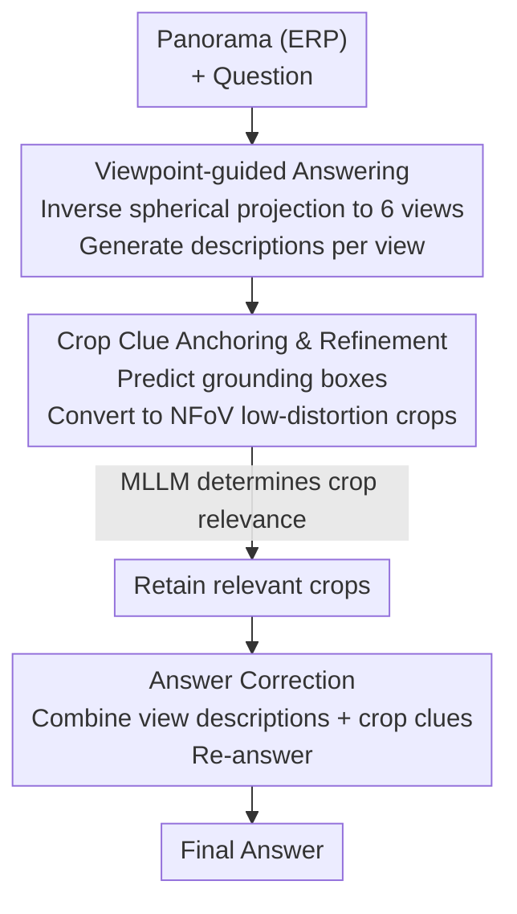

# ODI-Bench: Can MLLMs Understand Immersive Omnidirectional Environments?

**Conference**: ICLR 2026  
**OpenReview**: [https://openreview.net/forum?id=fT8FrhGNo0](https://openreview.net/forum?id=fT8FrhGNo0)  
**Code**: https://github.com/ylylyl-sjtu/ODI-Bench (Available)  
**Area**: Multimodal VLM  
**Keywords**: Omnidirectional Image Understanding, MLLM Benchmark, Spatial Reasoning, Chain-of-Thought, Immersive Environments

## TL;DR
This work constructs ODI-Bench, the first benchmark for systematically evaluating the Omnidirectional Image (ODI) understanding capabilities of MLLMs (2,000 real-world panoramas, 4,254 QAs, 10 fine-grained tasks, dual closed+open formats). Evaluating 20 mainstream models reveals that current MLLMs perform only slightly better than random guessing in immersive spatial understanding. A training-free Chain-of-Thought framework, Omni-CoT, is proposed, improving the overall scores of models like o3 by 6–8 percentage points.

## Background & Motivation
**Background**: 360° Omnidirectional Images (ODI) provide a complete $180°\times360°$ field of view and serve as core data formats for VR/AR, spatial navigation, and embodied AI. While MLLMs have achieved high performance on standard 2D image/video benchmarks, their ability to "understand" the immersive environments carried by panoramas has not been systematically evaluated.

**Limitations of Prior Work**: Existing ODI benchmarks suffer from four types of flaws: (1) **Low resolution**: VQA 360°, OSR-Bench, etc., are limited to approximately 1K, with blurry top/bottom views unsuitable for real VR applications; (2) **Homogeneous scenes**: Most rely on indoor datasets with 3D annotations, covering only residential indoor scenes or blurry synthetic environments; (3) **Restricted problem domains**: Primarily generated via automated pipelines or off-the-shelf 3D data, leading to severe linguistic bias and narrow question types; (4) **Limited perspectives**: Spatial reasoning tasks almost exclusively focus on egocentric perspectives, ignoring allocentric perspective-taking and user interaction simulation.

**Key Challenge**: Panoramas differ fundamentally from 2D images by projecting immersive 3D scenes onto an Equirectangular Projection (ERP) plane, which contains massive visual information but introduces severe projection distortion and complex spatial relationships (front, back, left, right, up, down). Current MLLMs, trained almost exclusively on 2D data, tend to treat ERP images as "distorted 2D images" rather than performing perspective transformation followed by relative spatial reasoning.

**Goal**: This is decomposed into two sub-problems: (a) Building a high-quality, scene-diverse, perspective-complete, and task-fine-grained benchmark to quantify MLLMs' ODI understanding; (b) Finding a training-free enhancement method that approximates the human process of "switching perspective before spatial reasoning."

**Key Insight**: The authors observe that MLLM failure stems from a lack of "perspective awareness"—they do not actively decompose ERP into various orientations for understanding. Rather than increasing training data or using external 3D models, compact text prompts can guide models to step-by-step establish panoramic scene cognition.

**Core Idea**: Establish a solid evaluation using a dual-layer fine-grained task system and immersive first-person questioning (ODI-Bench), then supplement missing perspective cognition with a training-free three-step Chain-of-Thought (Omni-CoT: Viewpoint-guided answering → Crop clue anchoring and refinement → Answer correction).

## Method

### Overall Architecture
The paper follows two main lines: **Evaluation** (ODI-Bench) and **Enhancement** (Omni-CoT). ODI-Bench collects 2,000 real panoramas crawled from Flickr and manually curated (47.4% indoor / 52.6% outdoor, up to 12K resolution), with 4,254 annotated QAs. Tasks are divided into **5 General-level tasks** (Object Attributes OA, Human Attributes HA, Existence Exist., Counting Count., Panoramic OCR) and **5 Spatial-level tasks** (Egocentric Viewpoint Orientation EVO, Allocentric Viewpoint Orientation AVO, Scene Simulation SS, Relative Direction RD, ODI Reasoning OR), evaluated in both **closed-ended** (multiple-choice/Yes-No) and **open-ended** formats. 20 mainstream MLLMs (GPT-4o, o3, Gemini, InternVL/Qwen-VL series, etc.) are benchmarked, showing they generally perform only slightly better than blind guessing (Blind GPT-4o / Random).

Based on these findings, the authors propose **Omni-CoT**, a training-free, plug-and-play CoT framework that shifts the model from "viewing a distorted 2D image" to "establishing panoramic perspective cognition before answering." The inference pipeline is shown below:

### Key Designs

**1. Dual-layer Fine-grained Task System + Immersive First-person Questions**

To address narrow question types and biased perspectives, ODI understanding is explicitly split into **General-level** and **Spatial-level** tasks (10 total). General tasks (OA/HA/Exist./Count./OCR) focus on visual information and distortion; for instance, Panoramic OCR requires reading text under distorted perspective and high resolution. Spatial tasks test all-around cognition and **deliberately cover two perspective types**: EVO/RD use the observer's own perspective, while AVO/SS require perspective-taking from another agent or virtual viewpoint. OR tasks evaluate understanding of trajectory/orientation distortions caused by ERP projection. The **immersive questioning** innovation uses first-person phrasing (e.g., "What is the person to my right doing?" instead of "the right side of the image"), which aligns with the immersive viewing experience and tests the model's ability to utilize panoramas in interactive environments.

**2. Semi-automatic QA Annotation Pipeline**

To manage costs while maintaining quality, the authors use a bifurcated pipeline. For instance-level tasks (OA/HA), an **automated pipeline** is used: ERP images are projected into 6 low-distortion views via cubemap projection. GroundedSAM segments instances and provides labels, **filtering out instances crossing multiple views** to ensure precision. Remaining instances are cropped and described by Qwen2.5-VL-72B, **retaining only instances where GroundedSAM labels match Qwen-VL descriptions**. GPT-4o generates QAs from these descriptions, followed by manual verification. For complex tasks like counting and orientation where automation is unreliable, **manual annotation** by three experts in VR environments was conducted over one month.

**3. Omni-CoT Three-step Chain-of-Thought**

This address the root cause of MLLMs treating ERP as distorted 2D. Instead of feeding multiple images (which exceeds token limits and creates redundancy), Omni-CoT uses **textual perspective information**: **(i) Viewpoint-guided answering**—Inverse spherical projection generates top/bottom/right/left/front/back perspective views; MLLMs describe each view, and these orientation-tagged descriptions are prepended to the prompt. **(ii) Crop clue anchoring and refinement**—The model predicts grounding boxes, which are converted to NFoV parameters:

$$\theta = -180°+\frac{c_x}{W}\cdot360°,\quad \phi = 90°-\frac{c_y}{H}\cdot180°$$
$$fov_w=(x_2-x_1)\cdot360°,\quad fov_h=(y_2-y_1)\cdot180°$$
$$fov=\mathrm{clip}\big(\max(fov_w,fov_h)+margin,\ 30°,\ 120°\big)$$

where $(c_x,c_y)$ is the center, and $margin$ prevents tight cropping. A **refinement** step asks the model if each crop is relevant (Yes/No) to filter grounding errors. **(iii) Answer correction**—The panorama, view descriptions, and refined crops are fed back to "re-think" the final answer.

**4. Dual Closed+Open Evaluation Formats**

The benchmark tests **both formats for every task**. Closed-ended uses accuracy (multiple-choice/Yes-No), and open-ended uses an LLM-evaluator score. This reveals that for tasks with unique answers (Count, OCR), closed-ended scores are higher due to option hints. However, "open-correct, closed-wrong" cases exist, indicating that predefined options can sometimes act as distractors, highlighting the gap between generative and discriminative reasoning.

## Key Experimental Results

### Main Results
Overall performance of 20 MLLMs on ODI-Bench (Closed-ended). The strongest model, o3, achieves 62.62, which is less than 30 points higher than Blind GPT-4o (36.39).

| Model | Overall (Closed) | Overall (Open) | Spatial Difficulty (AVO/SS Closed) |
|--------|------|------|------|
| o3 (Best) | **62.62** | **49.53** | 39.62 / 46.60 |
| InternVL3-78B | 59.43 | 42.52 | 31.67 / 40.40 |
| Gemini-2.0-flash | 57.12 | 36.42 | 32.91 / 40.20 |
| Qwen2.5-VL-72B | 56.91 | 39.49 | 32.08 / 38.40 |
| GPT-4o | 55.79 | 42.91 | 32.49 / 39.60 |
| Blind GPT-4o (Baseline) | 36.39 | — | 29.14 / 31.60 |
| Random Choice | 26.93 | — | 25.00 / 25.00 |

Spatial tasks (especially allocentric AVO/SS) are the primary bottleneck, with scores barely exceeding the blind baseline.

Omni-CoT improvement on representative models (Closed-ended):

| Model | Baseline Overall | w/ Viewpoint Guiding | w/ Full Omni-CoT | EVO Gain |
|--------|------|------|------|------|
| o3 | 62.62 | 68.78 | **70.03 (+7.41)** | +26.40 |
| GPT-4o | 55.79 | 61.67 | 62.08 (+6.29) | +28.29 |
| Gemini-2.0-flash | 57.12 | 62.95 | 63.89 (+6.77) | +26.26 |
| Qwen2.5-VL-72B | 56.91 | 64.51 | 65.41 (+8.50) | +33.37 |

### Ablation Study
Necessity of the three steps using Gemini-2.0-flash / InternVL2.5-8B:

| Configuration | Overall (Gemini) | Spatial (Gemini) | Note |
|------|------|------|------|
| Baseline | 57.12 | 45.05 | No CoT |
| + Viewpoint Guiding | 63.07 | 54.94 | Major spatial improvement |
| + Viewpoint Guiding + Anchoring (No Refine) | 58.29 | 49.83 | Irrelevant crops introduce noise |
| + Viewpoint Guiding + Anchoring + Refinement | **63.89** | **56.01** | Best performance |

### Key Findings
- **Viewpoint guiding is the primary driver**: Spatial tasks (especially EVO) surge by +25 points after adding 6-view text descriptions, proving models lack "active orientation awareness."
- **Cropping requires refinement**: Direct grounding crops can degrade performance by introducing irrelevant visuals; the "self-refinement" mechanism is essential for stability.
- **Spatial understanding is the true bottleneck**: MLLMs maintain reasonable general task performance (OA/HA > 70) due to 2D pre-training, but allocentric tasks (AVO/SS) hover near blind baselines.
- **Closed-ended $\neq$ Open-ended**: Closed format scores are higher for unique-answer tasks (hints), but disparities reveal inconsistent generative vs. discriminative reasoning.

## Highlights & Insights
- **Ingenious use of text for perspective**: Replacing additional images with view descriptions avoids token overflow and focus-stealing redundant visuals.
- **Immersive first-person phrasing**: A simple change from "right side" to "my right" transforms evaluation into interactive embodied understanding.
- **Anchoring + Self-refinement**: Filtering unreliable grounding via cheap Yes/No self-evaluation is a practical trick for training-free frameworks.
- **Reasoning scaffolding**: The fact that o3 improves by 7.41 points without training suggests MLLMs have the raw capacity but lack the "inference scaffolding" to treat panoramas as multi-perspective environments.

## Limitations & Future Work
- **High inference cost**: Omni-CoT requires multiple MLLM calls (descriptions + grounding + refinement + correction), significantly increasing latency and token usage.
- **Geometric dependence on grounding**: Crop accuracy relies on the model's ability to provide a rough initial box; refinement can filter but not fix missing detections.
- **Occasional negative transfer**: Minor drops in tasks like OA or RD suggest that perspective decomposition is not universally beneficial for pure recognition.
- **Dependence on closed-source models**: The annotation pipeline relies heavily on GPT-4o/Qwen-VL, potentially inheriting their biases.

## Related Work & Insights
- **vs. General/Spatial 2D Benchmarks (MMBench, ViewSpatial-Bench)**: These focus on standard images or NFoV video. ODI-Bench targets unique ERP spatial/distortion challenges and covers both ego/allocentric perspectives.
- **vs. Existing ODI Benchmarks (VQA 360°, Dense360-Bench)**: Previous works are low-res, indoor-only, and ignore allocentric perspectives. ODI-Bench uses 12K real-world images and 10 fine-grained task types.
- **vs. Training/External 3D Models**: Unlike resource-intensive or specialized 3D feature methods, Omni-CoT is training-free, pure prompt-based, and broadly applicable to any MLLM.

## Rating
- Novelty: ⭐⭐⭐⭐ First systematic fine-grained benchmark for panoramas. Immersive questioning and Omni-CoT are innovative, though individual steps use known components.
- Experimental Thoroughness: ⭐⭐⭐⭐⭐ Comprehensive 20-model evaluation, dual-format testing, and detailed ablations.
- Writing Quality: ⭐⭐⭐⭐ Motivation and design are well-aligned. Formulas and flowcharts are clear, though some tables are dense.
- Value: ⭐⭐⭐⭐⭐ High practical value for VR/AR and embodied AI, providing both a rigorous benchmark and a ready-to-use enhancement strategy.

<!-- RELATED:START -->

## Related Papers

- [\[ICLR 2026\] IWR-Bench: Can LVLMs Reconstruct Interactive Webpage from a User Interaction Video?](iwr-bench_can_lvlms_reconstruct_interactive_webpage_from_a_user_interaction_vide.md)
- [\[ACL 2025\] Can MLLMs Understand the Deep Implication Behind Chinese Images?](../../ACL2025/multimodal_vlm/can_mllms_understand_the_deep_implication_behind_chinese_images.md)
- [\[CVPR 2026\] VS-Bench: Evaluating VLMs for Strategic Abilities in Multi-Agent Environments](../../CVPR2026/multimodal_vlm/vs_bench_evaluating_vlms_for_strategic_abilities_in_multi_agent_environments.md)
- [\[ICLR 2026\] SpatialViz-Bench：一个认知科学驱动、用于诊断 MLLM 空间可视化能力的基准](spatialviz-bench_a_cognitively-grounded_benchmark_for_diagnosing_spatial_visuali.md)
- [\[ACL 2025\] Can Vision Language Models Understand Mimed Actions?](../../ACL2025/multimodal_vlm/can_vision_language_models_understand_mimed_actions.md)

<!-- RELATED:END -->
