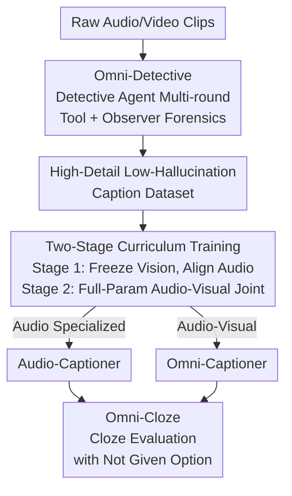

# Omni-Captioner: Data Pipeline, Models, and Benchmark for Omni Detailed Perception

**Conference**: ICLR 2026  
**OpenReview**: [https://openreview.net/forum?id=Z091XLyVkJ](https://openreview.net/forum?id=Z091XLyVkJ)  
**Code**: https://github.com/ddlBoJack/Omni-Captioner  
**Area**: Multimodal VLM  
**Keywords**: Omni-modality perception, detailed captioning, agentic data synthesis, hallucination suppression, cloze evaluation  

## TL;DR
Addressing the symbiotic problem of "the more detailed the description, the more hallucinations" in omni-modal language models, this paper proposes an agentic "detective" data pipeline (Omni-Detective) that calls various tools to automatically produce high-detail, low-hallucination audio-visual captions. Through two-stage curriculum training, the authors develop Audio-Captioner and Omni-Captioner, and design a cloze-style benchmark, Omni-Cloze. The models achieve open-source SOTA on multiple benchmarks including VDC, MMAU, and Omni-Cloze, rivaling Gemini 2.5 Pro.

## Background & Motivation

**Background**: Omni Language Models (OLMs) can process audio and video signals in parallel, outputting rich descriptions of scenes. A natural intuition is that within a model's capacity, longer descriptions capture more fine-grained details; thus, "detailed captioning" has become a crucial task for measuring multimodal perception.

**Limitations of Prior Work**: Empirical studies conducted by the authors on Gemini 2.5 Pro reveal a "co-growth" phenomenon—as description length increases, the detail ratio indeed rises, but the hallucination ratio (fabricated content) increases simultaneously. Short descriptions are safe but incomplete, missing subtle events, background cues, or cross-modal interactions; long descriptions are informative but prone to injecting content not supported by the input, which is a fatal flaw for applications requiring factual precision like AI assistants, scientific reports, or autonomous driving agents.

**Key Challenge**: The coupling of detail gain and hallucination growth in existing OLMs makes it difficult to obtain details without hallucinations. This contradiction is further amplified in omni-modal scenarios where the model must process visual and auditory streams with highly asymmetric information densities.

**Goal**: Systematically address the omni-modal detailed perception problem across three levels—data pipeline, model, and benchmark—to push the "detail–hallucination frontier" outward, producing richer descriptions without disproportionately increasing hallucinations.

**Key Insight**: Rather than having a single model attempt to "write everything at a single glance," it is better to mimic a human detective—repeatedly questioning independent observers, calling domain-specific tools for evidence, and cross-checking existing clues to incrementally add verifiable details. In this way, detail gains stem from forensic evidence rather than creative fabrication, decoupling hallucinations from details at the source.

**Core Idea**: Use "agentic multi-round forensics" to generate low-hallucination, high-detail data, then distill this capability into a 7B model using two-stage curriculum training. Finally, transform the challenging task of scoring open-ended generation into a stable multiple-choice format using "cloze" evaluation.

## Method

### Overall Architecture

This paper presents a complete solution spanning "data–model–evaluation." **Data side**: Omni-Detective is an agentic data synthesis pipeline where an LLM agent iteratively calls tools like OCR/ASR/MLLM and modality-specific observers. A multi-round Query-Observation loop accumulates evidence for the same video/audio segment, eventually integrating it into high-detail, low-hallucination captions. **Model side**: Using Qwen2.5-Omni-7B as the backbone, a two-stage curriculum is applied. First, the visual encoder is frozen to align sparse but critical audio cues (Audio-Captioner), followed by full-parameter joint training for audio-visual integration (Omni-Captioner). **Evaluation side**: To address scoring difficulties in open generation, Omni-Cloze is designed to convert fine-grained details into multiple-choice cloze tests with a "Not Given" option, enabling stable differentiation between "omission" and "fabrication" with a single automatic score.

### Key Designs

**1. Omni-Detective: Replacing single observation with detective-style multi-round forensics to decouple details from hallucinations**

Directly asking an MLLM to write a description in one go is the root of "co-growth" hallucinations—models fabricate content to increase detail. Omni-Detective transforms this into an iterative Query-Observation loop involving three components: (1) **Detective Agent**—an LLM agent that autonomously orchestrates the perception process by constructing queries each round; (2) **Tool Box**—specialized tools including MLLM, OCR, and ASR to extract precise information (e.g., on-screen text, speech transcripts); (3) **Independent Observers**—which interact directly with raw audio-visual streams to probe specific aspects. At each step, the agent issues a query and calls relevant tools; observers analyze retrieved content and feed enriched observations back to the agent. This continues until sufficient fine-grained evidence is collected, after which the agent integrates all observations. Crucially, each round **cross-checks existing claims** while adding verifiable details. Analysis in Section 6.2 confirms that as forensic steps increase, the detail rate rises steadily while both not-given and hallucination rates decrease. However, the hallucination rate converges around steps 5–6, indicating an inherent ceiling in current multimodal tools for correcting false claims.

**2. Two-stage Curriculum Training: Aligning sparse audio with frozen vision before joint multimodal fusion**

In audio-visual clips of equal duration, visual information density is typically much higher than audio. Joint training from the start often leads the model to ignore sparse but semantically critical audio cues (sound effects, speech, musical cues). To mitigate this asymmetry, a two-stage curriculum is designed. **Stage 1 (Audio Perception Alignment)**: The visual encoder is frozen, and only audio detailed captions are used to optimize the audio encoder and LLM, forcing the model to anchor perception on the audio stream (resulting in Audio-Captioner). **Stage 2 (Omni Perception Alignment)**: Joint training is performed on audio-visual detailed captions, where descriptions are significantly longer (averaging 1125 words for short videos). All components are unfrozen for full-parameter fine-tuning, allowing the network to exploit cross-modal complementarity to produce rich, coherent, and modality-complete descriptions (resulting in Omni-Captioner). An engineering finding noted is that removing text prompts actually improves captioning performance; thus, both stages are conducted without explicit text prompts. This "hard-to-easy" arrangement—forcing the model to master sparse audio before full fusion—is designed to counter visual "attention dominance."

**3. Omni-Cloze: Converting open generation scoring into single-pass multiple-choice cloze tests**

Detailed captions are open-ended, making traditional metrics like BLEU/METEOR/CIDEr inadequate for long, information-dense outputs. Existing benchmarks like VDC derive $k$ short QA pairs per caption, requiring $2k$ LLM calls per sample, which is inefficient and accumulates evaluation errors. Omni-Cloze adopts a cloze paradigm: fine-grained details are converted into multiple-choice blanks with distractors and a "**Not Given**" option. During evaluation, the model generates a detailed caption, and an LLM is then used to fill the blanks *only* based on that caption. Since the LLM performs information extraction rather than subjective reasoning, it requires only **one** LLM call (compared to 38 for VDC). The "Not Given" option is the key: it explicitly decomposes errors into not-given rate (omission) and hallucination rate (choosing a wrong item instead of Not Given), providing an interpretable distinction. The benchmark covers vision-only, audio-only, and audio-visual settings across 9 domains, 47 subcategories, 2k video clips, and 70k blanks, all human-verified. Arena-style Elo preference alignment shows a Pearson correlation of $r=0.91$ between Omni-Cloze accuracy and human Elo, surpassing VDC (0.86).

### A Complete Example

Considering a basketball game video: In Round 1 of Omni-Detective, the agent calls an MLLM to get a coarse description: "This is a basketball game." Detecting speech, Round 2 calls ASR to transcribe the commentary. Round 3 calls OCR to read the scoreboard "PHI 83, JOR 86", "2:20 left", and courtside ads. Observers verify player numbers (#15 ABBAS), slow-motion replays, and crowd atmosphere. After multi-round forensics, the agent integrates a high-fidelity description including details like "Brownlee dunks over Zaid Abbas, score updates to PHI 85–86," without hallucinating the score (compared to Qwen2.5-Omni, which hallucinated JOR leading 86-83). Trained on such data, the model learns to be detailed without fabricating.

## Key Experimental Results

### Main Results

Detailed Captioning Benchmarks (VDC Vision-only + video-SALMONN 2 Test Set Audio-Visual):

| Model | Modality | VDC Acc%↑ | VDC Score↑ | SALMONN2 Miss%↓ | SALMONN2 Hall%↓ |
|-------|----------|-----------|------------|------------------|------------------|
| GPT-4o | V | 46.3 | 2.5 | 17.0 | 14.2 |
| Gemini 1.5 Pro | A+V | 43.1 | 2.2 | 21.8 | 16.5 |
| Qwen2.5-Omni-7B | A+V | 39.7 | 2.2 | 26.3 | 21.7 |
| video-SALMONN2-7B | A+V | 46.1 | 2.5 | 10.0 | 12.9 |
| **Omni-Captioner-7B** | A+V | **55.0** | **2.7** | 17.8 | 10.9 |

Omni-Captioner sets a new SOTA on VDC with 55.0% accuracy and a 2.7 score, outperforming all proprietary and open-source baselines. On the SALMONN2 test set, it achieves the best detail-hallucination trade-off with zero-shot performance.

Caption-to-QA Cascaded Evaluation (Audio / Omni-modal, GPT-4o as QA backend):

| Model | MMAU | MMAR | Video-MME | Video-Holmes | WorldSense | Daily-Omni |
|-------|------|------|-----------|--------------|------------|------------|
| Gemini 2.5 Flash | 65.6 | 58.2 | 69.1 | 52.8 | 44.6 | 59.5 |
| Gemini 2.5 Pro | 70.0 | 64.1 | 75.0 | 59.9 | 53.6 | 73.6 |
| Qwen2.5-Omni-7B | 65.2 | 51.8 | 52.7 | 35.7 | 30.6 | 47.9 |
| video-SALMONN 2-7B | – | – | 65.9 | 42.9 | 44.1 | 59.7 |
| **Audio/Omni-Captioner-7B** | **70.0** | **59.8** | **67.1** | **48.8** | **48.2** | **67.9** |

Audio-Captioner reaches 70.0 on MMAU, matching Gemini 2.5 Pro and significantly leading open-source baselines. Omni-Captioner achieves the highest open-source scores across four audio-visual benchmarks.

### Ablation Study

Omni-Cloze Primary Results (Omni-modal) + Cascaded Ablation of Omni-Detective on Gemini 2.5 Pro:

| Configuration | Key Metrics | Note |
|---------------|-------------|------|
| Audio-Captioner-7B | Omni-Cloze 53.2% | Highest Audio open-source, +5.2% over Gemini 2.5 Pro (48.0%) |
| Omni-Captioner-7B | Omni-Cloze 56.4% | Omni-modal SOTA total score, exceeding Gemini 2.5 Pro (43.6%) |
| Gemini 2.5 Pro (Baseline) | MMAR 64.1 / Video-MME 75.0 | Baseline |
| Gemini 2.5 Pro + Omni-Detective | MMAR 68.3 / Video-MME 76.1 | Pipeline yields gains even on strong proprietary models |

### Key Findings
- **Omni-Detective forensics yield more detail and less hallucination, but hallucinations have a ceiling**: Detail rate rises with steps while not-given and hallucination rates fall; however, hallucinations converge around step 5–6, suggesting inherent limits in current tools.
- **Data pipeline is plug-and-play**: Applying Omni-Detective to Gemini 2.5 Pro for caption-to-QA improves MMAR by +4.2 and Video-MME by +1.1, showing gains from the paradigm itself.
- **Omni-Cloze aligns best with human preferences**: Accuracy correlation with human Elo is $r=0.91$, higher than VDC (0.86).
- **Removing text prompts is beneficial**: Stripping text prompts during training improves captioning performance, a counter-intuitive but practical discovery.

## Highlights & Insights
- **Turning "Data Generation" into an Agentic Forensic Loop**: Using an LLM agent with tool calls and independent observers for cross-verification ensures details come from evidence rather than "hallucinatory" creativity. This decouples detail from hallucination more effectively than simple prompting or DPO.
- **"Not Given" Option for Interpretable Errors**: This single design choice allows evaluation to separate "omission" from "fabrication," providing a diagnostic tool for model improvement.
- **Cloze Evaluation as Dimensionality Reduction**: Reducing LLM calls from $2k$ to 1 while increasing alignment with humans allows this cloze-based approach to be generalized to any long-context or detailed captioning task.
- **Curriculum Freezing to Combat Modality Asymmetry**: Forcing the model to master audio before joint fusion is a universal recipe for handling "strong-modality-dominates-weak-modality" scenarios.

## Limitations & Future Work
- **Unbroken Hallucination Ceiling**: The hallucination rate converges at step 5–6; current multimodal tools cannot correct certain misclassified details even with more forensics. The pipeline pushes the frontier but does not eliminate hallucinations.
- **Data Generation Cost**: Multi-round agentic forensics with high-frequency OCR/ASR/MLLM calls is significantly more expensive than single-pass prompts.
- **Cascaded Inference Weakness**: The caption-to-QA cascade is inherently weaker than end-to-end QA for certain types (e.g., precise counting), regardless of caption quality.
- **Gap with Proprietary Models**: While Omni-Captioner closes the gap with Gemini 2.5 Pro, absolute scores on benchmarks like Video-MME still lag, likely limited by the 7B parameter capacity.

## Related Work & Insights
- **vs. AuroraCap / VDC**: Unlike the vision-centric AuroraCap and the high-overhead VDC (requiring $2k$ LLM calls), this work extends to audio and uses cloze tests to reduce evaluation to a single call with higher correlation.
- **vs. video-SALMONN 2**: While SALMONN 2 uses multi-round DPO for post-training alignment, this work focuses on pre-training data generation, achieving a better detail-hallucination trade-off on SALMONN 2's own test set.
- **vs. Human-prompted Data Collection**: Omni-Detective breaks the trade-off between description precision and data scale by automating forensics, allowing for large-scale, low-hallucination data.

## Rating
- Novelty: ⭐⭐⭐⭐⭐ "Detective agentic generation + cloze evaluation + Not Given error decomposition" is highly original and covers the full stack.
- Experimental Thoroughness: ⭐⭐⭐⭐⭐ Solid evidence across nearly ten benchmarks with trend analyses and human alignment.
- Writing Quality: ⭐⭐⭐⭐ Clear analogies like "co-growth" and "detective"; complete figures, though some hyperparameter details are in the appendix.
- Value: ⭐⭐⭐⭐⭐ Open-sourcing the pipeline, models, and benchmark provides immediate value to the omni-modal perception community.

<!-- RELATED:START -->

## Related Papers

- [\[ICLR 2026\] OmniVinci: Enhancing Architecture and Data for Omni-Modal Understanding LLM](omnivinci_enhancing_architecture_and_data_for_omni-modal_understanding_llm.md)
- [\[ICLR 2026\] XModBench: Benchmarking Cross-Modal Capabilities and Consistency in Omni-Language Models](xmodbench_benchmarking_cross-modal_capabilities_and_consistency_in_omni-language.md)
- [\[ICLR 2026\] OmniVideoBench: Towards Audio-Visual Understanding Evaluation for Omni MLLMs](omnivideobench_towards_audio-visual_understanding_evaluation_for_omni_mllms.md)
- [\[ICLR 2026\] NExT-OMNI: Towards Any-to-Any Omnimodal Foundation Models with Discrete Flow Matching](next-omni_towards_any-to-any_omnimodal_foundation_models_with_discrete_flow_matc.md)
- [\[ICLR 2026\] Omni-Weather: A Unified Multimodal Model for Weather Radar Understanding and Generation](omni-weather_a_unified_multimodal_model_for_weather_radar_understanding_and_gene.md)

<!-- RELATED:END -->
