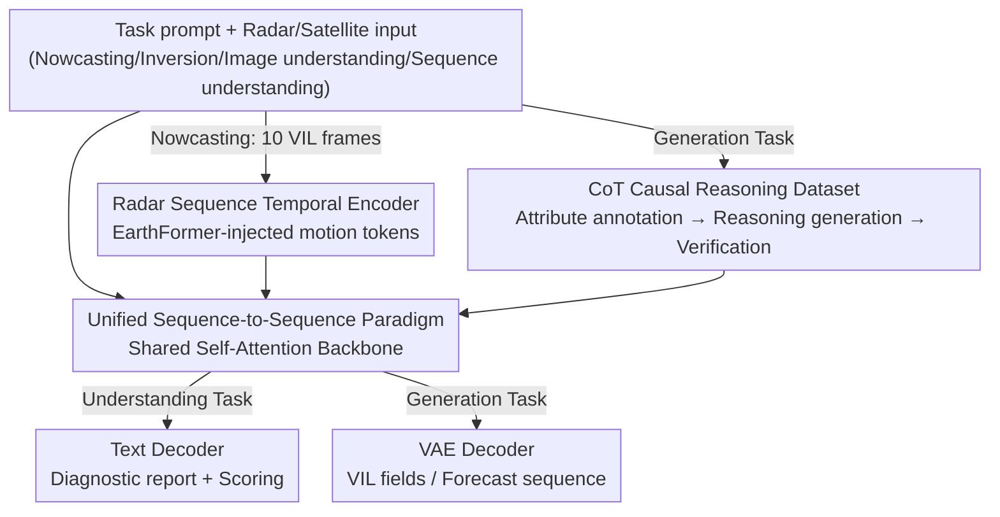

# Omni-Weather: A Unified Multimodal Model for Weather Radar Understanding and Generation

**Conference**: ICLR 2026  
**OpenReview**: [https://openreview.net/forum?id=3WnXsp72v6](https://openreview.net/forum?id=3WnXsp72v6)  
**Code**: https://github.com/Zhouzone/OmniWeather  
**Area**: Multimodal VLM  
**Keywords**: Meteorological Foundation Model, Unified Generation and Understanding, Radar Nowcasting, Chain-of-Thought Reasoning, SEVIR

## TL;DR
Omni-Weather is the first foundation model to unify "meteorological generation" (radar nowcasting, satellite-to-radar inversion) and "meteorological understanding" (diagnostic reports for radar images/sequences) within a single multimodal backbone. By employing a shared self-attention mechanism and modality-specific encoders, it expresses various tasks in a unified sequence-to-sequence format. Accompanied by a Chain-of-Thought (CoT) dataset for meteorological causal reasoning, the model enables generation tasks to "think while drawing," outperforming specialized SOTA models in both task categories and demonstrating that generation and understanding can mutually benefit each other.

## Background & Motivation

**Background**: Meteorological AI has evolved along two disjoint paths over recent years. On the generation side, nowcasting models like PreDiff, DiffCast, and CasCast predict convection evolution from historical radar sequences, while inversion methods like DiffSR reconstruct radar observations from satellite infrared channels. On the understanding side, models like RadarQA and WeatherQA generate diagnostic reports or identify severe convection impact areas from atmospheric fields or radar observations. Meanwhile, in the general domain, unified multimodal large models such as InternVL, UniGen, and Bagel have demonstrated that "perception + synthesis" can be integrated into a single architecture for end-to-end training.

**Limitations of Prior Work**: The meteorological field lacks such a unified architecture. Generation models (ClimaX, WeatherGFM) excel at forecasting and downscaling but cannot explain their observations; understanding models (RadarQA, WeatherQA) provide diagnostic reasoning but cannot synthesize physical fields. Consequently, nowcasting models cannot "comprehend" radar observations, while meteorological MLLMs cannot "predict" radar variables, leading to an artificial decoupling of these capabilities.

**Key Challenge**: Atmospheric systems are inherently multi-scale; storm generation, intensification, and dissipation are interconnected, and accurate prediction naturally entails a demand for mechanistic explanation. For extreme events like rapid cyclogenesis, decision-makers need to know both "what dangerous outcomes will occur" and "what the underlying drivers are." Splitting "prediction" and "understanding" into two models discards the storm evolution representations that the two could otherwise share.

**Goal**: To utilize a single backbone that handles both generative tasks (nowcasting, inversion) and understanding tasks (diagnostic reasoning, QA), while equipping the generation process with explainable causal reasoning.

**Key Insight**: The authors observe that by rewriting all tasks into a unified $T: X \to Y$ mapping (given prompt + radar input → target output), heterogeneous meteorological tasks can be fitted into a shared backbone. Furthermore, sharing representations between generation and understanding may be complementary—the diagnostic supervision signals provided by understanding tasks help the generation tasks learn more transferable storm evolution representations.

**Core Idea**: Using Bagel-7B-MoT as the base, the model unifies generation and understanding through "modality-specific encoders + shared self-attention + task-specific decoders." Additionally, a meteorological causal CoT dataset is constructed to supervise generation tasks with explicit reasoning and infer using reasoning prompts.

## Method

### Overall Architecture

Omni-Weather aims to solve the problem of "one model performing two types of work": Generative (radar nowcasting = predicting the next 12 frames given 10 VIL frames; radar inversion = reconstructing VIL fields from IR069/IR107 satellite infrared channels) and Understanding (radar single-frame/sequence understanding = outputting natural language reports and structured scores for storm morphology, intensity, evolution, and forecast quality). All tasks are unified as $y_t = F_\theta(p_t, x_t)$: the task prompt $p_t$ is encoded into a shared text space as a condition, and radar/satellite visual inputs are encoded via modality-specific encoders. After fusion, they pass through a shared self-attention layer and are decoded by corresponding decoders—the understanding task uses a text decoder to output text, while the generation task uses a VAE decoder to output physical fields. Thus, the model can switch freely between multiple tasks simply by changing the prompt.

The key to the pipeline lies in "visual modality branching": the understanding task uses an understanding encoder to encode VIL frames and concatenates them with text tokens; the inversion task uses a generation encoder to encode satellite channels; and because nowcasting requires modeling multi-frame temporal evolution, an EarthFormer radar sequence encoder is introduced to produce motion-aware temporal tokens as an additional condition for the shared attention layer. On top of unified SFT, a layer of CoT supervision is added, requiring generation tasks to output "intermediate reasoning + final prediction," transforming black-box generation into explainable causal inference.

### Key Designs

**1. Unified Sequence-to-Sequence Paradigm + Shared Self-Attention Backbone: Integrating Disconnected Generation and Understanding**

Addressing the fundamental split where "generation models cannot understand and understanding models cannot generate," the authors reduce four types of meteorological tasks to a unified mapping $T: X \to Y$. In nowcasting, $X$ is 10 VIL frames and $Y$ is the subsequent 12; in inversion, $X$ is two infrared channels and $Y$ is the VIL field; in understanding, $X$ is a pair of predicted/observed VIL sequences and $Y$ is a quality assessment text. All task prompts are mapped to the same text condition space, and visual inputs follow different modality encoders based on the task, before passing through a shared self-attention backbone $F_\theta$. This design does more than just "save training multiple models"—it allows generation and understanding to share the same storm evolution representation, which experiments prove leads to bidirectional gains rather than simple multi-task averaging.

**2. EarthFormer Radar Sequence Encoder: Injecting Reliable Temporal Structure into Nowcasting**

Unlike other tasks, nowcasting must model the motion and evolution of ten VIL frames. The authors found that forcing the backbone to learn multi-frame evolution using only a general Gen Encoder was "unstable." Consequently, an EarthFormer-based radar sequence temporal encoder was instantiated to produce motion-aware aggregated tokens $\kappa_t$, injected as optional conditions into the shared attention layer. Formally, the input sequence is written as $X_t = [\tau_{\text{text}}(p_t)\,;\,\tau_t(x_t)\,;\,\kappa_t]$, where $\kappa_t$ is the temporal embedding. This maintains the unity of the pipeline while feeding reliable temporal structures separately to stabilize long-term dynamics and improve temporal coherence—a middle-ground approach of "giving difficult tasks extra help within a unified architecture."

**3. Meteorological Causal Chain-of-Thought (CoT) Dataset: Turning Diagnostic Reasoning into Verifiable Causal Chains**

To enable generation tasks to explain themselves, reasoning supervision is required, yet no current CoT data exists for meteorological reasoning. The authors designed a meteorology-oriented CoT that frames reasoning as "causal inference of storm dynamics," splitting elements into two layers based on annotation difficulty: "causal factors" (morphology, intensity, direction/speed, rotation center, etc.) and "outcome indicators" (storm evolution patterns like expansion/contraction, merging/splitting). During nowcasting, causal factors are extracted from input VIL sequences and combined with projection factors of forecast frames to infer more difficult outcome indicators; satellite-to-radar inversion involves only causal factors. The CoT is constructed with a three-stage pipeline: GPT-4o for attribute annotation → GPT-o3 for task-specific reasoning generation → Automated verification (structural consistency, causal alignment, terminology normalization). The taxonomy is adapted from RadarQA but restructured by difficulty, with clear orientation mapping (image `origin='upper'`, North at the top) and threshold definitions (convection unit = connected region with intensity $\ge 32/255$) to ensure objective annotation.

**4. Dual-Path Integration of CoT: Training as Supervision and Inference as Prompting**

The constructed CoT connects to Omni-Weather via two complementary angles. During training, CoT serves as auxiliary supervision, requiring the model to generate intermediate reasoning text alongside the final prediction. During inference, CoT acts as a reasoning prompt, combined with task instructions to guide the model toward structured, explainable outputs (referred to as "thinking inference"). This integration provides more than just explainability; results show that explicit reasoning improves perceptual fidelity (better LPIPS and Radar-Score) at the cost of a slight decrease in pixel-level CSI, forming a controllable trade-off between "semantic/structural fidelity vs. pixel alignment."

### Loss & Training

The model is initialized from the pre-trained Bagel-7B-MoT and undergoes joint domain SFT across all meteorological tasks. Tokens from the shared backbone are branched for decoding: generation tasks $t \in T_{\text{gen}}$ use the VAE decoder $G_\phi$, while understanding tasks $t \in T_{\text{under}}$ use the text decoder $L_\psi$. The total loss includes a pixel regression term for generation and an autoregressive language modeling term for understanding:

$$L = \sum_{t \in T_{\text{gen}}} \lambda_t \frac{1}{|\Omega_t|}\lVert \hat{y}_t - y_t \rVert_2^2 + \sum_{t \in T_{\text{under}}} \lambda_t \left(-\sum_{k=1}^{n_t} \log p_\psi(y_{t,k}\mid y_{t,<k}, f_\theta(X_t))\right)$$

where $\Omega_t$ indexes target pixels/frames, $n_t$ is the target text length, and $\lambda_t$ balances tasks. Training is conducted on 8×H200 nodes for 20k steps using AdamW (base learning rate $2\times10^{-4}$, weight decay 0.05, 2k step warm-up + cosine decay). Images are unified to 256×256 (approx. 256 visual tokens).

## Key Experimental Results

The dataset used is SEVIR (time-aligned radar + satellite sequences). Generative tasks use pixel-level metrics (CSI, CRPS) + perceptual metrics (LPIPS, Radar-Score); understanding tasks follow the RadarQA protocol (Attribute Accuracy + GPT4-Score).

### Main Results

| Task | Metric | Omni-Weather | Strongest Baseline | Conclusion |
|------|------|------|----------|------|
| Nowcasting | CRPS ↓ | 0.026 | CasCast 0.031 | >15% reduction |
| Nowcasting | LPIPS ↓ | 0.179 | CasCast 0.207 | >25% improvement |
| Nowcasting | CSI-Pool16 | 0.539 | CasCast 0.518 | Slight increase, CSI/SSIM comparable |
| Radar Inversion | CSI@181 | 0.221 | WeatherGFM 0.157 | High threshold gain ~20% |
| Radar Inversion | CSI@16 | 0.622 | WeatherGFM 0.619 | Leading across all thresholds |
| Seq. Understanding | Overall | 61.79 | RadarQA 66.17 / GPT-5 49.50 | Near RadarQA, far exceeds closed-source LLMs |
| Seq. Understanding | Dynamic Consistency | 64.05 | RadarQA 53.31 | >10 points higher |
| Image Understanding| Miss / FAR | 92.21 / 88.72 | RadarQA 67.67 / 65.35 | 20–25 points higher |

Closed-source LLMs (Claude-sonnet-4, Gemini-2.5-pro, GPT-5) typically achieve accuracies below 30% on these tasks. With thinking inference, Omni-Weather-thinking further reduces LPIPS to 0.166 and increases Radar-Score to 2.86 for nowcasting, while CSI-Mean decreases slightly from 0.384 to 0.353, reflecting the perception-pixel trade-off.

### Ablation Study

| Configuration | Understanding Acc (Frame/Seq) | Understanding GPT4 (Frame/Seq) | Generation CSI-M (Frame/Seq) | Generation RMSE↓ |
|------|------|---------|------|------|
| Under. Only (U) | 81.95 / 54.34 | 5.78 / 6.03 | - | - |
| Gen. Only (G) | - | - | 0.303 / 0.323 | 0.590 / 19.01 |
| Joint (U+G) | 86.65 / 59.58 | 7.48 / 6.03 | 0.338 / 0.347 | 0.514 / 17.11 |

| CoT Fine-tuning | Thinking Inference | CSI-M ↑ | CRPS ↓ | Radar-Score ↑ | LPIPS ↓ | GPT4-Score |
|------|------|------|------|------|------|------|
| ✗ | ✗ | 0.347 | 0.023 | 2.423 | 0.182 | - |
| ✓ | ✗ | 0.237 | 0.042 | 2.032 | 0.213 | 4.21 |
| ✓ | ✓ | 0.335 | 0.023 | 2.657 | 0.163 | 7.82 |

### Key Findings
- **Mutual Gains between Generation and Understanding**: Joint training (U+G) outperforms single-task training on both sides—understanding accuracy rose from 81.95/54.34 to 86.65/59.58, and generation CSI-M rose from 0.303/0.323 to 0.338/0.347. This validates that the unified architecture provides synergy rather than just multi-tasking.
- **CoT requires Thinking Inference to be effective**: CoT fine-tuning without inference "thinking" actually worsened CSI-M to 0.237 and increased CRPS to 0.042; only when both are enabled do Radar-Score (2.657), LPIPS (0.163), and GPT4-Score (7.82) achieve SOTA, with CSI-M returning to 0.335.
- **Inclusion of General Data Helps**: Combining SEVIR with 20,000 general metaquery samples improved CSI-Mean (0.3352→0.3471) and CRPS compared to using SEVIR alone.
- **The Cost of Reasoning is Pixel Precision**: "Thinking" makes storm structures sharper and more temporally coherent (better LPIPS, Radar-Score), but at the cost of a moderate decrease in CSI, prioritizing semantic/structural fidelity over pixel-wise alignment.

## Highlights & Insights
- **"Unification as Gain" Proven in Science**: While unified multimodal models often focus on natural image-text domains, this work empirically proves that meteorological generation and understanding can mutually improve one another. This shifts the "unification" argument from architectural convenience to representation benefit.
- **Practical "Specialization within Unification"**: When direct backbone learning of temporal dynamics proved unstable, the authors used EarthFormer to inject specialized temporal tokens into the shared attention mechanism. This compromise—preserving the unified pipeline while stabilizing difficult tasks—is a valuable engineering takeaway.
- **Layered CoT Synthesis Paradigm**: Breaking reasoning into causal factors (easier) and outcome indicators (harder), and utilizing a division of labor between GPT-4o and GPT-o3 with automated verification, provides a replicable paradigm for scientific CoT data synthesis.
- **Quantified Perception-Pixel Trade-off**: The paper honestly presents the drop in CSI when using thinking inference, framing it as a controllable trade-off, which is informative for practical deployment.

## Limitations & Future Work
- Authors admit the model currently lacks compatibility with general-domain VAEs and needs validation on a wider range of tasks such as mid-range forecasting or typhoon path prediction. Reasoning trajectories might not be fully faithful, requiring stronger alignment between textual reasons and generated fields.
- On understanding tasks, the model has not yet fully surpassed specialized models like RadarQA in all metrics (e.g., Sequence Overall 61.79 < 66.17).
- The drop in CSI during thinking inference suggests that for pixel-precision sensitive applications (e.g., Quantitative Precipitation Estimation), reasoning should not be used indiscriminately.
- Future improvements could involve faithful constraints in the training objective (e.g., verifying reasoning factors against generated fields) or adaptive loss weighting to mitigate multi-task interference.

## Related Work & Insights
- **vs. RadarQA**: RadarQA is a pure understanding model providing diagnostic reports and is the primary baseline for the understanding side; Omni-Weather reuses its protocol but unifies understanding and generation, surpassing it in dynamic consistency and image Miss/FAR.
- **vs. CasCast / DiffCast / EarthFormer**: These are specialized nowcasting models that cannot provide explanations; Omni-Weather achieves better CRPS/LPIPS and provides reasoning trajectories, while integrating EarthFormer as an internal module.
- **vs. WeatherGFM**: WeatherGFM uses in-context learning for general nowcasting/inversion but lacks understanding; Omni-Weather leads in inversion high-value thresholds by ~20%.
- **vs. Bagel / Transfusion / MetaQuery**: Direct foundation for Omni-Weather’s SFT, demonstrating the "domainization" of general unified multimodal paradigms into meteorological science.

## Rating
- Novelty: ⭐⭐⭐⭐⭐ First foundation model to unify meteorological generation and understanding with empirical proof of mutual gains.
- Experimental Thoroughness: ⭐⭐⭐⭐ Extensive multi-task evaluations and ablations on CoT/data, though limited to the SEVIR dataset.
- Writing Quality: ⭐⭐⭐⭐ Clear presentation of task paradigms, architecture, and honest trade-offs.
- Value: ⭐⭐⭐⭐⭐ Provides a replicable unified paradigm for paired "prediction + diagnostic" scientific scenarios.

<!-- RELATED:START -->

## Related Papers

- [\[ICLR 2026\] Thinking with Camera: A Unified Multimodal Model for Camera-Centric Understanding and Generation](thinking_with_camera_a_unified_multimodal_model_for_camera-centric_understanding.md)
- [\[ICLR 2026\] UniF2ace: A Unified Fine-grained Face Understanding and Generation Model](unif2ace_a_underlineunified_underlinefine-grained_underlineface_understanding_an.md)
- [\[ICML 2026\] WeatherSyn: An Instruction Tuning MLLM For Weather Forecasting Report Generation](../../ICML2026/multimodal_vlm/weathersyn_an_instruction_tuning_mllm_for_weather_forecasting_report_generation.md)
- [\[CVPR 2026\] MeteorPred: A Meteorological Multimodal Large Model and Dataset for Severe Weather Event Prediction](../../CVPR2026/multimodal_vlm/meteorpred_a_meteorological_multimodal_large_model_and_dataset_for_severe_weathe.md)
- [\[ICLR 2026\] ORION: Decoupling and Alignment for Unified Autoregressive Understanding and Generation](orion_decoupling_and_alignment_for_unified_autoregressive_understanding_and_gene.md)

<!-- RELATED:END -->
