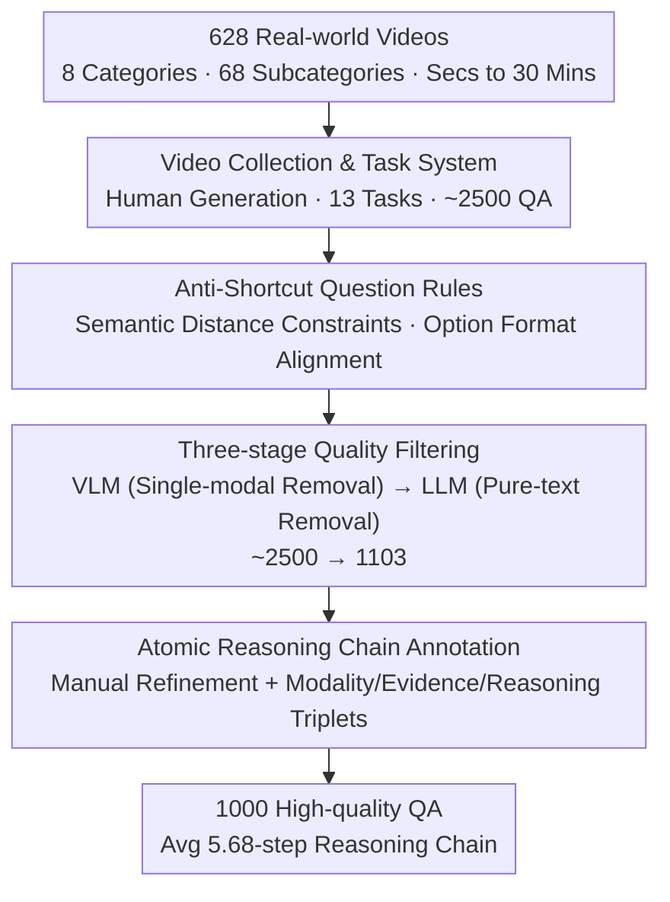

# OmniVideoBench: Towards Audio-Visual Understanding Evaluation for Omni MLLMs

**Conference**: ICLR 2026  
**OpenReview**: [https://openreview.net/forum?id=ItRYEe8E61](https://openreview.net/forum?id=ItRYEe8E61)  
**Code**: https://github.com/NJU-LINK/OmniVideoBench  
**Area**: Multimodal VLM  
**Keywords**: Audio-visual understanding, Benchmark, Omni-modal MLLM, Reasoning chain annotation, Long video

## TL;DR
OmniVideoBench is a high-quality benchmark specifically designed to evaluate "audio-visual collaborative reasoning." Using 628 real-world videos (up to 30 minutes), the authors constructed 1,000 multiple-choice questions with atomic-level reasoning chain annotations through human question generation, dual-model filtering, and manual refinement. Results indicate that even the strongest Gemini-3.0-Pro achieves only 61.8% accuracy—far below the human level of 82.69%—while open-source models perform near chance levels.

## Background & Motivation
**Background**: Multimodal Large Language Models (MLLMs) have advanced rapidly in video understanding, with increasing "Omni-modal" models claiming simultaneous processing of vision, language, and audio. Evaluating this capability requires benchmarks that truly test "collaborative audio-visual reasoning."

**Limitations of Prior Work**: Existing audio-visual benchmarks suffer from two systematic defects. First, **videos are too short**: datasets like AVQA, Music-AVQA, and AVHBench mostly use 10–60 second clips, failing to examine temporal dependencies over long spans. Second, **modality integration is superficial**: many benchmarks treat audio as an optional auxiliary signal, or there is no logical coupling between audio and vision (e.g., news or documentaries where audio covers all visual information, allowing answers based on vision alone without the need for audio).

**Key Challenge**: The evaluation must ensure that "both audio and vision are required for a correct answer." Without rigorous design, models can exploit **single-modal shortcuts** (seeing only frames, reading only captions, or relying on common sense) or **textual cues** (differences in phrasing or length of options) to guess correctly, resulting in inflated scores that fail to reflect true cross-modal reasoning. Experiments show that disabling the audio for Gemini-2.0-Flash drops its accuracy to near chance, proving visual information alone is insufficient for many tasks.

**Goal**: To create a benchmark that "forces audio-visual collaboration and eliminates various shortcuts," while providing transparency into the model's reasoning process rather than just the final answer.

**Key Insight**: The authors insist on **full manual question generation** rather than automated generation, as automated labeling is capped by the capabilities of the labeling model itself, whereas human generation aligns better with real-world needs. Models are then used as "filters" to remove questions solvable by single modalities or pure text, followed by the addition of **step-by-step reasoning chains** for each question.

**Core Idea**: A three-stage pipeline consisting of "human question generation + dual-model filtering + manual refinement," combined with explicit atomic reasoning chain annotations, produces a challenging and clean benchmark capable of diagnosing model reasoning processes.

## Method

### Overall Architecture
OmniVideoBench is essentially a **data construction and quality control pipeline**. It transforms "vast real-world videos" into "1,000 high-quality multiple-choice questions that force audio-visual collaboration and eliminate shortcuts." The pipeline consists of three phases: first, **collecting 628 real videos** across 8 major categories and 68 subcategories (seconds to 30 minutes) and manually generating ~2,500 questions; second, **dual filtering**—using a strong MLLM (Gemini-2.0-Flash) to remove single-modality-solvable questions and a strong LLM (DeepSeek-V3.1) to remove text-only/common-sense-solvable questions, reducing the set to 1,103; finally, **manual refinement** and adding **atomic reasoning chains** consisting of "modality-evidence-reasoning" triplets.

### Key Designs

**1. Video Collection & Task System: Ensuring "Non-Collaborative Unsolvability" at the Source**

To measure audio-visual collaboration, the video content must be complementary and tasks must be diverse. The authors classified videos into 8 categories (Vlog, News, Cartoon, Sports, Documentary, TV, Ego, Others) and **manually controlled category distribution**. Videos where audio replicates visual content (News/Documentary) were intentionally limited. Durations cover a range up to 30 minutes (average 384s). 13 task types were designed: Fine-grained Perception, Spatial Reasoning, Attribute Comparison, Background & Music Understanding, Counting, Temporal Understanding, Summarization, Sentiment Analysis, Causal Reasoning, Relation Reasoning, Referring Reasoning, First-person Reasoning, and Hypothetical Reasoning.

**2. Anti-shortcut Question Rules: Eliminating Textual Cues via Semantic Distance Constraints**

To prevent models from guessing based on textual cues, the authors introduced a **semantic distance** metric. Let an option $o_i$ be represented as a set of semantic units $S_i$. The distance between two options is the cardinality of their symmetric difference:

$$d(o_i, o_j) = |S_i \triangle S_j|$$

All distractors and the correct answer must maintain consistent semantic distances from one another. Other rules include simplifying stems to remove redundant details, restricting answer length, and ensuring consistent formatting (length, tone, style) across options to prevent "the longest option is the answer" patterns.

**3. Three-stage Quality Filtering: Using Strong Models as Filters for Shortcut Detection**

The ~2,500 human-generated questions were purified via:
- **Stage 1**: Gemini-2.0-Flash was used to test if questions could be answered with single-modal info. If the model succeeded with reasonable explanations, the question was removed.
- **Stage 2**: DeepSeek-V3.1 tested if questions could be solved via pure text, targeting common sense or linguistic leaks.
- **Stage 3**: A separate group of humans reviewed all remaining questions for correctness and uniqueness.

**4. Atomic Reasoning Chain Annotation: Diagnosing the Reasoning Process**

To explain why models fail, authors added **step-by-step reasoning chains**. Each step includes: **Modality** (audio or visual dependency), **Evidence** (specific information extracted, e.g., a line of dialogue), and **Reasoning** (the judgment based on the evidence). Each step must be **atomic**—involving only one modality and one minimal evidence unit. The average chain length is 5.68 steps (54% Visual, 46% Audio).

### Dataset Statistics
Final dataset: 628 real videos with audio, 8 categories, 68 subcategories, average length 384.24s, 480p–1080p resolution. 1,000 QA pairs, average question length 14.68 words, answer length 4.92 words, reasoning chain 5.68 steps. Audio types: Speech (762), Sound (147), Music (91).

## Key Experimental Results

### Main Results
The evaluation includes closed-source (Gemini-3.0/2.5/2.0) and open-source (Qwen3-Omni, Baichuan-Omni, etc.) models. Human accuracy is **82.69%**.

| Model | Type | Total Acc | Music | Sound | Speech |
| :--- | :--- | :--- | :--- | :--- | :--- |
| Human | — | **82.69** | — | — | — |
| Gemini-3.0-Pro | Vision+Audio | 61.80 | 52.81 | 55.17 | 64.13 |
| Gemini-2.5-Pro | Vision+Audio | 58.90 | 38.46 | 57.72 | 61.66 |
| Gemini-2.0-Flash | Vision+Audio | 41.50 | 29.67 | 40.27 | 43.21 |
| Qwen3-Omni-30B-A3B | Vision+Audio | 38.40 | 37.36 | 34.67 | 39.26 |
| Qwen2.5-Omni-7B | Vision+Audio | 29.30 | 23.07 | 25.33 | 30.70 |
| VideoLLaMA2-7B | Vision+Audio | 29.20 | 26.37 | 30.67 | 29.25 |

### Ablation Study

| Configuration | Observation | Explanation |
| :--- | :--- | :--- |
| Visual Only | Gemini-2.0-Flash 41.5 → 31.3 | Vision alone is insufficient; corroborates the need for collaboration. |
| Vision + ASR Text | Generally better than Visual Only | Textualized speech helps, but is useless for Music/Sound. |
| Vision + Real Audio | Outperforms Vision + ASR | Audio understanding cannot be fully replaced by ASR. |
| Open-ended QA vs MCQ | Gemini-2.0-Flash 41.50 → 27.06 | Removing options causes significant drops, proving MCQ inflates performance. |

### Key Findings
- **Music represents the hardest bottleneck**: Gemini-2.5-Pro scored only 38.46% in the music category. Abstract emotional acoustic cues are difficult for models to translate into reasoning.
- **Open-source audio integration is weak**: Qwen2.5-Omni-7B performed worse than the vision-only Qwen2.5-VL-7B at the same scale.
- **Density matters**: Increasing frames from 32 to 256 steadily improves accuracy, especially for long videos.

## Highlights & Insights
- **Filtering paradigm**: Using strong MLLMs/LLMs as filters to detect shortcuts is a repeatable quality control pattern for multimodal benchmarks.
- **Quantifying textual shortcuts**: The semantic distance metric $|S_i \triangle S_j|$ provides a mathematical tool to ensure option balance.
- **Diagnostic Signal**: Atomic reasoning chains allow researchers to pinpoint whether failures occur in audio perception, visual evidence gathering, or reasoning steps.

## Limitations & Future Work
- **Small Scale**: 1000 QA pairs is small compared to training sets, leading to larger confidence intervals for niche tasks like Music.
- **Human Cost**: Full manual generation and refinement are expensive and hard to scale.
- **MCQ Bias**: Despite open-ended QA tests, the primary benchmark uses MCQs, which have a guessing chance floor.

## Related Work & Insights
- **Comparison**: Modern benchmarks like WorldSense or Daily-Omni often fail to realize natural modality fusion. OmniVideoBench uses anti-shortcut rules and proves collaboration necessity via "Visual Only" drops to random chance.
- **Extension**: It extends short-clip benchmarks (AVQA, Music-AVQA) to long-sequence, fine-grained cross-modal reasoning.

## Rating
- **Novelty**: ⭐⭐⭐⭐ Systematic innovation in anti-shortcut rules and atomic chain diagnosis.
- **Experimental Thoroughness**: ⭐⭐⭐⭐⭐ High-density analysis across closed/open models and various modality configurations.
- **Writing Quality**: ⭐⭐⭐⭐ Clear pipeline description and logical analysis.
- **Value**: ⭐⭐⭐⭐⭐ Reveals the significant gap in true audio-visual reasoning (especially for music and long contexts) for current Omni MLLMs.

<!-- RELATED:START -->

## Related Papers

- [\[ICML 2026\] AVI-Bench: Toward Human-like Audio-Visual Intelligence of Omni-MLLMs](../../ICML2026/multimodal_vlm/avi-bench_toward_human-like_audio-visual_intelligence_of_omni-mllms.md)
- [\[CVPR 2026\] EgoAVU: Egocentric Audio-Visual Understanding](../../CVPR2026/multimodal_vlm/egoavu_egocentric_audio-visual_understanding.md)
- [\[ICLR 2026\] Customizing Visual Emotion Evaluation for MLLMs: An Open-vocabulary, Multifaceted, and Scalable Approach](customizing_visual_emotion_evaluation_for_mllms_an_open-vocabulary_multifaceted_.md)
- [\[ICLR 2026\] OmniVinci: Enhancing Architecture and Data for Omni-Modal Understanding LLM](omnivinci_enhancing_architecture_and_data_for_omni-modal_understanding_llm.md)
- [\[ICLR 2026\] Omni-Weather: A Unified Multimodal Model for Weather Radar Understanding and Generation](omni-weather_a_unified_multimodal_model_for_weather_radar_understanding_and_gene.md)

<!-- RELATED:END -->
