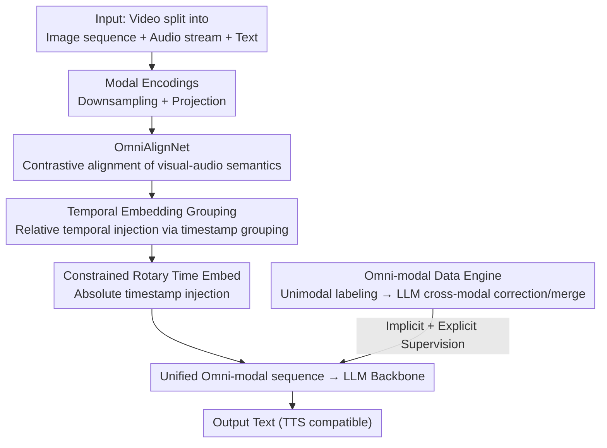

# OmniVinci: Enhancing Architecture and Data for Omni-Modal Understanding LLM

**Conference**: ICLR 2026  
**OpenReview**: [https://openreview.net/forum?id=DZeic3NpHy](https://openreview.net/forum?id=DZeic3NpHy)  
**Code**: Yes (NVIDIA open source, including model weights and project page)  
**Area**: Multimodal VLM  
**Keywords**: Omni-modal LLM, visual-audio alignment, temporal encoding, data synthesis, contrastive learning

## TL;DR
OmniVinci employs three architectural improvements for "visual-audio alignment" (OmniAlignNet semantic alignment, temporal grouping, and Constrained Rotary Time Embedding) alongside a data pipeline capable of synthesizing 24 million dialogues. Trained on only 0.2T tokens, this open-source omni-modal LLM understands video, audio, speech, and text simultaneously, outperforming Qwen2.5-Omni (while using only 1/6 of its training tokens) across multiple cross-modal, audio, and visual benchmarks.

## Background & Motivation
**Background**: Multimodal LLMs are already capable of "seeing" (vision) or "hearing" (audio). Recent works have begun attempting to align visual frames and audio within videos to advance "omni-modal" general intelligence—perceiving vision, natural sound, human speech, and language simultaneously—with representative works including Qwen2.5-Omni and Gemini.

**Limitations of Prior Work**: Training an omni-modal system is both expensive and difficult across many dimensions. Methodologically, existing approaches often simply concatenate heterogeneous visual/audio/text embeddings into the same latent space. This lacks explicit modeling of the **semantic correlation** and **temporal alignment** between vision and audio, wasting the natural synchronization inherent in video data. Furthermore, training data with genuine "joint visual-audio annotations" is extremely scarce, leading most video LLMs to simply discard the audio track.

**Key Challenge**: Omni-modal understanding requires the model to leverage complementary information from all modalities simultaneously. However, (1) architectures lack mechanisms to achieve both semantic and temporal alignment in a shared space; (2) data lacks explicit omni-modal annotations, while unimodal auto-labeling produces contradictory descriptions due to "modality-specific hallucinations."

**Goal**: This paper systematically explores the architecture, data, and training recipes for omni-modal LLMs, addressing both challenges by designing a unified visual-audio embedding mechanism and a pipeline to produce high-quality omni-modal dialogues at scale.

**Key Insight**: The authors observe that the visual and audio streams of the same video possess intrinsic semantic correlations, providing natural supervision for alignment. Simultaneously, a large volume of "video QA with audio" data **implicitly** encodes omni-modal signals that have been historically underutilized. Leveraging these points provides leverage for both architecture and data.

**Core Idea**: Semantic alignment is achieved via contrastive learning in a shared latent space (OmniAlignNet), while temporal alignment uses temporal grouping and Constrained Rotary Time Embedding (CRTE). This is paired with a data engine that generates explicit omni-modal supervision by performing "unimodal labeling followed by LLM cross-modal error correction and merging."

## Method

### Overall Architecture
OmniVinci is an autoregressive omni-modal LLM. Inputs can be any subset of images, videos, audio (natural sound or speech), and text; it outputs text (which can be converted to speech via external TTS). Videos are decomposed into "temporally correlated image sequences + audio streams." Images pass through a visual encoder, while audio passes through a unified audio encoder (handling both sound and speech). After downsampling and projection, they are fused into a unified omni-modal token sequence via the proposed **omni-modal alignment mechanism** and fed into the LLM backbone.

The method is divided into "Architectural Alignment" and "Data/Training." The architecture focuses on aligning visual and audio embeddings into the same latent space in three steps: high-level semantic alignment via OmniAlignNet, relative temporal ordering via Temporal Embedding Grouping, and absolute timestamp injection via CRTE. The data line utilizes an engine to produce 24 million dialogues via a two-stage (unimodal to omni-modal joint) training regime.

### Key Designs

**1. OmniAlignNet: Semantic Alignment via Contrastive Learning**

Simply concatenating tokens does not force the model to recognize that modalities describe the same event. Inspired by ImageBind/CLIP, OmniAlignNet learns a "shared visual-audio latent space." For a video, visual projection outputs $E_v \in \mathbb{R}^{N_v \times C}$ and audio projection outputs $E_a \in \mathbb{R}^{N_a \times C}$. Learnable queries $Q_v$ and $Q_a$ (via cross-attention) compress sequences into fixed $1\times C$ embeddings, followed by three self-attention layers and L2 normalization to obtain visual-omni embeddings $V \in \mathbb{R}^{K\times C}$ and audio-omni embeddings $A \in \mathbb{R}^{K\times C}$ for a batch of $K$ videos.

Alignment uses a symmetric contrastive loss: similarity $s_{ij} = V_i^\top A_j$, pulling embeddings of the same video together and pushing others apart:

$$\mathcal{L}_{\text{o-align}} = \tfrac{1}{2}(\mathcal{L}_{v\to a} + \mathcal{L}_{a\to v}),\quad \mathcal{L}_{v\to a} = -\tfrac{1}{N}\sum_{i=1}^{N}\log\frac{\exp(s_{ii})}{\sum_{j=1}^{N}\exp(s_{ij})}.$$

**2. Temporal Embedding Grouping (TEG): Relative Temporal Encoding**

OmniAlignNet aligns high-level semantics but loses the "before-and-after" temporal relationship. TEG addresses relative timing by segmenting the timeline into blocks of duration $T_G$ and reordering embeddings into corresponding blocks based on timestamps. For example, tokens $G_v^1, G_v^2, G_a^1, G_a^2$ are interleaved as:

$$E_{\text{group}} = [G_v^1, G_a^1, G_v^2, G_a^2],$$

ensuring visual and audio tokens from the same window are adjacent in the sequence.

**3. Constrained Rotary Time Embedding (CRTE): Absolute Timestamp Injection**

While TEG provides relative order, it lacks **absolute moments**. CRTE addresses the sensitivity of standard RoTE to small jitters and its failure to capture large offsets by introducing a maximum span $T_{\max}$. It constructs base frequencies $\omega_i = \frac{2\pi}{T_{\max}^{\,\theta i / C}}$ and modulates them with timestamps $\Omega_{i,j} = \omega_i \cdot t_j$, followed by element-wise rotation:

$$\text{CRTE}(x, \Omega_{:,j}) = x \odot \cos(\Omega_{:,j}) + \text{RotateHalf}(x)\odot \sin(\Omega_{:,j}).$$

**4. Omni-modal Data Engine: Cross-modal Correction of "Modality Hallucinations"**

**Implicit Learning** reuses existing "video QA with audio" data. **Explicit Learning** uses an engine to synthesize dialogues. It segments videos (20s/2min), generates unimodal descriptions, then uses an LLM to **synthesize and correct information across modalities**. This removes "modality-specific hallucinations" (e.g., misjudging a silent visual scene) to produce accurate joint captions and reasoning-chain QA pairs.

### Loss & Training
The strategy involves two stages: **Unimodal Training** to build base capabilities, and **Omni-modal Joint Training** merging randomly sampled unimodal data with omni-modal data (both implicit and explicit). The total loss combines the LLM's cross-entropy language modeling loss with the OmniAlignNet contrastive loss $\mathcal{L}_{\text{o-align}}$.

## Key Experimental Results

### Main Results
OmniVinci achieves a new SOTA on average omni-modal leaderboards, with significant gains in cross-modal understanding (Dailyomni):

| Dataset | Metric | OmniVinci | Qwen2.5-Omni | Gain |
|--------|------|-----------|--------------|------|
| Worldsense (Visual-Audio) | Acc | 48.23 | 45.40 | +2.83 |
| Dailyomni (Visual-Audio) | Acc | 66.50 | 47.45 | +19.05 |
| Omni-modal Average | Avg | 53.73 | 49.66 | +4.07 |
| Video-MME (Visual) | Acc | 68.2 (w/o sub) | 64.3 | +3.9 |

### Ablation Study
Incremental addition of the architecture components (trained on a 10B token subset):

| Configuration | Worldsense | Dailyomni | Omnibench | Average |
|------|-----------|-----------|-----------|------|
| Token Concatenation (Baseline) | 42.21 | 54.55 | 36.46 | 45.51 |
| + TEG | 44.51 | 60.99 | 37.65 | 47.72 (+2.21) |
| ++ CRTE | 45.46 | 65.66 | 39.64 | 50.25 (+4.74) |
| +++ OmniAlignNet | 46.21 | 65.83 | 45.74 | 52.59 (+7.08) |

### Key Findings
- **OmniAlignNet** provides the largest gain for Omnibench (+6.1), confirming semantic alignment is critical. **CRTE** significantly improves Dailyomni, highlighting the value of absolute time for synchronization.
- **Implicit Audio Learning** improves performance even when subtitles are present, indicating audio contains non-textual information (tone, events).
- The **Data Engine** provides the largest boost for long video segments (+6.67), proving joint captions are vital for complex content.

## Highlights & Insights
- **Modality-specific hallucination correction**: Using an LLM to synthesize unimodal labels into a reliable joint label is a robust trick for data synthesis.
- **Hierarchical Temporal Alignment**: Splitting temporal logic into relative (TEG) and absolute (CRTE) layers is clean. CRTE's $T_{\max}$ explicitly trades off local vs. global sensitivity.
- **Efficiency**: Achieving SOTA performance with 1/6 of the competitor's tokens suggests that alignment architecture and high-quality synthetic data outweigh raw data volume.

## Limitations & Future Work
- The data engine depends on upstream unimodal models; upper bounds are constrained by their accuracy.
- Audio output relies on external TTS rather than end-to-end generation, affecting latency and prosody.
- The work focuses primarily on "understanding" rather than active cross-modal generative tasks (e.g., simultaneous video and audio generation).

## Related Work & Insights
- **vs Qwen2.5-Omni**: Adds explicit semantic and hierarchical temporal alignment. Higher efficiency (0.2T vs 1.2T tokens).
- **vs RoTE**: CRTE addresses RoTE's sensitivity issues through $T_{\max}$ constraints and multi-scale frequency rotation.

## Rating
- Novelty: ⭐⭐⭐⭐
- Experimental Thoroughness: ⭐⭐⭐⭐⭐
- Writing Quality: ⭐⭐⭐⭐
- Value: ⭐⭐⭐⭐⭐

<!-- RELATED:START -->

## Related Papers

- [\[ICLR 2026\] Omni-Captioner: Data Pipeline, Models, and Benchmark for Omni Detailed Perception](omni-captioner_data_pipeline_models_and_benchmark_for_omni_detailed_perception.md)
- [\[ICLR 2026\] XModBench: Benchmarking Cross-Modal Capabilities and Consistency in Omni-Language Models](xmodbench_benchmarking_cross-modal_capabilities_and_consistency_in_omni-language.md)
- [\[ICLR 2026\] OmniVideoBench: Towards Audio-Visual Understanding Evaluation for Omni MLLMs](omnivideobench_towards_audio-visual_understanding_evaluation_for_omni_mllms.md)
- [\[ICLR 2026\] Omni-Weather: A Unified Multimodal Model for Weather Radar Understanding and Generation](omni-weather_a_unified_multimodal_model_for_weather_radar_understanding_and_gene.md)
- [\[ICLR 2026\] Multi-modal Data Spectrum: Multi-modal Datasets are Multi-dimensional](multi-modal_data_spectrum_multi-modal_datasets_are_multi-dimensional.md)

<!-- RELATED:END -->
