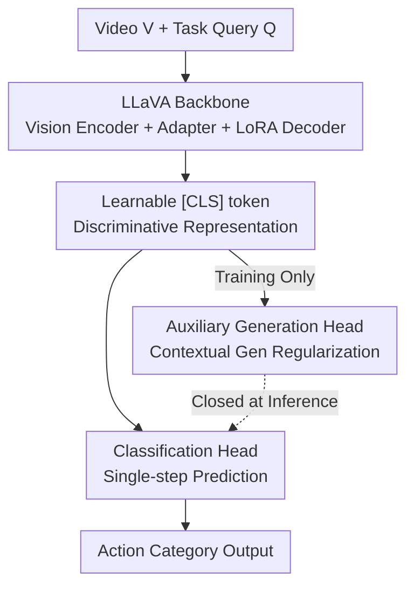

# On Discriminative vs. Generative Classifiers: Rethinking MLLMs for Action Understanding

**Conference**: ICLR 2026  
**OpenReview**: [https://openreview.net/forum?id=ppceQOZrAX](https://openreview.net/forum?id=ppceQOZrAX)  
**Code**: https://github.com/pangzhan27/GAD  
**Area**: Multimodal VLM / Video Understanding  
**Keywords**: MLLM, Temporal Action Understanding, Discriminative Classifier, Generative Classifier, Semantic Overlap

## TL;DR
The authors revisit the mainstream practice of treating MLLMs as generative classifiers that autoregressively output action labels. They identify semantic overlap caused by shared subwords in action labels as the root cause of low accuracy. Consequently, they transform MLLMs into discriminative classifiers using a learnable [CLS] token and introduce generative modeling as an auxiliary regularization. The proposed GAD (Generation-Assisted Discriminative) framework achieves higher accuracy across 5 datasets and 4 types of temporal action understanding tasks, with up to 3× inference acceleration.

## Background & Motivation
**Background**: Leveraging autoregressive text generation, MLLMs have extended video understanding from closed-set recognition to the open world. Many works (e.g., VideoLLM-online, VideoLLM-MoD) treat closed-set action recognition as a generation problem—feeding the model "What is the action in the video?" and letting it generate action labels (e.g., "add onion") as free text token-by-token, then mapping the generated text back to predefined categories using edit distance.

**Limitations of Prior Work**: Such generative classifiers have two major drawbacks. First is **latency**: a label is split into multiple subwords for token-by-token decoding, requiring multiple forward passes. Second is the **tendency to confuse semantically similar actions**: action labels are intentionally annotated to be concise and high-level ("add sugar" instead of a long description), leading to many categories sharing verbs or objects (e.g., "add" and "put" appear repeatedly). After tokenization, these subwords are shared across classes, creating severe **semantic overlap** in the output space—adding an extra layer of ambiguity beyond the visual ambiguity of the video itself.

**Key Challenge**: Generative objectives are inherently not designed for classification. Discriminative classifiers (learning task-specific representations and drawing clear decision boundaries) are naturally better suited for classification but have been neglected in the MLLM era due to the assumption that MLLM value lies in "unifying all tasks with language output." The question is: Does classification truly require label semantics, or is semantic overlap actually a burden?

**Goal**: (1) Systematically compare generative vs. discriminative classifiers on MLLMs; (2) Understand why generative classifiers underperform and whether the gap can be bridged; (3) Use generative modeling to **enhance** discriminative learning rather than treating them as independent tasks.

**Key Insight**: The authors conduct t-SNE visualization on actions sharing the verb "add" in CrossTask. They find that discriminative features separate actions clearly, while generative features are entangled. Through control experiments that progressively shuffle label tokenization, they isolate "shared semantics in the output space" as the root cause of the performance gap.

**Core Idea**: Discriminative classifiers are robust because they **disregard label semantics** and eliminate output-side overlap. The semantic/contextual information discarded by the discriminative approach can be recovered using an auxiliary generation head that is **active only during training and deactivated during inference**—this is GAD.

## Method

### Overall Architecture
GAD is built on a LLaVA-style backbone: a vision encoder $E_v$ encodes video frames, which are mapped to text-aligned visual tokens $F_v = A_{vt}(E_v(V))$ via a vision-language adapter $A_{vt}$. The task query $Q$ is tokenized into text tokens $F_t$. During fine-tuning, only the adapter and the LoRA-wrapped language decoder are trained; the rest remains frozen.

The three classification paradigms differ in how the decoder output is utilized:
- **Generative Classifier**: Feeds $F_t \oplus F_v$ into the causal decoder to autoregressively generate label subwords. Inference requires multiple forward passes and suffers from semantic overlap.
- **Discriminative Classifier**: Appends a learnable [CLS] token to the end of the input sequence. It attends to all preceding tokens to produce a global representation $o$ aggregating video and query information, which is fed to a classification head for single-step results; the language modeling head is deactivated.
- **GAD**: Uses the discriminative backbone as the primary branch and **attaches an auxiliary generation head**. It generates "context" (e.g., previous actions, global task goals) conditioned on the video, query, and learned [CLS] representation to regularize representation learning. At inference, only the discriminative branch is executed, maintaining the efficiency of a pure discriminative model.

### Key Designs

**1. Learnable [CLS] token: Converting MLLMs into Discriminative Classifiers**

To address the "slow + semantic confusion" issues of generative models, the authors do not introduce task-specific architectures but reuse existing MLLMs. By appending a learnable [CLS] token to the end of the input sequence, it attends to all visual and text tokens to output a global representation $o = f_\phi(Q, V, [\text{CLS}]) = D_t(F_t \oplus F_v \oplus [\text{CLS}])$. This is passed through a classification head optimized via standard cross-entropy $L_{cls} = -\log \Pr(y \mid o, \phi')$, while the language modeling head is disabled. This prevents action labels from being split into subwords, eliminating output-side semantic overlap and allowing single-step inference. A learnable token is used instead of the last visual token to improve generalization (ablation shows segment-F1 on EK100 drops from 23.2 to 20.7 w/o [CLS]).

**2. Single-step Generation Equivalence: Discriminative as a Special Case of Generative**

To explain why discriminative approaches are effective and to unify both paradigms, the authors prove that when action labels are added to the tokenizer vocabulary as **new tokens** and the classification head is merged into the language modeling head, discriminative classification is equivalent to "single-token generation of the action label." Since these tokens are only output targets, their randomly initialized embeddings do not affect performance. To verify that "semantic overlap is the root of the gap," the authors designed three levels of label tokenization experiments (e.g., [Tab.3]): **Randomized Consistent Mapping** (subwords replaced with random tokens but identical subwords mapped consistently—retaining inter-class overlap) shows little change; **Desynchronized Independent Mapping** (identical subwords in different labels mapped to different random tokens—eliminating overlap) allows generative performance to approach discriminative levels; **Extended Vocabulary** (each label treated as a single new token) similarly matches discriminative performance and enables single-step prediction. This chain of evidence attributes the performance gap to "shared semantics in the output space" rather than the linguistic meaning of subwords themselves.

**3. Generation Assistance: Recovering Discarded Context**

While discriminative models are strong, they discard the semantic richness of text generation. GAD adds a language modeling head as an **auxiliary task** (prior work shows simply concatenating objectives yields limited gains). The total loss is $L_{GAD} = L_{cls} + \lambda L'_{gen}$, where the auxiliary generation loss is conditioned on the [CLS] representation: $L'_{gen} = -\sum_i \log \Pr(u_i \mid u_{<i}, Q, V, [\text{CLS}], \theta)$, with $\lambda=1$ by default. Comparing three unification strategies (discriminative-first then generate, generation-first then discriminate, or parallel), the authors found **discriminative-first then generation** to be most effective. The key is what to generate: in OAD tasks, generating the **previous action** as context is more effective than generating future actions (past actions are supported by observed video, whereas the future is unobserved in online settings). In COIN, generating **task-level goal** information yields the highest gain. Ablations also show that replacing context generation with a discriminative auxiliary head (GAD prev disc/disc+) hurts accuracy, proving that gains stem from **generative semantic encoding** rather than the auxiliary task itself.

### Loss & Training
During training, the vision encoder is frozen, the adapter is fine-tuned, and the LLM is updated using LoRA ($r=128$, $\alpha=256$). Discriminative and generative objectives are jointly optimized across all samples. During inference, the generation branch is deactivated, using only the discriminative head to maintain low latency. Post-processing for generative outputs follows Levenshtein edit distance mapping to closed-set labels.

## Key Experimental Results

### Main Results
Evaluated on 5 datasets and 4 task types (Step Recognition, Step Prediction, Task Recognition, Online Action Detection OAD). OAD uses segment-F1 (S-F1, IoU 0.1) and point-F1 (P-F1, 1s threshold), while recognition/prediction tasks use Top-1 accuracy.

Discriminative vs. Generative (Llama3.2-1B, OAD task S-F1 / P-F1 and Inference FPS):

| Dataset | Gen S-F1/P-F1 | Gen FPS | Disc S-F1/P-F1 | Disc FPS |
| :--- | :--- | :--- | :--- | :--- |
| THUMOS'14 | 56.9 / 38.8 | 38.3 | 57.8 / 40.1 | 58.0 |
| CrossTask | 46.8 / 31.7 | 44.0 | 48.8 / 34.0 | 59.4 |
| EPIC-Kitchens-100 | 16.7 / 13.9 | 28.8 | 23.2 / 19.3 | 51.1 |
| Ego4D GoalStep | 8.9 / 3.4 | 17.8 | 10.6 / 4.1 | 53.6 |

The discriminative approach shows the largest improvement on datasets with many fine-grained actions (EK100 ~3600 classes, S-F1 +6.5), and speedups scale with label token count: Ego4D GoalStep (avg. 5.5 tokens per label) is nearly 4× faster. Notably, the 1B discriminative model outperforms the 8B generative model.

Comparison with SOTA (COIN Top-1 acc, Step/Next/Task):

| Method | Step | Next | Task |
| :--- | :--- | :--- | :--- |
| Videollm-online-8B | 63.1 | 49.1 | 92.7 |
| StreamMind-8B | 63.7 | 49.9 | 93.2 |
| Disc (Llama3.2-1B) | 64.1 | 50.1 | 92.8 |
| GAD (Llama3.2-1B) | 65.3 | 51.4 | 93.5 |
| GAD (Llama3-8B) | 67.3 | 51.6 | 94.5 |

On OAD, GAD is the first LLM-based method, reaching 58.1/40.2 on THUMOS'14, significantly exceeding CMeRT (48.9/34.6). The paper reports an average 2.5% accuracy gain + 3× speedup on COIN, and an average 6.8% F1 gain + 1.8× speedup on EK100.

### Ablation Study

| Configuration | CrossTask S-F1/P-F1 | EK100 S-F1/P-F1 | Description |
| :--- | :--- | :--- | :--- |
| Disc | 48.8 / 34.0 | 23.2 / 19.3 | Pure discriminative baseline |
| GAD | 50.3 / 34.5 | 24.1 / 20.1 | Full (context generation) |
| w/o [CLS] | 49.2 / 33.8 | 20.7 / 17.7 | Using last visual token; EK100 drops significantly |
| GAD prev disc | 48.2 / 31.6 | 23.6 / 19.3 | Prev action as discriminative auxiliary head; performance drops |
| GAD (label 2stage) | 41.8 / 26.7 | 9.3 / 6.7 | Train gen first then freeze; catastrophic failure |

Bridging the gap control (Llama3.2-1B): Gen 16.7/13.9 (EK100) → Gen rand 16.8/14.0 (negligible change) → Gen desync 23.0/19.0, Gen extend 23.3/19.2 (matching Disc 23.2/19.3).

### Key Findings
- **Semantic overlap is the root cause of performance gaps**: Shuffling subwords while retaining inter-class shared mapping has no effect; only breaking inter-class overlap (desync/extend) matches discriminative performance.
- **Error diversity metric evidence**: Generative entropy-based misclassification diversity scores on CrossTask/EK100/Ego4D are 0.76/1.3/1.8, vs. discriminative 0.66/0.79/1.5—generative models produce more divergent errors due to semantics (e.g., confusing "add sugar" with "add meat").
- **Complementary generation content**: Auxiliary generation is effective only when it captures information not available to the discriminative head (past actions, task goals).
- **Two-stage training failure**: Training only the generation head first then freezing it shows that generative classification alone does not provide strong representations.

## Highlights & Insights
- Defining discriminative classification as a "single-step special case of generation" using extended vocabularies elegantly unifies the two paradigms and explains both the efficiency and accuracy gains.
- The three-level tokenization control experiment is a clean causal design that separates subword semantics from inter-class overlap.
- GAD only activates the generation branch during fine-tuning, achieving "training with semantics, inference with efficiency" without altering pre-trained weights.
- The finding that "generative auxiliary tasks outperform discriminative auxiliary tasks" suggests the benefit comes from the **semantic encoding style** of generation rather than the multi-task supervision itself.

## Limitations & Future Work
- Discriminative models remain confined to closed sets and cannot handle unseen actions—the authors admit this is a core limitation and suggest future work using generative components for open-set generalization.
- Task-specific fine-tuning causes "task-induced forgetting" of general QA capabilities; this trade-off is analyzed only in the appendix.
- Gains depend on the premise of "concise labels with heavy semantic overlap"; for scenarios with descriptive, unique labels (e.g., Ego4D GoalStep), the discriminative advantage narrows.
- The choice of "what to generate" for auxiliary context is currently dependent on task priors (e.g., previous actions for OAD), lacking a universal mechanism for automatic context selection.

## Related Work & Insights
- **vs. Generative MLLM Classifiers (VideoLLM-online / StreamMind)**: These treat classification as autoregressive generation, suffering from semantic overlap and multi-step decoding; this work uses discriminative [CLS], allowing 1B models to outperform 8B counterparts.
- **vs. Customized Tokenization (Lin & Shou 2025)**: While those methods compress tokens while retaining semantics, this work argues that for fine-grained actions, "retaining semantics is harmful" and suggests encoding each action as a unique, structureless atomic token.
- **vs. Unified Retrieval+Generation (CoCa)**: Unlike frameworks that simply concatenate objectives, GAD uses generation as an auxiliary signal to **enhance** the discriminative task within the same objective.

## Rating
- Novelty: ⭐⭐⭐⭐⭐ Redefines closed-set action classification for MLLMs and provides a unified "discriminative = single-step generation" perspective.
- Experimental Thoroughness: ⭐⭐⭐⭐⭐ 5 datasets across 4 tasks, including causal controls and error diversity analysis.
- Writing Quality: ⭐⭐⭐⭐ Clear analytical chain, though some evidence on context selection is relegated to the appendix.
- Value: ⭐⭐⭐⭐⭐ Improves both accuracy and efficiency without modifying pre-training, offering high practical value for MLLM-based classification.

<!-- RELATED:START -->

## Related Papers

- [\[ICLR 2026\] Understanding vs. Generation: Navigating Optimization Dilemma in Multimodal Models](understanding_vs_generation_navigating_optimization_dilemma_in_multimodal_models.md)
- [\[ICLR 2026\] AttTok: Marrying Attribute Tokens with Generative Pre-trained Vision-Language Models towards Medical Image Understanding](atttok_marrying_attribute_tokens_with_generative_pre-trained_vision-language_mod.md)
- [\[ICLR 2026\] GeoBench: Rethinking Multimodal Geometric Problem-Solving via Hierarchical Evaluation](geobench_rethinking_multimodal_geometric_problem-solving_via_hierarchical_evalua.md)
- [\[ICLR 2026\] OmniVideoBench: Towards Audio-Visual Understanding Evaluation for Omni MLLMs](omnivideobench_towards_audio-visual_understanding_evaluation_for_omni_mllms.md)
- [\[ICLR 2026\] Efficient Discriminative Joint Encoders for Large Scale Vision-Language Re-ranking](efficient_discriminative_joint_encoders_for_large_scale_vision-language_rerankin.md)

<!-- RELATED:END -->
