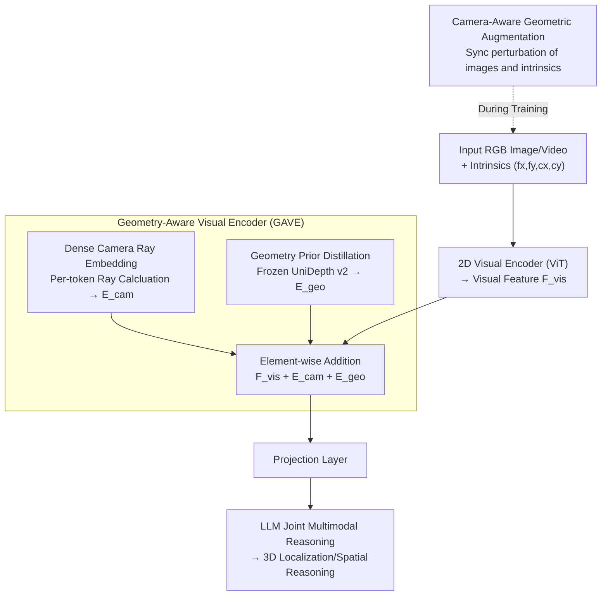

# On the Generalization Capacities of MLLMs for Spatial Intelligence

**Conference**: ICLR 2026 Oral  
**arXiv**: [2603.06704](https://arxiv.org/abs/2603.06704)  
**Code**: [github.com/Vegetebird/CA-MLLM](https://github.com/Vegetebird/CA-MLLM)  
**Area**: 3D Spatial Understanding / MLLM  
**Keywords**: Camera-Aware, Spatial Intelligence, Cross-Camera Generalization, 3D Localization, Geometric Priors

## TL;DR

This paper reveals a fundamental flaw in RGB-only spatial reasoning MLLMs: the focal length-depth ambiguity caused by ignoring camera intrinsics. It proposes the Camera-Aware MLLM (CA-MLLM) framework, which utilizes dense camera ray embeddings, camera-aware data augmentation, and geometric prior distillation to improve F1 scores from 39.1% to 52.1% on spatial localization tasks requiring cross-camera generalization.

## Background & Motivation

**Background**: MLLMs are increasingly applied to spatial reasoning tasks (3D localization, depth estimation, navigation). The mainstream paradigm involves end-to-end training directly on RGB images or videos, achieving promising results without relying on explicit 3D data.

**Limitations of Prior Work**: RGB-only MLLMs ignore camera intrinsics, making them unable to distinguish between a "small nearby object" and a "large distant object" (size-depth ambiguity), or a "wide-angle close-up" and a "telephoto distant view" (focal length-depth ambiguity). Consequently, models overfit to the camera distribution of the training sets.

**Key Challenge**: In the projection equation $h_{\text{proj}} = fH/Z$, the variables $(f, H, Z)$ form an equivalence class $(f, H, Z) \sim (\lambda f, H, \lambda Z)$. Without camera intrinsics, decoupling these variables is impossible—this is not a matter of model scale or architecture, but a fundamental lack of information.

**Goal**: Enable MLLMs to perform accurate spatial reasoning across different camera parameters, rather than being effective only on the training camera setups.

**Key Insight**: Drawing lessons from camera-aware monocular metric depth estimation (e.g., Metric3D, UniDepth) and generalizing them to general-purpose spatial reasoning at the MLLM level.

**Core Idea**: By injecting camera intrinsics as conditional information into each visual token of the MLLM, the model learns to decouple camera attributes from scene content, achieving cross-camera generalization.

## Method

### Overall Architecture

CA-MLLM addresses the cross-camera generalization issue of RGB-only spatial MLLMs, rooted in the model's inability to see intrinsics, which leads to the entanglement of "camera characteristics" and "scene content." **Mechanism**: Visual inputs initial pass through a **Geometry-Aware Visual Encoder (GAVE)**. After a 2D visual encoder extracts visual features $F_{\text{vis}}$, GAVE superimposes two types of conditional information: per-pixel camera ray embeddings $E_{\text{cam}}$ that inform each token of its line-of-sight, and geometric prior embeddings $E_{\text{geo}}$ distilled from a frozen depth model to provide 3D structure. These three are element-wise added and projected into the LLM for joint multimodal reasoning. During training, camera-aware geometric augmentation is used to synthesize various camera parameters, forcing the model to decouple camera attributes from scene content; during inference, these priors are internalized, and only RGB input is required.

### Key Designs

**1. Dense Camera Ray Embedding: Locating each token's line-of-sight**

The root cause of RGB-only MLLM failure is the inability to distinguish between "near-small" and "far-large" objects because $(f,H,Z)$ in the projection equation $h_{\text{proj}} = fH/Z$ forms an equivalence class. Without intrinsics, focal length and depth are permanently entangled. The proposed solution decomposes intrinsics into per-pixel ray directions: for each grid position $(i,j)$, normalized rays are calculated as $R_x[i,j] = (u_{ij} - c_x)/f_x$ and $R_y[i,j] = (v_{ij} - c_y)/f_y$. These are concatenated with global focal lengths $f_x, f_y$ and processed via sinusoidal embeddings to obtain $E_{\text{cam}} \in \mathbb{R}^{H\times W\times D}$, which is added to $F_{\text{vis}}$. Unlike Metric3D's approach of normalizing images to a virtual camera (computationally expensive and creates padding), directly attaching line-of-sight info to tokens is efficient and preserves resolution.

**2. Geometry Prior Distillation: Borrowing 3D structure and handling uncalibrated images**

While ray embeddings provide camera info, many internet 2D datasets lack intrinsics and explicit 3D supervision. This framework uses a frozen UniDepth v2 (pretrained on 10M+ RGB-depth pairs) to predict dense 3D point clouds for each training image, encoded as prior embeddings $E_{\text{geo}} \in \mathbb{R}^{H\times W\times D}$. This distills geometric knowledge from metric depth models into the MLLM. Crucially, as UniDepth can estimate intrinsics directly from images, the framework can generate ray embeddings for uncalibrated web images, expanding training data from labeled 3D sets to massive 2D image collections. These priors are internalized in features during training, so inference remains RGB-only.

**3. Camera-Aware Geometric Augmentation: Expanding the training distribution with synthetic parameters**

Existing 3D datasets have limited camera diversity (e.g., ScanNet, ARKitScenes, Matterport3D have distinct, clustered focal length distributions). Models trained only on real data treat training-specific camera shortcuts as general 3D geometry. The augmentation synthesizes new cameras: first via scaling, applying a factor $s$ to the image while updating intrinsics as $(f_x,f_y,c_x,c_y)\mapsto(sf_x,sf_y,sc_x,sc_y)$; second via translation, shifting the principal point $(c_x,c_y)$ to simulate eccentric projection. Ensuring consistency between image and intrinsic updates prevents destroying geometric relationships, forcing the model to treat intrinsics as conditions and the scene as content.

### Loss & Training

The framework uses VG-LLM as a baseline and is jointly trained on multi-source 3D data including ScanNet, ARKitScenes, Matterport3D, 3RScan, SUN RGB-D, and Objectron. For general spatial reasoning, LLaVA-Video-178k and SPAR data are included to cover a broader range of cameras and scenes.

## Key Experimental Results

### Main Results

| Dataset | Metric | Ours (4B) | Comparison | Note |
|--------|------|------|------|------|
| SPAR-Bench (full) | Avg. | 68.35 | 63.25 (SPAR-8B) | Surpasses 8B baseline |
| SPAR-Bench (full) | High-level | 81.74 | 72.92 (VG-LLM-4B) | Significant lead in high-level reasoning |
| VSI-Bench | Abs. Dist. | 71.3 | 66.0 (VG-LLM-4B) | Significant gain in absolute distance |
| CV-Bench-3D | Avg. | 90.7 | 91.3 (VG-LLM-4B) | Comparable to VG-LLM |
| BLINK-Spatial Multi. View | Multi-view | 87.2 | 54.1 (VG-LLM-4B) | Large gain (+33.1) in multi-view |

### Ablation Study

| Configuration | $F1_{0.25}$ | Description |
|------|------|------|
| Baseline (No components) | 39.1 | ScanNet-val x1.2 cross-camera test |
| + Ray Embedding | 41.2 | +2.1, ray embedding is effective |
| + Geom. Augmentation | 42.0 | +2.9, data diversity helps |
| + Prior Distillation | 43.1 | +4.0, distillation contributes most |
| Ray + Prior | 44.3 | Synergistic effect |
| All Components | 52.1 | +13.0, joint integration causes qualitative change |

### Key Findings

- Camera-agnostic MLLMs suffer performance collapses under simple image scaling (F1 drops 46.5→25.8 at 0.8× scale), proving they learn camera-specific shortcuts rather than general 3D geometric principles.
- Mixing multi-source datasets can actually decrease performance on specific sets (F1 46.5→46.0 on ScanNet) due to conflicting geometric signals from different cameras.
- Ablations show the three components must work together; while individual gains are modest, the full combination leads to a jump from 39.1 to 52.1.

## Highlights & Insights

- The depth of theoretical analysis is impressive: deriving equivalence class ambiguity from projection equations perfectly explains generalization failures (where scaling leads to systematic depth bias $Z_{\text{pred}} \approx Z_{\text{physical}}/s$). The problem diagnosis itself is a major contribution.
- The use of geometry prior distillation is clever as it allows the framework to scale to internet images lacking intrinsics. UniDepth acts as an "intrinsic estimator," significantly broadening the training data scope.

## Limitations & Future Work

- Currently only validated on single-frame and video 3D detection/localization; broader tasks like depth estimation or 3D reconstruction remain unexplored.
- Prior distillation relies on UniDepth v2 quality and may fail in scenarios where UniDepth fails (e.g., extreme lighting, specular reflections).
- Comparisons are limited for the 4B model against ultra-large models like GPT-5 or Gemini-2.5-Pro.

## Related Work & Insights

- **vs VG-LLM**: VG-LLM represents the RGB-only paradigm. This work uses it as a baseline to demonstrate the necessity of being camera-aware; VG-LLM's performance degrades significantly in cross-camera scenarios.
- **vs Metric3D / UniDepth**: These works proved the necessity of camera awareness for monocular metric depth; this paper generalizes that insight to broader MLLM spatial reasoning.
- **vs SPAR-Bench**: While SPAR provides comprehensive spatial reasoning benchmarks, it does not address camera generalization; this method achieves SOTA on SPAR-Bench.

## Rating

- Novelty: ⭐⭐⭐⭐⭐ First to systematically analyze and solve camera generalization in MLLM spatial reasoning with deep theory.
- Experimental Thoroughness: ⭐⭐⭐⭐ Cleverly designed cross-camera experiments, comprehensive ablations, and multiple benchmarks.
- Writing Quality: ⭐⭐⭐⭐⭐ Seamless flow from problem diagnosis to theoretical analysis and experimental validation.
- Value: ⭐⭐⭐⭐⭐ Reveals a fundamental issue in the field and provides a three-component framework directly applicable to various spatial MLLMs.

<!-- RELATED:START -->

## Related Papers

- [\[CVPR 2026\] SpatialTree: How Spatial Intelligence Branches Out in MLLMs](../../CVPR2026/multimodal_vlm/spatialtree_how_spatial_intelligence_branches_out_in_mllms.md)
- [\[ICLR 2026\] MMSI-Bench: A Benchmark for Multi-Image Spatial Intelligence](mmsi-bench_a_benchmark_for_multi-image_spatial_intelligence.md)
- [\[CVPR 2026\] SpatialScore: Towards Comprehensive Evaluation for Spatial Intelligence](../../CVPR2026/multimodal_vlm/spatialscore_towards_comprehensive_evaluation_for_spatial_intelligence.md)
- [\[CVPR 2026\] Scaling Spatial Intelligence with Multimodal Foundation Models](../../CVPR2026/multimodal_vlm/scaling_spatial_intelligence_with_multimodal_foundation_models.md)
- [\[CVPR 2026\] Is your VLM Sky-Ready? A Comprehensive Spatial Intelligence Benchmark for UAV Navigation](../../CVPR2026/multimodal_vlm/is_your_vlm_sky-ready_a_comprehensive_spatial_intelligence_benchmark_for_uav_nav.md)

<!-- RELATED:END -->
