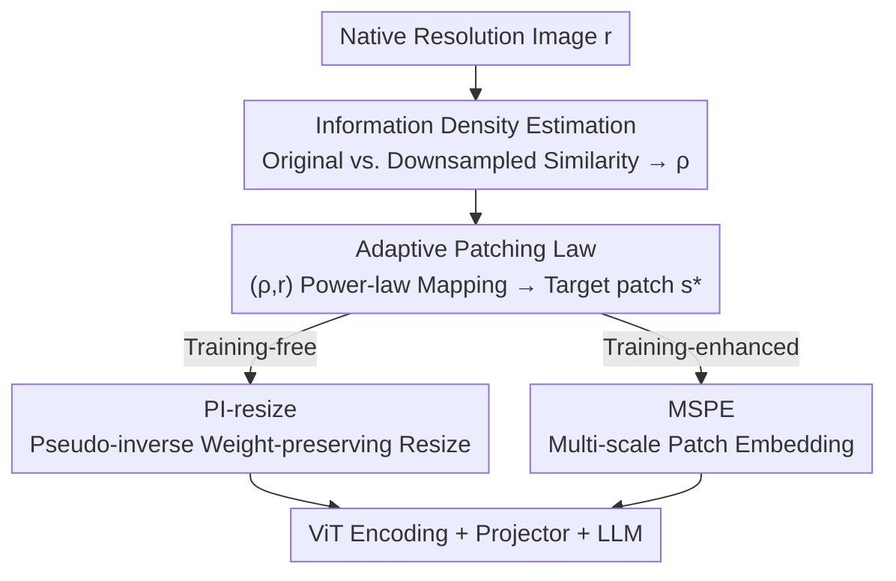

# One Patch Doesn't Fit All: Adaptive Patching for Native-Resolution Multimodal Large Language Models

**Conference**: ICLR 2026  
**OpenReview**: [https://openreview.net/forum?id=six75YUGgS](https://openreview.net/forum?id=six75YUGgS)  
**Code**: TBD  
**Area**: Multimodal VLM  
**Keywords**: Native resolution, Adaptive patch, Information density, Sequence packing, Training-free  

## TL;DR
The authors discover that MLLMs claiming "any-resolution" support are actually highly sensitive to resolution, rooted in the use of **fixed patch sizes** in ViTs. They propose AdaPatch, which adaptively selects patch sizes per image based on resolution and information density. By using pseudo-inverse resizing, they convert pre-trained fixed-patch models into any-patch models **without training**, simultaneously improving accuracy, stability, and inference speed at high resolutions by reducing token counts.

## Background & Motivation
**Background**: Current mainstream MLLMs connect a pre-trained ViT to an LLM via a lightweight projector. To handle diverse real-world resolutions and aspect ratios, recent works (e.g., Qwen2.5-VL, Ovis2.5, Kimi-VL) follow the NaViT approach: preserving the native resolution of images and cutting them into non-overlapping patches of a fixed size. This results in token sequences of varying lengths, which are then processed via sequence packing for joint encoding, claiming to support arbitrary input resolutions.

**Limitations of Prior Work**: The authors systematically evaluate these SOTA models from the perspective of "pixel budget" (pixel range) and find they are not truly robust to "any resolution." Performance fluctuates significantly when preprocessing the same benchmark at different pixel ranges: at low resolutions, information-dense images (charts, documents) fail due to the loss of fine-grained signals during resampling; at high resolutions (even when the model claims 3K+ support), performance generally drops.

**Key Challenge**: The fundamental cause is the **fixed patch size**. For low-resolution or information-dense images, a large patch is too coarse to recover fine-grained cues. For ultra-high-resolution or information-sparse images, a small patch is too local to capture global context. A fixed receptive field granularity cannot accommodate both extremes, leading to most performance losses.

**Key Insight**: By scanning Qwen2.5-VL with various patch sizes $s\in\{7,14,21,28,35,42\}$ on MME, the authors identified a clear pattern: low resolutions prefer small patches, while high resolutions prefer large patches. Furthermore, the optimal patch size depends not only on resolution but also on information density—at the same resolution, higher density (Document > Chart > Natural Image) requires smaller patches. Empirically, this satisfies $s^{\star}\propto r/\rho$ (where $r$ is a resolution scalar and $\rho$ is information density).

**Core Idea**: Since the optimal patch is determined by "resolution + information density," the model should not be restricted to a single patch size. The goal is to estimate the information density $\rho$ for each image, map $(\rho, r)\mapsto s$ to an appropriate patch size, and use a weight-preserving transformation to enable fixed-patch models to handle arbitrary patches, making "any-resolution" support truly effective.

## Method

### Overall Architecture
AdaPatch is a **plug-and-play** front-end module inserted before the MLLM visual encoding. It consists of two steps: first, estimating the appropriate patch size for the input image (Adaptive Patching Estimation, Sec 3.1); second, converting the pre-trained fixed patch embedding layer to handle the target patch size (Fixed-to-Any Patch Conversion, Sec 3.2). The process then proceeds with standard patch & position embedding, visual encoding, and projection to the LLM.

The first step includes three linked components: calculating information density $\rho$ via "original vs. downsampled feature" similarity → applying the $(\rho, r)$ mapping via a power-law formula (Patching Law) → quantizing to the target patch size $s^{\star}$. The second step offers two routes: the training-free PI-resize (Pseudo-Inverse resize) for direct inference-time conversion, and the training-enhanced MSPE (Multi-Scale Patch Embedding), which assigns parameters for each patch size. Both routes keep the backbone frozen and are compatible with sequence packing.

### Key Designs

**1. Information Density Estimation: Quantifying Image "Density" via Downsampling Loss**

Adjusting patches by information density requires a lightweight per-image metric. The authors' intuition is that downsampling high-density images loses more information, while downsampling sparse images has minimal impact. Thus, density is measured by the similarity difference between features before and after downsampling. Specifically, for image $x$, let $E^{[k,i]}_\phi$ be the $i$-th token feature at layer $k$. The cosine similarity between features of the original image with patch size $s$ and features obtained by "half-resolution downsampling then using $s/2$ patch" is computed, averaged across tokens, and subtracted from 1:

$$\rho_{\text{info}}(x) = 1 - \frac{1}{n}\sum_{i=1}^{n}\frac{\langle E^{[k,i]}_\phi(\text{conv}_\theta(\tilde{x}; s)),\ E^{[k,i]}_\phi(\text{conv}_{\theta^*}(B^{r/2}_{r}\text{vec}(\tilde{x}); s/2))\rangle}{\lVert E^{[k,i]}_\phi(\text{conv}_\theta(\tilde{x}; s))\rVert \cdot \lVert E^{[k,i]}_\phi(\text{conv}_{\theta^*}(\cdots; s/2))\rVert}$$

$\rho(x)\in[0,1]$, where higher values indicate higher information density. This is calculated only once in a shallow layer (default layer 0), incurring low overhead while providing the critical "density" input missing in fixed-patch methods.

**2. Adaptive Patching Law: Merging Resolution and Density via Power Law**

To translate $s^{\star}\propto r/\rho$ into an executable formula, the authors model this dependency using a power law with hyperparameters $\alpha, \beta$ controlling sensitivity to resolution and density:

$$s^{*}(x) = \text{Quantize}\left(\text{clip}\left(\tilde{s}\left(\frac{\kappa(r_x)}{r_0}\right)^{\alpha}\left(\frac{\tilde{\rho}}{\rho(x)+\varepsilon}\right)^{\beta}, s_{\min}, s_{\max}\right)\right)$$

where $\kappa(\cdot)$ is a resolution scalar (e.g., $\min\{h,w\}$), and $r_0,\tilde{\rho},\tilde{s}$ are benchmarks for the pre-trained model (default 896, 0.2, 14 respectively). $\text{clip}$ constrains the result to $[s_{\min},s_{\max}]$, and $\text{Quantize}$ maps it to a discrete set of integers. This rule allows per-image patch selection while remaining compatible with sequence packing. Default values are $(\alpha,\beta)=(0.5,0.3)$.

**3. PI-resize: Training-free Conversion to Any-patch Models**

After selecting target patch $s_i$, the challenge is that pre-trained patch embeddings are learned for a fixed $s$. The authors aim to keep the token embedding after the patch change as consistent as possible with the original, formulated as a least-squares objective: making $\text{conv}_{\theta_i}(B^{r_i}_r\text{vec}(x), s_i)$ approximate the original $\text{conv}_\theta(x, s)$. This has a **closed-form solution** via the Moore–Penrose pseudo-inverse $\omega_{\theta_i}=(B_i^\top)^{+}\omega_\theta$:

$$\text{PI-resize}^{s_i}_{s}(w) = (B_i^\top)^{+}\text{vec}(w)$$

For upsampling ($s_i>s$), the inner product is exactly preserved $\langle B_i x,(B_i^\top)^{+}\omega_\theta\rangle=\langle x,\omega_\theta\rangle$, while for downsampling ($s_i<s$), it provides the optimal approximation. This process **requires no training** to adapt pre-trained MLLMs at inference time.

**4. MSPE: Training-enhanced Multi-scale Patch Embedding**

While PI-resize is plug-and-play, MSPE goes further by allocating independent parameters $\{\theta_i\}^{M}_{i=1}$ for each candidate patch size $s_i$. These are jointly trained end-to-end with the MLLM, with patch sizes sampled adaptively. Each $\theta_i$ is initialized via PI-resize. The default candidate set is $\{s_i\}=\{8,12,14,16,24,28\}$. Neither method modifies the backbone.

### Loss & Training
The training-free route (PI-resize) requires no updates. The training-enhanced route (MSPE) uses AdamW (LR $1\times10^{-5}$, weight decay 0.01) for incremental fine-tuning on LLaVA1.5-665K and LLaVA1.6-779K. The maximum generation length is 512 with temperature 0.

## Key Experimental Results

### Main Results
Across four native-resolution models (Qwen2.5-VL-3B, SAIL-VL-2B, Ovis2.5-2B, Kimi-VL-A3B), AdaPatch consistently outperforms the fixed-patch ($s=14$) baseline, especially on benchmarks with high heterogeneity:

| Model | Benchmark | Vanilla | AdaPatch | Gain |
|------|------|---------|----------|------|
| Qwen2.5-VL-3B | OCRBench | 821 | 845 | +24 |
| Qwen2.5-VL-3B | MMBench-EN | 75.15 | 78.49 | +3.34 |
| Qwen2.5-VL-3B | MME | 2135.90 | 2210.41 | +74.5 |
| SAIL-VL-2B | OCRBench | 783 | 855 | +72 |
| Ovis2.5-2B | OCRBench | 706 | 814 | +108 |
| Kimi-VL-A3B | DocVQA | 96.45 | 98.33 | +1.88 |

In cross-pixel range evaluations (112×112 to 3584×3584), standard MLLMs degrade significantly at both extremes, whereas AdaPatch remains stable, confirming that resolution sensitivity stems from fixed patching.

### Ablation Study

| Config | Key Finding | Description |
|------|---------|------|
| PI-resize vs Bilinear/Area | PI-resize is optimal | Other interpolation methods cause significant drops |
| $\alpha$ (Resolution Sensitivity) | High impact | Large values cause performance drops; default 0.5 |
| $\beta$ (Density Sensitivity) | Moderate impact | Default 0.3 |
| AdaPatch vs Image Resize | AdaPatch is superior | Standard resizing helps OCRBench but hurts DocVQA/MME |
| Scale (3B/7B/32B) | Consistent gains | Gains come from alleviating patch rigidity, not model capacity |

### Key Findings
- **OCRBench and MME see the largest gains**: These benchmarks involve diverse resolutions and complex layouts where fixed patching is most disadvantageous.
- **Direct image resizing is not a good alternative**: While resizing images to a fixed pixel range might help specific benchmarks, it causes significant drops in DocVQA and MME. Preservation of native resolution with adaptive patching is necessary.
- **Inference time is a double-edged sword**: Extra overhead occurs at low resolutions due to density estimation and longer sequences, but significant speedups are achieved at high resolutions due to reduced token counts.

## Highlights & Insights
- **Debunking and fixing "Any Resolution"**: The authors reveal the resolution fragility of SOTA models through pixel-range scanning and correctly attribute it to fixed patching—a classic example of diagnosing before prescribing.
- **Clever Definition of Information Density**: By using similarity of shallow features without external networks, they quantify density at near-zero cost, filling the missing dimension in patch selection.
- **Closed-form PI-resize**: Formulating patch embedding resizing as a least-squares problem with a pseudo-inverse solution allows for training-free adaptation while preserving inner products for upsampling.

## Limitations & Future Work
- The current solution primarily addresses the vision front-end; the internal LLM dynamics regarding resolution remain unexplored.
- Density estimation and variable sequence lengths increase overhead for low-resolution, latency-sensitive scenarios.
- The Patching Law relies on empirical power laws; hyperparameters $\alpha, \beta$ may require tuning for different model architectures or tasks.

## Related Work & Insights
- **vs NaViT / Pix2struct**: These preserve native resolution but use **fixed patches**, which this paper identifies as a bottleneck at resolution extremes. AdaPatch allows per-image variable patches.
- **vs FlexiViT**: FlexiViT allows training a model for multiple patch sizes, primarily for classification. This work extends the concept to MLLMs with density-driven selection and training-free conversion.
- **vs CNN-based Adaptive Resolution**: Earlier CNN methods routed inputs to different sub-networks or resolutions, which is difficult to port to ViT-based MLLMs. AdaPatch focuses directly on the patch granularity of ViTs.

## Rating
- Novelty: ⭐⭐⭐⭐⭐ Identifies fixed patching as the root cause and provides a training-free solution via density estimation and pseudo-inverse math.
- Experimental Thoroughness: ⭐⭐⭐⭐⭐ Comprehensive coverage across four models, multiple scales, and various benchmarks.
- Writing Quality: ⭐⭐⭐⭐ Clear logic from diagnosis to solution, though formula-heavy.
- Value: ⭐⭐⭐⭐⭐ High practical value due to its plug-and-play nature and high-resolution speedups.

<!-- RELATED:START -->

## Related Papers

- [\[CVPR 2026\] One Patch to Caption Them All: A Unified Zero-Shot Captioning Framework](../../CVPR2026/multimodal_vlm/one_patch_to_caption_them_all_a_unified_zero-shot_captioning_framework.md)
- [\[ICLR 2026\] Self-Aug: Query and Entropy Adaptive Decoding for Large Vision-Language Models](self-aug_query_and_entropy_adaptive_decoding_for_large_vision-language_models.md)
- [\[ICLR 2026\] ERGO: Efficient High-Resolution Visual Understanding for Vision-Language Models](ergo_efficient_high-resolution_visual_understanding_for_vision-language_models.md)
- [\[ICLR 2026\] From Pixels to Words -- Towards Native Vision-Language Primitives at Scale](from_pixels_to_words_--_towards_native_vision-language_primitives_at_scale.md)
- [\[AAAI 2026\] ClearAIR: A Human-Visual-Perception-Inspired All-in-One Image Restoration](../../AAAI2026/multimodal_vlm/clearair_a_human-visual-perception-inspired_all-in-one_image_restoration.md)

<!-- RELATED:END -->
