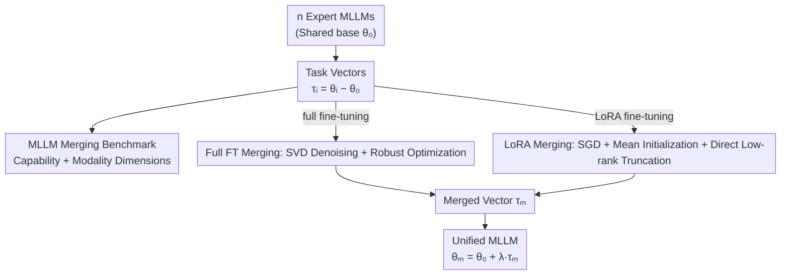

# OptMerge: Unifying Multimodal LLM Capabilities and Modalities via Model Merging

**Conference**: ICLR 2026  
**OpenReview**: [https://openreview.net/forum?id=Me0n0iESJY](https://openreview.net/forum?id=Me0n0iESJY)  
**Code**: Yes (The paper states that all code and checkpoints are publicly available)  
**Area**: Multimodal VLM / Model Merging  
**Keywords**: Model Merging, MLLM, Task Vectors, Low-rank Denoising, Omni Models

## TL;DR
This paper establishes the first benchmark for Multimodal Large Language Model (MLLM) merging with clearly defined capability and modality dimensions. It proposes OptMerge, which utilizes SVD low-rank denoising and robust task vector optimization to merge multiple expert MLLMs into a unified model without data, achieving an average gain of 2.48% and even surpassing mixture-of-data training.

## Background & Motivation
**Background**: Training foundation models is expensive and updates are slow, whereas domain-specific fine-tuned models in the community iterate rapidly (e.g., specialized checkpoints for VQA, geometry, charts, and OCR on Hugging Face). Model merging aims to "add" these expert models sharing the same base in the parameter space to create a multi-capability model, saving training and storage costs while supporting decentralized collaborative development.

**Limitations of Prior Work**: Previous merging research focused almost exclusively on vision classification models or pure-text LLMs for code/math tasks. MLLMs, which have the greatest practical demand, lacked a clean benchmark where training and evaluation tasks are clearly partitioned. Existing MLLM merging methods also have significant drawbacks: AdaMMS can only merge two models at a time and requires repeated response generation to select hyperparameters (assuming the test set is visible and slow); UQ-Merge treats each LLaVA-v1.5 fine-tuning dataset as a "task" without categorizing by capability dimensions, and relies on uncertainty calculated from unlabeled test sets to determine merging order.

**Key Challenge**: Model merging is extremely sensitive to "task vectors" ($\tau_i = \theta_i - \theta_0$, the parameter difference between fine-tuned and base models). Task vectors contain both redundancy (shared basic capabilities relearned across tasks) and noise (irrelevant parameter updates). Direct summation amplifies these interferences, while data-free optimization to fit a clean merged vector is often unstable or non-convergent—especially in LoRA scenarios, where the merged vector "takes a shortcut" by exploding its norm to satisfy orthogonality, ultimately collapsing language capabilities.

**Goal**: (1) Create an MLLM merging benchmark with clear capability divisions covering cross-modality merging; (2) Propose a data-free, hyperparameter-search-free merging method robust to both full fine-tuning and LoRA.

**Key Insight**: The authors first theoretically prove that the "degree of parameter drift during fine-tuning" determines merging quality—models with smaller drift are easier to merge, even if their single-task accuracy is slightly lower. This reattributes "merging failure" to the experts being over-trained rather than just algorithmic deficiencies.

**Core Idea**: Use SVD low-rank approximation to strip noise from task vectors, then robustly optimize the merged vector in the denoised subspace (using different stabilization techniques for full FT and LoRA) to ensure data-free optimization is both accurate and stable.

## Method

### Overall Architecture
OptMerge takes $n$ expert MLLMs fine-tuned from the same base $\theta_0$, converts them into task vectors $\tau_i = \theta_i - \theta_0$, and robustly computes a merged vector $\tau_m$ via two branches depending on the fine-tuning method. Finally, the unified model is obtained as $\theta_m = \theta_0 + \lambda \tau_m$. This process requires no training/testing data and performs lightweight layer-wise optimization on each linear layer (other layers are simply averaged).

The method builds upon the WUDI Merging optimization framework, treating merging as a data-free optimization problem that minimizes "layer-wise interference" between the merged vector and task vectors:
$$\min_{\tau_{m,l}} \mathcal{L}_l = \sum_{i=1}^{n} \frac{1}{\|\tau_{i,l}\|_F^2} \left\| (\tau_{m,l} - \tau_{i,l})(\tau_{i,l})^\top \right\|_F^2.$$
OptMerge contributes by using SVD to denoise task vectors and then applying stabilization techniques tailored for full FT and LoRA to resolve noise amplification and norm explosion issues.

### Key Designs

**1. MLLM Merging Benchmark: Decoupling Capabilities and Modalities**

To address the lack of clear task partitioning, the authors created the first merging benchmark with fine-grained capability classification. Capabilities are divided into VQA, Geometry, Chart, OCR, and Grounding. For each, at least 100K public samples were collected for supervised fine-tuning (588K/190K/218K/238K/135K respectively), paired with specific evaluation sets (VizWiz/GQA, MathVista/MATH-Vision, ChartQA, TextVQA/OCRVQA, RefCOCO). InternVL2.5-1B-Instruct (full fine-tuning) and Qwen2-VL-7B-Base (LoRA) were selected to cover "fine-tuning base" and "fine-tuning instruct" models. For modalities, a shared LLM (Vicuna-7B) is connected to CLIP (vision), BEATs (audio), and LanguageBind (video) encoders to study the feasibility of merging them into an Omni model.

**2. Parameter Drift Theory: Merging Depends on Fine-Tuning Intensity, Not Task Accuracy**

The authors discovered that merging performance first increases and then decreases with fine-tuning steps; experts with higher accuracy are not necessarily better for merging. They provide a theoretical upper bound (Theorem 3.1): for task $i$ trained for $T$ steps with a fixed learning rate $\eta$, the loss after merging satisfies:
$$\mathcal{L}_i(\Theta + \tau_m) \le C_i + O(\gamma^T) + O(\delta\,\eta T) + O(\eta^2 T^2),$$
where $O(\gamma^T)$ is the residual from insufficient convergence, $O(\delta\,\eta T)$ is cross-task interference, and $O(\eta^2 T^2)$ is curvature error from L-smoothness. This implies that while the target task gains dominate early training, interference and curvature error (growing with $\eta T$ and $\eta^2 T^2$) eventually degrade merging quality. Thus, the benchmark uses small learning rates to limit drift.

**3. Full Fine-tuning Merging: SVD Low-rank Denoising + Decentralized Optimization**

Directly adding task vectors amplifies noise. The authors first centralize task vectors using the mean $\bar{\tau}_l = \frac{1}{n}\sum_i \tau_{i,l}$, then apply SVD to $\tau_{i,l} - \bar{\tau}_l$, stripping noise hidden in tail singular vectors using the top-$k$ components $U_{1:k}\Sigma_{1:k}V_{1:k}^\top$. Crucially, $\Sigma_{1:k}V_{1:k}^\top$ is used as the input subspace $x_{i,l}$ instead of $\tau_{i,l}$, focusing on column feature space to yield the objective:
$$\min_{\tau_{m,l}} \mathcal{L}_l = \sum_{i=1}^{n} \frac{1}{\|\tau_{i,l}\|_F^2} \left\| (\tau_{m,l} - U_{1:k}\Sigma_{1:k}V_{1:k}^\top - \bar{\tau}_l)(\Sigma_{1:k}V_{1:k}^\top)^\top \right\|_F^2.$$
This effectively captures principal components to achieve robust denoising. $k$ is set to "rank per task vector / number of tasks (5)", optimized with Adam (1e-5) for 300 steps.

**4. LoRA Merging: SGD + Mean Initialization + Direct Truncation to Suppress Norm Explosion**

LoRA optimization faces a unique challenge: gradients are only effective in the non-zero singular value directions of $\tau_{i,l}$, trapping the merged vector. It often "takes a shortcut" by inflating its norm to achieve orthogonality across tasks, which shifts the final parameters away from the original distribution and collapses language capabilities. Three techniques are used: (1) Replacing Adam with SGD for its stability and implicit regularization under sparse gradients; (2) Direct truncated SVD on $\tau_{i,l}$ to naturally reduce the norm; (3) Initializing the merged vector with the mean of task vectors. This keeps the norm stable throughout optimization.

### Loss & Training
The process is entirely data-free, minimizing interference loss layer-wise for linear layers while averaging others. The merging coefficient $\lambda$ is searched in $\{0.1, 0.3, 0.5, 0.7, 1.0, 1.5\}$. Optimization runs for 300 steps using Adam (1e-5) for InternVL and SGD (1e-4) for QwenVL on 8×V100 GPUs.

## Key Experimental Results

### Main Results
Capability Merging Average Scores:

| Method | InternVL2.5 Avg. | Qwen2-VL Avg. |
|------|------|------|
| Weight Average | 49.12 | 60.55 |
| Task Arithmetic | 56.18 | 60.29 |
| TIES Merging | 56.70 | 61.24 |
| TSV Merging | 54.37 | 60.63 |
| Iso-C | 54.78 | 26.69 (Collapses on LoRA) |
| WUDI Merging | 57.00 | 58.65 |
| **OptMerge (Ours)** | **57.44** | **63.30** |
| Mixture Training / Instruct (Upper Bound) | 57.66 | 62.23 |

On Qwen2-VL (LoRA), OptMerge reaches 63.30, surpassing all baselines and even Qwen2-VL-Instruct (62.23), demonstrating that merging can outperform mixture-of-data training.

Modality Merging (Vision/Audio/Video → Omni, Vicuna-7B):

| Method | MUSIC-AVQA | AVQA | Avg. |
|------|------|------|------|
| Best Single Modality | 50.77 | 79.20 | 64.11 |
| Task Arithmetic | 52.14 | 78.62 | 65.38 |
| **OptMerge (Ours)** | **52.77** | **80.82** | **67.00** |
| NaiveMC (Online) | 53.50 | 80.26 | 66.88 |
| DAMC (Online) | 52.80 | 80.78 | 66.79 |

Merging three modalities significantly outperforms single modalities, and OptMerge even surpasses online combination methods like NaiveMC/DAMC which require 3× storage.

### Ablation Study
Ablation on Qwen2-VL (LoRA) and Vicuna-7B (Modality):

| Configuration | Qwen2-VL | Vicuna-7B |
|------|---------|-----------|
| WUDI Merging | 58.65 | 64.65 |
| + SGD | 48.88 (−9.77%) | 66.91 (+2.26%) |
| + Mean Init | 63.08 (+4.43%) | 67.07 (+2.42%) |
| + Low-rank Approx | 63.30 (+4.65%) | 67.00 (+2.35%) |

### Key Findings
- **SGD alone leads to performance drops** (−9.77%), but combined with mean initialization, it yields gains (+4.43%), highlighting the synergy between initialization and a stable optimizer.
- **Efficiency outperforms mixture training**: InternVL2.5-1B merging takes 0.22h / 2.62GB, whereas mixture training takes 25.38h / 240GB.
- **Valid on real-world checkpoints**: Merging four real fine-tuned models from Hugging Face (GRPO, Pokemon, olmOCR, EraX-VL), OptMerge (66.70) significantly outperforms single models and Qwen2-VL-Instruct (62.23).

## Highlights & Insights
- **Theoretic Reattribution of Merging Failure**: Theorem 3.1 provides an actionable criterion: merging success is driven by parameter drift (learning rate $\times$ steps).
- **Diagnosis of LoRA "Norm Shortcut"**: The study identifies how norm explosion causes language collapse and resolves it through SGD implicit regularization and mean initialization.
- **Subspace Approximation**: Using $\Sigma_{1:k}V_{1:k}^\top$ as an input subspace effectively denoises components, providing more accurate subspace estimation than raw task vectors.

## Limitations & Future Work
- Assumes expert models have small parameter drift and linear connectivity to the base. It fails for over-trained models with large drift (e.g., Math+Coder).
- Only optimizes linear layers, ignoring potential conflicts in non-linear layers.
- Still requires searching for the coefficient $\lambda$ and relies on a heuristic for selecting the rank $k$.

## Related Work & Insights
- **vs AdaMMS**: OptMerge is data-free and hyperparameter-search-free, supporting the merging of multiple MLLMs simultaneously.
- **vs UQ-Merge**: OptMerge provides a clear capability/modality benchmark and is entirely data-independent.
- **vs WUDI Merging**: OptMerge builds on WUDI's framework but introduces SVD denoising and LoRA-specific stabilization, improving average scores by significant margins.

## Rating
- Novelty: ⭐⭐⭐⭐
- Experimental Thoroughness: ⭐⭐⭐⭐⭐
- Writing Quality: ⭐⭐⭐⭐
- Value: ⭐⭐⭐⭐⭐

<!-- RELATED:START -->

## Related Papers

- [\[ICLR 2026\] VisCodex: Unified Multimodal Code Generation via Merging Vision and Coding Models](viscodex_unified_multimodal_code_generation_via_merging_vision_and_coding_models.md)
- [\[NeurIPS 2025\] RobustMerge: Parameter-Efficient Model Merging for MLLMs with Direction Robustness](../../NeurIPS2025/multimodal_vlm/robustmerge_parameter-efficient_model_merging_for_mllms_with_direction_robustnes.md)
- [\[ICLR 2026\] DualToken: Towards Unifying Visual Understanding and Generation with Dual Visual Vocabularies](dualtoken_towards_unifying_visual_understanding_and_generation_with_dual_visual_.md)
- [\[ACL 2025\] Transferring Textual Preferences to Vision-Language Understanding through Model Merging](../../ACL2025/multimodal_vlm/transferring_textual_preferences_to_vision-language_understanding_through_model_.md)
- [\[ICLR 2026\] WAVE: Learning Unified & Versatile Audio-Visual Embeddings with Multimodal LLM](wave_learning_unified_versatile_audio-visual_embeddings_with_multimodal_llm.md)

<!-- RELATED:END -->
