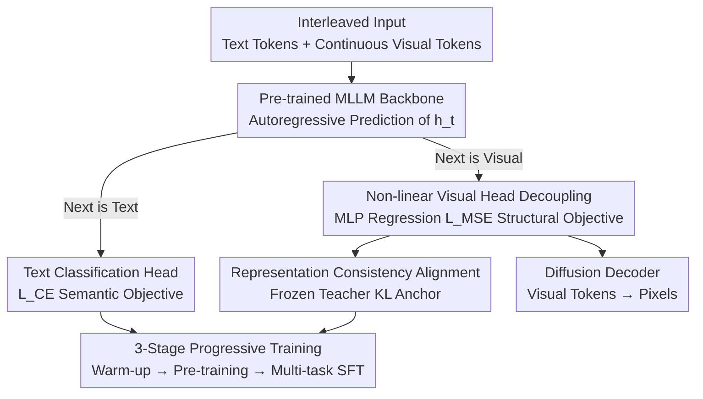

# ORION: Decoupling and Alignment for Unified Autoregressive Understanding and Generation

**Conference**: ICLR 2026  
**OpenReview**: [https://openreview.net/forum?id=PP7j0xvvUB](https://openreview.net/forum?id=PP7j0xvvUB)  
**Code**: TBD (Authors declare all code/data/models will be open-sourced)  
**Area**: Multimodal VLM / Unified Understanding and Generation  
**Keywords**: Unified MLLM, Autoregressive, Semantic-Structural Conflict, Representation Alignment, Knowledge Distillation

## TL;DR
ORION identifies a **semantic-structural representation conflict** in "monolithic autoregressive" unified MLLMs when learning understanding and generation simultaneously (understanding requires semantic separability, while generation requires low-level reconstructability, creating a "tug-of-war" in shared representations). By employing a **non-linear visual head for decoupling** and a **representation consistency distillation loss for alignment**, combined with a three-stage progressive training strategy, a pure monolithic autoregressive backbone achieves performance comparable to or exceeding more complex unified models without any task-specific parameters.

## Background & Motivation
**Background**: Unifying "understanding" and "generation" into a single MLLM is a current research hotspot. There are three main architectural routes: cascaded (MLLM as a text encoder for diffusion models), parallel (independent parameters for understanding/generation with shared attention), and **monolithic autoregressive** (treating images as another "language" and predicting interleaved tokens using shared parameters and a single autoregressive objective). The monolithic route is the most elegant and naturally supports interleaved multi-turn dialogues, but early works like Emu and Chameleon have lagged in performance.

**Limitations of Prior Work**: When a strong pre-trained MLLM is fine-tuned for generation (by adding a regression loss to visual tokens), the model's original understanding capabilities suffer from **catastrophic forgetting**. The authors provide empirical evidence showing that after naive full-parameter fine-tuning, the model's classification predictions for visual tokens collapse from "meaningful text semantics" (e.g., fur/ear/dog) into garbled distributions, indicating severe semantic drift.

**Key Challenge**: The root cause is a "tug-of-war" in the shared representation space. Understanding tasks are driven by cross-entropy, seeking **semantic fidelity** where latent representations are highly separable for classification. Generation tasks are driven by MSE, seeking **structural reconstructability** where latent representations must contain sufficient low-level information to precisely restore coordinates in a continuous embedding space. These two objectives conflict, pulling the same $h_t$ in opposite directions.

**Goal**: Enable a monolithic autoregressive model to retain understanding while learning generation without introducing task-specific independent parameters.

**Key Insight**: Rather than forcing a reconciliation within the shared representation, it is better to **divert structural pressure away from the shared representation (decoupling)** while **explicitly pulling the semantics during generation back to the pre-training trajectory (alignment)**.

**Core Idea**: Resolve the conflict via "Decoupling and Alignment." A non-linear visual head absorbs the "semantic-blind" gradients of MSE, while a representation consistency loss anchors semantics using a frozen teacher.

## Method

### Overall Architecture
ORION is built upon a pre-trained autoregressive MLLM (Qwen2.5-VL 7B). The input is an arbitrary interleaved sequence: text is converted into text tokens via a tokenizer, and images are converted into continuous visual tokens via a vision encoder. The Transformer decoder autoregressively predicts the next token based on the prefix. The key lies in its **dual-head** setup: when the next token is text, it uses a **text classification head** supervised by cross-entropy $L_{CE}$ (semantic objective); when the next token is a visual token, it uses a **visual regression head** to directly regress its embedding vector via MSE $L_{MSE}$ (structural objective). The generated sequence of visual tokens is then fed into a separately pre-trained diffusion decoder to render pixels.

To resolve the head conflict in the shared representation, ORION introduces interventions at both the **architectural** and **loss** levels: replacing the linear visual head with a non-linear MLP (decoupling) and adding a representation consistency distillation loss $L_{KL}$ (alignment), followed by a three-stage progressive training regimen.

### Key Designs

**1. Non-linear Visual Head: Diverting "Semantic-blind" MSE Pressure**

The target limitation is that models like Emu or Nexus-Gen use a **linear** visual head, which acts as a representation bottleneck between the latent $h_t$ and the visual token. MSE gradients **directly** inject "reconstruction-only, semantic-agnostic" pressure back into the shared LLM representation, disrupting the semantic space. ORION replaces the linear layer with a **single-hidden-layer MLP** as a non-linear structural decoder. The authors draw inspiration from the text prediction path itself: the transition from hidden state to final token (`hidden → logits(up-projection) → softmax → embedding lookup(down-projection)`) is effectively an implicit MLP regression; thus, the visual side should also use an MLP. This MLP acts like a key-value memory, specialized in translating high-level semantics $h_j$ into low-level visual vectors $f(h_j)$, with a regression loss of $L_{MSE} = \frac{1}{N_{vision}} \sum \lVert f(h_j) - v_{j+1} \rVert_2^2$. This **relaxes the constraints on $h_t$**: the MLLM is no longer forced to maintain a "linearly decodable" semantic space but only needs to output sufficient information for the MLP to generate the visual token. The structural pressure is absorbed by the MLP, significantly mitigating the decline in understanding.

**2. Representation Consistency Loss: Anchoring Semantics via a Frozen Teacher**

Decoupling alone is insufficient—at positions predicting visual tokens, the model lacks semantic supervision from cross-entropy, making it prone to drift. The core idea is that when the model regresses a visual token, it must **simultaneously understand** the text semantics corresponding to that token. This is implemented via knowledge distillation, using the **frozen original base model as a teacher**: at each visual token position $j$, the student model's text classification distribution $p_{student}(w|h_j)$ is forced to remain consistent with the teacher's distribution $p_{teacher}(w|h_j)$, measured by KL divergence: $L_{KL} = \frac{1}{N_{vision}} \sum_{j} D_{KL}(p_{teacher}(w|h_j) \,\Vert\, p_{student}(w|h_j))$. This term acts as a powerful "semantic anchor," ensuring that while pursuing structural reconstructability, the representation does not deviate from a meaningful semantic trajectory. The total loss is $L_{total} = L_{CE} + \lambda_{MSE} L_{MSE} + \lambda_{KL} L_{KL}$. Experiments show that adding $L_{KL}$ improves **both** understanding and generation, providing direct evidence that the conflict is effectively reconciled.

**3. Three-stage Progressive Training: Smooth Injection of Generation Capabilities**

Direct full-parameter fine-tuning results in poor performance for both tasks. ORION uses a three-stage recipe. **Stage 1 (Visual Head Warm-up)**: Freeze the MLLM backbone and train only the new MLP visual head using $L_{MSE}$ on 20 million lower-quality but diverse text-to-image pairs to establish basic structural prediction. The authors find this step critical for subsequent performance. **Stage 2 (Full-parameter Pre-training)**: Unfreeze all parameters and use a data mix biased toward understanding (3.5M understanding + 5M T2I) to adapt new components while strongly anchoring original semantics. **Stage 3 (Multi-task SFT)**: Introduce 1.2M image editing data, mixing all types (understanding, generation, editing) to balance and enhance all capabilities. The loss weights for CE:MSE:KL shift from `0:1:0` in Stage 1 to `1:1:0.01` in later stages.

### Loss & Training
- Weighted sum of three losses: $L_{total} = L_{CE} + \lambda_{MSE} L_{MSE} + \lambda_{KL} L_{KL}$, with CE:MSE:KL = 1:1:0.01 in Stages 2/3.
- Backbone Qwen2.5-VL 7B + Nexus-Gen diffusion decoder; images represented by 81 visual tokens for generation, keeping native multi-resolution for understanding.
- DeepSpeed ZeRO-3 training; skip abnormal gradient steps, and use sequence packing to improve throughput. Optimizer: AdamW ($\beta_1=0.9, \beta_2=0.95$).

## Key Experimental Results

### Main Results
Text-to-image generation on GenEval (with LLM rewriter) and understanding on five comprehensive benchmarks:

| Task | Dataset/Metric | ORION | Strongest Monolithic | Reference |
|------|------|------|----------|------|
| Gen | GenEval Overall | 0.82 | Janus-Pro 0.80 / Show-o2 0.76 | FLUX.1-dev 0.82 |
| Und | MMBench | 83.7 | Show-o2 79.3 / Janus-Pro 79.2 | Base Qwen2.5-VL 79.1 |
| Und | MMStar | 64.2 | — | Qwen2.5-VL 63.9 |
| Und | MMVet | 64.5 | Janus-Pro 50.0 | Qwen2.5-VL 67.1 |
| Und | SEED | 78.1 | Janus-Pro 72.1 | Qwen2.5-VL 79.5 |
| Und | RealWorldQA | 67.4 | Emu3 57.4 | Qwen2.5-VL 68.5 |

ORION leads the monolithic route across the board (GenEval 0.82 is a new record for monolithic models; MMBench 83.7 slightly exceeds the base model's 79.1). Generation is on par with FLUX.1-dev, while understanding performance is largely preserved.

### Ablation Study

| Config | Visual Head | $L_{KL}$ | Stage 1 Data | MMB | MMStar | GenEval |
|------|--------|--------|------|------|--------|---------|
| A | Linear | ✗ | 5M | 71.6 | 54.3 | 0.62 |
| C | Q-Former | ✗ | 5M | 77.3 | 60.7 | 0.75 |
| E' | MLP | ✗ | 5M | 76.4 | 59.3 | 0.76 |
| F | MLP | ✗ | 20M | 79.8 | 61.0 | 0.79 |
| G (Full) | MLP | ✓ | 20M | 83.7 | 63.2 | 0.82 |

### Key Findings
- **Visual Head Architecture**: With 5M data, Q-Former (C: MMB 77.3) slightly outperforms MLP (E': 76.4). However, when Stage 1 is scaled to 20M, MLP (F: 79.8) overtakes Q-Former (D: 78.6) in all metrics, suggesting **better scaling and generalization** for MLP.
- **Contribution of $L_{KL}$**: Moving from F to G (adding only $L_{KL}$) yields MMBench +3.9 and GenEval +3.0. This simultaneous improvement in understanding and generation proves the effective alignment of conflicting goals.
- **Emergent Capabilities**: The unified representation enables zero-shot interleaved dialogues, cross-lingual generation (e.g., Japanese prompts for a model trained on English), and multi-image editing tasks not explicitly present in the training set.

## Highlights & Insights
- **Re-diagnoses "catastrophic forgetting"** as a "semantic-structural tug-of-war" at the representation level, providing visual evidence of predicted token collapse.
- **Insightful MLP Visual Head**: Migrates the observation that text prediction is essentially implicit MLP regression to the visual side, using an MLP as a structural decoder to "offload" MSE pressure.
- **Self-distillation as a Semantic Anchor**: Using the frozen original model as a teacher provides a strong semantic anchor at almost zero additional labeling cost.
- **Validation of the Monolithic Route**: Demonstrates that sharing a single set of parameters is a "simple, effective, and competitive" strategy, countering the narrative that parallel decoupled parameters are mandatory.

## Limitations & Future Work
- While GenEval 0.82 is excellent, it still trails complex parallel architectures like BAGEL (0.88).
- Understanding metrics are preserved but show slight drops in MMVet and SEED, indicating that forgetting is mitigated rather than eliminated.
- Generation resolution is limited (81 tokens, max side 252); the diffusion decoder remains a pre-trained external module rather than a truly end-to-end component.
- Sensitivity to $\lambda_{KL}=0.01$ and the impact of teacher model choice were not systematically scanned.

## Related Work & Insights
- **vs. Cascaded (OmniGen2)**: Cascaded models cannot understand their own visual output. ORION inherently supports interleaved dialogues and zero-shot emergent capabilities.
- **vs. Parallel (BAGEL / Mogao)**: Parallel models use independent parameters, increasing training costs and scaling difficulty. ORION is more elegant and efficient, though the generation ceiling is currently slightly lower.
- **vs. Discrete Token Monolithic (Chameleon / Emu3)**: Discrete tokens focus on low-level textures, harming understanding. ORION uses **continuous** tokens to maximize multimodal understanding, explaining why its MMBench (83.7) far exceeds Chameleon (35.7).
- **vs. Parallel Query Regression (Seed-X)**: Using fixed query tokens for generation creates a mismatch between understanding and generation. ORION's sequential autoregressive approach ensures representation consistency.

## Rating
- **Novelty**: ⭐⭐⭐⭐⭐ (Redefining forgetting as a semantic-structural conflict is highly insightful.)
- **Experimental Thoroughness**: ⭐⭐⭐⭐ (Strong main results and clean ablations, though lacking high-res analysis.)
- **Writing Quality**: ⭐⭐⭐⭐ (Clear motivation and diagrams.)
- **Value**: ⭐⭐⭐⭐⭐ (Advocates for the monolithic route and promises full open-source availability.)

<!-- RELATED:START -->

## Related Papers

- [\[ICLR 2026\] UniF2ace: A Unified Fine-grained Face Understanding and Generation Model](unif2ace_a_underlineunified_underlinefine-grained_underlineface_understanding_an.md)
- [\[ICLR 2026\] Thinking with Camera: A Unified Multimodal Model for Camera-Centric Understanding and Generation](thinking_with_camera_a_unified_multimodal_model_for_camera-centric_understanding.md)
- [\[ICLR 2026\] Omni-Weather: A Unified Multimodal Model for Weather Radar Understanding and Generation](omni-weather_a_unified_multimodal_model_for_weather_radar_understanding_and_gene.md)
- [\[ICLR 2026\] Lavida-O: Elastic Large Masked Diffusion Models for Unified Multimodal Understanding and Generation](lavida-o_elastic_large_masked_diffusion_models_for_unified_multimodal_understand.md)
- [\[CVPR 2026\] UVU: Improving Multimodal Understanding via Vision-Language Unified Autoregressive Paradigm](../../CVPR2026/multimodal_vlm/uvu_improving_multimodal_understanding_via_vision-language_unified_autoregressiv.md)

<!-- RELATED:END -->
