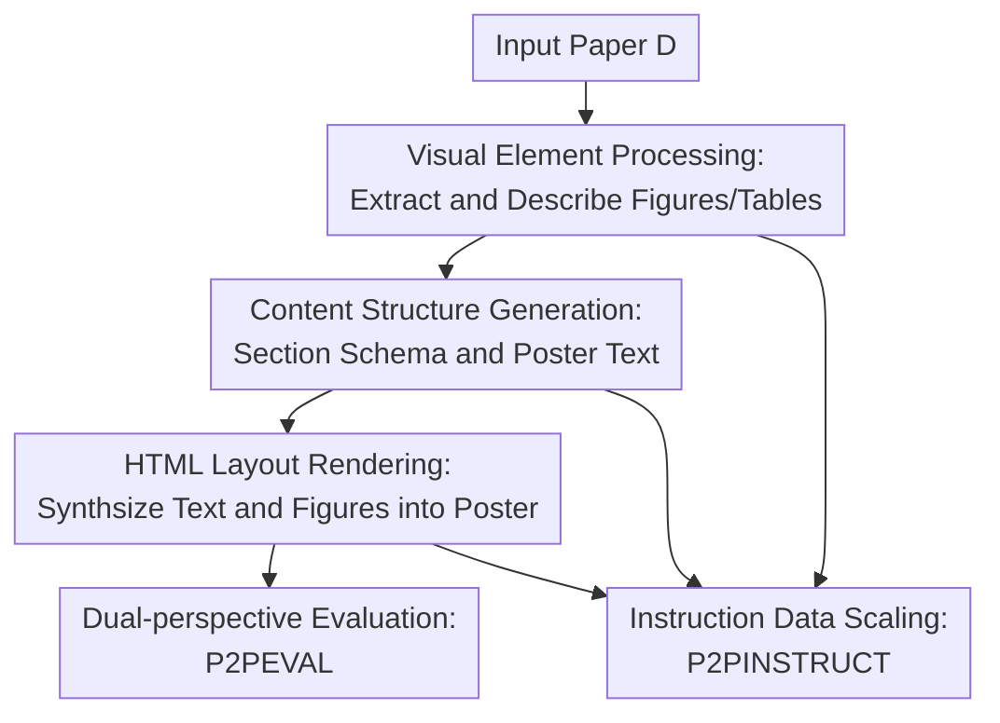

# P2P: Automated Paper-to-Poster Generation and Fine-Grained Benchmark

**Conference**: ICLR 2026  
**OpenReview**: [https://openreview.net/forum?id=JojyT9niJL](https://openreview.net/forum?id=JojyT9niJL)  
**Code**: https://github.com/multimodal-art-projection/P2P  
**Area**: Multimodal VLM  
**Keywords**: Academic poster generation, Multi-agent, Document understanding, Fine-grained evaluation, Instruction dataset

## TL;DR
P2P decomposes the paper-to-poster generation process into three agents—figure understanding, content organization, and HTML layout orchestration—each equipped with self-checking loops. It introduces the P2PINSTRUCT dataset and the P2PEVAL dual-perspective benchmark to evaluate generated posters based on both objective content fidelity and subjective overall quality.

## Background & Motivation
**Background**: Academic posters serve as a critical compression medium for conference communication, requiring the distillation of long papers into visually scannable regions while retaining titles, motivations, methods, results, figures, and core conclusions. Prior work in automated poster generation was mostly based on templates, rules, or sub-task modeling (e.g., extracting content first, then predicting panel attributes, then layout). While recent LLMs/MLLMs can read long documents, write HTML, and understand image-text relations, directly prompting a model to generate a poster from a paper remains highly unstable.

**Limitations of Prior Work**: Poster generation is not a standard summarization task. Firstly, it must faithfully preserve verifiable facts from the paper without misrepresenting metrics, figure meanings, or core claims. Secondly, it requires 2D spatial design to determine which content to highlight, which figures to enlarge, and how to balance text and whitespace. Existing methods often fail at both ends: either semantic information is flattened by templates, or the visual layout appears attractive but loses scientific detail.

**Key Challenge**: The fundamental contradiction lies in the lack of a unified evaluation language for "scientific fidelity" and "visual expression." Metrics like ROUGE/BERTScore only measure text overlap, while general VLM judges often conflate aesthetic preference with factual accuracy. Without a fine-grained checklist, it is difficult to identify whether a poster missed a key figure, an experimental conclusion, or a methodological step.

**Goal**: The authors aim to solve three sub-problems simultaneously: first, providing a paper-to-poster generation pipeline with a replaceable foundation model; second, constructing instruction data for training such tasks; and third, establishing an evaluation benchmark that distinguishes objective fidelity from subjective quality to enable systematic comparison.

**Key Insight**: An observation is that humans do not generate posters in one go. Instead, they read the paper, select figures, reorganize sections, arrange the layout, and then continuously check and modify. Consequently, the authors decompose the task into multiple specialized agents with checker-reflection stages, allowing the model to produce intermediate results that are then inspected for duplicate figures, missing content, citation errors, or layout issues.

**Core Idea**: Replacing single-shot end-to-end generation with "Multi-agent generation + staged check-reflection + dual-perspective benchmark," transforming paper-to-poster generation from a black-box creative task into a decomposable, trainable, and evaluable multimodal document conversion task.

## Method
### Overall Architecture
The input to P2P is a research paper $D$, and the output is an academic poster $P$ rendered in HTML/CSS. The workflow begins with a Figure Agent extracting and describing figures to obtain a set of visual elements $F$; followed by a Section Agent generating the poster text and structure based on the paper and figure descriptions; finally, an Orchestrate Agent assembles the text and actual figures into a web-native poster, with iterative corrections via checker-reflection at each stage.

The paper formalizes the process as $P = A_{Orch}(A_{Sec}(D, F), F)$, where $F = A_{Fig}(D)$. This formulation emphasizes that the final poster depends explicitly on two intermediate products—figure understanding and content structuring—rather than being directly generated, which also facilitates the collection of intermediate I/O to construct the P2PINSTRUCT dataset.

### Key Designs
**1. Visual Element Processing: Transforming figures into semantic units for reliable LLM usage**

The visual quality of an academic poster depends heavily on figure selection and image-text alignment, yet figures, tables, and captions in PDFs are not naturally structured. The P2P Figure Agent uses DocLayout-YOLO to extract figure regions, identifies corresponding captions via spatial analysis, and employs an MLLM to generate descriptions for each visual element, forming $F_d = \{(v_i, c_i, desc_i)\}_{i=1}^n$. Here, $v_i$ represents the cropped figure and metadata, $c_i$ is the original caption, and $desc_i$ is the model-generated semantic description.

This design addresses the issue of "the model seeing the image but not knowing how to use it." Passing raw images directly to subsequent LLM/MLLMs often leads to figure duplication, mismatched captions, or insufficient interpretation. By converting figures into semantic units, the Section Agent can reference specific figure indices while writing poster content. The Figure Checker ensures no duplicate extractions, no missing critical elements, and correct caption matching; if errors are found, it lowers detection thresholds to retry, preventing early PDF parsing errors from propagating.

**2. Content Structure Generation: Dynamically inferring poster schemas rather than using fixed templates**

Different papers emphasize different focus areas: a methodology paper might highlight a pipeline, a benchmark paper might focus on data composition and metrics, while an application paper might emphasize task settings. The P2P Section Agent reads paper $D$ and dynamically generates a JSON-style schema $S$ describing the target poster's sections and coverage. The Content Generator then produces the poster text $P_{poster\_text} = M_{text}(D, S, F_d)$ based on $D$, $S$, and $F_d$.

The key here is not simple summarization but restructuring a linear paper into a 2D information architecture. The model must decide which contributions become standalone panels and which experimental data should be paired with figures. The Section Checker evaluates the output across four dimensions: logical coherence, core contribution coverage, fidelity to original findings, and correct referencing of visual elements. If checks fail, the system mandates revisions to the structure or content.

**3. HTML Layout Rendering: Decoupling content semantics and visual layout via web-native formats**

The Orchestrate Agent generates the final poster using HTML/CSS. HTML is chosen because it allows the decoupling of content and presentation via modular CSS, supports adaptive column layouts via Flexbox, and is better suited for LLM generation and browser rendering. The paper emphasizes three orchestration principles: decoupling semantics and display, aligning color schemes with institutional/conference identities, and generating responsive, balanced layouts.

The Poster Checker inspects the rendered result for uneven whitespace, misaligned elements, or broken structures, triggering reflections. Notably, P2P omits original captions when embedding visual elements to improve visual clarity, as caption information is already integrated into the generated text and figure descriptions. This mirrors human design patterns of "re-expression" rather than simple transportation.

**4. Dual-Perspective Evaluation: Separating verifiable facts from overall aesthetics**

P2PEVAL splits evaluation into Fine-Grained Evaluation and Universal Evaluation. The former focuses on objective fidelity, using human-written, paper-specific checklists to verify whether the generated poster retains key visual elements, methodological details, and experimental findings from the official poster. The latter focuses on subjective quality, using 10 criteria: title/author accuracy, image quality, whitespace, context relevance, image-text ratio, sizing, visual consistency, content fidelity, information flow, and self-consistency.

The Fine-Grained score is defined as $$S_{fine} = \frac{\sum_{i=1}^{n}s_i}{\sum_{i=1}^{n}M_i} \times 100$$, where $M_i$ is the maximum score for the $i$-th checklist item and $s_i$ is the model's score. This ensures that losing a core conclusion is penalized more heavily than losing a minor decorative element. For Universal Evaluation, an LLM first scores the 10 dimensions (0-5), and then an XGBoost model trained on 1,701 human ratings fits the final overall score, reporting an $R^2$ of 0.92. This approach is more interpretable and closer to human non-linear trade-offs than direct LLM scoring.

**5. Instruction Data Accumulation: Turning intermediate products into trainable resources**

P2PINSTRUCT is derived from intermediate results of the P2P pipeline, containing 30,460 high-quality instruction-response pairs. The visual element processing stage contributes 16,848 figure description samples (avg. 192 tokens/element); the content generation stage contributes 13,612 samples from the Section, Content, and HTML Generators (responses avg. over 3,300 tokens).

This dataset enables models to learn the entire workflow—from figure description to HTML assembly—rather than just "writing poster copy." Fine-tuning on Qwen3-P2P, Qwen2.5-VL-P2P, and InternVL3-P2P yielded significant improvements, proving that P2P serves as both an inference framework and a source of training signals for end-to-end models.

### Loss & Training
The P2P framework is a model-agnostic orchestration pipeline and does not rely on a single end-to-end training loss; it can utilize various foundations like Claude, GPT, Qwen, InternVL, or DeepSeek. Training-related aspects focus on P2PINSTRUCT: instruction data was used to fine-tune models like Qwen3-8B and InternVL3-8B.

In evaluation, the "training" aspect is seen in the Universal Evaluation's XGBoost fitting. LLM scores across 10 dimensions are used as features to predict overall human preference (supervised by 1,701 human scores) using 200 trees and 10-fold cross-validation. This model learns how humans aggregate local dimensions into global aesthetic scores.

## Key Experimental Results
### Main Results
The authors compared 35 models/systems on P2PEVAL. Using Claude-3.7-Sonnet, P2P performed as one of the strongest in both FineGrain and Universal metrics, showing competitiveness against YuanBao and original human-authored posters.

| Model/System | ROUGE-1 | Judge Preference | FineGrain | Universal | Note |
|--------|------|------|------|------|------|
| Claude-3.7-Sonnet / P2P | 0.2745 | 0.5537 | 65.3962 | 37.2474 | Main config; strongest overall |
| Claude-3.7-SonnetR / P2P | 0.2734 | 0.6281 | 65.8848 | 35.5062 | Reasoning mode; higher FineGrain |
| GPT-4.1-2025-04-14 | 0.2459 | 0.4793 | 60.2879 | 34.4700 | Strong closed-source baseline |
| Deepseek-R1RT | 0.1927 | 0.5333 | 62.5013 | 33.9701 | Competitive open reasoning model |
| Qwen3-P2P-8B | 0.2882 | 0.4587 | 57.6622 | 32.4996 | Highest ROUGE after P2PINSTRUCT tuning |

| Comparison | Preferred or Tied | Strictly Preferred | Conclusion |
|------|------|------|------|
| P2P / YuanBao | 83.05% | 54.35% | Humans find P2P at least equal, majority better |
| P2P / Original | 57.63% | 35.59% | P2P is competitive with original authors |
| YuanBao / Original | 20.34% | 12.40% | Large gap between general apps and manual posters |

### Ablation Study
| Config | FineGrain | Universal | Note |
|------|---------|------|------|
| Multi Agent + Figure Describer + Reflection | 65.3962 | 37.2474 | Full system |
| Multi Agent + Figure Describer (No Reflection) | 64.4556 | 34.2229 | Slight fidelity drop, significant aesthetic drop |
| Multi Agent + Reflection (No Fig. Describer) | 63.7388 | 35.1107 | Missing figure semantics hurts organization |
| Multi Agent only | 63.5806 | 33.1458 | Modularization helps, but lacks semantics/check |
| Direct Single-shot Generation | 60.7233 | 34.2554 | Largest FineGrain drop; intermediate steps protect details |

| Output Format | FineGrain | Universal | Note |
|------|------|------|------|
| HTML | 65.3962 | 37.2474 | Optimal; LLMs excel at generation & rendering |
| SVG | 52.7408 | 30.6648 | Weak structural expression & rendering stability |
| LaTeX | 56.8756 | 25.2585 | Good for typesetting but unfriendly to current LLMs |

### Key Findings
- Closed-source models remain superior (Claude-3.7-Sonnet leading), but open models with reasoning capabilities (DeepSeek-R1, Qwen3) show competitive fine-grained fidelity.
- P2PINSTRUCT provides tangible value: Qwen3-P2P-8B achieved the highest ROUGE-1 (0.2882) and showed consistent improvements over base models in FineGrain/Universal metrics.
- Reflection mechanisms primarily enhance Universal scores, while the Figure Describer directly impacts image-text alignment and content organization; both are required for peak performance.
- HTML significantly outperforms SVG and LaTeX, suggesting that format choice is a core system design decision rather than a trivial implementation detail for current LLMs.

## Highlights & Insights
- The most distinct contribution is decomposing "making a pretty poster" into checkable sub-tasks, making failures locatable (e.g., figure extraction vs. layout collapse) and interpretable.
- The dual-perspective design of P2PEVAL is highly instructive. Many generative tasks involve both "factual correctness" and "human preference"; mixing them into a single score obscures problems. Using checklist-based fidelity alongside aesthetic fitting provides a clearer paradigm.
- Deriving checklists from official posters is a clever design. Official posters represent what authors deem important; annotating these into weighted items is more relevant for this task than using the full paper text as a reference.
- P2PINSTRUCT demonstrates that multi-agent pipelines generate value beyond inference—they naturally produce intermediate supervision data. This pattern can be applied to slide generation, paper-to-blog, and other complex scientific communication tasks.

## Limitations & Future Work
- The system is optimized for HTML. While flexible, many users require PowerPoint, PDF, or LaTeX Beamer. Performance in LaTeX/SVG is currently poor, necessitating better conversion or native generation.
- Multi-agent systems with reflection incur higher inference costs and latency. The number of reflection rounds needs to be a tunable parameter for large-scale processing.
- Checker-reflection fixes structural and layout issues but remains limited by the base model's deep semantic understanding. Highly specialized multi-panel figures or complex experimental relationships may still be misinterpreted.
- The P2PEVAL test set consists of 121 paper-poster pairs. Future work should expand to more conferences, poster styles, and non-English scenarios.
- Universal Evaluation still inherits LLM scoring biases; incorporating more human reviewers or specialized visual layout metrics could further improve reliability.

## Related Work & Insights
- **vs template/rule-based poster generation**: Early methods relied on fixed templates or probabilistic graphical models. P2P uses LLM/MLLMs for semantic restructuring and incorporates reflection at each stage, offering more flexibility at a higher computational cost.
- **vs PostDoc / poster summarization benchmark**: These focus on datasets for summarization or evaluation. P2P provides a complete ecosystem including an executable framework, instruction data, and evaluation systems.
- **vs Design2Code / Screenshot-to-HTML**: These focus on pixel/structural reconstruction. P2P must first understand scientific content before generating a readable poster; both benefit from HTML as an intermediate format, but P2P adds the challenge of scientific fidelity.
- **vs LLM-as-a-Judge**: General judges struggle to explain specific failures. P2PEVAL uses human checklists for verifiable content and XGBoost for overall preference, offering a more stable decomposition than a single judge score.

## Rating
- Novelty: ⭐⭐⭐⭐☆ The integration of a multi-agent framework, benchmark, and data is comprehensive, though individual components utilize existing LLM capabilities.
- Experimental Thoroughness: ⭐⭐⭐⭐☆ Extensive comparisons across 35 models, formats, and human preferences, though the P2PEVAL scale could be larger.
- Writing Quality: ⭐⭐⭐⭐☆ Clear structure; methodology, data, and evaluation are well-supported, though some training details are condensed.
- Value: ⭐⭐⭐⭐⭐ High reference value for scientific communication automation, multimodal evaluation, and LLM agent workflows.

<!-- RELATED:START -->

## Related Papers

- [\[ICLR 2026\] UniF2ace: A Unified Fine-grained Face Understanding and Generation Model](unif2ace_a_underlineunified_underlinefine-grained_underlineface_understanding_an.md)
- [\[CVPR 2026\] PosterIQ: A Design Perspective Benchmark for Poster Understanding and Generation](../../CVPR2026/multimodal_vlm/posteriq_a_design_perspective_benchmark_for_poster_understanding_and_generation.md)
- [\[ICLR 2026\] MotionSight: Boosting Fine-Grained Motion Understanding in Multimodal LLMs](motionsight_boosting_fine-grained_motion_understanding_in_multimodal_llms.md)
- [\[ICLR 2026\] Bongard-RWR+: Real-World Representations of Fine-Grained Concepts in Bongard Problems](bongard-rwr_real-world_representations_of_fine-grained_concepts_in_bongard_probl.md)
- [\[ICLR 2026\] Catching the Details: Self-Distilled RoI Predictors for Fine-Grained MLLM Perception](catching_the_details_self-distilled_roi_predictors_for_fine-grained_mllm_percept.md)

<!-- RELATED:END -->
