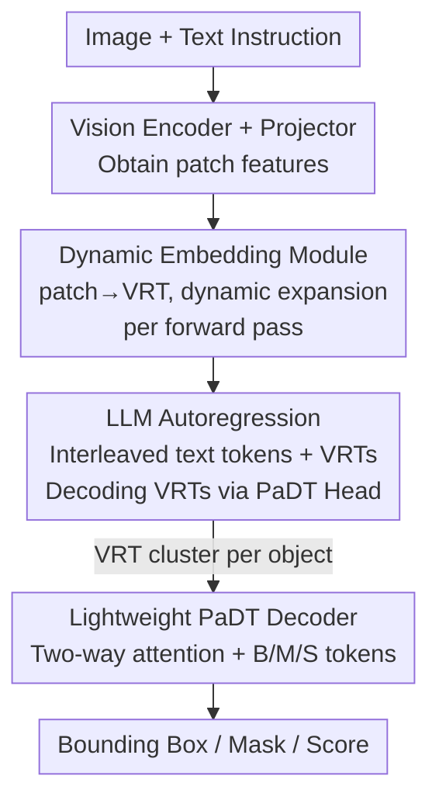

# Patch-as-Decodable-Token: Towards Unified Multi-Modal Vision Tasks in MLLMs

**Conference**: ICLR 2026  
**OpenReview**: [https://openreview.net/forum?id=xF0Dcmvsl0](https://openreview.net/forum?id=xF0Dcmvsl0)  
**Code**: https://github.com/Gorilla-Lab-SCUT/PaDT  
**Area**: Multi-modal VLM  
**Keywords**: MLLM, Visual Reference Token, Unified Vision Tasks, Object Detection, Referring Expression Segmentation

## TL;DR
PaDT treats the patch features of the query image itself as "decodable tokens" (Visual Reference Tokens, VRTs) and inserts them into the autoregressive output of the MLLM. This allows the MLLM to represent detected objects using the image patches themselves rather than textual coordinates. A lightweight decoder then converts these VRTs into boxes, masks, and scores. This approach achieves SOTA across four task categories: detection, referring expression comprehension (REC), referring expression segmentation (RES), and referring image captioning (RIC). Notably, the 3B model outperforms the 78B InternVL3 on RefCOCO REC.

## Background & Motivation
**Background**: When integrating visual perception tasks into MLLMs, the prevailing approach is to let the LLM "serialize" detection or localization results into "textual coordinates," such as generating strings like `[x1, y1, x2, y2]`. This path is the most straightforward as it reuses the LLM's native text output space without altering the model structure.

**Limitations of Prior Work**: This "coordinates-as-text" paradigm suffers from three specific issues. First, **unstable output formats**—given the same prompt, the model might output normalized floats `[0.16, 0.54, ...]`, integer pixels `[248, 0, 346, 97]`, JSON, or free text, making stable parsing difficult. Second, **fragmented digits**—LLM tokenizers split `489` into unrelated discrete tokens like `4`, `8`, and `9`, destroying numerical continuity and harming localization precision. Third, and most fundamentally, **coordinates lack semantic alignment**—there is no semantic link between pure digit tokens and real visual targets in the image. Token activation analysis shows textual coordinates rarely "activate" corresponding image regions, leading to repetitions and hallucinations in dense prediction.

**Key Challenge**: The root cause is that the LLM output space is purely textual, whereas visual targets are inherently 2D spatial-semantic entities. Forcing visual targets into discrete textual digits loses the natural correspondence between the target and image patches. Previous work like ClawMachine tried using "image patch tokens," but it relies on a **global discrete codebook**: the codebook is fixed at the dataset level, massive in size, and the decoded visual tokens lack **unique correspondence** within the current query image—similar patches may map to the same token, causing confusion between similar objects or predicting tokens not present in the image.

**Goal**: Design a unified paradigm that enables an MLLM to output both text and diverse visual targets (boxes, masks, grounding) without the ambiguity introduced by global codebooks.

**Key Insight**: The authors observe that patch features from a vision encoder already carry rich semantics and naturally map uniquely to specific image regions. Instead of creating a new global codebook, why not use "the image's own patches" as the decodable vocabulary? This ensures both semantic alignment and unique spatial correspondence.

**Core Idea**: Replace "textual coordinates / global codebooks" with "Patch-as-Decodable-Token" (PaDT). During each forward pass, the query image's patches are dynamically expanded into the vocabulary. An object is represented by several VRTs located on it, which are then decoded into structured outputs.

## Method

### Overall Architecture
PaDT adds a "Patch-as-Decodable-Token Head" on top of a standard MLLM (Image Encoder + Projector + LLM). Given a query image and text instruction, the image is partitioned into patches, encoded, and projected into patch features $F_{patch}\in\mathbb{R}^{N'\times d}$. The crucial turn occurs here: the **Dynamic Embedding Module** projects these patch features into a set of "Visual Reference Prototypes" $P_{ref}$, which are temporarily appended to the LLM's existing text embedding table (approx. 150k tokens) to form a "text + vision" multi-modal vocabulary. Simultaneously, the output classifier weights are similarly expanded, allowing these VRTs to serve as both input embeddings and predictable outputs. The LLM generates sequences autoregressively, where **text tokens and VRTs are interleaved**—e.g., outputting "There are 2 'bear' (`<vrt_a><vrt_b>`, `<vrt_c><vrt_d>`)", where the brackets contain VRTs located on the two bears. Finally, the **lightweight PaDT Decoder** collects the hidden features of the VRT cluster corresponding to each object, combines them with learnable box/mask/score tokens, and decodes them into final bounding boxes, segmentation masks, and confidence scores.

The pipeline is clearly sequential:

### Key Designs

**1. Visual Reference Token + Dynamic Embedding Module: Image patches as the decodable vocabulary**

This design directly addresses the ambiguity of global codebooks. PaDT maintains no fixed codebook; instead, it reuses the current query image's patch features in **every forward pass**. Specifically, the dynamic embedding module $f_{vp}$ (a LayerNorm + a low-rank linear projection) projects patch features into visual reference prototypes, which are concatenated with the text embedding table to form a dynamic vocabulary:

$$E_{dyn} = [E_{text};\, P_{ref}],\qquad P_{ref} = f_{vp}(F_{patch})\in\mathbb{R}^{N'\times d}.$$

This provides two benefits. First, **natural semantic alignment**: VRTs are transformed from original image tokens and share the same source as the LLM's high-level feature space, making training converge easier. Second, **unique correspondence and no cross-image ambiguity**: Since the vocabulary contains "this image's own patches," each VRT points uniquely to a specific region, making it impossible to predict non-existent tokens and allowing similar objects to be distinguished by their positions.

**2. PaDT Head: Making visual indices predictable at the output**

Simply inserting VRTs into the input is insufficient—the LLM must be able to "speak" these VRTs, requiring the output classifier to recognize them. In standard MLLMs, the next-token distribution is $p(y_t)=\mathrm{softmax}(W_{text}\cdot h_t)$, covering only text. The PaDT Head concatenates the visual reference prototypes to the classifier weights:

$$W_{tv} = [W_{text};\, P_{ref}]\in\mathbb{R}^{(V_{text}+N')\times d}.$$

Consequently, the output space of $Y = h\cdot W_{tv}^{\top}$ covers both text tokens and current image VRTs. The LLM can **generate patch-level references as ordinary tokens** within the autoregressive sequence. By making VRTs embeddable at the input and decodable at the output, they become first-class "decodable tokens."

**3. Lightweight PaDT Decoder: Translating VRT clusters into boxes/masks/scores**

Since the LLM only outputs "which VRTs belong to which object," a decoder is needed to convert these into structured outputs. The PaDT decoder is a lightweight stack of three **two-way attention blocks**. it extracts hidden features of predicted VRTs from the LLM's last layer, grouping them by object (delimited by text tokens). Three learnable tokens—**Box (B), Mask (M), and Score (S)**—are injected into each group. After three layers of two-way attention (query-patch interaction, with 2x upsampling for masks), these task tokens are projected to their respective output spaces to produce $[cx, cy, w, h]$ boxes, mask logits, and confidence scores.

**4. Robust Token-wise Cross-Entropy + Random VRT Sampling: Stable training and anti-overfitting**

Supervising with **all** foreground VRTs of a target (as seen in prior work) biases training toward high-density regions and hurts performance (Ablation shows "All VRTs" causes REC to crash from 93.2 to 49.1). PaDT instead **randomly samples $N_{vrt}=5$ VRTs from each target's foreground** per forward pass. This increases supervision diversity, forcing the model to explore multiple valid visual references rather than memorizing a fixed set. Implementation-wise, a foreground mask $M\in\{0,1\}^{T\times N'}$ is introduced, setting logits of **unselected** tokens to $-\infty$:

$$l'_t = W_{tv}\cdot h_t,\qquad l'_{t,\,n+V_{text}} = -\infty \;\text{ if } M_{t,n}=1.$$

The GT negative log-likelihood is then computed as $L^{robust}_{CE} = -\log\mathrm{softmax}_{GT}(l'_t)$. Masked tokens are excluded from softmax normalization, essentially "softening" the supervision set. The final objective is $L = L^{robust}_{CE} + L_{bbox} + L_{mask} + L_{score}$.

### Loss & Training
The base model is Qwen2.5-VL (3B / 7B). GT sequences are constructed by sampling 5 VRTs per target. Training uses 8×96GB GPUs, batch size 16, and a learning rate of $2\times10^{-5}$ with gradient checkpointing and FlashAttention-2. **PaDT Pro** is a version joint-trained on all tasks (RefCOCO/+/g, COCO, RIC) and can switch tasks via prompts.

## Key Experimental Results

### Main Results
The 3B model outperforms significantly larger competitors across four task categories.

| Task / Dataset | Metric | PaDT Pro (3B) | Prev. SOTA | Comparison |
|--------------|------|------|----------|------|
| REC RefCOCO/+/g Overall | Acc | 93.6 | 91.4 (InternVL3-78B) | 3B beats 78B |
| RES RefCOCO/+/g Overall (7B) | cIoU | 84.1 | 74.7 (Text4Seg+SAM-7B) | +9.4 Gain |
| COCO2017 Open-vocab Det (3B) | mAP@[50:95] | 38.2 | 19.2 (VLM-R1-3B) | Nearly Doubled |
| RIC Referring Captioning (3B) | CIDEr-D | 1.45 | 0.386 (Qwen2.5-VL-3B) | Massive Lead |

In REC, PaDT (3B) and PaDT Pro (3B) both exceed the 78B InternVL3 (91.4). In detection, while most MLLMs struggle (Qwen2.5-VL-3B gets only 13.7 mAP), PaDT Pro pushes COCO mAP to 38.2.

### Ablation Study
Breakdown on the 3B model (REC / RES using RefCOCO val).

| Configuration | REC | RES | Description |
|------|-----|-----|------|
| w/o VRT (Textual coords) | 88.7 | – | Degrades to Qwen2.5-VL SFT; no segmentation |
| VRT + Decoder, w/o $f_{vp}$ | 91.1 | 72.1 | Performance drop without projection |
| VRT + Decoder, w/o Robust CE | 92.0 | 75.2 | Performance drop without robust loss |
| VRT, using All Foreground VRTs | 76.5 | 69.5 | Significant drop with full supervision |
| VRT + All VRTs + $f_{vp}$ | 49.1 | 19.8 | Training collapse toward high-density regions |
| **Full PaDT** | **93.2** | **76.1** | Projection + Robust CE + Random Sampling |

### Key Findings
- **Random VRT sampling is critical**: Replacing "random 5" with "all foreground VRTs" crashed REC from 93.2 to 49.1. This proves that "sparse VRT references + diverse sampling" is the effective recipe.
- **$f_{vp}$ and Robust CE are both essential**: Removing either drops REC from 93.2 to the 91-92 range, showing that semantic alignment (projection) and supervision stability (robust CE) are complementary.
- **SAM2 Integration**: Using PaDT boxes/masks as prompts for SAM2-L improved RefCOCOg cIoU from 70.5 to 76.3. However, using sparse point prompts was less effective (69.9), suggesting PaDT's box/mask priors are more informative.
- **Pre-training Generalization**: After Objects365 pre-training, PaDT's zero-shot detection (16.9 mAP) already surpassed the Qwen2.5-VL base (13.7).

## Highlights & Insights
- **"Image patches as vocabulary" is a stroke of genius**: It eliminates global codebook issues (predicting non-existent tokens, cross-image ambiguity) because the vocabulary is built dynamically per image. Each token uniquely corresponds to a region.
- **Unification via representation, not heads**: Detection, segmentation, and grounding share one VRT representation and one lightweight decoder. Task distinction is handled simply by B/M/S tokens, which is far more elegant than task-specific heads.
- **Small models punching above their weight**: A 3B model surpassing the 78B InternVL3 suggests that "how you represent things" is more important than "how many parameters you have" in perception tasks—textual coordinates have a clear ceiling.
- **Honest Ablations**: Showing that "full VRT supervision crashes to 49.1" strongly justifies the necessity of random sampling and increases the credibility of the methodology.

## Limitations & Future Work
- **Patch grid dependency**: VRT spatial resolution is limited by the ViT patch grid. For tiny objects or boundaries requiring sub-patch precision, VRT localization may hit a ceiling (hence the gain from SAM2).
- **Custom RIC Benchmark**: The Referring Image Captioning task uses a newly annotated COCO benchmark by the authors, making absolute CIDEr values harder to compare against third-party baselines.
- **Training Costs**: The requirement for 8×96GB GPUs is high. Hyperparameters like $N_{vrt}=5$ are sensitive (all-vrt results in collapse), and their robust ranges require further study.

## Related Work & Insights
- **vs. Text-coordinate MLLMs (Qwen2.5-VL / InternVL3)**: These serialize targets as textual digits, leading to format instability and lack of alignment. PaDT uses VRTs for natural semantic alignment and enables dense prediction (segmentation), which is why it wins despite a smaller scale.
- **vs. ClawMachine (Global codebook patch tokens)**: While both use patch tokens, ClawMachine's global codebook is massive and prone to cross-image ambiguity. PaDT's dynamic expansion is more efficient, unique, and easier to train.
- **vs. Segmentation Specialists (SAM / Text4Seg+SAM)**: PaDT outperforms these specialists in RES using only a lightweight decoder and can optionally use SAM2 as a post-processor for further gains.

## Rating
- Novelty: ⭐⭐⭐⭐⭐ "Image patches as dynamic decodable vocabulary" is a fundamental restructuring of MLLM visual output.
- Experimental Thoroughness: ⭐⭐⭐⭐⭐ Covers four tasks, multiple scales, detailed ablations, SAM compatibility, and generalization analysis.
- Writing Quality: ⭐⭐⭐⭐ Clear motivation and diagrams; some loss details are deferred to the appendix.
- Value: ⭐⭐⭐⭐⭐ 3B surpassing 78B provides a powerful, scalable new paradigm for unified vision tasks.

<!-- RELATED:START -->

## Related Papers

- [\[ICLR 2026\] Multi-modal Data Spectrum: Multi-modal Datasets are Multi-dimensional](multi-modal_data_spectrum_multi-modal_datasets_are_multi-dimensional.md)
- [\[ICLR 2026\] InternSVG: Towards Unified SVG Tasks with Multimodal Large Language Models](internsvg_towards_unified_svg_tasks_with_multimodal_large_language_models.md)
- [\[ICLR 2026\] Sparsity Forcing: Reinforcing Token Sparsity of MLLMs](sparsity_forcing_reinforcing_token_sparsity_of_mllms.md)
- [\[ICLR 2026\] Enhancing Multi-Image Understanding through Delimiter Token Scaling](enhancing_multi-image_understanding_through_delimiter_token_scaling.md)
- [\[ICLR 2026\] EventFlash: Towards Efficient MLLMs for Event-Based Vision](eventflash_towards_efficient_mllms_for_event-based_vision.md)

<!-- RELATED:END -->
