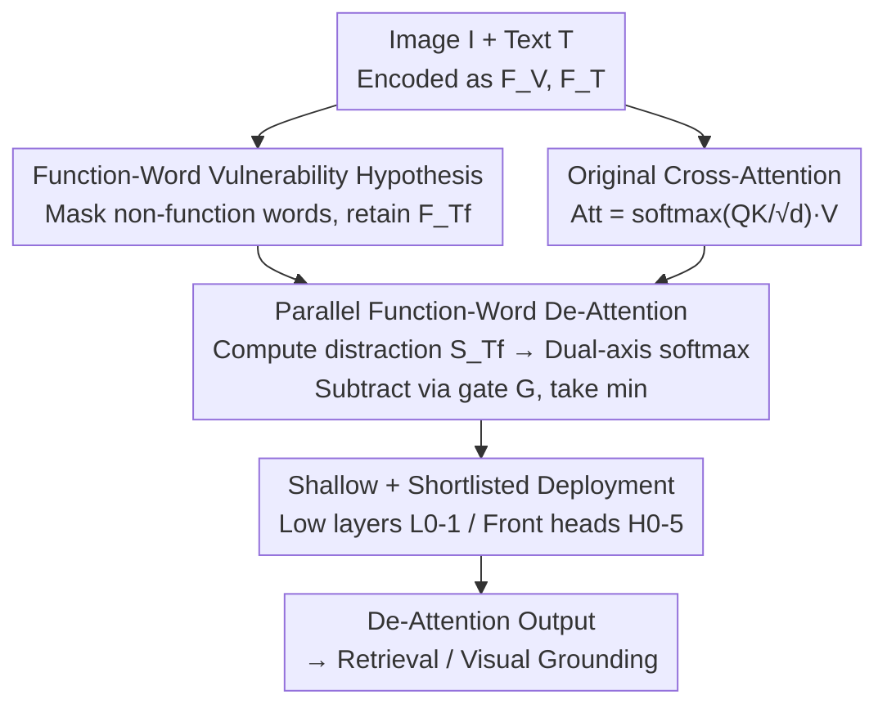

# Pay Less Attention to Function Words for Free Robustness of Vision-Language Models

**Conference**: ICLR 2026  
**OpenReview**: [https://openreview.net/forum?id=4K2NNr9W5C](https://openreview.net/forum?id=4K2NNr9W5C)  
**Code**: https://github.com/michaeltian108/FDA  
**Area**: Multimodal VLM / Adversarial Robustness  
**Keywords**: Vision-Language Models, Adversarial Robustness, Cross-modal Alignment, Function Words, Differential Attention

## TL;DR
The authors discover that "function words" (high-frequency words with minimal semantic content like *the*, *a*, *of*) are the vulnerability points of vision-language models under cross-modal adversarial attacks. They propose **Function-word De-Attention (FDA)**: calculating a parallel "function-word-to-image" cross-attention as a distraction within the fusion encoder, and differentially subtracting it from the original attention. This reduces the average attack success rate for retrieval tasks by 18/13/53% and visual grounding by approximately 90%, with almost no loss in clean performance (<1%).

## Background & Motivation

**Background**: Enhancing the robustness of vision-language models (VLM) against adversarial attacks is a high-priority direction. The mainstream defense method is Adversarial Training (AT), which incorporates adversarial samples into training to improve robustness. Representative methods like TeCoA and FARE significantly improve robustness in CLIP-like models.

**Limitations of Prior Work**: Adversarial training suffers from two major drawbacks: first, a significant drop in clean performance (incorporating adversarial noise into training disrupts representations; TeCoA/FARE drop clean R@1 by an average of 4/3/9% on ALBEF/TCL/BLIP); second, high training costs. Even when FARE attempts to mitigate the trade-off using the original model's visual embeddings as supervision, performance degradation remains evident. In other words, there is a difficult-to-avoid trade-off between robustness and performance.

**Key Challenge**: Why are adversarial perturbations so effective? The authors' key observation is a natural semantic gap between clean images and target text. Cross-modal perturbations are "guided" to attack tokens where the semantic gap is smallest and most accessible. **Function words** (prepositions, articles, conjunctions), which carry minimal semantic information but have extremely high frequency, happen to be the most vulnerable targets—they quietly absorb adversarial semantics and divert the model's attention from the correct regions.

**Verification**: The authors conducted an intuitive experiment, observing changes in relative clean R@1 and Attack Success Rate (ASR) after removing verbs, adjectives, and function words respectively. The results showed that only removing function words could **reduce ASR** while **maintaining clean performance**. Removing verbs or nouns led to significant performance drops as they carry essential task semantics. Attention maps also revealed that under attack, models are diverted toward the incorrect person by the function word *her*; only removing function words allows the model to "look back" at the correct target.

**Core Idea**: Since function words carry redundant adversarial semantics, the model should "pay less attention to function words." Inspired by Differential Transformers and differential amplifiers, the **function-word cross-attention is treated as noise and differentially subtracted**, making cross-modal alignment tighter. Since this only adds a parallel computation during fine-tuning without introducing extra parameters or altering the training pipeline, it is termed "free robustness."

## Method

### Overall Architecture

FDA does not modify the original downstream fine-tuning process. Instead, it **attaches a parallel branch** to the fusion encoder's attention calculation. The original branch uses all text features $F_T$ and image features $F_V$ to calculate the cross-attention $\text{Att}$. The parallel branch **masks all tokens except function words** in the input text (retaining [CLS]), leaving only function word features $F_{T_f}$, and computes a "function-word-to-image" cross-attention score $S_{T_f}$. This score represents the distraction—where the function words divert the model's attention in the visual tokens. Softmax is then applied to $S_{T_f}$ along both the visual and text dimensions to highlight the mis-activated visual tokens and misleading text tokens. These are controlled by a gate $G$ and **differentially subtracted** from the original attention. The element-wise minimum of the two subtraction results is taken as the de-attention output, followed by the concatenation of all attention heads. After computing $D(\cdot)$, the output returns to the normal downstream heads (retrieval/visual grounding).

### Key Designs

**1. Function-Word Vulnerability Hypothesis: Pinpointing adversarial vulnerability to "empty words"**

This is the foundation of the paper, addressing the fundamental question of why adversarial perturbations succeed. The authors hypothesize that due to the natural semantic gap between clean images and target text, perturbations attack tokens with smaller semantic gaps. Function words, being semantically thin but highly frequent, become the easiest carriers of "adversarial semantics." This was validated by category-wise word deletion: only function word removal simultaneously reduced ASR without destroying clean performance. Deleting content words dropped clean R@1 from 95.90/85.60 to 21.50/11.10, making them unusable. The value of this hypothesis lies in shifting defense from "brute-force adversarial training" to "identifying and removing internal vulnerable attention sources."

**2. Parallel Function-Word De-Attention: Using differential subtraction to offset distraction, not simple deletion**

Addressing the pain point that "adversarial training drops performance and is computationally expensive." A naive approach would be to simply mask function words, but the paper proves this drops ~1% clean performance with almost no robustness gain. FDA's approach is more refined: it extracts function word features $F_{T_f} = \mathcal{T}(T, M_{T_f})$ where $M_{T_f}$ is the mask and $\mathcal{D}$ is the dictionary. It calculates the scores:

$$S_{T_f}^{L,H} = \frac{Q(F_{T_f})K(F_V)^{\top}}{\sqrt{d_k}}$$

Then, **softmax is applied across both visual and text dimensions**, producing two de-attention maps $\tilde{\text{Att}}_t^{L,H}$ and $\tilde{\text{Att}}_v^{L,H}$, which highlight "visual tokens mis-activated by function words" and "misleading text tokens," respectively. The distraction is subtracted from the original attention:

$$\hat{\text{Att}}^{L,H} = \min\!\big(\text{Att}^{L,H} - G(\tilde{\text{Att}}_t^{L,H}),\; \text{Att}^{L,H} - G(\tilde{\text{Att}}_v^{L,H})\big)$$

Taking the `min` instead of sum/average ensures that distractions are suppressed in both dimensions, leading to a conservative (clean) attention result. The brilliance here is treating "function word attention" as subtractable noise, analogous to a differential amplifier canceling common-mode signals. This tightens cross-modal embedding alignment without adding parameters or changing fine-tuning workflows—hence, it is "free."

**3. Deployment Strategy: Depth and dictionary selection determine success**

FDA can be attached to any layer/head, but where and what to subtract significantly affects results. The authors provide clear recommendations: ① **Subtracting in the fusion encoder (H) is best**—subtracting only in the text encoder (T) is "too early" to remove distraction, while subtracting in both T and H is "overkill," destroying context and dropping performance by ~2%. ② **Use shallow layers and front attention heads**: $L_{0\text{-}1}, H_{0\text{-}5}$ are most stable for retrieval. Removing distraction in early layers prevents subsequent layers from "absorbing" function word information. ③ **Use a shortlisted dictionary**: Compared to a 208-word stop-word list, a 91-word "Shortlisted Dict" of the most used function words is slightly superior—a dictionary too long "over-deletes," distorting context.

### Loss & Training
FDA introduces no new loss functions and no additional trainable parameters. Fine-tuning with FDA is identical to standard downstream fine-tuning. All models follow ALBEF's 10-epoch setting, using $L_{0\text{-}1}$ and $H_{0\text{-}5}$.

## Key Experimental Results

Experiments covered 2 SOTA baselines (TeCoA, FARE), 3 models (ALBEF/TCL/BLIP), 2 tasks (Retrieval, Visual Grounding), 3 datasets (Flickr30k, MSCOCO, RefCOCO+), and 6 types of attacks. Metrics included ASR and $\Delta\text{ASR} = \frac{\text{ASR}_B-\text{ASR}_M}{\text{ASR}_B}\times100\%$ (higher means more robust). For fairness, baselines were tuned for clean performance parity with FDA.

### Main Results (Flickr30k / RefCOCO+)

| Task | Model | Defense | Clean Performance | Avg $\Delta$ASR↑ |
|------|------|------|---------|-------------------|
| Retrieval (Flickr, ε=2) | ALBEF | FDA | 95.60 (R@1, -0.3%) | ↑22.26% |
| Retrieval (Flickr, ε=2) | TCL | FDA | 94.40 | ↑14.29% |
| Retrieval (Flickr, ε=2) | BLIP | FDA | 96.50 | ↑51.60% |
| Retrieval (Flickr, ε=2) | ALBEF | TeCoA / FARE | 91.2 / 91.1 (-4%) | ↓3.02 / ↑5.36% |
| Visual Grounding (RefCOCO+, ε=2) | ALBEF | FDA | 66.80 (Test A, +0.3%) | ↑93.16% |

Overview: In retrieval, FDA achieved average ASR reductions of 18/13/53% across ALBEF/TCL/BLIP, while clean R@1 dropped by only 0.2/0.3/0.6%. In visual grounding, it achieved near-perfect defense (ASR drop ~90%) while increasing clean accuracy by 0.3%. A notable scale effect: larger models (BLIP) yield larger FDA gains.

### Ablation Study

| Configuration | Avg $\Delta$ASR↑ | Description |
|------|-------------------|------|
| Text Encoder only (T) | ↓2.54% | Early subtraction, insufficient to remove distraction |
| Text + Fusion (T&H) | ↑15.61% | Over-deletion, ~2% clean performance drop |
| Fusion Encoder only (H) | ↑18.48% | **Optimal**: Removes distraction while preserving context |
| Full Dict (208 words) | ↑4.22% | Too many words, distorts context |
| Shortlisted Dict (91 words)| ↑6.45% | Slightly superior |
| Direct masking (FUNC) | ↑1.56% | Drop in clean perf (~1%), minimal robustness |
| FDA | ↑23.07% | Significantly outperforms all variants |

### Key Findings
- **Location matters more than what is subtracted**: Subtracting in shallow fusion encoder layers ($L_{0\text{-}1}, H_{0\text{-}5}$) is most effective.
- **Differential subtraction >> Direct masking**: Direct masking only yields a ↑1.56% robustness gain compared to FDA's ↑23.07%, proving the value of "soft differential subtraction" over "hard deletion."
- **Plug-and-play + Zero-shot**: FDA stacking with TeCoA/FARE further improves robustness, and the $L_{all}$ setting for zero-shot tasks generally brings small performance gains.

## Highlights & Insights
- **Attributing adversarial vulnerability to linguistic units**: Unlike most defenses targeting pixels/embeddings, this identifies function words as an interpretable vulnerability point.
- **Truly "Free"**: No parameters, no change to training, no adversarial samples. It circumvents the robustness trade-off.
- **Cross-domain reuse of the "differential" concept**: Borrowing from Differential Transformers to cancel noise is an elegant analogy.
- **Min operation vs. weighted sum**: Taking the element-wise minimum across visual/text dimensions is a clever trick for conservative fusion.

## Limitations & Future Work
- The authors admit direct subtraction is efficient but might be less refined than modular removal; evaluations on larger VLMs or PEFT (like LoRA) were limited by hardware.
- **Architecture limitations**: FDA is designed for fusion-encoder backbones (ALBEF/TCL/BLIP) and has not yet been empirically demonstrated on projector-based models (like LLaVA/Qwen-VL), and it excludes CLIP due to the lack of a fusion encoder.
- **Manual dictionary**: The optimal dictionary size requires validation; reliance on stop-word lists makes cross-lingual/domain generalization uncertain.

## Related Work & Insights
- **vs. Adversarial Training (TeCoA / FARE)**: AT requires high compute and drops clean performance by 3-9%; FDA uses zero adversarial samples and can be stacked with AT for added benefits.
- **vs. Masking**: Simple masking is ineffective; FDA's dual-dimension subtraction provides an order of magnitude higher robustness.
- **vs. Differential Transformer**: Inherits the subtraction mechanism but applies it uniquely to cross-modal alignment using function words as the distraction source.

## Rating
- Novelty: ⭐⭐⭐⭐⭐ Attributing adversarial vulnerability to function words with differential subtraction is a rare and interpretable perspective.
- Experimental Thoroughness: ⭐⭐⭐⭐ Covers 3 models, 2 tasks, 3 datasets, and 6 attacks, though missing projector-based large VLMs.
- Writing Quality: ⭐⭐⭐⭐ Clear hypothesis, validation, method, and ablation logic.
- Value: ⭐⭐⭐⭐⭐ Improves robustness and clean performance at zero extra cost; highly practical and transferable.

<!-- RELATED:START -->

## Related Papers

- [\[ICLR 2026\] From Pixels to Words -- Towards Native Vision-Language Primitives at Scale](from_pixels_to_words_--_towards_native_vision-language_primitives_at_scale.md)
- [\[CVPR 2026\] AGFT: Alignment-Guided Fine-Tuning for Zero-Shot Adversarial Robustness of Vision-Language Models](../../CVPR2026/multimodal_vlm/agft_alignment-guided_fine-tuning_for_zero-shot_adversarial_robustness_of_vision.md)
- [\[ICCV 2025\] Is Less More? Exploring Token Condensation as Training-free Test-time Adaptation](../../ICCV2025/multimodal_vlm/is_less_more_exploring_token_condensation_as_training-free_test-time_adaptation.md)
- [\[ICLR 2026\] Memory-Free Continual Learning with Null Space Adaptation for Zero-Shot Vision-Language Models](memory-free_continual_learning_with_null_space_adaptation_for_zero-shot_vision-l.md)
- [\[ICLR 2026\] Error Notebook-Guided, Training-Free Part Retrieval in 3D CAD Assemblies via Vision-Language Models](error_notebook-guided_training-free_part_retrieval_in_3d_cad_assemblies_via_visi.md)

<!-- RELATED:END -->
