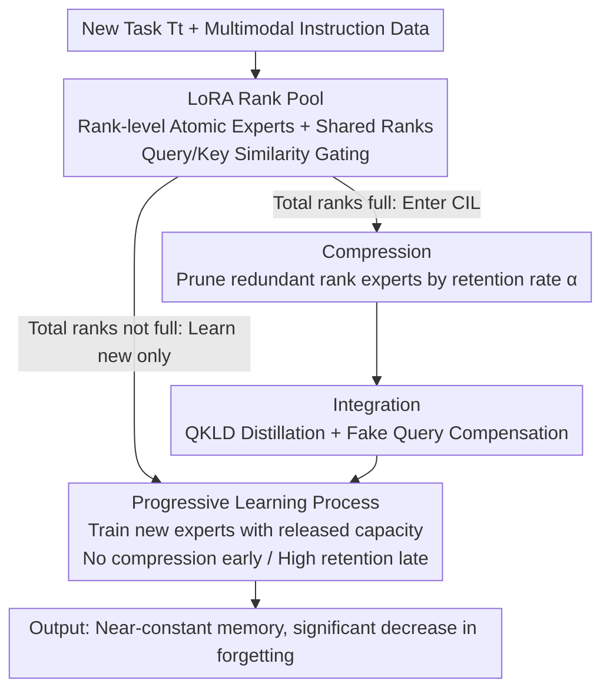

# PCLR: Progressively Compressed LoRA for Multimodal Continual Instruction Tuning

**Conference**: ICLR 2026  
**OpenReview**: [https://openreview.net/forum?id=WdP1NVSzsz](https://openreview.net/forum?id=WdP1NVSzsz)  
**Code**: https://github.com/SII-HITclearlove777/PCLR  
**Area**: Multimodal VLM / Continual Learning / LoRA  
**Keywords**: Multimodal Continual Instruction Tuning, LoRA, Rank-level Experts, Compress-Integrate-Learn, Catastrophic Forgetting

## TL;DR
Decomposes a LoRA adapter into "rank-level atomic experts" to form an extremely fine-grained MoE (LRP). Drawing inspiration from human memory consolidation during sleep, it designs a "Compression–Integration–Learning" (CIL) pipeline: compression prunes redundant rank experts to free up capacity, integration uses distillation to recover knowledge from pruned ranks, and learning uses the freed capacity to accommodate new tasks. Combined with a progressive compression schedule, the model enables persistent learning of new tasks while keeping memory growth near the level of "non-expansion" methods. On the CoIN benchmark, it reduces forgetting from 37.29 in LoRA to 3.39.

## Background & Motivation

**Background**: Large Multimodal Models (LMMs) have become standard through pre-training + instruction tuning. However, tasks and data evolve continuously, making full retraining for every new task costly and impractical. Continual Instruction Tuning (CIT) has emerged to enable LMMs to learn a sequence of new tasks without losing old capabilities. Existing CIT approaches fall into two categories: static structure (non-expansion) methods mitigate forgetting by constraining parameter updates, while model extension methods isolate interference by adding new modules for each task.

**Limitations of Prior Work**: Static methods are stuck in the "stability–plasticity" trade-off—retaining old knowledge prevents learning new tasks, while learning new ones causes forgetting. Extension methods isolate interference but experience unbounded memory growth as the number of tasks increases. Recent "conditional expansion" methods attempt a compromise: they measure the feature distribution similarity between new and old tasks before training; if similar, tasks are merged into the nearest parameter group with regularized updates; if dissimilar, a new group is created. However, these only "delay" structural expansion, and memory remains unbounded over long task sequences.

**Key Challenge**: This work finds that the memory overhead from expansion is largely "unnecessary." By decomposing LoRA adapters trained on different tasks to the rank vector level, it is revealed that many rank vectors are linearly correlated and compressible (Figure 2: 38.2% of LoRA ranks for VizWiz are redundant relative to GQA). Existing extension methods only route at the coarse "expert/task" level, completely ignoring fine-grained rank-level redundancy—which is the true driver of memory explosion.

**Goal**: To simultaneously address forgetting (stability), learning (plasticity), and memory (efficiency) within a unified framework, ensuring memory does not grow unbounded with the number of tasks.

**Key Insight**: Since redundancy occurs at the rank level, knowledge management should be performed at that granularity. By decomposing LoRA into rank experts that can be individually added or removed, it becomes possible to "expand less during training and prune after training." Furthermore, borrowing from neuroscience—where the hippocampus reactivates during sleep to consolidate memories—the "learning" process is framed as a memory cycle involving compression and consolidation.

**Core Idea**: Replace coarse-grained task experts with an atomic MoE (LoRA Rank Pool) and replace the "fixed space vs. unbounded expansion" dilemma with a CIL cycle: "compress to free capacity → consolidate via distillation to compensate loss → learn new tasks in freed capacity." By ensuring "capacity saved by compression = capacity added by learning," unbounded expansion is eliminated at its source.

## Method

### Overall Architecture
PCLR consists of two coupled components: the **LoRA Rank Pool (LRP)** architecture and the **Compression–Integration–Learning (CIL) pipeline**. LRP decomposes each LoRA adapter into a set of "rank vector + learnable key" atomic experts, inserted into the LLM backbone and cross-modal bridge linear layers. During inference, a query is constructed from the input to calculate cosine similarity with the key pool for top-r gating, activating the most relevant rank experts. CIL defines the learning process for each new task: once the total rank count reaches a preset limit, it first performs **Compression** (pruning redundant rank experts based on a retention rate), then **Integration** (absorbing pruned knowledge back via improved distillation to compensate for compression loss), and finally **Learning** (training new experts in the freed capacity). A **progressive learning process** is added to schedule the intensity of compression and learning, forming a "constant memory, evolving knowledge" system.

### Key Designs

**1. LoRA Rank Pool (LRP): Decomposing LoRA into Rank-level Atomic MoE**

To address the issue where coarse-grained experts ignore rank-level redundancy, LRP decomposes a LoRA adapter $\Delta W = \beta AB^T$ by splitting $A$ into column vectors $\{a_1,\dots,a_n\}$ and $B^T$ into row vectors $\{b_1^T,\dots,b_n^T\}$. Each rank vector is paired with a learnable key as an "atomic expert." Global shared components $A_s, B_s$ are introduced to accumulate common knowledge across tasks. The forward pass is:

$$y = xW + \beta_s xA_sB_s^T + \beta_m \sum_{i=1}^{n} \text{gate}(s(x), r)_i\, x a_i b_i^T,$$

where $n$ is the total number of rank experts and $r$ is the activation count. The scoring function $s(x)=Kq$ uses a query $q$ (constructed by mean-pooling text embeddings concatenated with vision outputs like [CLS] tokens) and a key pool $K$ to select top-r experts via cosine similarity. To avoid the overhead of an $n$-term matrix polynomial, discrete ranks are aggregated into $A_m, B_m$, and the scoring vector is broadcast, yielding the parallel equivalent: $y = xW + \beta_s xA_sB_s^T + \beta_m F(xA_m, \text{gate}(Kq,r)^T)B_m^T$. By lowering the granularity to the rank level, "knowledge invocation and editing" gain maximum flexibility—minimal additions are needed during training, and redundant ranks can be precisely pruned after.

**2. Compression: Pruning Redundant Rank Experts to Free Capacity**

To prevent unbounded memory growth from expansion, compression introduces a retention rate $\alpha \in (0,1]$ during the first stage of CIL. This training-free process discards redundant rank experts and keys, reducing the LRP size to $\alpha$ times its original. While compression induces performance loss, it is vital for mitigating memory pressure. Specifically, "capacity saved by compression" is set to equal "learning additions," keeping system memory constant. CIL only triggers once the total rank count reaches a predefined upper bound.

**3. Integration: Recovering Pruned Knowledge via QKLD Distillation + Fake Queries**

To counter knowledge loss during compression, the integration stage employs distillation: the pre-compression LRP (teacher) is frozen while the post-compression LRP (student) is updated. This allows pruned knowledge to be absorbed by existing rank experts or flow into the shared knowledge space. Since original task data is unavailable, the authors leverage the fact that the query-key cosine similarity optimization makes "each key equal the mean of all task queries." These learned keys serve as **fake queries**. Performance loss under fake queries is measured using KLD:

$$D_{KL}(q) = \frac{1}{T}\sum_{t=1}^{T} P_{\theta_{ori}}(x_t \mid x_{<t}, q)\log\frac{P_{\theta_{ori}}(x_t \mid x_{<t}, q)}{P_{\theta_{zip}}(x_t \mid x_{<t}, q)},$$

Optimization focuses on tasks with higher loss selected via $P(q) = \sqrt{D_{KL}(q)}/\sum_{q\in K_{ori}}\sqrt{D_{KL}(q)}$, resulting in the **Query-based KL Divergence (QKLD) Loss** $L(\theta_{zip}) = \mathbb{E}_{q\sim P}[D_{KL}(q)]$. This step recovers forgetting on LLaVA-7B from 11.29 post-compression to 5.09.

**4. Progressive Learning Process: Learning Stage + Dynamic Scheduling**

During the learning stage, shared and old ranks are frozen. New key-value pairs (new rank experts) are trained in the capacity freed by compression, enhanced by "nearest-similarity initialization" for forward transfer—initializing new ranks using values from the top-r most similar old keys. Above this, a **progressive scheduler** manages CIT: in early stages before the rank space is full, compression is disabled to avoid unnecessary loss. As tasks accumulate and knowledge becomes denser (with more overlap/reusable knowledge), the model becomes more compression-resistant. Consequently, later stages use lower new rank allocations and higher retention rates, relying more on frozen knowledge. This "planning learning trajectories by knowledge density" further reduces forgetting to 3.39.

### Loss & Training
The learning stage combines cross-entropy and query–key cosine similarity loss: $L(\theta) = -\frac{1}{T}\sum_{t=1}^{T}\log P_\theta(y_t\mid x, y_{<t}, q) + \frac{\lambda}{l}\sum_{i=1}^{l}\|\mathbf{1}_r - \text{top}_r(K_i)q\|_1$, where $\lambda$ is a balancing coefficient and $l$ is the number of key pools (equal to LMM layers). To preserve old knowledge, old keys and ranks are frozen. The integration stage uses QKLD Loss. Each task is trained for 1 epoch. The method can also be combined with regularization (e.g., PCLR-LwF), dividing long sequences into task groups where intra-group learning uses regularization and inter-group learning uses CIL.

## Key Experimental Results

### Main Results
The backbone models are LLaVA-1.5 (7B/13B) and Qwen-VL, evaluated on CoIN (8 tasks) and the long-sequence Continual-NExT (15 tasks). Metrics: Avg.ACC↑, Forgetting↓, New.ACC↑.

| Benchmark / Backbone | Method | Avg.ACC↑ | Forgetting↓ | New.ACC↑ |
|------|------|------|------|------|
| CoIN / LLaVA-7B | LoRA (Baseline) | 28.74 | 37.29 | 61.36 |
| CoIN / LLaVA-7B | SEFE (Prev. Best Reg.) | 58.57 | 11.94 | 69.02 |
| CoIN / LLaVA-7B | EProj (Prev. Best Ext.) | 60.79 | 5.42 | 65.54 |
| CoIN / LLaVA-7B | **Ours (PCLR)** | **62.19** | **3.39** | 65.16 |
| Continual-NExT / LLaVA-hf | MoELoRA (Other Best) | 46.99 | 8.06 | 54.51 |
| Continual-NExT / LLaVA-hf | **Ours (PCLR)** | **47.94** | **7.71** | 55.14 |
| Continual-NExT / LLaVA-hf | **Ours (PCLR-LwF)** | **52.67** | **4.58** | 56.89 |

On CoIN, PCLR outperforms the previous best regularization method SEFE by +3.62 Avg.ACC and −8.55 Forgetting, achieving the highest New.ACC and lowest Forgetting across all methods. It matches the memory budget of non-expansion methods but exceeds the performance of extension methods. On Continual-NExT, PCLR outperforms MoELoRA by +0.95 Avg.ACC and −0.35 Forgetting; with LwF fusion, gains increase to +4.73 Avg.ACC and −3.13 Forgetting.

### Ablation Study
Incremental components added to LoRA baseline (LLaVA-7B / CoIN):

| Configuration | Avg.ACC↑ | Forgetting↓ | New.ACC↑ | Note |
|------|---------|---------|---------|------|
| LoRA (Baseline) | 28.74 | 37.29 | 61.36 | Starting point |
| w/o Integration (Comp. + Learn) | 54.66 | 11.29 | 64.54 | LRP impact: Avg.ACC +25.92, Forgetting −26 |
| w/o Progressive (Full CIL) | 60.78 | 5.09 | 65.23 | Integration impact: Avg.ACC +6.12, Forgetting −6.2 |
| PCLR (Full) | 62.19 | 3.39 | 65.16 | Progressive impact: Avg.ACC +1.41, Forgetting −1.7 |

### Key Findings
- **LRP architecture provides the largest contribution**: Simply introducing "Compression + Learning" improves Avg.ACC by 25.92 and reduces forgetting by 26, proving that fine-grained rank-level management is the core source of gain.
- **Integration is key to compensating compression loss**: CIL reduces forgetting from 11.29 (Compression + Learning only) to 5.09, validating that QKLD distillation + fake queries can recover knowledge without original data.
- **Compression strategy shape matters**: Comparing five schedules with equal memory budgets (Table 6), aggressive compression favors plasticity but increases forgetting (+1.7), while conservative compression favors stability but drops New.ACC (−1.73). Only "Progressive Compression" (dynamic ratios) achieves the lowest forgetting (3.39) and highest New.ACC (65.16).
- **Strong Robustness**: Avg.ACC remains stable across three instruction templates (Table 3) and three task orders (Table 4), indicating that CIL smoothly transitions task-specific experts into multi-task mixed experts, resisting inter-task interference.

## Highlights & Insights
- **Turning "Sleep Memory Consolidation" into a Computational Workflow**: Compression (synaptic pruning), Integration (hippocampal reactivation via distillation), and Learning (encoding new experiences). The neuroscience metaphor is backed by concrete losses/operations, balancing readability with engineering feasibility.
- **Memory-Conserving Design**: By enforcing "capacity saved = capacity added," memory is kept constant rather than growing with tasks. This bypasses the fundamental flaw of extension methods while retaining their performance advantages.
- **Fake Queries are Critical for Data-Free Integration**: Exploiting the property that keys converge to the task query mean allows using keys as proxies for old data during distillation—a trick transferable to other data-free knowledge retention scenarios.
- **Rank-level Initialization Transfer**: Using similar old ranks to initialize new ones for better forward transfer is a lightweight way to explicitly build "knowledge reuse" into parameter initialization.

## Limitations & Future Work
- Integration relies on the "key ≈ task query mean" optimality assumption. If query–key loss doesn't converge or task query distributions are multi-modal, the fidelity of fake queries as proxies might decline; this bias is not yet quantified.
- Multiple hyperparameters (retention rate $\alpha$, scaling factors $\beta_s, \beta_m$, activation count $r$) exist, and the progressive schedule remains empirical rather than adaptive.
- On Continual-NExT, vanilla PCLR shows a smaller lead over MoELoRA (+0.95 Avg.ACC); significant gaps require LwF fusion, suggesting room for improvement in extremely long sequences.
- Evaluation focuses on VQA, classification, and grounding; rank-level redundancy patterns in generative and long-context tasks remain to be verified.

## Related Work & Insights
- **vs. Extension Methods (EProj / CIA / ProgLoRA)**: These isolate interference at coarse task/expert levels, leading to unbounded memory growth. PCLR achieves near-constant memory via rank-level management and outperforms EProj on CoIN (62.19 vs 60.79 Avg.ACC).
- **vs. Static/Regularization Methods (LwF / EWC / SEFE / MT)**: These constrain updates to mitigate forgetting, hitting the stability–plasticity trade-off. PCLR achieves higher New.ACC and lower Forgetting and can be fused with these methods (PCLR-LwF) for further gains.
- **vs. AdaLoRA / L2P Series**: LRP is inspired by AdaLoRA's adaptive ranks and L2P's prompt/key pools but combines them into a "rank-level atomic MoE + compressible/editable" architecture for continual learning, emphasizing minimal expansion during training and pruning after.

## Rating
- Novelty: ⭐⭐⭐⭐⭐ Rank-level atomic MoE + sleep-inspired CIL pipeline creates a system-level "constant memory" design.
- Experimental Thoroughness: ⭐⭐⭐⭐⭐ Comprehensive coverage across dual benchmarks (including 15-task sequences), multiple backbones (7B/13B/Qwen-VL), and extensive ablation on compression strategies and robustness.
- Writing Quality: ⭐⭐⭐⭐ Clear neuroscience metaphors and complete formulas, though many details (pseudo-code, visualizations) are in the appendix, making the main text dense.
- Value: ⭐⭐⭐⭐⭐ Provides a practical solution for multimodal CIT that achieves extension-level performance with non-extension-level memory. High transferability for rank-level management and data-free integration tricks.

<!-- RELATED:START -->

## Related Papers

- [\[CVPR 2026\] Multimodal Continual Instruction Tuning with Dynamic Gradient Guidance](../../CVPR2026/multimodal_vlm/multimodal_continual_instruction_tuning_with_dynamic_gradient_guidance.md)
- [\[ICML 2025\] Dynamic Mixture of Curriculum LoRA Experts for Continual Multimodal Instruction Tuning](../../ICML2025/multimodal_vlm/dynamic_mixture_of_curriculum_lora_experts_for_continual_multimodal_instruction_.md)
- [\[ACL 2025\] Enhancing Multimodal Continual Instruction Tuning with BranchLoRA](../../ACL2025/multimodal_vlm/branchlora_continual_instruction.md)
- [\[CVPR 2026\] Harmonious Parameter Adaptation in Continual Visual Instruction Tuning for Safety-Aligned MLLMs](../../CVPR2026/multimodal_vlm/harmonious_parameter_adaptation_in_continual_visual_instruction_tuning_for_safet.md)
- [\[ICLR 2026\] KeepLoRA: Continual Learning with Residual Gradient Adaptation](keeplora_continual_learning_with_residual_gradient_adaptation.md)

<!-- RELATED:END -->
