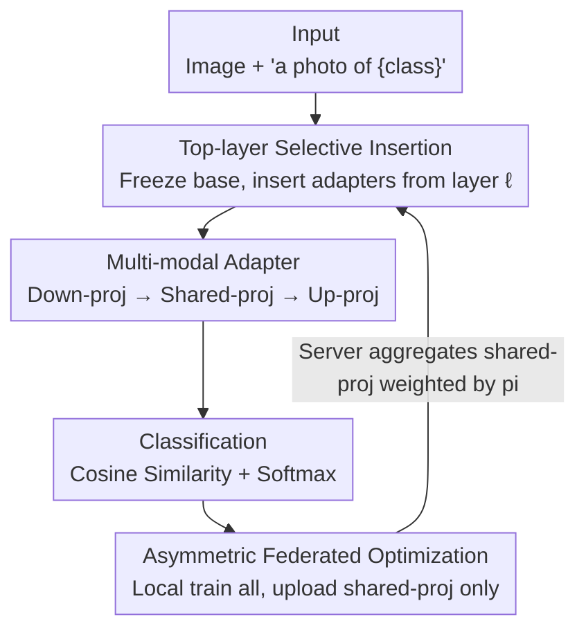

# pFedMMA: Personalized Federated Fine-Tuning with Multi-Modal Adapter for Vision-Language Models

**Conference**: ICLR 2026  
**OpenReview**: [https://openreview.net/forum?id=aX3E6LirK5](https://openreview.net/forum?id=aX3E6LirK5)  
**Code**: https://github.com/sajjad-ucsb/pFedMMA  
**Area**: Multi-modal VLM / Personalized Federated Learning / Parameter-Efficient Fine-Tuning  
**Keywords**: Federated Learning, CLIP, Multi-modal Adapter, Personalization, Generalization-Personalization Trade-off

## TL;DR
pFedMMA inserts a "down-projection — shared projection — up-projection" multi-modal adapter into the top layers of CLIP's image/text encoders. In federated learning, each client trains all parameters locally but only uploads and aggregates the shared projection used for cross-modal alignment. This achieves the optimal trade-off between strong personalization and strong generalization (to unseen classes/domains) across 11 datasets.

## Background & Motivation
**Background**: Vision-Language Models (VLMs) like CLIP possess strong zero-shot and few-shot capabilities. Adapting them efficiently to decentralized, privacy-sensitive, and distributionally heterogeneous scenarios (medical, legal, industrial) requires Parameter-Efficient Fine-Tuning (PEFT) within a Federated Learning (FL) framework. Recently, the mainstream approach has been "Federated + Prompt Tuning": pFedPrompt, FedOTP, FedPGP, and pFedMoAP all learn prompts for each client and coordinate via different mechanisms (optimal transport, contrastive learning, mixture-of-experts).

**Limitations of Prior Work**: These prompt tuning methods sacrifice generalization for personalization. The paper's radar chart (Fig.1) shows that FedOTP achieves extremely high accuracy on local classes (>97%) but collapses on base and novel classes (base is only around 18%), resulting in poor Harmonic Mean (HM). This implies the models "overfit" to the few classes seen by each client, becoming ineffective for unseen classes or domains, which limits their utility in Out-of-Distribution (OOD) scenarios.

**Key Challenge**: There is a trade-off between personalization (fitting the local distribution) and generalization (transferring to unseen classes/domains). Prompt injection occurs at the token/input level, where expressive power is constrained by the architecture, making it difficult to balance both ends. Furthermore, cross-modal alignment is crucial for VLMs like CLIP, yet unimodal prompts or adapters (AdaptFormer, LoRA) ignore the dependencies between images and text.

**Goal**: Find an adaptation mechanism under federated heterogeneous data that allows each client to fit its local distribution while maintaining cross-domain/class generalization and ensuring low communication costs.

**Key Insight**: The authors abandon prompts in favor of "multi-modal adapters"—which are independent of the backbone architecture, can be inserted into any backbone, and align image-text features through a cross-modal shared projection layer. A key observation is that the three-stage structure of the adapter (down-projection/shared/up-projection) can be naturally split: the up and down-projections handle modality-specific processing, while the shared projection handles cross-modal alignment. These can be "treated separately" in federated learning.

**Core Idea**: Decompose the adapter into "locally private up/down-projections" + "globally shared alignment projection." Train all parameters locally but aggregate only the shared projection—using this asymmetric federated optimization to assign personalization and generalization to two separate sets of parameters.

## Method

### Overall Architecture
The input to pFedMMA consists of an image $x$ and category text in the form of "a photo of a {class}." The output is classification logits based on image-text cosine similarity. The pipeline is built on a frozen CLIP: lower Transformer blocks remain frozen, while multi-modal adapters (MMA) are inserted in parallel into the upper blocks of both the image and text encoders starting from layer $\ell$. Internally, each adapter consists of "down-projection → shared projection → up-projection," with the shared projection reused between both image and text paths to facilitate alignment. On the federated side, each client trains all adapter parameters locally for several epochs using cross-entropy, but only uploads the shared projection matrix during communication rounds. The server aggregates these using weighted averaging based on client data volume, while the up and down-projections remain local permanently.

### Key Designs

**1. Top-layer Selective Insertion: Applying adaptation only to upper layers to preserve general knowledge**

Applying prompts/adapters across all layers (like AdaptFormer or LoRA) or within lower layers can disrupt the general representations learned during CLIP's pre-training and increase trainable parameters. The authors locate the insertion point based on two empirical observations: first, higher layers of image-text encoders contain more discriminative, dataset-specific features, while lower layers preserve general transferable knowledge; second, the modality gap is larger in lower layers, making early cross-modal alignment more difficult. Consequently, adapters are only inserted into upper blocks $j\in\{\ell,\cdots,L\}$, leaving lower layers frozen. This preserves universal representations (beneficial for generalization) while concentrating task-specific adaptation at the discriminative top layers, simultaneously reducing parameter counts.

**2. Multi-modal Adapter: Bridging text and images into the same alignment space via shared projection**

Unimodal adapters ignore the cross-modal dependencies of VLMs, leading to poor alignment. pFedMMA's adapter uses a parallel structure: input $z$ passes through both the frozen backbone $f(z)$ and the adapter branch, combined as $\text{Output}(z)=f(z)+\alpha A(z)$, where $\alpha$ is a scaling factor balancing general and task-specific features. The adapter branch itself is a three-stage bottleneck. For layer $j$ and modality $o\in\{I,T\}$ (Image/Text):

$$A^{(o)}_j(z^{(o)}_j)=W^{(o)}_{ju}\cdot \delta\!\left(W_{js}\cdot \delta\!\left(W^{(o)}_{jd}\cdot z^{(o)}_j\right)\right)$$

The key is that the down-projections $W^{(I)}_{jd},W^{(T)}_{jd}$ and up-projections $W^{(I)}_{ju},W^{(T)}_{ju}$ are modality-specific, while the middle shared projection $W_{js}$ is reused by both paths; $\delta$ denotes a non-linearity like GELU. Features are first compressed to a low dimension ($r\ll d$), then passed through the shared projection for cross-modal information exchange, and finally restored by the up-projection. This maintains modality-specific channels while forcing image-text interaction at the shared projection to align them into the same space—providing the structural basis for federated decomposition.

**3. Asymmetric Federated Optimization: Private projections for personalization, shared projection for generalization**

Given the structure where "up/down-projections are modality-specific and the shared projection handles alignment," the authors map this directly to the parameter partitioning in FL. In round $t$, each client $i$ trains all adapter parameters locally:

$$W\in\{W^{(I)}_{jd,i},W^{(I)}_{ju,i},W^{(T)}_{jd,i},W^{(T)}_{ju,i},W_{js,i}\}$$

for $E$ epochs via cross-entropy ($W^{t,e}_i=W^{t,e-1}_i-\eta\nabla\mathcal{L}_{ce}$). However, only the shared projection $W^{t,E}_{js,i}$ is uploaded. The server aggregates these as $W^{t+1}_{js}=\sum_{i=1}^N p_i W^{t,E}_{js,i}$ with $p_i=n_i/n$. The up and down-projections never leave the client. This asymmetric design achieves three goals: (i) **Local Personalization**: Private projections shape the representation space to fit the local distribution, effective for label/feature heterogeneity; (ii) **Global Generalization**: The shared projection is collaboratively trained to align image-text into a consistent global space, enabling transfer to unseen classes/domains; (iii) **Communication Efficiency**: The shared projection is far smaller than the entire adapter stack, significantly reducing communication costs. Assigning personalization to private parameters and generalization to shared parameters is the fundamental reason for breaking the "personalization vs. generalization" trade-off.

### Loss & Training
The objective is standard cross-entropy $\mathcal{L}_{CE}=-\frac{1}{M}\sum_i\sum_k y_{ik}\ln p_{i,k}$, where $p_{i,k}=\exp(\cos(z^{(I)}_i,z^{(T)}_k)/\gamma)/\sum_j\exp(\cos(z^{(I)}_i,z^{(T)}_j)/\gamma)$ and $\gamma$ is temperature. The CLIP backbone is frozen throughout, with only top-layer adapters trained. For CLIP-based datasets, the default setup uses ViT-B/16, 10 non-overlapping class splits, 100% participation, 2 local epochs, and 50 communication rounds. The shared layer dimension is 32 by default.

## Key Experimental Results

### Main Results
Evaluated on 7 CLIP datasets, 16-shot, ViT-B/16, across Local / Base / Novel / Harmonic Mean (HM) (average of 7 datasets):

| Method | Local | Base | Novel | HM |
|------|-------|------|-------|------|
| CLIP (Zero-shot) | 76.36 | 76.81 | 81.21 | 78.03 |
| PromptFL | 88.93 | 88.95 | 75.36 | 83.09 |
| FedPGP | 95.38 | 76.49 | 71.68 | 79.09 |
| FedOTP | **97.34** | 18.00 | 36.69 | 31.08 |
| pFedMoAP | 97.89 | 61.82 | 66.60 | 71.05 |
| **pFedMMA (Ours)** | 97.17 | **77.40** | **81.49** | **84.15** |

The highlight is that the Novel class score is +13.69% higher than pFedMoAP, and the HM is +6.4% higher, while the Local score is only 0.74% lower than the strongest baseline. This confirms that it "restores generalization significantly with almost no sacrifice to personalization." The extreme performance drop in FedOTP (97% Local, 36% Novel) is completely resolved.

Results on DomainNet / Office-Caltech10 with feature + label dual shifts ($\beta=0.5$):

| Method | DomainNet Avg. | Office-Caltech10 Avg. |
|------|----------------|------------------------|
| FedPGP | 24.90 | 20.71 |
| pFedMoAP | 24.65 | 19.55 |
| **pFedMMA** | **47.17** | **21.33** |

Accuracy nearly doubled on DomainNet (24.9 → 47.2), indicating that the cross-domain generalization advantage is more pronounced in real heterogeneous scenarios.

### Ablation Study

| Configuration | Key Metric | Description |
|------|---------|------|
| Shared Dim 32 vs 128 | 128 is slightly higher | 128-dim is slightly better but 32-dim is used to save parameters. |
| Scaling Factor $\alpha$ | Balances general/task features | Controls the contribution of the adapter in $f(x)+\alpha A(x)$. |
| Backbone ViT-B/32 | Best HM across all settings | Local is slightly lower than FedOTP/pFedMoAP on smaller backbones, but HM remains the highest. |
| CIFAR-10/100 Personalization (Dirichlet) | Best for all $\beta$ | Ranked first under 100 clients, 10% participation across various $\beta$. |

### Key Findings
- The gap is widened in Base/Novel classes rather than Local: The improvement over baselines is almost entirely in unseen classes/domains, while Local performance remains comparable—validating the design intent of "shared projection for generalization."
- Stronger heterogeneity leads to larger advantages: In DomainNet (dual shifts), pFedMMA leads significantly, demonstrating the effectiveness of asymmetric partitioning for realistic heterogeneity.
- Personalization is slightly lower with smaller backbones or fewer shots, but the HM (overall trade-off) is always optimal, showing low sensitivity to backbone choice.

## Highlights & Insights
- **Mapping structural decomposition to parameter partitioning**: Since the adapter's "modality-specific up/down-projections + cross-modal shared projection" is a structural fact, making the former private and the latter global achieves personalization and generalization with almost no extra mechanisms. This "structure-as-strategy" approach is elegant and transferable.
- **Communication efficiency as a byproduct**: Because only the low-dimensional shared projection is exchanged, efficiency is a natural result of the partition boundary rather than an added constraint like compression or sparsification.
- **Diagnostic Motivation**: Using the radar chart in Fig.1 to pinpoint FedOTP's "high Local, crashed Novel" bias turns an abstract trade-off into an intuitive visualization, aiding the understanding of the problem.

## Limitations & Future Work
- The shared projection is the only collaborative channel; if modal alignment needs vary drastically across clients, a single global shared projection might become a bottleneck.
- Personalization is slightly inferior to FedOTP/pFedMoAP on small backbones (ViT-B/32) or with extremely few shots, suggesting limited capacity for private projections under data scarcity.
- The method relies on empirical observations (high-layer discriminative, low-layer general/larger gap) to select the insertion layer $\ell$, which might require tuning per dataset.
- Validation is limited to CLIP (ViT-B series); performance on larger models (ViT-L/14) or non-CLIP architectures remains to be tested.

## Related Work & Insights
- **vs FedOTP / FedPGP / pFedPrompt (Federated Prompt Tuning)**: These inject prompts at the token/input level and coordinate via OT/contrastive learning; they have strong personalization but poor generalization. Ours uses top-layer adapters and shares alignment parameters—the difference is "partitioning parameters for both ends" instead of a "single prompt trade-off."
- **vs pFedMoAP (Mixture-of-Experts)**: pFedMoAP uses non-local experts with attention gating; while Local is high, Base/Novel still lags. Ours doesn't rely on cross-client experts but on a shared alignment space, outperforming it by +13.69% on unseen classes.
- **vs Unimodal Adapters / LoRA (AdaptFormer, CLIP-Adapter, CLIP-LoRA)**: These ignore cross-modal dependencies. pFedMMA explicitly bridges image-text via a shared projection and uses it as the sole communication target, representing the first systematic "Multi-modal Adapter x Personalized FL" solution for this relatively unexplored path.

## Rating
- Novelty: ⭐⭐⭐⭐ Mapping adapter structure splitting directly to FL partitioning is clever and previously unexplored.
- Experimental Thoroughness: ⭐⭐⭐⭐⭐ 11 datasets covering label/feature shifts, different backbones, shots, and $\beta$ values.
- Writing Quality: ⭐⭐⭐⭐ Motivation is intuitive via radar charts; method is clear, though layer selection $\ell$ relies on empirical rules.
- Value: ⭐⭐⭐⭐ Provides a practical solution balancing personalization, generalization, and communication for VLM deployment in privacy-sensitive, heterogeneous environments.

<!-- RELATED:START -->

## Related Papers

- [\[CVPR 2026\] FedMPT: Federated Multi-Label Prompt Tuning of Vision-Language Models](../../CVPR2026/multimodal_vlm/fedmpt_federated_multi-label_prompt_tuning_of_vision-language_models.md)
- [\[AAAI 2026\] RMAdapter: Reconstruction-based Multi-Modal Adapter for Vision-Language Models (Oral)](../../AAAI2026/multimodal_vlm/rmadapter_reconstructionbased_multimodal_adapter_for_visionlanguage.md)
- [\[ICLR 2026\] Preserve and Sculpt: Manifold-Aligned Fine-tuning of Vision-Language Models for Few-Shot Learning](preserve_and_sculpt_manifold-aligned_fine-tuning_of_vision-language_models_for_f.md)
- [\[ICLR 2026\] Fed-Duet: Dual Expert-Orchestrated Framework for Continual Federated Vision-Language Learning](fed-duet_dual_expert-orchestrated_framework_for_continual_federated_vision-langu.md)
- [\[ICLR 2026\] A-TPT: Angular Diversity Calibration Properties for Test-Time Prompt Tuning of Vision-Language Models](a-tpt_angular_diversity_calibration_properties_for_test-time_prompt_tuning_of_vi.md)

<!-- RELATED:END -->
