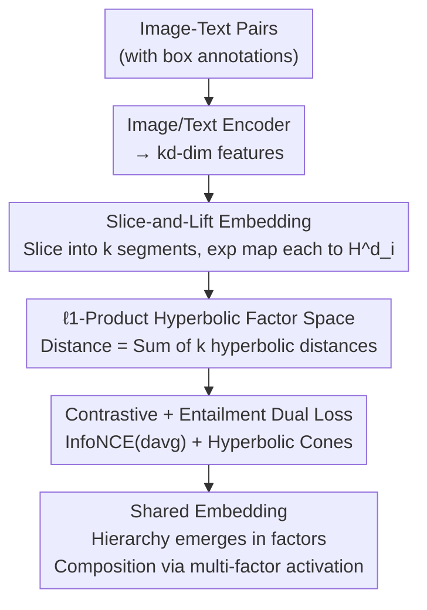

# PHyCLIP: $\ell_1$-Product of Hyperbolic Factors Unifies Hierarchy and Compositionality in Vision-Language Representation Learning

**Conference**: ICLR 2026  
**OpenReview**: [https://openreview.net/forum?id=I3Ct1eDmVI](https://openreview.net/forum?id=I3Ct1eDmVI)  
**Code**: https://github.com/tksmatsubara/PHyCLIP  
**Area**: Multimodal VLM / Representation Learning  
**Keywords**: Vision-Language Models, Hyperbolic Geometry, Product Metric Space, Compositionality, Hierarchical Structure

## TL;DR
PHyCLIP replaces the image-text embedding space from a "single hyperbolic space" with an "$k$ hyperbolic factors $\ell_1$-product metric space." This allows "is-a" hierarchies within concept families to emerge spontaneously within individual hyperbolic factors, while cross-family compositions (e.g., "dog + car") are captured by the additive geometry of $\ell_1$ summation, analogous to Boolean algebra. This approach outperforms CLIP / MERU / HyCoCLIP across zero-shot classification, retrieval, hierarchical classification, and compositional understanding tasks.

## Background & Motivation
**Background**: Vision-language models like CLIP use contrastive pre-training to compress images and text into single-point vectors in a shared space, performing zero-shot transfer via cosine similarity. To represent "is-a" hierarchies (tree-like taxonomies where nodes grow exponentially with depth), works like MERU and HyCoCLIP lift embeddings into **hyperbolic space**. Hyperbolic geometry scales exponentially with radius, naturally fitting the growth of trees, and utilizes hyperbolic entailment cones to encode partial order relations.

**Limitations of Prior Work**: Semantic structures require simultaneous representation of two properties. First, **hierarchy**: `dog ⪯ mammal ⪯ animal`, representing is-a relations within a concept family. Second, **compositionality**: `"a dog in a car"` entails both `dog` and `car`, representing a conjunction across "animal" and "vehicle" families. Compressing an entire image into a single point makes it difficult to faithfully encode both structures simultaneously.

**Key Challenge**: Hyperbolic geometry excels at hierarchy but **lacks a standard composition operator**. Möbius addition in hyperbolic space aligns neither with standard vector addition nor Boolean structures. While intersections of entailment cone regions can approximate conjunctions, they lack representation efficiency guarantees for arbitrary co-occurrences. Conversely, classical Boolean algebra / bag-of-words / word2vec addition excels at composition but fails to encode hierarchy well. The paper identifies the root of this contradiction through a proposition: a Boolean lattice of $n$ atomic concepts $(\{0,1\}^n, d_{\mathrm{Ham}})$ can be **isometrically embedded into an $\ell_1$-product metric space** after suitable factor scaling, but **it cannot be isometrically embedded into a single hyperbolic space $\mathbb{H}^d$ for any $d\ge 2,\,n\ge 2$** (Proposition 1). This implies that a single hyperbolic space geometrically cannot accommodate Boolean-style composition.

**Goal**: To find a geometric space where hierarchy emerges "locally" and composition is "globally" additive, ensuring both structures do not interfere with each other.

**Key Insight**: The authors leverage two classical correspondences: (i) metric trees can be embedded into hyperbolic space with low distortion (Sarkar’s Theorem); (ii) finite Boolean algebras with Hamming distance can be isometrically embedded into $\ell_1$ space. By **replacing each bit $\{0,1\}$ in Boolean algebra with a hyperbolic factor representing a concept family** (e.g., one factor each for animals, vehicles, food), composition is expressed when multiple factors are activated simultaneously.

**Core Idea**: Use an "$k$ hyperbolic factors $\ell_1$-product metric space $(\mathbb{H}^d)^k$" instead of a "single hyperbolic space." Intra-family hierarchies reside within single factors, while cross-family compositions are handled by $\ell_1$ summation.

## Method

### Overall Architecture
PHyCLIP takes image-text pairs as input and outputs a set of embeddings in an $\ell_1$-product metric space. The architecture remains based on standard CLIP encoders, modifying only the "embedding space geometry" and "distance/loss." Specifically, the image and text encoders each produce a $kd$-dimensional feature vector, which is **sliced into $k$ segments** of $d$ dimensions each. The $i$-th segment is lifted to the $i$-th hyperbolic factor $\mathbb{H}^d_i$ via an exponential map, yielding $x^{(i)}$. Thus, an instance is represented as a tuple $X=(x^{(1)},\dots,x^{(k)})\in(\mathbb{H}^d)^k$. The distance between two points is not a geodesic distance in a single space, but the $\ell_1$ sum of distances across the $k$ hyperbolic factors. Training follows the box supervision of HyCoCLIP (image box = object-level crop, text box = noun phrase), using contrastive loss to pull pairs together and entailment loss to constrain "more specific" instances within the hyperbolic entailment cones of "more general" instances.

### Key Designs

**1. $\ell_1$-Product Hyperbolic Factor Space: Separating Hierarchy and Composition**

This is the geometric core of the paper, addressing the contradiction that a single space cannot fit both structures. The space is defined as the Cartesian product of $k$ copies of $d$-dimensional hyperbolic space $(\mathbb{H}^d)^k$, equipped with the $\ell_1$-product metric:

$$d_1(X,Y)=\sum_{i=1}^{k} d_{\mathbb{H}^d_i}\!\big(x^{(i)},y^{(i)}\big),\qquad d_{\mathrm{avg}}(X,Y)=\tfrac{1}{k}\,d_1(X,Y).$$

Each hyperbolic factor $\mathbb{H}^d_i$ is responsible for an is-a taxonomy of a concept family (e.g., "animal" or "vehicle"). **Inside** a factor, standard hyperbolic embeddings and entailment cones encode hierarchy. **Between** factors, $\ell_1$ simply sums the distances of various families. This additive geometry corresponds to the conjunctive semantics of "union of multiple concepts" in Boolean algebra. Theorem 2 proves that the $\ell_1$-product of $k$ metric trees can be $(1+\varepsilon)$-quasi-isometrically embedded into the $\ell_1$-product of $k$ two-dimensional hyperbolic factors, allowing both "tree hierarchy + Boolean composition" to fit in one space. Unlike previous mixed-curvature models, PHyCLIP uses **only negative curvature hyperbolic factors and an $\ell_1$ product metric instead of Riemannian $\ell_2$**. Both choices are theoretically supported and validated in ablation studies. Another benefit of $\ell_1$ appears in retrieval: when an object specified in text is missing in the candidate image, the corresponding factor produces a large distance penalty, making hard negatives more separable. A single hyperbolic space would implicitly encode "presence/absence" as a hierarchical relation, weakening such penalties.

**2. Slice-and-Lift Embedding with Learnable Curvature: Connecting Encoders to Product Space**

To integrate the new geometry without changing the encoder backbone, the $kd$-dimensional feature is sliced into $k$ segments $v^{(i)}$ of $d$ dimensions, which are then lifted via an exponential map to the corresponding hyperbolic factor as $x^{(i)}$. Each factor uses the Lorentz model with a **learnable** curvature $-\alpha_i$. Why learn the curvature? When the negative curvature $\alpha_i$ of a factor is multiplied by $1/c^2$, the Riemannian metric is scaled by $c^2$, and the distance between any two points is multiplied by $c$. This is equivalent to learning the composition weight of the $i$-th factor for the weighted $\ell_1$-product metric. The paper sets $k=64$ and $d=8$ (512 total dimensions). Learners for curvature add only $k=64$ parameters, which is negligible compared to an 86M ViT. Operations like $\cosh/\sinh/\mathrm{arcosh}$ are parallelizable across factors, and the wall-clock time remains dominated by the ViT and text encoder. Notably, small curvature does not mean the factor is emphasized; if an instance's embeddings in a specific factor are all close to the origin, that factor is effectively "weighted down"—a mechanism observed in characterization visualizations.

**3. Contrastive + Entailment Dual Loss and Box Supervision: Aligning and Ordering in Product Space**

The training objective is the weighted sum of contrastive and entailment losses: $\mathcal{L}_{\text{overall}}=\mathcal{L}_{\text{cont}}+\gamma\,\mathcal{L}_{\text{ent}}$. The contrastive loss uses standard InfoNCE but replaces spatial distance with the average distance $d_{\mathrm{avg}}$:

$$\mathcal{L}_{\text{cont}}(\{X_b\},\{Y_b\})=-\sum_{b\in B}\log\frac{\exp(-d_{\mathrm{avg}}(X_b,Y_b)/\tau)}{\sum_{a\in B}\exp(-d_{\mathrm{avg}}(X_b,Y_a)/\tau)},$$

averaged across image-to-text, text-to-image, image box-to-text box, and text box-to-image box directions. The entailment loss follows hyperbolic entailment cones: for a point $y^{(i)}$ in each factor, a geodesic cone $C(y^{(i)})$ with vertex $y^{(i)}$ and half-angle $\omega(y^{(i)})$ is defined. Points inside the cone are considered more specific ($x^{(i)}\preceq y^{(i)}$). A penalty is applied when the exterior angle $\phi(x^{(i)},y^{(i)})$ exceeds the boundary. The per-factor loss is:

$$\mathcal{L}_{\text{ent},i}(X,Y)=\max\!\big(0,\ \phi(x^{(i)},y^{(i)})-\eta\,\omega(y^{(i)})\big),$$

averaged over $k$ factors and summed across four types of partial order pairs: image-text, image box-text box, image-image box, and text-text box. Box supervision follows HyCoCLIP: images are more specific than paired text ($I\preceq T$ because text ignores details), and boxes (object crops / noun phrases) are more general than full images/texts ($I\preceq I^{\text{box}}$, $T\preceq T^{\text{box}}$). These partial orders are injected via entailment loss, allowing $\ell_1$-product geometry to shape both hierarchy and composition.

### Loss & Training
All models are trained from scratch on the GRIT dataset (approx. 14M image-text pairs, 26.6M box annotations). The image encoder is a base ViT. Hyperparameters follow the official HyCoCLIP implementation, with results averaged over three random seeds. Temperature $\tau$ and curvatures $\alpha_i$ are learnable. $\gamma$ and $\eta$ are entailment loss weights/boundary hyperparameters. Extra geometric calculations introduce negligible training overhead.

## Key Experimental Results

### Main Results
Comparison across four task categories against CLIP / MERU / HyCoCLIP (all with box supervision) shows PHyCLIP is overall the strongest.

| Task / Dataset | Metric | PHyCLIP | HyCoCLIP | Notes |
|--------|------|------|----------|------|
| Zero-shot Classification / ImageNet | top-1 | **44.31** | 43.80 | Significant gain on general datasets |
| Zero-shot Classification / Food-101 | top-1 | **57.26** | 52.64 | Cleaner intra-family hierarchy learning |
| Zero-shot Classification / CIFAR-100 | top-1 | **59.05** | 58.59 | |
| Retrieval COCO Text→Image | R@5 | **58.03** | 57.11 | stronger $\ell_1$ penalty on hard negatives |
| Retrieval COCO Image→Text | R@5 | **70.94** | 69.51 | |
| Hierarchy Classification / WordNet | TIE(↓) | **3.294** | 3.319 | Incorrect perfs closer to ground truth |
| Hierarchy Classification / WordNet | $J$(↑) | **0.8059** | 0.8043 | |
| Compositional Understanding / SugarCrepe | Overall | **78.32** | 77.99 | Better attribute-object binding |

On VL-CheckList–Object, PHyCLIP is more robust to object position (center/middle/edge) and size (large/medium/small). For example, at edge positions: 70.37 vs HyCoCLIP 67.80.

### Ablation Study
Fixing total dimension $kd$, the number of factors $k$, product metric type, and curvature were tuned:

| Config | ImageNet | Food-101 | COCO R@5(I) | TIE(↓) | Notes |
|------|---------|---------|------|------|------|
| $k{=}1$ (≈HyCoCLIP) | 52.64 | 57.11 | 69.51 | 3.319 | No decomposition; worst performance |
| $k{=}64, d{=}8, \ell_1$ | **57.26** | 58.03 | **70.94** | 3.294 | Main config; peak performance |
| $k{=}128, d{=}4, \ell_1$ | 53.96 | 57.79 | 71.18 | 3.284 | Over-decomposition hurts intra-family hierarchy |
| $k{=}64, d{=}8, \ell_2$ | 53.39 | 57.09 | 70.53 | 3.367 | Riemannian product consistently worse |
| $k{=}64, d{=}8, \ell_\infty$ | 10.33 | 8.77 | 14.51 | 9.697 | $\ell_\infty$ causes collapse |
| mixed-curvature($\ell_2$) | 49.05 | 56.72 | 70.81 | 3.712 | Overall inferior to Ours |

### Key Findings
- **Decomposition is effective**: $k=1$ (equivalent to HyCoCLIP) is worst on most metrics. Increasing $k$ generally improves results, peaking at $k=64$ or $128$. However, at $k=128$, Food-101 drops significantly, indicating excessive decomposition harms the representation of intra-family taxonomies.
- **Metric type is crucial**: Replacing $\ell_1$ with Riemannian $\ell_2$ consistently degrades performance, and $\ell_\infty$ leads to training collapse (ImageNet 10.33%). This empirically supports that "$\ell_1$ is the correct way to aggregate cross-family compositions."
- **Factor specialization emerges spontaneously**: Visualizations show factor $i{=}39$ encodes the mammal is-a tree (the norm of "dog" is maximized here and zeroed in $i{=}9$), while factor $i{=}9$ encodes vehicles/personal items. "A dog and a car" activates **both** factors simultaneously. Retrieving images using the element-wise max of two single-concept prompts yields results nearly identical to a compositional prompt—consistent with "union" behavior in Boolean algebra, achieved without explicit supervision for factor assignment.

## Highlights & Insights
- **Geometric choice driven by non-embeddability**: Proposition 1 proves that Boolean lattices can be isometrically embedded in $\ell_1$-products but not in a single hyperbolic space. This elevates the motivation from empirical observation to geometric necessity.
- **Factor-to-bit analogy**: Replacing discrete bits of Boolean algebra with continuous hyperbolic factors preserves composition (multi-factor activation = union) while allowing space for intra-family hierarchies. One design solves two problems.
- **Transferable trick**: Splitting a "single metric space" into a "product metric space + per-factor learnable curvature/weight" is virtually free (only 64 curvature parameters). This is applicable to any representation learning task needing both hierarchy and composition (e.g., Knowledge Graph Embeddings, recommendation systems).
- **Inherent interpretability**: Factor specialization and composition via multi-factor activation are natural outcomes of the $\ell_1$-product geometry, not forced by extra constraints. Visualizations clearly show "which factor manages which family."

## Limitations & Future Work
- **Relational and swap tasks**: Slight drops in the relation replacement and object swap subsets of SugarCrepe. The author attributes this to Boolean geometry not naturally emphasizing relational structures between objects (it is better at "what is present" than "who did what to whom").
- **Specialized data performance**: On out-of-distribution specialized data relative to GRIT (e.g., textures/DTD, satellites/EuroSAT), PHyCLIP is not always the best. Gap exists in fine-grained sets like FGVC-Aircraft.
- **Hyperparameter $k$**: Finding the optimal $k$ requires tuning; both too small (no decomposition) and too large (damaging hierarchy) are sub-optimal. The factor-family correspondence is emergent and uncontrollable.
- **Future Directions**: Adding a "non-Boolean" geometric component for relational composition or guiding factor assignment with weak supervision could address relational/swap weaknesses and improve controllability.

## Related Work & Insights
- **vs HyCoCLIP**: HyCoCLIP uses box supervision in a single hyperbolic space to capture intra-modal hierarchy. PHyCLIP reuses this supervision but changes the space to an $\ell_1$-product of $k$ factors. Ablation at $k=1$ reduces to HyCoCLIP, proving gains come from the "decomposition + $\ell_1$" geometric modification.
- **vs MERU**: MERU first lifted CLIP to a single hyperbolic space using entailment cones. PHyCLIP identifies that a single space cannot accommodate Boolean composition (Proposition 1) and adds the composition dimensionality via product metrics.
- **vs Mixed-Curvature Models**: These also use product spaces but mix Euclidean/Spherical/Hyperbolic geometries with Riemannian $\ell_2$ metrics. PHyCLIP insists on "all-hyperbolic factors + $\ell_1$ metric" with theoretical backing; ablation shows mixed-curvature is overall inferior.
- **vs Order/Box Embeddings**: These use region inclusion/intersection to express hierarchy and conjunction. The paper theoretically views order embeddings as continuous relaxations of Boolean lattices, proving both order embeddings and PHyCLIP support Boolean-level composition whereas a single hyperbolic space does not.

## Rating
- Novelty: ⭐⭐⭐⭐⭐ Unifying hierarchy and composition via "$\ell_1$-product hyperbolic factors" with solid geometric theory.
- Experimental Thoroughness: ⭐⭐⭐⭐ Comprehensive across four task types and metric/factor ablations; minor weaknesses in specialized domains and relational tasks.
- Writing Quality: ⭐⭐⭐⭐⭐ Clear progression from theoretical background to method and visualization; Proposition 1 provides a very strong motivation.
- Value: ⭐⭐⭐⭐ Near-zero cost modification for CLIP-like models with interpretable factor structures; provides methodological inspiration for representation learning.

<!-- RELATED:START -->

## Related Papers

- [\[ICLR 2026\] U-MARVEL: Unveiling Key Factors for Universal Multimodal Retrieval via Embedding Learning](u-marvel_unveiling_key_factors_for_universal_multimodal_retrieval_via_embedding_.md)
- [\[CVPR 2026\] MOON2.0: Dynamic Modality-balanced Multimodal Representation Learning for E-commerce Product Understanding](../../CVPR2026/multimodal_vlm/moon20_dynamic_modality-balanced_multimodal_representation_learning_for_e-commer.md)
- [\[ICLR 2026\] Reversible Primitive–Composition Alignment for Continual Vision–Language Learning](reversible_primitivecomposition_alignment_for_continual_visionlanguage_learning.md)
- [\[ICLR 2026\] Modality Alignment across Trees on Heterogeneous Hyperbolic Manifolds](modality_alignment_across_trees_on_heterogeneous_hyperbolic_manifolds.md)
- [\[AAAI 2026\] HiMo-CLIP: Modeling Semantic Hierarchy and Monotonicity in Vision-Language Alignment](../../AAAI2026/multimodal_vlm/himo-clip_modeling_semantic_hierarchy_and_monotonicity_in_vi.md)

<!-- RELATED:END -->
