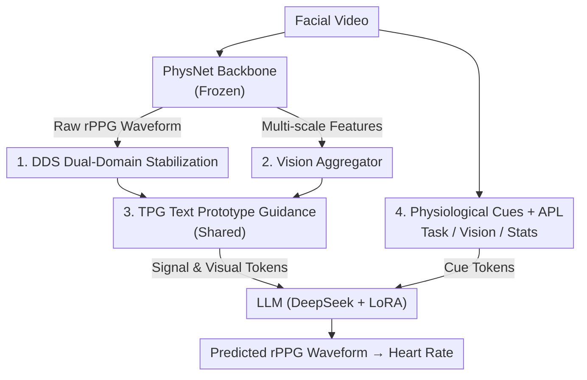

# PhysLLM: Harnessing Large Language Models for Cross-Modal Remote Physiological Sensing

**Conference**: ICLR 2026  
**OpenReview**: [https://openreview.net/forum?id=aR43t8OEeW](https://openreview.net/forum?id=aR43t8OEeW)  
**Code**: TBD  
**Area**: Multimodal VLM  
**Keywords**: rPPG, remote physiological sensing, Large Language Models, cross-modal alignment, heart rate estimation

## TL;DR
PhysLLM utilizes a frozen CNN (PhysNet) as an rPPG backbone and employs "Dual-domain Stabilization + Multi-scale Visual Aggregation + Text Prototype Guidance" to translate signal and visual features into tokens decodable by an LLM. Combined with physiological cue prompts generated by LLaVA and statistical descriptors, the LLM estimates heart rates from facial videos, achieving SOTA results across four datasets and cross-domain tests.

## Background & Motivation
**Background**: Remote Photoplethysmography (rPPG) enables non-contact estimation of physiological indicators like heart rate and blood pressure by analyzing subtle skin color changes in camera videos. It is more suitable for continuous daily monitoring than contact-based ECG/PPG. Current mainstream models are end-to-end CNN/Transformer architectures where encoders extract features for direct waveform regression.

**Limitations of Prior Work**: Purely visual models are sensitive to motion blur, occlusion, low resolution, and lighting variations. They typically process single video streams and possess weak long-term sequence modeling capabilities, leading to poor robustness in real-world scenarios. While LLMs excel at long-range dependency modeling, they are designed for discrete text tokens. Directly applying them to continuous, noise-sensitive rPPG signals leads to a fundamental mismatch between discrete operations and continuous signals, causing poor representation and noise amplification.

**Key Challenge**: There exists a representation gap between the long-range temporal reasoning of LLMs and the continuous/noisy nature of rPPG signals. The objective is to leverage LLM semantic priors and long-sequence capabilities without distorting signals by forcing them into text space.

**Goal**: Without heavy LLM fine-tuning, (1) stabilize the backbone signals; (2) "translate" signal/visual features into the LLM semantic space; and (3) inject rPPG-specific contextual priors to enable scene-adaptive estimation.

**Key Insight**: The authors draw inspiration from time-series "reprogramming" (e.g., Time-LLM), but identify that rPPG requires additional visual context and physiological statistical priors. Thus, they design a collaborative optimization framework between CNNs and LLMs rather than a simple choice between the two.

**Core Idea**: Use "Text Prototypes" as semantic anchors to align signal tokens, visual tokens, and text cue tokens into a space interpretable by LLMs. The frozen backbone handles local spatiotemporal features while the LLM performs long-range temporal reasoning.

## Method

### Overall Architecture
The input is facial video, and the output is the predicted rPPG waveform. The pipeline has two main branches: the **Text-Vision-Sequence Embedding generation** translates backbone signals and visual features into LLM tokens; the **Physiological Cue-Aware Prompt Learning** generates scene-adaptive prompt tokens. Specifically, a frozen PhysNet backbone outputs raw rPPG waveforms and multi-scale spatiotemporal features. Waveforms are denoised via **DDS (Dual-Domain Stabilization)**, and visual features are fused via a **Vision Aggregator**. Both are mapped to the LLM semantic space through a shared **TPG (Text Prototype Guidance)** module. Concurrently, **Physiological Cues + APL** fuse task descriptions, LLaVA visual descriptions, and signal statistics into cue tokens. Finally, all tokens are fed into an LLM with LoRA (default: DeepSeek-1.5B) to regress the final waveform using MSE supervision.

### Key Designs

**1. DDS Dual-Domain Stabilization: Denoising before Downstream**
The raw waveform $x\in\mathbb{R}^{B\times L}$ is noisy and non-stationary. DDS stabilizes it in both time and frequency domains. In the time domain, it applies normalization $x'=\frac{x-\mu}{\sigma+\epsilon}$ ($\epsilon=10^{-5}$) followed by exponential moving average $z^{time}_i=\alpha\cdot x'_i+(1-\alpha)\cdot z_{i-1}$. In the frequency domain, it uses Discrete Wavelet Transform (DWT) to decompose the signal, stabilizes coefficients, and reconstructs $z^{fre}$ via IDWT. A **learnable** coefficient $\beta\in[0,1]$ adaptively weights the two: $z=(1-\beta)\cdot z^{time}+\beta \cdot z^{fre}$.

**2. Vision Aggregator: Supplementing Shallow Details with Deep Semantics**
Deep features $F_M$ have strong semantics but miss fine-grained details, while shallow features $F_1 \dots F_{M-1}$ are the opposite. VA uses **deep features $F_M$ as the query** to perform cross-attention over shallow features $X = \text{Concat}(F_1, \dots, F_{M-1})$: $F_{cross} = \text{CrossAttention}(F_M, X, X)$. This dynamically retrieves lost details. Final fusion is achieved via residual scaling: $F_{visual} = F_M + \gamma_2 \cdot (F_{cross} + \gamma_1 \cdot F_{self})$.

**3. Text Prototype Guidance (TPG): Cross-Modal Alignment**
Continuous high-dimensional rPPG signals cannot be directly edited or described losslessly by natural language. TPG maintains a small set of **text prototypes** $E'\in\mathbb{R}^{V'\times D}$ ($V'\ll V$, where $V$ is vocabulary size) as semantic anchors. Input features $X$ undergo cross-attention with these prototypes to "translate" features into the LLM space. A **shared TPG module** for both signals and vision forces both modalities to learn latent correlations on the same anchor set.

**4. Physiological Cue-Aware Prompt Learning + APL**
The model constructs three types of cue tokens: **Task Cues** (literary consensus on domain gaps like skin tone/lighting), **Vision Cues** (LLaVA-generated descriptions of face/environment), and **Stats Cues** (symbolic priors from calculated statistics like min/max, trends $\Gamma(x)=\sum_{i=2}^{T}(x_i-x_{i-1})$, and TopK). These are fused via **Adaptive Prompt Learning (APL)**, which uses an Attentive Compressor and learnable weighting $W$ to adaptively determine which cues are most critical for a given sample.

### Loss & Training
The PhysNet backbone is frozen. Only DDS, VA, TPG, APL, and the LLM's LoRA adapters are trained. The model minimizes the Mean Squared Error: $\mathcal{L}_{MSE}=\frac{1}{n}\sum_{i=1}^{n}(y_i-\hat{y}_i)^2$.

## Key Experimental Results

### Main Results
Intra-dataset testing (MAE↓, RMSE↓ in bpm):

| Dataset | Metric | PhysLLM | Next Best SOTA | Note |
|--------|------|---------|-----------|------|
| UBFC-rPPG | MAE/RMSE | 0.21 / 0.57 | 0.50 / 0.78 | Stable long-term tracking |
| PURE | MAE/RMSE | 0.17 / 0.35 | 0.27 / 0.47 | Robust to head motion |
| BUAA | MAE/RMSE | 6.48 / 8.48 | 6.89 / 10.39 | Strong lighting robustness |
| MMPD | MAE/RMSE | 4.36 / 10.76 | 4.69 / 11.31 | Best in complex scenarios |

In cross-domain generalization (training on $P+U$, testing on $M$), PhysLLM reduces MAE/RMSE to 9.95/14.96, a Gain of 1.05/2.34 bpm over the previous SOTA.

### Ablation Study
Main modules ablation (UBFC-rPPG):

| Config | MAE | RMSE | Note |
|------|-----|------|------|
| Full | 0.21 | 0.57 | - |
| w/o DDS | 0.25 | 0.76 | Denoising is effective |
| w/o TPG | 0.27 | 0.92 | Most significant impact |
| w/o VA | 0.34 | 1.05 | - |

Removing **APL** leads to a 76% performance degradation (MAE increases from 0.21 to 1.31), highlighting its role as the most critical component for scene adaptation.

### Key Findings
- **TPG and APL are Essential**: TPG achieves cross-modal alignment while APL handles context selection; neither can be omitted.
- **LLM Priors are Necessary**: Replacing the LLM with a non-pretrained Transformer (Sundial) results in massive performance drops (MAE from 0.21 to 3.35), proving the value of LLM semantic knowledge.
- **Higher Value in Hard Scenarios**: Gains are most pronounced on BUAA and MMPD (complex lighting/motion).

## Highlights & Insights
- **Translation vs. Fine-tuning**: Using text prototypes to "reprogram" signals into the LLM space avoids heavy fine-tuning and provides a lightweight paradigm for non-text modalities.
- **Synergy of Frozen Backbone + Learned Adaptation**: Keeping the rPPG-specialized backbone frozen while training adapters allows the LLM to focus on long-range temporal reasoning.
- **Symbolic Statistical Prompts**: Tokenizing simple statistics (min/max/trends) effectively compensates for what static visual descriptions miss regarding temporal blood flow changes.

## Limitations & Future Work
- MAE on BUAA/MMPD remains at 4–6 bpm; clinical-grade accuracy in extreme real-world noise is still challenging.
- Dependency on external models (LLaVA and DeepSeek) leads to high inference overhead, making real-time deployment on edge devices difficult.
- LLaVA descriptions may be inaccurate under extreme lighting/occlusion, requiring further investigation into cue robustness.

## Related Work & Insights
- **vs. CNN/Transformer SOTA**: Recent models like RhythmFormer suffer from noise sensitivity; PhysLLM addresses this using LLM-based long-range reasoning and contextual prompts.
- **vs. Time-LLM**: While Time-LLM focuses on general time-series, PhysLLM extends this to physiological signals by incorporating multi-scale visual context and domain-specific statistical priors.

## Rating
- Novelty: ⭐⭐⭐⭐⭐ 
- Experimental Thoroughness: ⭐⭐⭐⭐ 
- Writing Quality: ⭐⭐⭐⭐ 
- Value: ⭐⭐⭐⭐

<!-- RELATED:START -->

## Related Papers

- [\[NeurIPS 2025\] CHOICE: Benchmarking the Remote Sensing Capabilities of Large Vision-Language Models](../../NeurIPS2025/multimodal_vlm/choice_benchmarking_the_remote_sensing_capabilities_of_large_vision-language_mod.md)
- [\[ICLR 2026\] Exploring Cross-Modal Flows for Few-Shot Learning](exploring_cross-modal_flows_for_few-shot_learning.md)
- [\[ICLR 2026\] XModBench: Benchmarking Cross-Modal Capabilities and Consistency in Omni-Language Models](xmodbench_benchmarking_cross-modal_capabilities_and_consistency_in_omni-language.md)
- [\[CVPR 2026\] CF-IPT: Cross-Modal Fusion Interactive Prompt Tuning of Vision-Language Pre-Trained Model for Multisource Remote Sensing Data Classification](../../CVPR2026/multimodal_vlm/cf-ipt_cross-modal_fusion_interactive_prompt_tuning_of_vision-language_pre-train.md)
- [\[ICLR 2026\] CityLens: Evaluating Large Vision-Language Models for Urban Socioeconomic Sensing](citylens_evaluating_large_vision-language_models_for_urban_socioeconomic_sensing.md)

<!-- RELATED:END -->
## Related Papers

- [\[NeurIPS 2025\] CHOICE: Benchmarking the Remote Sensing Capabilities of Large Vision-Language Models](../../NeurIPS2025/multimodal_vlm/choice_benchmarking_the_remote_sensing_capabilities_of_large_vision-language_mod.md)
- [\[ICLR 2026\] XModBench: Benchmarking Cross-Modal Capabilities and Consistency in Omni-Language Models](xmodbench_benchmarking_cross-modal_capabilities_and_consistency_in_omni-language.md)
- [\[CVPR 2026\] CF-IPT: Cross-Modal Fusion Interactive Prompt Tuning of Vision-Language Pre-Trained Model for Multisource Remote Sensing Data Classification](../../CVPR2026/multimodal_vlm/cf-ipt_cross-modal_fusion_interactive_prompt_tuning_of_vision-language_pre-train.md)
- [\[ICLR 2026\] CityLens: Evaluating Large Vision-Language Models for Urban Socioeconomic Sensing](citylens_evaluating_large_vision-language_models_for_urban_socioeconomic_sensing.md)
- [\[ICLR 2026\] FLARE: Fully Integration of Vision-Language Representations for Deep Cross-Modal Understanding](flare_fully_integration_of_vision-language_representations_for_deep_cross-modal_.md)

<!-- RELATED:END -->
