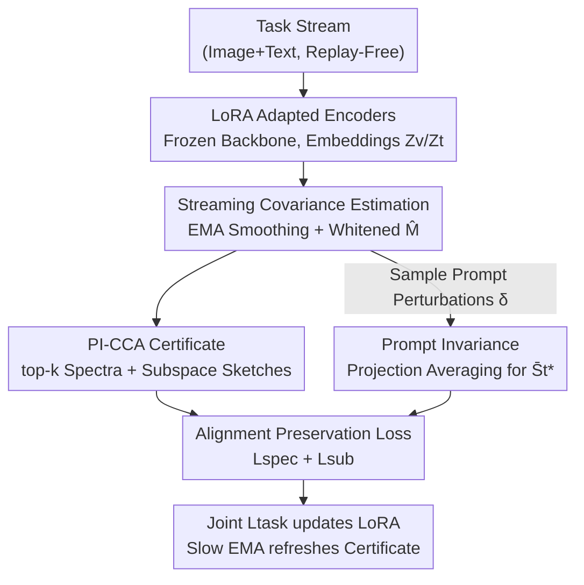

# PI-CCA: Prompt-Invariant CCA Certificates for Replay-Free Continual Multimodal Learning

**Conference**: ICLR 2026  
**OpenReview**: [https://openreview.net/forum?id=pn2H6YeOv2](https://openreview.net/forum?id=pn2H6YeOv2)  
**Code**: To be confirmed  
**Area**: Multimodal VLM / Continual Learning  
**Keywords**: Vision-Language Continual Learning, Replay-Free, Canonical Correlation Analysis (CCA), Prompt Robustness, Zero-shot Retention

## TL;DR
PI-CCA redefines "forgetting" in Vision-Language Models (VLMs) as the drift of image-text alignment geometry. It employs a compact "CCA certificate" (top-k canonical correlation spectra + subspace sketches) as an invariant to constrain LoRA fine-tuning under replay-free, constant memory settings. By averaging across prompt perturbations, it achieves prompt invariance, reaching SOTA performance among replay-free methods on MTIL, X-TAIL, VLCL, and ConStruct-VL benchmarks.

## Background & Motivation
**Background**: Foundation VLMs like CLIP achieve strong zero-shot recognition and retrieval capabilities through image-text alignment. When deployed to non-stationary data streams, they must continuously adapt to new domains. However, due to privacy, copyright, or cost, storing old data (replay-free) is often prohibited. The goal of Vision-Language Continual Learning (VL-CL) is to learn new domains while preserving cross-modal alignment (zero-shot capability) and robustness to changes in prompts or distributions.

**Limitations of Prior Work**: Dominant VL-CL methods follow a "proxy constraint" route—distilling logit/similarity distributions, aligning off-diagonal elements of similarity matrices, isolating new/old knowledge with routers/adapters, or synthesizing pseudo-replay. They constrain outcome variables (similarity, logit, weight, route) rather than the alignment objects that underpin cross-modal generalization.

**Key Challenge**: Constraining proxy variables $\neq$ constraining alignment geometry. This leads to three consequences: (i) the alignment geometry that truly determines zero-shot performance still drifts slowly; (ii) many methods rely on reference corpora, generators, or task metadata that may not be available; (iii) even if average metrics improve, the model remains fragile to prompt or style changes.

**Goal**: To find a replay-free "principle" that treats image-text alignment as a first-class invariant to be directly preserved, rather than a byproduct of proxy objectives, while explicitly obtaining prompt invariance.

**Key Insight**: The author observes that CLIP's retrieval and open-vocabulary recognition capabilities essentially depend on the geometric structure of the "whitened image-text cross-covariance"—its canonical correlation spectra (degree of alignment) and canonical subspaces (directions of alignment). If this geometric skeleton can be compressed into a small certificate and forced to align during training, zero-shot capabilities can be directly maintained.

**Core Idea**: Use "Canonical Correlation Analysis (CCA) certificates" to record spectral and subspace invariants of the alignment geometry. When training on new tasks, only mini-batch statistics are used to match this certificate (without old data), and prompt invariance is achieved by projection averaging over prompt perturbations.

## Method

### Overall Architecture
PI-CCA solves the problem of "preventing alignment geometry drift while learning new tasks." The overall framework is a replay-free serial pipeline: tasks arrive sequentially, frozen image/text encoders $f_v, f_t$ are adapted only via LoRA, outputting embeddings $Z_v, Z_t$. Covariances are calculated from mini-batches and smoothed via EMA to construct the whitened cross-covariance $\widehat{M}$. Top-k SVD is applied to $\widehat{M}$ to obtain current canonical correlation spectra and subspaces, which are compressed into low-dimensional sketches using fixed random sketch matrices $R_v, R_t$. Simultaneously, a prompt-invariant text basis is obtained via projection averaging over prompt perturbations. Finally, a joint objective comprising spectral preservation, subspace preservation, prompt invariance, and task loss updates only the LoRA parameters $\phi_v, \phi_t$, with the certificate itself refreshed via slow EMA.

### Key Designs

**1. PI-CCA Certificate: Compressing Alignment Geometry into a Constant-Memory "Skeleton Snapshot"**

To address the core pain point that proxy constraints fail to fix alignment geometry, the authors avoid storing data or distilling old logits. Instead, they capture the "skeleton" of the alignment. Given centered mini-batch embeddings, they construct covariances with ridge shrinkage $\widehat{\Sigma}_{vv}, \widehat{\Sigma}_{tt}, \widehat{\Sigma}_{vt}$, and compute the whitened cross-covariance $\widehat{M}=\widehat{\Sigma}_{vv}^{-1/2}\widehat{\Sigma}_{vt}\widehat{\Sigma}_{tt}^{-1/2}$. Its top-k SVD yields canonical correlations $\rho_{1:k}^\star$ (spectral invariants representing alignment strength) and canonical directions $U_k^\star, V_k^\star$ (directional invariants representing alignment subspaces). Since storing $U_k^\star, V_k^\star$ scales with feature dimensions $d_v, d_t$, the authors use random orthogonal sketches $R_v\in\mathbb{R}^{d_v\times h}, R_t\in\mathbb{R}^{d_t\times h}$ ($h\ll d_v, d_t$, e.g., Gaussian orthogonal or subsampled Hadamard transforms) to project them into $h$ dimensions. The certificate is defined as:

$$\text{Cert} := \big(\rho_{1:k}^\star,\ S_v^\star,\ \bar S_t^\star\big),\quad S_v^\star = R_v^\top U_k^\star \in \mathbb{R}^{h\times k}.$$

This ensures storage is independent of original dimensions, achieving constant memory. Unlike methods like Mod-X which align only off-diagonal elements of similarity matrices, this certificate locks the canonical spectra and subspaces of the whitened cross-covariance themselves, which are the quantities that truly determine zero-shot capability.

**2. Prompt-Invariant Certificate: Removing Sign/Rotation Ambiguity via Projection Averaging**

To address the vulnerability to prompt/style changes even when average metrics improve, the text-side certificate is not calculated from a single prompt but through projection averaging over a set of prompt perturbations $\delta\sim P$ (synonyms/template variations). For $M$ perturbations, original space projections $P_t^\star(\delta_m)=V_k^\star(\delta_m)V_k^\star(\delta_m)^\top$ and their sketches $Q_t^\star(\delta_m)=R_t^\top P_t^\star(\delta_m) R_t$ are computed. The average projection $\bar Q_t^\star=\frac{1}{M}\sum_m Q_t^\star(\delta_m)$ is taken, and its top-k eigenvectors yield the prompt-invariant text basis $\bar S_t^\star$. The key advantage is that averaging projection matrices (rather than base vectors) naturally eliminates sign and rotation ambiguities within the canonical subspace, removing the need for Procrustes alignment. A global certificate is maintained by default, constructed from a diverse set of anchor prompts.

**3. Spectral + Subspace Dual Preservation Loss: Maintaining "How Strong" and "Where" to Align**

With the certificate established, mini-batch statistics are used during training to pull the current geometry back to the certificate. The total loss is $L=L_{task}+\lambda_1 L_{spec}+\lambda_2 L_{sub}+\lambda_3 L_{pi}$. The spectral preservation term $L_{spec}$ addresses the instability of "rigid index-based pairing" under near-degenerate singular values by using sorted pairing and Ky-Fan-k sum alignment:

$$L_{spec}=\big\|\text{sort}_\downarrow(\widehat\rho_{1:k})-\rho_{1:k}^\star\big\|_2^2 + \xi\Big(\sum_i \widehat\rho_i-\sum_i \rho_i^\star\Big)^2,$$

where $\xi\in[0,1]$ balances element-wise and total magnitude matching. The subspace term $L_{sub}$ uses the Frobenius distance between sketched Gram projections $\widehat Q_v, \widehat Q_t$ and the certificate projections as a proxy for principal angles. Ablations show that removing either $\lambda_1$ or $\lambda_2$ leads to the largest performance drops, indicating both spectra and direction are essential.

**4. Mechanism: Streaming Replay-Free Estimation**

To manage noise in single-batch estimation without old data, the authors maintain EMA for the covariance factors: $\Sigma_{vv}^{(t)}\leftarrow(1-\beta)\Sigma_{vv}^{(t-1)}+\beta\widehat\Sigma_{vv}$ (similarly for $tt, vt$). $M^{(t)}$ is assembled from smoothed factors for top-k SVD. The certificate itself is refreshed via slow EMA ($\rho^\star\leftarrow(1-\alpha)\rho^\star+\alpha\widehat\rho$, with subspace bases refreshed via QR orthogonalization), allowing controlled plasticity while holding the alignment skeleton. The prompt invariance term $L_{pi}$ further aligns the mean of perturbation projections and shrinks their dispersion:

$$L_{pi}=\tfrac12\big\|\tfrac1M\textstyle\sum_m \widehat Q_t^{(m)}-\bar Q_t^\star\big\|_F^2 + \tfrac{\eta}{2M}\textstyle\sum_m\big\|\widehat Q_t^{(m)}-\tfrac1M\textstyle\sum_\ell \widehat Q_t^{(\ell)}\big\|_F^2.$$

### Loss & Training
The total objective is $L=L_{task}+\lambda_1 L_{spec}+\lambda_2 L_{sub}+\lambda_3 L_{pi}$. Only LoRA parameters $\phi_v, \phi_t$ are optimized while the backbone remains frozen. Key hyperparameters include certificate capacity $k$, sketch dimension $h$, and two EMA coefficients $\alpha$ (certificate) and $\beta$ (covariance). The default configuration is $(k,h)=(64,256)$.

## Key Experimental Results

### Main Results
Evaluation was conducted on four VL-CL benchmarks: MTIL (11-domain Task-Incremental Classification), X-TAIL (Cross-domain Task-Agnostic Classification), VLCL (Continual Image-Text Retrieval, 8 tasks), and ConStruct-VL (Structured Concept Matching, 7 tasks).

| Benchmark | Metric | PI-CCA | Next Best | Gain |
|-----------|--------|--------|-----------|------|
| MTIL | Avg / Last / Transfer | 76.8 / 75.5 / 73.2 | C-CLIP 75.2 / 73.8 / 70.9 | +1.6 / +1.7 / +2.3 |
| X-TAIL | Avg / Last / Transfer | 68.1 / 66.9 / 64.7 | RAIL 67.4 / 66.2 / 64.2 | +0.7 / +0.7 / +0.5 |
| VLCL | I2T R@1 / T2I R@1 | 48.6 / 37.4 | GIFT† 47.3 / 36.5 | +1.3 / +0.9 |
| ConStruct-VL | FA↑ / AF↓ | 75.2 / 2.7 | GIFT† 73.9 / 3.3 | +1.3 / -0.6 |

PI-CCA achieved superior performance among replay-free methods across all tracks. On VLCL, it outperformed GIFT, which requires diffusion-based synthetic replay (marked with †), despite PI-CCA neither storing nor generating data.

### Ablation Study

| Configuration | MTIL Avg | MTIL Last | VLCL I2T R@1 | ConStruct-VL AF↓ |
|---------------|----------|-----------|--------------|------------------|
| PI-CCA (Full) | 76.8 | 75.5 | 48.6 | 2.7 |
| w/o Spectral ($\lambda_1=0$) | 74.3 (-2.5) | 73.1 (-2.4) | 46.3 (-2.3) | 3.8 (+1.1) |
| w/o Subspace ($\lambda_2=0$) | 74.6 (-2.2) | 73.4 (-2.1) | 45.9 (-2.7) | 3.9 (+1.2) |
| w/o Prompt Inv ($\lambda_3=0, M=0$) | 75.3 (-1.5) | 74.0 (-1.5) | 47.1 (-1.5) | 3.3 (+0.6) |
| w/o Cert EMA ($\alpha=0$) | 75.6 (-1.2) | 74.1 (-1.4) | 47.7 (-0.9) | 3.1 (+0.4) |
| w/o Cov EMA ($\beta=0$) | 74.1 (-2.7) | 72.7 (-2.8) | 46.1 (-2.5) | 3.7 (+1.0) |

### Key Findings
- **Spectra and Subspace are Indispensable**: Removing $\lambda_1$ or $\lambda_2$ caused the largest drops, proving that both "how strong" and "where" to align must be preserved.
- **Covariance EMA is more critical than Certificate EMA**: Setting $\beta=0$ caused a 2.7 drop, much more severe than $\alpha=0$ (1.2), indicating that stability in streaming estimation relies primarily on covariance smoothing.
- **Prompt Invariance protects Zero-Shot and Robustness**: While its impact on standard retrieval was moderate (-1.5), it significantly flattened the performance degradation curve under prompt perturbation stress tests and OOD templates.
- **Geometric Drift Predicts Performance Loss**: Correlation experiments showed that larger subspace angle drift ($D_{ang}$) and spectral drift ($D_\rho$) strongly correlate with performance drops, providing empirical evidence for viewing forgetting as geometry drift.

## Highlights & Insights
- **Redefining Forgetfulness as Alignment Geometry Drift**: The paper moves beyond tracking proxy variables to directly locking the top-k canonical spectra and subspaces of the whitened cross-covariance.
- **Clever Disambiguation via Projection Averaging**: Averaging projection matrices instead of basis vectors naturally resolves sign/rotation ambiguities within subspaces, bypassing the complexities of Procrustes alignment.
- **Constant Memory + Generator-Free**: Random sketches compress certificates to be independent of feature dimensions. The system requires no stored data or generators and integrates easily with parameter-efficient fine-tuning like LoRA.
- **Transferable Philosophy**: The paradigm of "compact invariant certificates + mini-batch statistical matching" can be extended to other structural preservation tasks in continual learning.

## Limitations & Future Work
- The "one global certificate" assumption might be insufficient for extremely long task streams with massive alignment geometry shifts; multi-certificate strategies were not fully explored.
- Prompt invariance relies on the design and coverage of the perturbation distribution $P$; extreme perturbations ($s > 0.6$) still lead to degradation.
- Differentiable SVD and whitened square root inverses (Newton-Schulz iterations) introduce computational overhead, with single-step latency around 270-320ms on A100.
- The geometric constraints are sensitive to numerical implementation (eigenvalue clipping, stop-gradients), requiring careful reproduction.

## Related Work & Insights
- **vs Mod-X / ZSCL**: These methods align similarity distributions or off-diagonal elements (proxies); PI-CCA constrains the alignment object (CCA spectra/subspace) itself.
- **vs C-CLIP / RAIL**: These rely on architectural isolation (adapters/routers); PI-CCA is an orthogonal geometric constraint that can be layered on top of LoRA.
- **vs GIFT / Smith**: These use diffusion or adversarial synthesis for pseudo-replay; PI-CCA remains entirely replay-free and generator-free while exceeding the performance of GIFT on benchmarks like VLCL.
- **vs CCA/CKA Analysis**: While CCA/CKA are typically diagnostic tools in CL, PI-CCA upgrades them into optimizable training constraints.

## Rating
- Novelty: ⭐⭐⭐⭐⭐ Effectively redefines forgetting as alignment geometry drift via differentiable CCA.
- Experimental Thoroughness: ⭐⭐⭐⭐ Solid results across 4 benchmarks and extensive ablation; long-sequence stress tests are limited.
- Writing Quality: ⭐⭐⭐⭐ Rigorous mathematical notation and clear motivation, though the engineering density is high.
- Value: ⭐⭐⭐⭐ High practical value for VLM deployment under strict privacy/memory constraints.

<!-- RELATED:START -->

## Related Papers

- [\[ICLR 2026\] Memory-Free Continual Learning with Null Space Adaptation for Zero-Shot Vision-Language Models](memory-free_continual_learning_with_null_space_adaptation_for_zero-shot_vision-l.md)
- [\[CVPR 2026\] Octopus: History-Free Gradient Orthogonalization for Continual Learning in Multimodal Large Language Models](../../CVPR2026/multimodal_vlm/octopus_history-free_gradient_orthogonalization_for_continual_learning_in_multim.md)
- [\[ICLR 2026\] KeepLoRA: Continual Learning with Residual Gradient Adaptation](keeplora_continual_learning_with_residual_gradient_adaptation.md)
- [\[ICLR 2026\] PSP: Prompt-Guided Self-Training Sampling Policy for Active Prompt Learning](psp_prompt-guided_self-training_sampling_policy_for_active_prompt_learning.md)
- [\[ICLR 2026\] Enhanced Continual Learning of Vision-Language Models with Model Fusion](enhanced_continual_learning_of_vision-language_models_with_model_fusion.md)

<!-- RELATED:END -->
## Related Papers

- [\[ICLR 2026\] Memory-Free Continual Learning with Null Space Adaptation for Zero-Shot Vision-Language Models](memory-free_continual_learning_with_null_space_adaptation_for_zero-shot_vision-l.md)
- [\[CVPR 2026\] Octopus: History-Free Gradient Orthogonalization for Continual Learning in Multimodal Large Language Models](../../CVPR2026/multimodal_vlm/octopus_history-free_gradient_orthogonalization_for_continual_learning_in_multim.md)
- [\[ICLR 2026\] KeepLoRA: Continual Learning with Residual Gradient Adaptation](keeplora_continual_learning_with_residual_gradient_adaptation.md)
- [\[ICLR 2026\] PSP: Prompt-Guided Self-Training Sampling Policy for Active Prompt Learning](psp_prompt-guided_self-training_sampling_policy_for_active_prompt_learning.md)
- [\[ICLR 2026\] Enhanced Continual Learning of Vision-Language Models with Model Fusion](enhanced_continual_learning_of_vision-language_models_with_model_fusion.md)

<!-- RELATED:END -->
